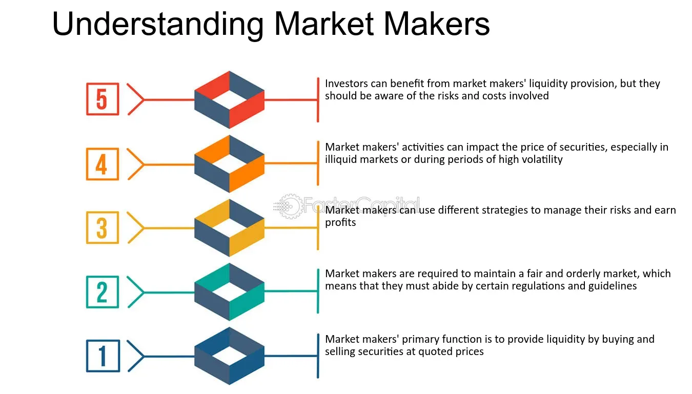

## Table of Contents

## What is an orderly market?

An orderly market is a market where trading happens smoothly and fairly. Prices move in a steady way, not jumping up and down suddenly. This makes it easier for people to buy and sell things without big surprises. In an orderly market, there are enough buyers and sellers, so no one person can control the prices too much.

Having an orderly market is important because it helps keep the economy stable. When markets are orderly, people feel more confident about investing their money. This confidence can lead to more trading and help the economy grow. If markets are not orderly, it can cause problems like panic selling, which can hurt the economy.

## Why is maintaining an orderly market important?

Maintaining an orderly market is important because it helps keep things stable and predictable. When the market is orderly, prices don't change suddenly, which means people can make plans and decisions without worrying about big surprises. This stability makes people feel more confident about buying and selling things. When people feel confident, they are more likely to invest their money, which can help the economy grow.

If markets are not orderly, it can lead to problems like panic selling. This happens when people get scared and start selling their investments quickly, which can make prices drop a lot. When prices drop suddenly, it can hurt the economy because people lose confidence and might stop investing. So, keeping markets orderly is really important for making sure the economy stays healthy and people can trust it.

## Who are the key participants in an orderly market?

In an orderly market, the key participants are buyers, sellers, and regulators. Buyers are people or companies that want to buy things like stocks, bonds, or other investments. Sellers are the ones who want to sell these things. Both buyers and sellers need to follow the rules of the market to make sure trading is fair and smooth.

Regulators are very important too. They are like the referees of the market. They make and enforce the rules to keep everything orderly. Regulators watch the market to make sure no one is cheating or doing anything that could mess up the market. They help keep the market stable and fair for everyone.

## How does an orderly market differ from a disorderly market?

An orderly market is like a well-behaved classroom where everyone follows the rules. Prices move smoothly and predictably, and there are enough buyers and sellers to keep things balanced. This makes it easier for people to buy and sell things without big surprises. In an orderly market, regulators make sure everyone plays fair, which helps keep the market stable and makes people feel confident about investing their money.

A disorderly market, on the other hand, is like a chaotic playground with no rules. Prices can jump up and down suddenly, which can scare people and make them want to sell their investments quickly. This can lead to panic selling and big price drops. In a disorderly market, there might not be enough buyers or sellers, and some people might try to cheat or manipulate the market. This can make the market unstable and cause people to lose confidence in it.

## What are the main characteristics of an orderly market?

An orderly market is a place where trading happens smoothly and fairly. Prices move in a steady way, not jumping up and down suddenly. This makes it easier for people to buy and sell things without big surprises. In an orderly market, there are enough buyers and sellers, so no one person can control the prices too much. This balance helps keep the market stable and makes people feel confident about investing their money.

Regulators play a big role in keeping the market orderly. They make and enforce the rules to make sure everyone plays fair. They watch the market to stop cheating or anything that could mess it up. When regulators do their job well, it helps keep the market stable and trustworthy. This is important because it helps the economy grow and keeps people from losing confidence in the market.

## What role do regulations play in maintaining an orderly market?

Regulations are like the rules of a game that everyone has to follow in a market. They help keep the market fair and orderly by making sure no one cheats or does anything that could mess things up. Regulators, who are like the referees, watch the market to make sure everyone follows these rules. They can stop people from doing bad things, like trying to control prices or tricking others. This helps keep the market stable and makes people feel safe about buying and selling things.

When regulations are strong and well-enforced, they help keep prices from jumping up and down suddenly. This makes the market more predictable, so people can plan their investments without big surprises. When people feel confident that the market is fair and stable, they are more likely to invest their money. This can help the economy grow because more trading happens. So, regulations are really important for keeping the market orderly and helping the economy stay healthy.

## How do market makers contribute to orderliness in financial markets?

Market makers are like helpers in the financial markets. They make sure there are always buyers and sellers around, so trading can happen smoothly. When someone wants to buy or sell something, like a stock, market makers are there to take the other side of the trade. This means if you want to sell a stock, they'll buy it from you, and if you want to buy a stock, they'll sell it to you. By doing this, they help keep the market balanced and stop prices from jumping around too much.

By being ready to trade at any time, market makers help make the market more orderly. They make sure there's always someone to trade with, which stops big gaps in prices. This makes people feel more confident because they know they can buy or sell whenever they want. When the market is orderly like this, it's easier for everyone to plan their investments and feel safe about putting their money in the market.

## What are the potential impacts of a disorderly market on investors?

A disorderly market can be really tough for investors. When prices jump around a lot, it can be hard to know what to do. Investors might get scared and start selling their investments quickly, which can make prices drop even more. This is called panic selling, and it can make people lose a lot of money. If the market keeps being disorderly, investors might lose trust in it and stop putting their money in, which can hurt their chances of making money in the future.

When the market is disorderly, it can also make it hard for investors to plan. They might have trouble figuring out when to buy or sell because prices are not moving in a steady way. This can make investing feel like a big risk, and some people might decide it's not worth it. If lots of investors feel this way, it can slow down the whole economy because less money is being used to buy and sell things.

## How can technology enhance the orderliness of a market?

Technology can help make markets more orderly by making trading faster and easier. Computers and special software can match buyers and sellers quickly, so there's always someone to trade with. This helps keep prices from jumping around too much because there are always enough people trading. Also, technology can help watch the market to make sure no one is cheating. Special programs can spot strange trading patterns and alert regulators, so they can stop bad things from happening.

Another way technology helps is by giving people more information. With the internet, investors can see lots of data about what's happening in the market. This helps them make better decisions about when to buy or sell. When everyone has good information, it makes the market more fair and stable. So, technology not only makes trading smoother but also helps keep the market honest and orderly.

## What historical examples illustrate the effects of a disorderly market?

One big example of a disorderly market is the stock market crash of 1929. This crash started the Great Depression, a really tough time for the economy. People were buying stocks with borrowed money, hoping the prices would keep going up. But when the market started to fall, everyone got scared and started selling their stocks at the same time. This caused prices to drop even more, and many people lost a lot of money. The market was so disorderly that it took years for things to get better.

Another example is the financial crisis of 2008. This happened because of problems in the housing market. Banks were giving out loans to people who couldn't really afford them, and then selling those loans to other investors. When people started to default on their loans, it caused a big mess. Banks and investors panicked, and the market became very disorderly. Prices of stocks and other investments fell sharply, and it led to a global economic crisis. It took a long time and a lot of effort to fix the problems caused by this disorderly market.

## How do global events influence the orderliness of financial markets?

Global events can shake up financial markets and make them less orderly. When big things happen, like wars or natural disasters, people can get scared and start selling their investments. This can cause prices to drop quickly, which makes the market disorderly. For example, if there's a war in an important country, it can make people worry about the economy and start selling stocks. This panic selling can make prices go down a lot, and it can be hard for the market to get back to normal.

But global events can also help make markets more orderly in some ways. When countries work together to solve big problems, like climate change or health crises, it can make investors feel more confident. If governments and big organizations make plans to help the economy, it can calm down the market. For example, when countries agreed to work together on vaccines during the COVID-19 pandemic, it helped people feel more sure about the future, and this can make the market more stable and orderly.

## What advanced strategies can market participants use to maintain market orderliness during volatile times?

During volatile times, market participants can use advanced strategies like [algorithmic trading](/wiki/algorithmic-trading) to help keep the market orderly. Algorithmic trading uses computer programs to buy and sell things very quickly. These programs can look at lots of data and make trades at the best times to keep prices from jumping around too much. For example, if the market starts to get too crazy, these programs can step in and make trades to balance things out. This helps stop big price swings and keeps the market calm.

Another strategy is using hedging to protect against big losses. Hedging is like buying insurance for your investments. If prices start to fall a lot, hedging can help you lose less money. This can make investors feel safer and less likely to panic and sell everything. When people are less scared, they are more likely to keep trading in a calm way, which helps keep the market orderly. By using these strategies, market participants can help make sure the market stays stable even when things get tough.

## References & Further Reading

[1]: Aldridge, I. (2013). ["High-Frequency Trading: A Practical Guide to Algorithmic Strategies and Trading Systems."](https://www.amazon.com/High-Frequency-Trading-Practical-Algorithmic-Strategies/dp/1118343506) Wiley.

[2]: Tsang, A., & Dai, S. (2018). ["Algorithmic Trading: Winning Strategies and Their Rationale."](https://www.wiley.com/en-us/Algorithmic+Trading%3A+Winning+Strategies+and+Their+Rationale-p-9781118460146) Wiley.

[3]: De Prado, M. L. (2018). ["Advances in Financial Machine Learning."](https://www.amazon.com/Advances-Financial-Machine-Learning-Marcos/dp/1119482089) Wiley.

[4]: Kissell, R. (2013). ["The Science of Algorithmic Trading and Portfolio Management."](https://www.sciencedirect.com/book/9780124016897/the-science-of-algorithmic-trading-and-portfolio-management) Academic Press.

[5]: Hasbrouck, J. (2007). ["Empirical Market Microstructure: The Institutions, Economics, and Econometrics of Securities Trading."](https://academic.oup.com/book/52241) Oxford University Press.