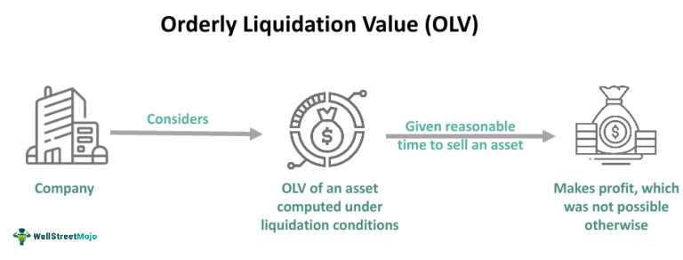

Understanding the mechanisms of market function economics is essential for investors and traders navigating today's dynamic financial landscape. These mechanisms ensure that financial markets operate efficiently, facilitating the smooth exchange of assets at prices that reflect their true values. This concept is critical as orderly markets are foundational to investor confidence and economic growth. 

Algorithmic trading is a key component of market function economics, utilizing sophisticated algorithms to execute trades with precision and speed. This technological advancement not only enhances market efficiency but also plays a pivotal role in maintaining price stability and liquidity. As the global economy becomes more interconnected, maintaining orderly markets is increasingly vital for economic growth. 

This article explores the essential components underpinning market function economics, delving into the role of algorithmic trading and the significance of market making in ensuring liquidity and stability. By analyzing these elements, readers will gain a comprehensive understanding of how financial markets operate efficiently and the implications for global economic growth. Such knowledge is crucial for market participants aiming to navigate the complex financial landscape effectively, adapting to technological advancements, and capitalizing on emerging opportunities while mitigating associated risks.

## Table of Contents

## Understanding Orderly Markets

An orderly market is characterized by a dynamic equilibrium where supply and demand are balanced, leading to asset prices that accurately reflect their true value. This precision in pricing is crucial for both bolstering investor confidence and promoting active participation within financial markets. Market participants rely on the integrity of prices to make informed decisions, and any deviation from this equilibrium can lead to inefficiencies and mistrust.

The maintenance of orderly markets hinges on the implementation of fair, secure, and efficient trading processes. These systems are governed by a set of rules and mechanisms designed to facilitate smooth transactions, reduce the occurrence of disputes, and provide transparent information about trades. For instance, electronic trading platforms, which execute trades automatically based on pre-set criteria, contribute significantly to market efficiency by minimizing human error and ensuring expedient transaction processing.

Several factors can threaten the integrity of orderly markets. Market manipulation, such as pump-and-dump schemes, and insider trading distort the natural balance of supply and demand. These unethical practices result in artificial price movements that do not represent the underlying value of assets. High volatility is another threat, as it can lead to abrupt and unpredictable changes in asset prices, causing instability and potentially deterring investor participation.

To combat these challenges and preserve market orderliness, specialized market surveillance teams operate within stock exchanges and other trading venues. These teams use a variety of tools and technologies to monitor trading activities in real-time, identifying suspicious behavior that may indicate market manipulation or insider trading. By enforcing regulations and implementing corrective measures, these surveillance teams play a vital role in maintaining the transparency and fairness of financial markets.

Ultimately, an orderly market's reliance on equilibrium and regulatory oversight ensures that it serves as a cornerstone for economic stability and growth. As financial markets continue to expand and evolve, the importance of sustaining this order remains paramount for fostering a conducive environment for trade and investment.

## Role of Algorithmic Trading

Algorithmic trading has fundamentally reshaped the operations of financial markets by bringing speed, precision, and efficiency to trading processes. At its core, [algorithmic trading](/wiki/algorithmic-trading) employs complex programmed systems to automatically execute trades at the most advantageous prices, effectively reducing the likelihood of human errors and subsequently enhancing overall market efficiency. These systems analyze multiple market variables in real-time, making split-second decisions that are impossible for a human trader to achieve, thereby transforming the dynamics of price setting and trade execution.

A significant contribution of algorithmic trading to market orderliness is its ability to inject [liquidity](/wiki/liquidity-risk-premium). Liquidity refers to the ease with which an asset can be bought or sold in the market without affecting its price substantially. By continuously placing buy and sell orders, algorithmic traders ensure that there is always someone willing to take the opposite side of a trade, thus preventing drastic price swings and supporting a stable trading environment. This function is particularly crucial during periods of high [volatility](/wiki/volatility-trading-strategies) when traditional market participants might hesitate to trade.

Moreover, algorithmic trading facilitates smooth price discovery, a process where market prices adjust to reflect new information. Automated systems can swiftly analyze and react to news and other inputs, ensuring that asset prices align with their underlying values. This capability helps maintain competitive price spreads, defined as the difference between the price at which an asset can be bought and sold. Narrow spreads are indicative of an efficient market, as they suggest reduced transaction costs and increased market participation.

Advanced algorithms also enable the precise execution of sophisticated trading strategies. These strategies, often based on historical data and complex mathematical models, can adapt to evolving market conditions. For instance, statistical [arbitrage](/wiki/arbitrage) strategies exploit small price inefficiencies across different markets or instruments, while trend-following algorithms can identify and capitalize on emerging market trends. The flexibility and adaptability offered by algorithmic trading allow it to respond swiftly to real-time changes, thereby supporting a stable and orderly market environment.

In conclusion, the integration of algorithmic trading in financial markets has been pivotal in promoting liquidity, facilitating efficient price discovery, and ensuring competitive pricing. As technology continues to advance, the capabilities of algorithmic systems are expected to expand, further anchoring their role in maintaining orderly markets.

## Market Making and its Importance

Market making is a critical function within financial markets, wherein market makers are responsible for providing consistent buy and sell quotes for various securities to ensure market liquidity. This process plays an essential role in stabilizing the market and facilitating seamless trading activities for investors.

Market makers generate income by capitalizing on the bid-ask spread, which is the difference between the buying price (bid) and the selling price (ask) of an asset. By facilitating trade execution, they significantly mitigate price volatility, making the markets more predictable and less risky for other participants.

The strategic operation of market makers involves utilizing complex algorithms to efficiently monitor the flow of orders within the market. These algorithms are designed to dynamically adjust prices and actions based on the current market conditions and order flow, ensuring that the spreads remain competitive and appealing to traders.

Moreover, market makers are indispensable in preserving orderly markets. Their ability to absorb shocks resulting from large trading volumes is crucial in maintaining price stability. When a sudden surge in buy or sell orders occurs, market makers adjust their quotes and inventory levels to accommodate this demand, thus preventing dramatic price swings and enhancing market resilience.

In summary, by ensuring continuous market liquidity, managing risk through sophisticated algorithms, and stabilizing prices against high-[volume](/wiki/volume-trading-strategy) fluctuations, market makers are pivotal in maintaining orderly and efficient financial markets.

## Challenges and Risks

Algorithmic trading and [market making](/wiki/market-making) have introduced numerous advancements to financial markets; however, they are not without challenges and risks. One notable concern is execution risk, which encompasses issues such as latency and slippage. Latency refers to the delay between the initiation and execution of a trade, which can be particularly detrimental in high-frequency trading environments where milliseconds can determine profit or loss. Slippage occurs when the price at which a trade is executed differs from the expected price, often due to rapid market movements or insufficient liquidity.

Market volatility presents another challenge, as it can result in widened bid-ask spreads, thereby affecting market stability and increasing transaction costs. During periods of high volatility, the rapid fluctuation in asset prices may lead to difficulties in maintaining orderly markets, compromising liquidity and investor confidence.

The competitive landscape of market making demands the use of highly sophisticated algorithms and cutting-edge technology to maintain an edge. Market makers must continually innovate to enhance the speed and efficiency of their trading systems. This intense competition drives firms to invest heavily in research and development to refine their trading strategies and infrastructure.

Furthermore, regulatory oversight plays a crucial role in maintaining fair trading practices and preventing market abuses such as manipulation and insider trading. Agencies like the Securities and Exchange Commission (SEC) in the United States and the European Securities and Markets Authority (ESMA) monitor and regulate trading activities to safeguard market integrity. Regulators face the complex task of balancing the encouragement of technological innovation with the need to ensure stability and protect investors.

In conclusion, while algorithmic trading and market making provide numerous efficiencies and liquidity to financial markets, they also bring about challenges and risks that require careful management. Addressing execution risks, adapting to volatile market conditions, keeping pace with competitive advancements, and ensuring effective regulatory oversight are crucial to maintaining the benefits these technologies offer while safeguarding market stability.

## Future Trends in Algorithmic Trading and Market Function

The future of market function economics and algorithmic trading is poised for significant transformation due to advancements in technology. High-frequency trading ([HFT](/wiki/high-frequency-trading-strategies)) firms are expected to continue dominating market-making activities. These firms utilize ultra-fast execution speeds and sophisticated algorithms to capitalize on minute price discrepancies. The competitive advantage afforded by HFT lies in its ability to process large volumes of transactions within milliseconds, thereby facilitating efficient market operations and providing continuous liquidity.

Globalization is also anticipated to play a substantial role in reshaping market-making activities. As financial markets become increasingly interconnected, market makers must adapt to regulatory differences, currency fluctuations, and varied market dynamics across borders. This globalization opens up new opportunities for expansion but also introduces challenges such as managing diverse trading environments and ensuring compliance with international regulations.

Automation and [artificial intelligence](/wiki/ai-artificial-intelligence) (AI) are set to become central components in enhancing the efficiency and adaptability of algorithmic trading. Advanced [machine learning](/wiki/machine-learning) models can analyze vast datasets to identify patterns and predict market movements with greater accuracy. This capability allows traders to develop and implement more effective strategies in real-time. Moreover, AI technologies can adapt to changing market conditions, improving decision-making processes and minimizing risks associated with human error.

The continuous evolution of these markets necessitates ongoing collaboration between traders, regulators, and technology providers. Such collaboration is crucial to ensure that the rapid development of algorithmic trading systems occurs within a framework that promotes fair and stable financial ecosystems. Regulatory bodies need to keep pace with technological advancements to prevent market abuses and ensure transparency and integrity in trading practices.

In conclusion, while technological advancements offer immense potential to enhance market function economics, they also require careful consideration of associated risks. Stakeholders from various sectors must work together to navigate these challenges, ensuring that the future of algorithmic trading and market-making continues to support orderly and efficient financial markets.

## Conclusion

Market function economics, encompassing algorithmic trading and market making, play a critical role in maintaining the stability and efficiency of financial markets. These mechanisms are fundamental to ensuring liquidity, enabling smooth price discovery, and supporting the overall integrity and function of the markets. For traders and investors, a deep understanding of these concepts is crucial for navigating the increasingly complex financial environment effectively. 

As technology progresses rapidly, it is imperative for market participants to stay informed of emerging trends and advancements. This vigilance allows them to adapt strategies to the evolving dynamics, thereby maximizing potential gains and mitigating inherent risks. The integration of artificial intelligence and machine learning in trading strategies, for example, is reshaping how markets function and opening up new avenues for innovation and efficiency. 

Ultimately, the maintenance of orderly markets through effective regulation and sophisticated trading systems is a cornerstone of economic growth and stability. It benefits all stakeholders within the global financial system, from individual investors to large institutional entities, by fostering an environment of trust and reliability. This contribution is not merely limited to financial gains but extends to broader economic enhancements, facilitating capital formation and redistribution, and supporting sustainable economic development worldwide.

## References & Further Reading

[1]: Aldridge, I. (2013). ["High-Frequency Trading: A Practical Guide to Algorithmic Strategies and Trading Systems."](https://www.amazon.com/High-Frequency-Trading-Practical-Algorithmic-Strategies/dp/1118343506) Wiley.

[2]: Tsang, A., & Dai, S. (2018). ["Algorithmic Trading: Winning Strategies and Their Rationale."](https://www.wiley.com/en-us/Algorithmic+Trading%3A+Winning+Strategies+and+Their+Rationale-p-9781118460146) Wiley.

[3]: De Prado, M. L. (2018). ["Advances in Financial Machine Learning."](https://www.amazon.com/Advances-Financial-Machine-Learning-Marcos/dp/1119482089) Wiley.

[4]: Kissell, R. (2013). ["The Science of Algorithmic Trading and Portfolio Management."](https://www.sciencedirect.com/book/9780124016897/the-science-of-algorithmic-trading-and-portfolio-management) Academic Press.

[5]: Hasbrouck, J. (2007). ["Empirical Market Microstructure: The Institutions, Economics, and Econometrics of Securities Trading."](https://academic.oup.com/book/52241) Oxford University Press.