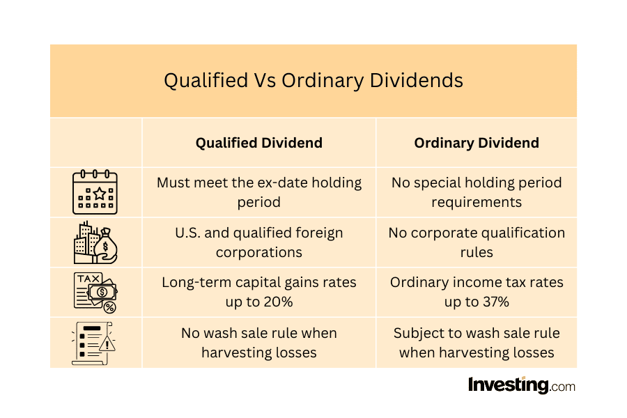

## Table of Contents

## What are ordinary dividends?

Ordinary dividends are payments that companies make to their shareholders from their profits. When a company earns money, it can choose to give some of that money back to the people who own its stock. These payments are usually made in cash, but sometimes they can be in the form of more stock. Ordinary dividends are different from other types of dividends because they are taxed at a regular income tax rate, not at a lower capital gains rate.

These dividends are important for investors because they provide a steady income stream. Many people, especially those who are retired, rely on these payments as part of their income. Companies usually pay ordinary dividends on a regular schedule, like quarterly or annually. This makes it easier for investors to plan their finances. Knowing when and how much they will receive helps investors manage their money better.

## How do ordinary dividends differ from qualified dividends?

Ordinary dividends and qualified dividends are both payments that companies give to their shareholders, but they are taxed differently. Ordinary dividends are taxed at the same rate as your regular income. This means if you earn money from a job, the tax rate on that money will be the same as the tax rate on your ordinary dividends. This can be higher than the tax rate for other types of income.

Qualified dividends, on the other hand, are taxed at a lower rate, called the capital gains rate. To be considered a qualified dividend, the dividend must meet certain rules set by the government. Usually, the company paying the dividend must be based in the U.S. or a country that has a tax treaty with the U.S., and the shareholder must have held the stock for a certain amount of time. Because of this lower tax rate, qualified dividends can save you money on taxes compared to ordinary dividends.

## What is the tax treatment of ordinary dividends?

Ordinary dividends are taxed at the same rate as your regular income. This means if you get money from a job, the tax you pay on that money is the same as the tax on your ordinary dividends. The tax rate can be higher than the rate for other types of income, like capital gains. The exact rate depends on your total income and the tax laws in your country.

For example, if you are in a high tax bracket, you might pay a lot of taxes on your ordinary dividends. This is different from qualified dividends, which have a lower tax rate. Knowing the difference can help you plan how to manage your investments and taxes better.

## Can you provide examples of ordinary dividends?

When a company makes money, it can choose to share some of that money with its shareholders. This sharing is called a dividend. If a company like ABC Corporation decides to pay its shareholders $1 per share every quarter, that payment is an ordinary dividend. So, if you own 100 shares of ABC Corporation, you would get $100 every three months. This money is taxed at the same rate as your regular income, like money you earn from a job.

Another example is XYZ Inc., which pays its shareholders $0.50 per share every year. If you own 200 shares of XYZ Inc., you would receive $100 once a year. This payment is also an ordinary dividend and is taxed the same way as your regular income. These dividends are important for many investors because they provide a steady income, which can be especially helpful for people who are retired and need regular money coming in.

## Who typically receives ordinary dividends?

Ordinary dividends are usually received by people who own stocks in companies that pay these dividends. These people are called shareholders. Shareholders can be anyone from individual investors to big organizations like pension funds. If a company decides to share its profits with its shareholders, it will pay them ordinary dividends. This happens regularly, like every three months or once a year, depending on the company's schedule.

Many people who receive ordinary dividends are looking for a steady income from their investments. This can be really helpful for people who are retired and need money coming in regularly. But it's not just retirees; anyone who owns stocks in a company that pays dividends can get them. The important thing is that these dividends are taxed at the same rate as regular income, so it's good for shareholders to know this when planning their finances.

## How are ordinary dividends reported on tax returns?

Ordinary dividends are reported on your tax return using a form called a 1099-DIV. If you get ordinary dividends, the company that paid them will send you this form. It shows how much money you got in dividends during the year. You need to include this amount on your tax return. You'll find a place to write it on your Form 1040, which is the main tax form most people use.

The ordinary dividends you report on your tax return are taxed at the same rate as your regular income. This means if you earn money from a job, the tax rate on that money will be the same as the tax rate on your ordinary dividends. The exact rate depends on your total income and the tax laws where you live. Knowing this can help you plan how to manage your investments and taxes better.

## What are the sources of ordinary dividends?

Ordinary dividends come from companies that want to share their profits with the people who own their stocks. These companies can be big or small, and they might be in different industries like technology, banking, or retail. When a company makes money, it can choose to give some of that money back to its shareholders as dividends. If the dividend doesn't meet special rules to be a qualified dividend, it's called an ordinary dividend.

Many investors like ordinary dividends because they get a regular payment, which can help them with their money planning. For example, if you own shares in a company that pays dividends every three months, you know when to expect that money. This can be really helpful for people who are retired and need a steady income. Ordinary dividends are taxed at the same rate as money you earn from a job, so it's good to know this when you're thinking about your taxes.

## How do companies decide to pay ordinary dividends?

Companies decide to pay ordinary dividends when they have made money and want to share some of it with their shareholders. They look at how much profit they have made and decide if they can afford to give some of it away. If they think it's a good idea, they set a certain amount of money to pay out as dividends. This amount is usually the same for each share of stock, so if you own more shares, you get more money.

The decision to pay dividends also depends on the company's plans for the future. If a company wants to grow and needs money for new projects, it might decide not to pay dividends or to pay less. But if the company is doing well and doesn't need all its profits for growth, it might choose to pay more dividends. This makes shareholders happy because they get more money, and it can make the company's stock more attractive to investors.

## What impact do ordinary dividends have on a company's financial statements?

When a company decides to pay ordinary dividends, it affects its financial statements in a few ways. First, the company's income statement will show a decrease in net income because the dividends are paid out of the company's profits. This means the company has less money to keep for itself after it pays the shareholders. The income statement will show this as a reduction in retained earnings, which is the money the company keeps to use for future growth or other needs.

The balance sheet also changes when ordinary dividends are paid. The company's cash account goes down because it uses cash to pay the dividends. At the same time, the equity section of the balance sheet, specifically the retained earnings, also goes down. This shows that the company has given some of its profits back to the shareholders instead of keeping it. These changes help investors and others see how the company is managing its money and how much it is giving back to its owners.

## How can investors use ordinary dividends in their investment strategy?

Investors can use ordinary dividends to get a regular income from their investments. If you own stocks that pay dividends, you get money every few months or once a year. This can be really helpful if you need money coming in regularly, like if you're retired. By choosing companies that pay good dividends, you can build a steady stream of income. This can help you plan your money better because you know when and how much you will get.

Another way investors use ordinary dividends is to reinvest them. Instead of taking the money out, you can use it to buy more shares of the same company or different companies. This can help your investments grow over time. If you keep reinvesting the dividends, you can own more shares and get even more dividends in the future. This strategy is called compounding, and it can make your investments grow faster. Knowing how to use ordinary dividends can help you make smarter choices about your money.

## What are the potential risks associated with relying on ordinary dividends for income?

Relying on ordinary dividends for income can be risky because companies can change or stop their dividend payments at any time. If a company runs into financial trouble or decides to use its profits for other things, it might cut back on dividends. This means you could suddenly get less money than you were expecting, which can be hard if you depend on that income to pay your bills or live on.

Another risk is that the stock's value might go down. If you own a stock just because it pays dividends, you might not pay as much attention to how the company is doing overall. If the company's stock price drops a lot, you could lose money on your investment even if you're still getting dividends. It's important to look at the whole picture and not just focus on the dividends when planning your income.

## How do international tax treaties affect the taxation of ordinary dividends for non-resident investors?

International tax treaties can change how much tax non-resident investors have to pay on ordinary dividends. These treaties are agreements between countries that help avoid double taxation. Double taxation happens when you have to pay taxes on the same income in two different countries. With a tax treaty, the country where the company paying the dividend is located might agree to lower the tax rate for non-resident investors. This means you might pay less tax on your dividends than you would without the treaty.

For example, if you live in Country A but own stocks in a company in Country B, a tax treaty between these countries could help you. The treaty might say that Country B can only withhold a certain percentage of your dividend as tax, instead of the full amount they might normally take. This can make a big difference in how much money you actually get to keep from your dividends. It's important for non-resident investors to know about these treaties and how they can affect their taxes.

## References & Further Reading

[1]: Bergstra, J., Bardenet, R., Bengio, Y., & Kégl, B. (2011). ["Algorithms for Hyper-Parameter Optimization."](https://papers.nips.cc/paper/4443-algorithms-for-hyper-parameter-optimization) Advances in Neural Information Processing Systems 24.

[2]: ["Advances in Financial Machine Learning"](https://www.amazon.com/Advances-Financial-Machine-Learning-Marcos/dp/1119482089) by Marcos Lopez de Prado

[3]: ["Evidence-Based Technical Analysis: Applying the Scientific Method and Statistical Inference to Trading Signals"](https://www.amazon.com/Evidence-Based-Technical-Analysis-Scientific-Statistical/dp/0470008741) by David Aronson

[4]: ["Machine Learning for Algorithmic Trading"](https://github.com/stefan-jansen/machine-learning-for-trading) by Stefan Jansen

[5]: ["Quantitative Trading: How to Build Your Own Algorithmic Trading Business"](https://www.amazon.com/Quantitative-Trading-Build-Algorithmic-Business/dp/1119800064) by Ernest P. Chan