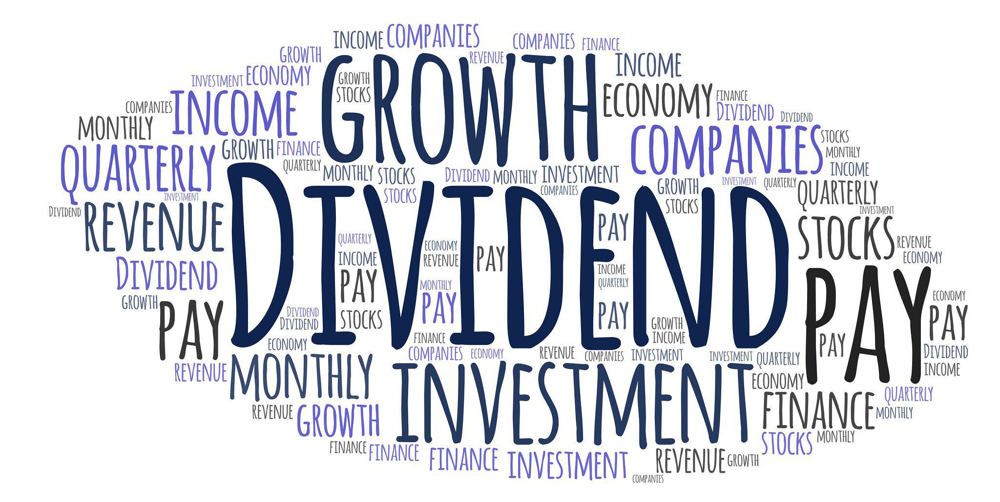

The intersection of dividends and algorithmic trading presents a unique opportunity for investors looking to optimize their portfolio strategies. Dividends, which are regular payments made by companies to their shareholders, provide a steady income stream that can enhance total returns and offer a cushion against market volatility. They represent a significant portion of earnings distributed to investors, offering stability even in fluctuating markets. Meanwhile, algorithmic trading, which utilizes computer algorithms to execute trades based on pre-set strategies, enhances decision-making through data-driven insights. This method removes human emotion from trading, ensuring that decisions are precise and efficient, guided by data rather than instinct.

The synergy of these two elements—dividends and algorithmic trading—offers a comprehensive approach to contemporary investing. Dividends provide the allure of consistent cash flow, appealing to investors who prioritize income stability. On the other hand, algorithmic trading supports swift adaptation to market changes, providing a competitive edge through strategies like trend-following and arbitrage. By leveraging the stable income from dividends and the precision of algorithmic trading, investors can reshape traditional approaches to investing, potentially achieving optimized investment outcomes and enhanced financial efficiency.



This article explores the nuances of dividends investment income, distinguishes ordinary from qualified dividends, and examines how algorithmic trading is reshaping traditional investment strategies, providing investors with tools to build a balanced and effective portfolio.

## Table of Contents

## Understanding Dividends Investment Income

Dividends are regular payments made by a company to its shareholders, typically derived from the company's profits. They represent a critical component of the return on equity investments and can offer investors a buffer against the risks associated with stock market [volatility](/wiki/volatility-trading-strategies). By consistently providing a portion of profits to shareholders, companies enable investors to enjoy a steady stream of income, thereby adding stability to their portfolios.

Historically, dividends have been an essential factor in total equity returns. For example, researchers have found that reinvested dividends constitute a substantial part of the total returns from shares over the long term. This stable cash flow is particularly appealing to those investors who prioritize income generation over capital appreciation. 

The attraction of dividend-paying stocks lies in their ability to offer regular income irrespective of broader market conditions. This is especially valuable during periods when market prices may be fluctuating unpredictably. By focusing on earnings and the regularity of their distribution, dividend stocks can provide predictability and reliability, characteristics that are appealing to investors seeking income stability.

In the financial world, this income stability draws certain types of investors, such as retirees or conservative investors, who rely on dividends as a primary source of income. Such investors typically prefer companies with a strong track record of profitability and a history of maintaining or even increasing their dividend payouts. Consequently, dividend-paying stocks often belong to well-established companies with robust business models, making them attractive for risk-averse investors.

Moreover, dividends can serve a dual purpose by also serving as signals of a company's financial health. A consistent or increasing dividend payout can indicate to investors that a company is performing well financially, reinforcing confidence in the company’s ongoing operations and future prospects. This signaling effect can further stabilize stock prices, mitigating some of the risks associated with equity investments.

Overall, understanding and leveraging dividends as a source of investment income is a valuable strategy, especially for those seeking to cushion their portfolios against the inherent uncertainties of the stock market. By balancing the pursuit of capital gains with the steady reliability of dividend income, investors can achieve a more diversified and resilient financial strategy.

## What Are Ordinary Dividends?

Ordinary dividends are distributions from a corporation's profits to its shareholders and are subject to taxation at the individual's regular income tax rates. These payments help bridge the gap between investment income and financial planning, offering a framework for recurring earnings. Unlike qualified dividends, which benefit from lower capital gains tax rates, ordinary dividends are taxed at the investor's marginal income tax rate, which can be significantly higher, affecting overall investment returns.

Understanding the tax implications associated with ordinary dividends is crucial for investors aiming to optimize their financial strategies. Since these dividends do not retain the preferential tax treatment that qualified dividends receive, they can notably impact an investor’s tax liability when dividends increase their taxable income. Consequently, investors must account for this [factor](/wiki/factor-investing) during tax planning to avoid unexpected tax burdens.

Corporations commonly issue ordinary dividends on a scheduled basis, providing a predictable and consistent stream of income to shareholders. This regularity underscores their appeal among income-focused investors who prioritize stable cash inflows over capital appreciation. Typically, corporations declare dividends based on their earnings performance and future expectations, effectively sharing profits with investors who hold shares on the date of record, known as the "record date".

Managing ordinary dividends for optimal financial outcomes may require strategic planning. Investors can employ techniques such as timing the purchase and sale of dividend-paying securities or strategically choosing investment accounts, like tax-advantaged retirement accounts, to minimize tax exposure. In essence, awareness and planning around ordinary dividends can significantly influence an investor's financial health and portfolio performance.

## The Role of Algorithmic Trading in Modern Investing

Algorithmic trading plays a critical role in modern investing by utilizing advanced computer algorithms to execute trades based on pre-set strategies. This automation provides numerous advantages over traditional, manual trading methods, primarily through the alleviation of human emotions from decision-making processes. By relying on data-driven insights, [algorithmic trading](/wiki/algorithmic-trading) enhances both precision and efficiency, resulting in improved investment outcomes.

The core objective of algorithmic trading is to capitalize on the computational power and speed of modern technology to identify and execute trading opportunities more swiftly and accurately than human traders. Algorithms can process vast amounts of market data, identifying patterns and executing trades in fractions of a second. This capability is particularly advantageous in volatile markets where rapid changes can drastically affect prices.

One popular strategy employed in algorithmic trading is trend-following. This approach involves identifying the direction of a market trend based on historical data and executing trades in alignment with that trend. For instance, if a stock is consistently trending upwards, the algorithm will initiate buy orders, betting on the continuation of the trend. Trend-following can be automated using moving averages, [momentum](/wiki/momentum) indicators, and the relative strength index (RSI).

Another common strategy is [arbitrage](/wiki/arbitrage), which seeks to exploit price discrepancies between different markets or financial instruments. Algorithms quickly detect these disparities and execute simultaneous buy and sell orders to profit from the differential. The efficiency of algorithms allows them to spot and react to arbitrage opportunities that human traders might miss due to the fast-paced nature of market movements.

In implementing these strategies, algorithmic trading benefits from high-frequency trading ([HFT](/wiki/high-frequency-trading-strategies)) capabilities. HFT involves executing a large number of orders at extremely high speeds. While not all algorithmic trading strategies rely on HFT, those that do can significantly amplify profits through small yet frequent gains.

The efficacy of algorithmic trading also hinges on [backtesting](/wiki/backtesting), which involves running an algorithm against historical data to verify its effectiveness. This analytical step ensures that trading strategies are robust and capable of performing well under various market conditions. By fine-tuning algorithms based on backtesting results, traders can enhance their strategies before deploying them in live markets.

In Python, a simple example of a moving average crossover strategy—a common trend-following technique—can be implemented using the pandas library:

```python
import pandas as pd

# Fetch historical stock price data
data = pd.read_csv('stock_data.csv')

# Calculate moving averages
data['SMA50'] = data['Close'].rolling(window=50).mean()
data['SMA200'] = data['Close'].rolling(window=200).mean()

# Generate buy/sell signals
data['Signal'] = 0
data.loc[data['SMA50'] > data['SMA200'], 'Signal'] = 1  # Buy when SMA50 crosses above SMA200
data.loc[data['SMA50'] < data['SMA200'], 'Signal'] = -1 # Sell when SMA50 crosses below SMA200

print(data[['Close', 'SMA50', 'SMA200', 'Signal']].dropna())
```

This code calculates the 50-day and 200-day simple moving averages (SMA) of a stock's closing price and generates buy or sell signals based on their crossover. Although simplified, this example illustrates how algorithmic trading can codify traditional strategies to operate systematically and efficiently.

Overall, algorithmic trading offers a powerful tool for modern investors, enabling them to adapt rapidly to market changes while maintaining a competitive edge through data-driven precision and speed.

## Integrating Dividends and Algo Trading

Combining dividends with algorithmic trading presents a strategic advantage to investors, allowing them to benefit from both a stable income and responsive market actions. Algorithmic trading leverages computer algorithms to scrutinize market conditions, execute trades, and identify patterns that may not be apparent to human analysts. This technological integration is beneficial for optimizing dividend-based strategies.

Algorithms are proficient at identifying dividend opportunities by analyzing massive volumes of financial data, such as dividend payout history, company earnings reports, and overall market performance. For example, an algorithm can be designed to pinpoint stocks that are likely to increase payouts or announce special dividends based on historical and current financial performance metrics. This analytical capability assists in constructing a portfolio targeting stocks with high dividend yields, thus ensuring a steady income flow.

Moreover, algorithmic trading minimizes the impact of emotional biases that can occur in manual trading. Human traders may make decisions based on emotions such as fear or greed, leading to inconsistencies and suboptimal outcomes. Algorithms, however, make decisions rooted purely in logic and data, ensuring that buy and sell actions are executed precisely and consistently, often within microseconds.

This synergy between dividends and algorithmic trading also facilitates dynamic portfolio adjustments. As market conditions shift, algorithms can recalibrate portfolios to either increase exposure to favorable dividend opportunities or reduce exposure to stocks with declining dividend potential. This adaptability is particularly beneficial in volatile markets, allowing for real-time risk management and capitalizing on fleeting opportunities.

Integrating dividends with algorithmic trading does, however, require careful consideration of various factors. For instance, the cost of implementing and maintaining an algorithmic trading system, including software and technological infrastructure, can be significant. Furthermore, understanding the complexities of algorithm development and market dynamics is crucial in avoiding costly errors.

In summary, by marrying dividends with algorithmic trading, investors can create a robust strategy that maximizes income potential while optimizing for efficiency and risk management. This integrated approach not only provides a competitive edge but also aligns well with the evolving landscape of modern investing.

## Risks and Considerations

While dividends are appealing for their potential to provide a steady income stream to investors, they inherently depend on the company's continued profitability and its management's choice to distribute earnings. Changes in a company’s financial health or strategic objectives may lead to a reduction or suspension of dividend payments, creating a potential income shortfall for investors. Additionally, economic downturns or crises can adversely affect a company's ability to maintain dividend payouts.

On the other hand, algorithmic trading, while offering significant advantages in terms of efficiency and precision, requires significant expertise in data analysis and an understanding of market dynamics. The development and implementation of effective trading algorithms necessitate a comprehensive skill set in quantitative analysis, programming, and financial theory. Moreover, poorly developed algorithms or inadequate risk management strategies can lead to substantial financial losses. Algorithm-induced trading errors or unanticipated market behaviors can exacerbate risks, especially in volatile market conditions.

Additionally, investors must remain vigilant regarding both market risks and regulatory requirements when utilizing these strategies. Market risks, including [liquidity](/wiki/liquidity-risk-premium) risk and market disruption, pose ongoing challenges. Regulatory environments are constantly evolving, and compliance with financial regulations is imperative. Regulations governing both dividend distributions and algorithmic trading differ across jurisdictions, impacting investment strategies. 

For instance, algorithmic trading can be subject to regulatory scrutiny due to potential market manipulation or unintended impacts on market integrity. As such, staying informed about applicable regulations and maintaining compliance is critical to mitigate legal and financial repercussions. Investors should consider integrating robust risk management frameworks and continuous monitoring systems to address and mitigate these multifaceted risks effectively.

## Conclusion

Leveraging dividends alongside algorithmic trading can significantly enhance investment outcomes by optimizing both income and efficiency. This combination allows investors to harness the steady income derived from dividends with the swift, data-driven decision-making capabilities of algorithmic trading. Such integration can lead to improved portfolio performance and more robust financial returns.

As financial markets are ever-evolving, staying informed and adaptable to new methods and tools is crucial. Market variables such as interest rates, economic indicators, and geopolitical events can influence investment performance. Investors must remain agile, incorporating dynamic strategies and continually updating their algorithmic models to align with the latest trends and technological advancements.

The blending of traditional dividends with modern algorithmic strategies provides a balanced and effective approach to portfolio management. Dividends offer a reliable income stream that can stabilize returns, while algorithmic trading can improve market reaction time and enhance trade execution accuracy. This dual approach not only aims to mitigate risks associated with human emotional biases but also capitalizes on computational power to identify and exploit market inefficiencies.

Investors are encouraged to use this synthesis of methodologies to construct a comprehensive investment strategy. By combining the predictability of dividend income with the precision of algorithmic systems, they can better navigate the complexities of contemporary financial markets, ultimately achieving a more resilient and successful financial portfolio.

## References & Further Reading

[1]: Bergstra, J., Bardenet, R., Bengio, Y., & Kégl, B. (2011). ["Algorithms for Hyper-Parameter Optimization."](https://papers.nips.cc/paper/4443-algorithms-for-hyper-parameter-optimization) Advances in Neural Information Processing Systems 24.

[2]: ["Advances in Financial Machine Learning"](https://www.amazon.com/Advances-Financial-Machine-Learning-Marcos/dp/1119482089) by Marcos Lopez de Prado

[3]: ["Evidence-Based Technical Analysis: Applying the Scientific Method and Statistical Inference to Trading Signals"](https://www.amazon.com/Evidence-Based-Technical-Analysis-Scientific-Statistical/dp/0470008741) by David Aronson

[4]: ["Machine Learning for Algorithmic Trading"](https://github.com/stefan-jansen/machine-learning-for-trading) by Stefan Jansen

[5]: ["Quantitative Trading: How to Build Your Own Algorithmic Trading Business"](https://www.amazon.com/Quantitative-Trading-Build-Algorithmic-Business/dp/1119800064) by Ernest P. Chan