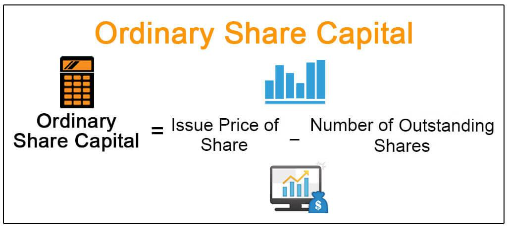

The financial landscape presents numerous investment possibilities, among which ordinary shares are a significant choice for many investors. Ordinary shares, also known as common stock, represent equity ownership in a company and are fundamental to the stock market's structure. This article aims to explore the benefits of holding ordinary shares, the various rights afforded to shareholders, and the impact of algorithmic trading on today's financial markets. 

The advantages of ordinary shares include potential capital appreciation and the ability to participate in a company's financial success through profit distributions. While dividends are not assured, investors are entitled to voting rights that allow them to exert influence over corporate policy. These aspects make ordinary shares an attractive prospect for those seeking both financial returns and a voice in corporate governance. 

Algorithmic trading, which employs sophisticated computer models for decision-making based on market data, has revolutionized how stocks like ordinary shares are traded. This automation introduces new levels of speed and efficiency but also brings about challenges such as increased market volatility. For investors, understanding these changes is crucial for navigating the modern financial landscape effectively.

By comprehending these elements—ordinary shares' potential for both risk and reward, key shareholder rights enhancing corporate governance, and the transformative role of algorithmic trading—investors can make more informed decisions. This article invites you to explore these essential components of investing, with the aim of enabling you to potentially maximize your returns in an ever-evolving market.

## Table of Contents

## Advantages of Ordinary Shares

Ordinary shares represent a fundamental component of the equity market, providing investors with the opportunity to partake in the ownership of a company and potentially benefit from its financial success. These shares are distinguished by several key advantages that contribute to their enduring appeal among investors.

One primary benefit of ordinary shares is the potential for capital appreciation. As the issuing company grows and becomes more profitable, the market value of its ordinary shares typically increases, offering investors the prospect of financial gain. This capital appreciation is primarily driven by factors such as improved business performance, favorable macroeconomic conditions, and strategic company initiatives. Consequently, ordinary shareholders stand to gain from the rise in share prices over time.

While dividends are not guaranteed with ordinary shares, investors may receive profit distributions contingent on the company's financial success. When companies accrue profits, they can decide to distribute a portion to shareholders in the form of dividends. Although the decision to pay dividends lies within the company’s discretion and may vary based on its earnings and capital allocation strategy, it provides an additional incentive for investors. Dividends can serve as a source of income and a signal of the company's financial health and management confidence.

Another compelling advantage of owning ordinary shares is the ability to participate in corporate governance. Ordinary shareholders typically possess voting rights, enabling them to vote on critical corporate matters during shareholder meetings. Such matters may include the election of board members, approval of major corporate policies, and significant business decisions. By exercising their voting rights, shareholders can assert their influence over the company’s strategic direction, aligning it with their interests and priorities.

These characteristics of ordinary shares underscore their popularity among investors. The combination of potential capital gains, prospective dividend income, and participatory rights in corporate governance renders ordinary shares an attractive investment option. These features offer both the opportunity for financial gain and a degree of control over the invested entity’s future, making ordinary shares a cornerstone of diversified investment portfolios.

## Ordinary Shareholder Rights

Ownership in ordinary shares grants shareholders specific rights that are central to the concept of corporate democracy. These rights empower shareholders to have a say in the operations and strategic directions of the companies they invest in. 

Firstly, ordinary shareholders typically have voting rights, which are exercised during the company's annual general meetings (AGMs). During these meetings, shareholders have the opportunity to influence key corporate decisions such as the election of the board of directors, approval of major transactions, and other significant policy changes. The voting power is generally proportional to the number of shares held; thus, a greater investment translates into a stronger voice in corporate decisions.

In addition to voting rights, ordinary shareholders have a financial claim on the company's residual profits. These profits are distributed after the company has fulfilled its obligations to preferred shareholders and other creditors. Although dividends for ordinary shareholders are not guaranteed, they are often issued if the company performs well financially. This claim on residual profits can manifest in cash dividends or stock dividends, providing potential income for shareholders.

In the unfortunate event of a company's insolvency, ordinary shareholders are entitled to a share of any remaining assets. However, they are last in line, behind creditors, bondholders, and preferred shareholders. This aspect highlights the risk associated with ordinary shares, as there might be little to no remaining assets for distribution after other obligations are met.

Understanding these rights is crucial for investors as it enables them to make informed and strategic decisions, enhancing their engagement with their investments. By exercising their voting rights, investors can actively participate in shaping the future of the companies they invest in. Furthermore, by understanding their financial claims, they can better assess the potential risks and rewards associated with holding ordinary shares.

These shareholder rights collectively contribute to creating a balance of power between the company and its owners, fostering a sense of accountability and transparency within the corporate governance framework.

## The Role of Algorithmic Trading

Algorithmic trading employs advanced computer programs to execute trades at speeds and efficiencies unattainable by human traders. This system relies on complex algorithms, which analyze market data to identify and exploit even the smallest opportunities for profit within milliseconds. Algorithmic trading covers a variety of strategies, including [arbitrage](/wiki/arbitrage), [market making](/wiki/market-making), and high-frequency trading, each aiming to capitalize on market inefficiencies or fluctuations.

As technology has advanced, the role of [algorithmic trading](/wiki/algorithmic-trading) has significantly expanded within financial markets. Its integration has enabled investors to manage large volumes of trade while maintaining lower transaction costs and reducing human error. However, this rapid execution and decision-making come with its own challenges. One significant concern is the increased market [volatility](/wiki/volatility-trading-strategies) induced by algorithmic trading. The speed at which algorithms can buy and sell shares may lead to rapid price shifts, sometimes exacerbating market fluctuations or even leading to flash crashes—events where stock values plummet and recover in a matter of minutes.

For ordinary shareholders, the presence of algorithmic trading necessitates a more informed and adaptive approach. Share prices and market behaviors can be influenced by algorithmic actions, which can complicate the traditional methods of evaluating investments. Investors must understand the dynamics of algorithmic trading to better anticipate market movements. This understanding can include recognizing trading patterns that may indicate algorithmic trading activity or using technology to assist in monitoring and responding to the rapid changes within the market.

Furthermore, algorithmic trading has democratized access to sophisticated trading strategies that were once exclusive to large institutional investors. With the right technological tools, ordinary investors can now participate in strategies that leverage algorithmic insights, leveling the playing field to some extent.

In summary, algorithmic trading has reshaped contemporary financial markets by increasing both capabilities and challenges. Its impact on stock prices and market volatility demands that shareholders remain vigilant and continuously informed to effectively navigate these evolving trading landscapes. Understanding the nuances of algorithmic trading empowers investors to manage their portfolios more strategically, balancing the advantages of speed and efficiency with the need for prudent, informed decision-making.

## Balancing Risks and Rewards

Investing in ordinary shares involves navigating inherent risks, notably market volatility and [liquidity](/wiki/liquidity-risk-premium) risks. Market volatility refers to fluctuations in stock prices due to changes in market dynamics, economic indicators, or investor sentiment. This volatility can result in substantial gains or losses over short periods. Liquidity risk concerns the ability to quickly buy or sell shares without significantly affecting their price. A lack of liquidity can lead to challenges in executing trades at desired prices, especially during volatile market conditions.

To effectively balance these risks with the pursuit of capital gains and dividends, investors need to employ strategic decision-making. Diversification is a key strategy for mitigating risk. By spreading investments across various sectors, industries, and geographic locations, investors can reduce exposure to any single asset's poor performance. This approach can be mathematically represented by the diversification formula in portfolio theory, which aims to minimize the portfolio variance:

$$
\sigma^2_p = \sum_{i=1}^n \sum_{j=1}^n w_i w_j \sigma_{ij}
$$

where $\sigma^2_p$ is the portfolio variance, $w_i$ and $w_j$ are the weights of assets $i$ and $j$ in the portfolio, and $\sigma_{ij}$ is the covariance between the returns on those assets.

Apart from diversification, investors must stay informed about their rights as shareholders and market dynamics like algorithmic trading. This awareness enables them to make informed decisions about when to buy, sell, or hold shares, optimizing their portfolios' risk-reward balance. Algorithmic trading, which uses computer algorithms to execute trades at high speeds, adds another layer of complexity and opportunity. Understanding its impact on market price movements can aid ordinary shareholders in adapting their strategies promptly.

In addition to diversification and informed decision-making, regular assessment and rebalancing of the investment portfolio are crucial. This involves periodically adjusting portfolio allocations to maintain the desired level of risk and return, aligning with an investor's financial goals and market conditions.

By comprehensively evaluating these elements, investors become equipped to build a resilient investment portfolio that balances the potential for rewards with the management of inherent risks, ultimately contributing to long-term financial success.

## Conclusion

Ordinary shares present an attractive investment option due to their combination of potential risks and rewards. They provide shareholders with ownership rights, allowing them to vote on significant corporate decisions, thus playing an essential role in shaping the company's direction. The potential for dividends and capital appreciation further enhances their appeal, offering investors opportunities for financial growth.

In the contemporary financial landscape, algorithmic trading has significantly influenced how ordinary shares are traded. By employing sophisticated algorithms and high-speed execution, it brings both advantages and challenges, such as increased market volatility. Understanding these dynamics is crucial for investors aiming to maximize their returns while mitigating associated risks.

To effectively leverage ordinary shares in their investment strategies, investors must maintain a thorough understanding of shareholder rights and keep abreast of market trends influenced by technological advancements like algorithmic trading. Staying informed and proactive enables shareholders to navigate complex financial markets effectively, aligning their portfolios with their financial objectives.

This article has provided insights into these various facets, aiming to support investors in making informed and advantageous decisions. By appreciating the intricate balance of risk and reward associated with ordinary shares, investors can strategically position themselves for success in their financial endeavors.

## References & Further Reading

[1]: Bergstra, J., Bardenet, R., Bengio, Y., & Kégl, B. (2011). ["Algorithms for Hyper-Parameter Optimization."](https://dl.acm.org/doi/10.5555/2986459.2986743) Advances in Neural Information Processing Systems 24.

[2]: ["Advances in Financial Machine Learning"](https://www.amazon.com/Advances-Financial-Machine-Learning-Marcos/dp/1119482089) by Marcos Lopez de Prado

[3]: ["Evidence-Based Technical Analysis: Applying the Scientific Method and Statistical Inference to Trading Signals"](https://www.amazon.com/Evidence-Based-Technical-Analysis-Scientific-Statistical/dp/0470008741) by David Aronson

[4]: ["Machine Learning for Algorithmic Trading"](https://github.com/stefan-jansen/machine-learning-for-trading) by Stefan Jansen

[5]: ["Quantitative Trading: How to Build Your Own Algorithmic Trading Business"](https://www.amazon.com/Quantitative-Trading-Build-Algorithmic-Business/dp/1119800064) by Ernest P. Chan