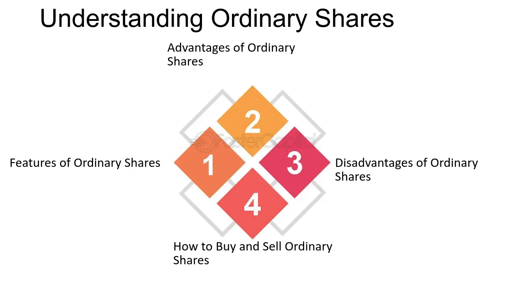

## Table of Contents

## What are ordinary shares?

Ordinary shares, also known as common stock, are a type of stock that companies issue to investors. When you buy ordinary shares, you become a part-owner of the company. This means you have a say in how the company is run, usually by voting at shareholder meetings. The value of ordinary shares can go up or down based on how well the company is doing and what's happening in the stock market.

One big advantage of owning ordinary shares is that you might get dividends. Dividends are payments the company makes to its shareholders from its profits. However, dividends are not guaranteed, and the company can decide not to pay them. If the company does really well, the value of your shares could increase, and you could sell them for a profit. On the other hand, if the company struggles, the value of your shares could drop, and you might lose money.

## How do ordinary shares differ from other types of shares?

Ordinary shares are different from other types of shares, like preference shares, in a few key ways. Ordinary shares give you voting rights at company meetings, which means you can help make decisions about how the company is run. They also let you share in the company's profits through dividends, but these dividends aren't guaranteed. If the company does well, the value of your ordinary shares can go up, and you might make money if you sell them. But if the company doesn't do well, the value of your shares can drop, and you could lose money.

Preference shares, on the other hand, don't usually give you voting rights. But they do offer a more stable income because they pay fixed dividends, which are paid out before any dividends go to ordinary shareholders. This means if the company has a tough year and can't pay all its dividends, preference shareholders get paid first. However, preference shareholders usually don't benefit as much from the company's growth because their dividends stay the same, and the value of their shares doesn't increase as much as ordinary shares might. So, ordinary shares can be riskier but offer more potential for growth, while preference shares are safer but with less chance for big gains.

## What are the basic rights associated with owning ordinary shares?

Owning ordinary shares gives you some basic rights in a company. One big right is the ability to vote at shareholder meetings. This means you can have a say in important decisions, like choosing the board of directors or approving big changes in the company. The more shares you own, the more votes you get, so bigger shareholders have more influence.

Another right is the chance to get dividends. Dividends are payments the company makes to shareholders from its profits. But, these payments aren't guaranteed. The company can choose to pay them or not, and they might change the amount from time to time. If the company does well, you might get bigger dividends, but if it struggles, you might get less or nothing at all.

Lastly, you have the right to sell your shares. If the company's value goes up, you can sell your shares for more than you paid, making a profit. But, if the company's value goes down, you might have to sell at a loss. This right to sell gives you flexibility to decide when to get out of your investment.

## How can someone purchase ordinary shares?

To buy ordinary shares, you need to use a broker. A broker is someone who helps you buy and sell stocks. You can find brokers online or at a bank or financial firm. Once you choose a broker, you'll need to open an account with them. This usually involves filling out some forms and giving them some money to start trading with. Once your account is set up, you can start looking for the shares you want to buy.

When you find a company you want to invest in, you tell your broker how many shares you want to buy. They will then place an order for you. You can choose to buy the shares at the current market price or set a specific price you're willing to pay. Once the order is filled, the shares will show up in your account. Remember, you'll need to pay a fee to the broker for their services, so keep that in mind when you're planning your investment.

## What are the potential financial benefits of owning ordinary shares?

Owning ordinary shares can give you a chance to make money in two main ways. First, you might get dividends. Dividends are payments that companies give to their shareholders from their profits. If a company does well and makes a lot of money, it might decide to share some of that with its shareholders. But, remember, dividends aren't guaranteed. The company can choose to pay them or not, and the amount can change.

The second way you can make money is by selling your shares for more than you paid for them. If the company grows and becomes more valuable, the price of its shares can go up. If you decide to sell your shares when they're worth more, you can make a profit. This is called capital appreciation. But, it's important to know that the value of shares can also go down. If you sell your shares for less than you paid, you'll lose money. So, owning ordinary shares can be risky, but it also has the potential for big rewards.

## How do dividends work with ordinary shares?

Dividends are payments that companies make to their shareholders out of their profits. If you own ordinary shares, you might get dividends. But, companies don't have to pay dividends, and they can decide to pay them or not. If they do pay dividends, the amount can change depending on how well the company is doing. So, dividends are not guaranteed, and they can go up or down.

When a company decides to pay dividends, it usually does so on a regular schedule, like every three months or once a year. The company's board of directors decides how much to pay and when. If you own ordinary shares on the date the company sets for receiving dividends, you'll get the payment. The dividend can be paid in cash, or sometimes the company might give you more shares instead of cash. This way, owning ordinary shares can give you a chance to earn some extra money from the company's profits.

## What is the role of ordinary shares in corporate governance?

Ordinary shares play a big role in how a company is run. When you own ordinary shares, you get to vote at shareholder meetings. This means you can help decide important things like who should be on the company's board of directors or if the company should make big changes. The more shares you own, the more votes you get, so people with a lot of shares have more say in the company's decisions. This voting power is a key part of corporate governance because it lets shareholders have a voice in how the company is managed.

Even though ordinary shareholders can vote, they don't run the company day-to-day. That job is for the board of directors and the company's managers. But, shareholders can use their votes to choose the board members, who then make sure the company is being run well. If shareholders aren't happy with how things are going, they can vote to change the board. This way, ordinary shares help keep the company accountable to its owners and make sure it's being managed in a way that looks out for their interests.

## How does the value of ordinary shares fluctuate?

The value of ordinary shares goes up and down because of many things. One big reason is how well the company is doing. If the company is making more money and growing, people might want to buy its shares, which makes the price go up. But if the company is not doing well and losing money, people might want to sell their shares, which makes the price go down. Also, what's happening in the whole economy can affect the value of shares. If the economy is doing great, people might feel confident and buy more shares, pushing prices up. But if the economy is struggling, people might sell their shares to get cash, and prices can drop.

Another thing that can change the value of ordinary shares is what people think will happen in the future. If people think a company will do really well in the future, they might buy its shares now, hoping to sell them later for more money. This demand can make the price go up. On the other hand, if people think a company might have problems in the future, they might sell their shares now, which can make the price go down. So, the value of ordinary shares can change a lot because of what's happening with the company, the economy, and what people think might happen next.

## What are the risks involved in investing in ordinary shares?

When you invest in ordinary shares, there's a big risk that you could lose money. The price of shares can go up and down a lot. If the company doesn't do well, the value of your shares might drop, and you could lose some or all of the money you put in. Also, if the whole economy is having a tough time, it can make the price of shares go down, even if the company itself is doing okay. So, there's always a chance that you might not get back what you invested.

Another risk is that you might not get dividends. Dividends are payments from the company's profits, but they're not guaranteed. The company can choose to pay them or not, and the amount can change. If the company decides not to pay dividends, you won't get any extra money from your shares. Also, even if you do get dividends, they might not be enough to make up for any drop in the share price. So, when you buy ordinary shares, you need to be ready for the ups and downs and the possibility that you might not make any money from them.

## How can ordinary shares be used as part of a diversified investment portfolio?

Ordinary shares can be a good part of a diversified investment portfolio because they can help you make money in two ways: through dividends and by selling the shares for more than you paid. When you add ordinary shares to your portfolio, you spread out your investments across different companies and industries. This way, if one company or industry doesn't do well, you might still make money from other parts of your portfolio. By having a mix of different kinds of investments, like ordinary shares, bonds, and maybe even real estate, you can lower your risk because you're not putting all your eggs in one basket.

When you're picking ordinary shares for your portfolio, it's smart to choose companies from different sectors, like technology, healthcare, and consumer goods. This helps make sure that your investments are spread out. If the tech industry has a bad year, your healthcare or consumer goods shares might still do well. Also, think about including both big, stable companies and smaller, growing companies. Big companies might give you steady dividends, while smaller ones could grow a lot and make your shares worth more. By mixing things up like this, you can have a better chance of making money while keeping your risk lower.

## What are some advanced strategies for trading ordinary shares?

One advanced strategy for trading ordinary shares is called "day trading." Day traders buy and sell shares within the same day, trying to make quick profits from small changes in the share price. They use charts and other tools to look for patterns that might tell them when to buy or sell. Day trading can be risky because it's hard to predict what will happen in just one day, but it can also be exciting and potentially rewarding if you get good at it.

Another strategy is "swing trading," where you hold onto shares for a few days or weeks. Swing traders look for shares that they think will go up in value over a short time. They use a mix of technical analysis, which looks at charts and patterns, and fundamental analysis, which looks at the company's financial health and news about it. This strategy can be less stressful than day trading because you don't need to watch the market all day, but it still requires a good understanding of how shares move.

A third strategy is "value investing." This means buying shares that you think are priced lower than they should be, based on the company's true worth. Value investors look at things like the company's earnings, its assets, and how much it's growing. They hold onto these shares for a long time, hoping that other people will eventually see the value too, and the share price will go up. This strategy can take patience, but it can lead to big gains if you pick the right companies.

## How do global economic factors influence the performance of ordinary shares?

Global economic factors can have a big impact on the performance of ordinary shares. When the world economy is doing well, people feel more confident and are more likely to invest in shares. This demand can push share prices up. For example, if countries like the United States or China are growing fast, it can make companies in those countries do better, which can help their share prices. On the other hand, if there's a global economic slowdown or a crisis, like a financial crisis or a big drop in oil prices, people might get scared and sell their shares. This can make share prices go down, even if the company itself is doing okay.

Another way global economic factors affect ordinary shares is through interest rates and currency values. When interest rates go up in a country, it can make borrowing more expensive for companies, which might hurt their profits and make their share prices drop. Also, if a country's currency gets stronger compared to others, it can make that country's companies less competitive when they sell things in other countries. This can hurt their earnings and, in turn, their share prices. So, keeping an eye on what's happening around the world can help you understand why share prices are moving the way they are.

## How can one balance risks and rewards?

Investing in ordinary shares involves navigating inherent risks, notably market volatility and [liquidity](/wiki/liquidity-risk-premium) risks. Market volatility refers to fluctuations in stock prices due to changes in market dynamics, economic indicators, or investor sentiment. This volatility can result in substantial gains or losses over short periods. Liquidity risk concerns the ability to quickly buy or sell shares without significantly affecting their price. A lack of liquidity can lead to challenges in executing trades at desired prices, especially during volatile market conditions.

To effectively balance these risks with the pursuit of capital gains and dividends, investors need to employ strategic decision-making. Diversification is a key strategy for mitigating risk. By spreading investments across various sectors, industries, and geographic locations, investors can reduce exposure to any single asset's poor performance. This approach can be mathematically represented by the diversification formula in portfolio theory, which aims to minimize the portfolio variance:

$$
\sigma^2_p = \sum_{i=1}^n \sum_{j=1}^n w_i w_j \sigma_{ij}
$$

where $\sigma^2_p$ is the portfolio variance, $w_i$ and $w_j$ are the weights of assets $i$ and $j$ in the portfolio, and $\sigma_{ij}$ is the covariance between the returns on those assets.

Apart from diversification, investors must stay informed about their rights as shareholders and market dynamics like algorithmic trading. This awareness enables them to make informed decisions about when to buy, sell, or hold shares, optimizing their portfolios' risk-reward balance. Algorithmic trading, which uses computer algorithms to execute trades at high speeds, adds another layer of complexity and opportunity. Understanding its impact on market price movements can aid ordinary shareholders in adapting their strategies promptly.

In addition to diversification and informed decision-making, regular assessment and rebalancing of the investment portfolio are crucial. This involves periodically adjusting portfolio allocations to maintain the desired level of risk and return, aligning with an investor's financial goals and market conditions.

By comprehensively evaluating these elements, investors become equipped to build a resilient investment portfolio that balances the potential for rewards with the management of inherent risks, ultimately contributing to long-term financial success.

## References & Further Reading

[1]: Bergstra, J., Bardenet, R., Bengio, Y., & Kégl, B. (2011). ["Algorithms for Hyper-Parameter Optimization."](https://dl.acm.org/doi/10.5555/2986459.2986743) Advances in Neural Information Processing Systems 24.

[2]: ["Advances in Financial Machine Learning"](https://www.amazon.com/Advances-Financial-Machine-Learning-Marcos/dp/1119482089) by Marcos Lopez de Prado

[3]: ["Evidence-Based Technical Analysis: Applying the Scientific Method and Statistical Inference to Trading Signals"](https://www.amazon.com/Evidence-Based-Technical-Analysis-Scientific-Statistical/dp/0470008741) by David Aronson

[4]: ["Machine Learning for Algorithmic Trading"](https://github.com/stefan-jansen/machine-learning-for-trading) by Stefan Jansen

[5]: ["Quantitative Trading: How to Build Your Own Algorithmic Trading Business"](https://www.amazon.com/Quantitative-Trading-Build-Algorithmic-Business/dp/1119800064) by Ernest P. Chan