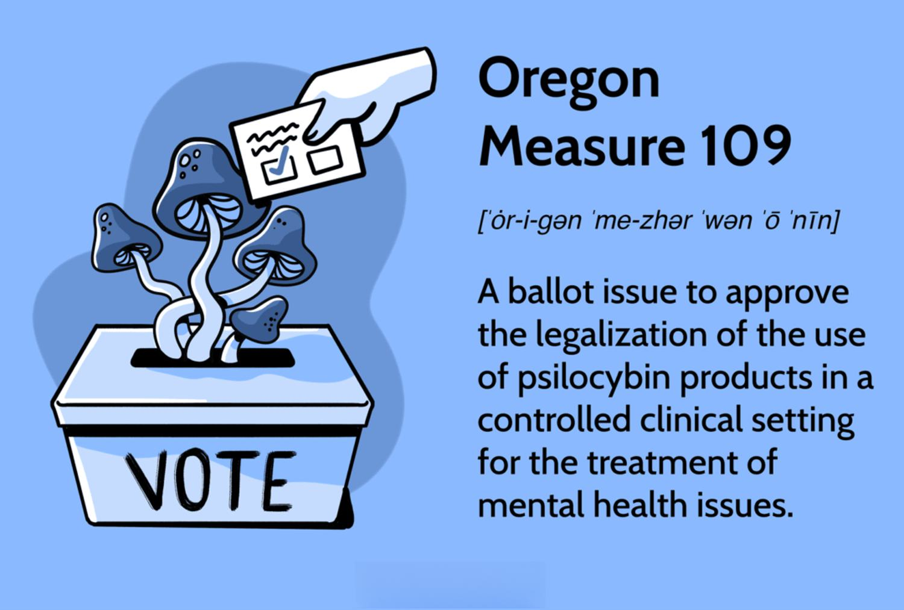

Oregon Measure 109 marks a significant step in the acceptance and regulation of psilocybin therapy in the U.S., representing a pioneering effort to integrate alternative mental health treatments within a legal framework. This measure, passed in November 2020, has caught the attention of stakeholders across a variety of sectors, from healthcare to investment. Its implementation has opened extensive dialogues about the potential benefits and challenges of psilocybin, a psychoactive compound found in certain mushrooms, in therapeutic settings.

The intrigue surrounding Oregon Measure 109 extends beyond its health implications. It has spurred curiosity among financial analysts and investors, prompting considerations of how developments in therapeutic hallucinogenics might intersect with innovative financial technologies, such as algorithmic trading. The burgeoning field of psychedelic stocks presents new, albeit speculative, opportunities and challenges which could mirror patterns seen in the early days of cannabis market investments.



This article will dissect Oregon Measure 109, examining its provisions and the undercurrents of debate surrounding psilocybin use. Additionally, it will explore the broader impact of this measure on various sectors, including how it might influence emerging trends in financial markets through algorithmic trading strategies. The convergence of mental health innovations and cutting-edge financial tools hints at potential new paradigms in investment approaches and highlights the importance of staying informed about the evolving interplay between health policy and market dynamics.

## Table of Contents

## Understanding Oregon Measure 109

Oregon Measure 109, formally known as the Oregon Psilocybin Services Act, was enacted following its approval by voters in the November 2020 election. This measure signifies a pioneering approach in the United States toward the therapeutic application of psilocybin, a psychoactive compound found in certain mushroom species often referred to as 'magic mushrooms'. 

The primary objective of Measure 109 is to enable the regulated use of psilocybin for therapeutic purposes, particularly in mental health treatment. Despite the measure's acceptance at the state level, psilocybin continues to be classified as a Schedule I drug under federal law, denoting a high potential for abuse and no currently accepted medical use. This discrepancy between state and federal regulations presents a complex legal landscape for the application and study of psilocybin therapies.

Measure 109 establishes a structured framework for the establishment and operation of psilocybin service centers. It specifies a licensing system for both the centers and facilitators who administer the therapy. To begin the treatment process, clients are required to undergo thorough preparation sessions. Consumption of psilocybin is mandated to occur within the confines of licensed facilities, aiming to ensure safety and proper supervision.

Furthermore, Measure 109 accommodates local governance by allowing cities and counties within Oregon to impose additional regulations as they see fit. This flexible regulatory approach enables local jurisdictions to tailor psilocybin services to the needs and concerns of their communities while maintaining a standardized state-wide framework. 

In essence, Oregon Measure 109 sets the stage for innovative mental health treatments while navigating the complex interplay between state and federal laws. This marks a significant development in the field of psychedelic-assisted therapy, with the potential for broad implications on health regulation and therapeutic practices.

## The Science and Debate Surrounding Psilocybin

Psilocybin, a naturally occurring psychoactive compound found in certain mushrooms, often referred to as 'magic mushrooms,' has garnered significant attention for its potential therapeutic applications. This compound is primarily recognized for its ability to alter perception, mood, and various cognitive processes, leading to its historical and cultural use in religious and spiritual contexts. Despite its classification as a Schedule I drug under the Controlled Substances Act, which signifies a high potential for abuse and no accepted medical use, recent scientific research has begun to uncover its possible benefits in mental health treatment.

Research into psilocybin's therapeutic potential suggests promising results in addressing mental health conditions such as depression and post-traumatic stress disorder (PTSD). A growing body of evidence, including controlled clinical studies, indicates that psilocybin can lead to significant reductions in depressive symptoms and contribute to improved overall well-being. In particular, its use in a controlled therapeutic environment, accompanied by psychological support, has shown potential as part of a novel treatment approach for those resistant to traditional therapies.

The ongoing debates surrounding psilocybin are fueled by its Schedule I classification, which poses challenges to the acceptance and integration of this compound in mainstream medical treatments. Supporters of psilocybin therapy highlight the breakthrough therapy designations granted by the U.S. Food and Drug Administration (FDA) for its use in certain therapeutic contexts. These designations aim to expedite the development and review of drugs that demonstrate substantial improvement over existing therapies for serious conditions, underscoring the potential that regulatory bodies see in psilocybin's therapeutic effects.

Nonetheless, critics remain cautious and emphasize the necessity for further research, particularly the lack of extensive Phase 3 clinical trials. These trials are crucial for establishing the safety, efficacy, and therapeutic value of psilocybin, especially concerning long-term use and its interaction with other medications. Concerns also persist regarding the potential for negative side effects, although preliminary studies report limited adverse events when administered in controlled environments.

In summary, psilocybin continues to be the focus of scientific exploration, with growing interest in its possible benefits for treating complex mental health issues. While research hints at significant potential, ongoing discussions about safety, efficacy, and regulatory classification remain critical aspects in the path toward its broader therapeutic acceptance.

## Implications of Measure 109 on the Broader Market

The passing of Oregon Measure 109 heralds notable implications that extend beyond the immediate sphere of health, significantly impacting investment and market dynamics. This legislation, permitting regulated psilocybin use for therapeutic purposes, has catalyzed the emergence of 'psychedelic stocks'. These stocks have drawn comparisons to the early cannabis market due to their high-risk, high-reward nature. Initial valuation metrics may appear speculative, reflecting a nascent industry where revenue streams and profitability remain untested. 

Regulatory environments are key determinants in shaping market opportunities within this sector. Oregon, alongside states like Colorado, which are at the forefront of drug policy reform, sets powerful precedents. Their actions influence investor sentiment and regulatory developments in other states, potentially leading to a cascade effect of decriminalization and legalization that further opens market avenues.

Investors are closely monitoring legislative trends across states and municipalities, assessing the likelihood of replication of Oregon's model elsewhere. As these regulatory landscapes evolve, strategic positioning in health-focused companies on the cutting edge of psychedelics could yield substantial returns. Companies that effectively navigate the murky regulatory waters will likely experience noteworthy growth. Nonetheless, challenges remain as these entities may also face significant regulatory hurdles that could affect their market valuation and operational viability.

For example, a healthcare company specializing in psychedelics aiming to capitalize on Measure 109's framework needs to balance innovation with compliance, ensuring that development pipelines align with both state and potential federal guidelines. Failure to do so could result in setbacks that affect investor confidence and stock performance.

As the psychedelic sector's trajectory unfolds, it is crucial for market participants to balance optimism with prudent risk assessment, navigating this sector much like the early days of cannabis—a domain where regulations, public perception, and investment potential are subject to rapid shifts.

## Psilocybin and Algorithmic Trading: An Unlikely Pair?

Algorithmic trading, defined by the use of automated systems to execute trades at high speed and [volume](/wiki/volume-trading-strategy), finds intriguing applicability in sectors that exhibit high [volatility](/wiki/volatility-trading-strategies) and are in the nascent stages of development. Psychedelic stocks, which have gained traction following regulatory measures like Oregon Measure 109, represent such an emerging sector. 

The allure of [algorithmic trading](/wiki/algorithmic-trading) in psychedelic stocks lies primarily in their inherent volatility and market conditions, which are subject to rapid change based on regulatory developments and shifts in public sentiment. These dynamics create a fertile ground for algorithmic strategies that thrive on volatility and price inefficiencies. For instance, algorithms can capitalize on short-term price movements following regulatory news—such as new state-level approvals or federal changes in drug scheduling—that influence stock valuations.

Optimizing trading in psychedelic stocks requires a sophisticated approach to analyzing not only traditional financial metrics but also non-traditional data sources that capture regulatory news and public sentiment. Natural Language Processing (NLP) techniques can parse information from news articles, social media, and financial reports to gauge sentiment and predict market movements. Python, with its comprehensive libraries such as `pandas`, `numpy`, and `nltk`, offers powerful tools for this analysis. For instance:

```python
import pandas as pd
from nltk.sentiment.vader import SentimentIntensityAnalyzer

# Example of sentiment analysis on stock-related news
news_data = pd.read_csv('news_headlines.csv')  # Assuming CSV file with news headlines
sid = SentimentIntensityAnalyzer()

def analyze_sentiment(headline):
    return sid.polarity_scores(headline)['compound']

news_data['sentiment_score'] = news_data['headline'].apply(analyze_sentiment)
market_sentiment = news_data.groupby('date')['sentiment_score'].mean()

# Incorporate sentiment into trading strategy
def trading_signal(sentiment_score):
    return 'buy' if sentiment_score > 0.05 else 'sell' if sentiment_score < -0.05 else 'hold'

news_data['signal'] = market_sentiment.apply(trading_signal)
```

Algorithmic tools also offer the ability to dynamically manage risk. Volatility measures such as the standard deviation of stock returns or more sophisticated Value at Risk (VaR) models can be integrated into trading systems to optimize the risk-return profile. Formulating algorithms to adjust positions based on these metrics can enhance performance in rapidly evolving markets.

Furthermore, the emerging status of the psychedelic industry paves the way for innovative financial products. Exchange-traded funds (ETFs) dedicated to psychedelic stocks or indices tracking the performance of companies in the wellness industry can cater to investors seeking exposure to this niche market. These products can benefit from algorithmic input to manage composition and rebalance in response to both market dynamics and regulatory shifts.

In summary, the synergy between algorithmic trading and the psychedelic sector lies in the ability to navigate and profit from volatility and rapid market evolution. With intelligent data analysis and risk management strategies, algorithmic systems have the potential to not only capitalize on this nascent industry's fluctuations but also support the development and acceptance of related financial instruments.

## Potential Future Developments

As more regions consider the regulation of psilocybin, the potential market growth could resemble the patterns witnessed during the cannabis legalization movement in the United States. This similarity stems from the expanding social and legislative acceptance that may encourage investment into research and development. Such investment has the potential to enhance both the legitimacy and stability of the market, drawing parallels to the trajectory observed in the cannabis sector. The burgeoning interest in psilocybin's therapeutic applications could drive significant funding toward scientific studies, aiming to conclusively establish its efficacy and safety.

In parallel with the market's evolution, technological advancements in trading are expected to play an increasingly pivotal role in how investors approach psychedelic stocks. Algorithmic trading, for instance, can offer advantages in navigating the high volatility and nascent status of these sectors. Traders employing algorithmic strategies could leverage real-time regulatory news and market sentiment analysis to optimize their portfolios, seeking to manage risks and seize opportunities brought about by rapid fluctuations in stock prices.

However, investors must remain vigilant as they navigate the changing legal frameworks that characterize the psychedelic industry. The complexities of varying state and federal laws, alongside potential shifts in public opinion, present both opportunities and challenges. This fluidity requires investors to balance potential high rewards against inherent risks such as regulatory setbacks or financial instability.

Ultimately, the journey towards wider acceptance of psilocybin has the potential to redefine aspects of both healthcare and investment landscapes. As scientific understanding deepens and legal barriers diminish, psilocybin could emerge as a mainstream therapeutic option, with significant implications for mental health treatment paradigms. Concurrently, the investment sector may witness the development of new financial products tailored to the wellness and psychedelic industries, as stakeholders seek to capitalize on this emerging intersection of health policy and market innovation.

## Conclusion

Oregon Measure 109 represents a significant shift in the landscape of psilocybin therapy, marking a pivotal moment in both healthcare and investment sectors. This measure has not only opened the door for therapeutic uses of psilocybin but also set the stage for new investment opportunities, particularly within innovative financial markets.

The convergence of Oregon's psilocybin framework and algorithmic trading illustrates a groundbreaking approach to investment in emerging markets. With the psychedelic sector still in its infancy, algorithmic trading presents a method for navigating the high volatility and rapid developments inherent in this field. The careful analysis of regulatory developments and market sentiments can provide insights into the risks and rewards associated with psychedelic investments.

As legal considerations continue to evolve, the importance of understanding these dynamics becomes paramount. Both the healthcare and financial sectors must remain agile and informed about the progression of regulatory landscapes that govern psilocybin use. Continuing research will likely illuminate new therapeutic pathways and guide market strategies.

The path forward requires stakeholders to maintain awareness and adapt their approaches to capitalize on opportunities within health policy and financial innovation. By bridging the gap between health care advancements and financial strategies, Measure 109 could redefine both therapy and market engagement, fostering a robust environment for sustained growth and innovation.

## References & Further Reading

[1]: Pollan, M. (2018). ["How to Change Your Mind: What the New Science of Psychedelics Teaches Us About Consciousness, Dying, Addiction, Depression, and Transcendence"](https://pubmed.ncbi.nlm.nih.gov/30376643/). Penguin Press.

[2]: Nichols, D. E. (2004). ["Hallucinogens."](https://pubmed.ncbi.nlm.nih.gov/14761703/) Pharmacology & Therapeutics, 101(2), 131-181.

[3]: Carhart-Harris, R. L., & Goodwin, G. M. (2017). ["The Therapeutic Potential of Psychedelic Drugs: Past, Present, and Future."](https://pubmed.ncbi.nlm.nih.gov/28443617/) Neuropsychopharmacology, 42(11), 2105–2113.

[4]: Aday, J. S., Davoli, C. C., & Bloesch, E. K. (2020). ["2020 Psychedelic Science Review: Recent Advances and Current Debates."](https://pubmed.ncbi.nlm.nih.gov/32194129/) Trends in Pharmacological Sciences, 41(12), 792-806.

[5]: Loehle, C. (1996). ["Algorithmic Approaches to Stock Trading."](https://en.wikipedia.org/wiki/Grafting) Computational Economics, 9, 181–187.