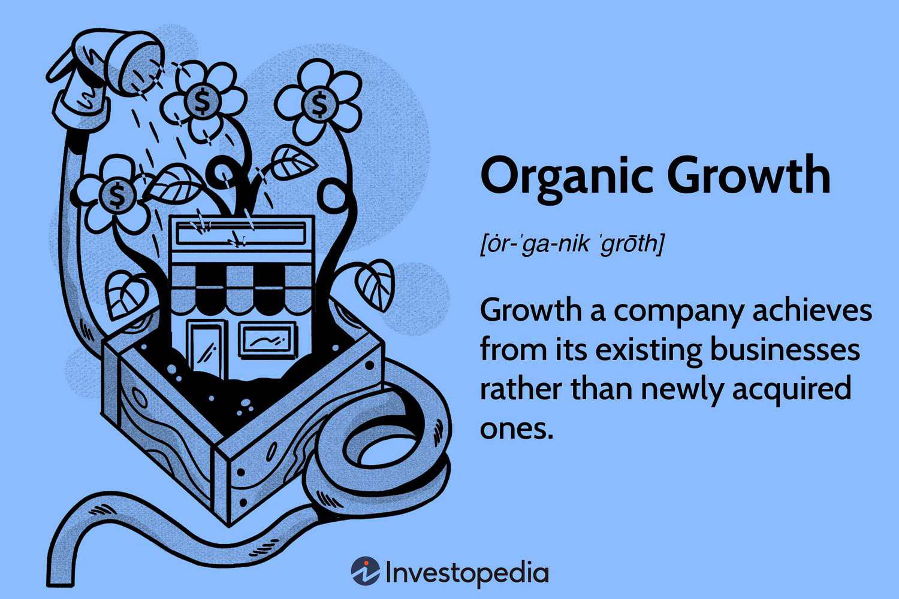

Investing has long been a critical component of financial planning and wealth accumulation, traditionally focusing on strategies like portfolio diversification, asset allocation, and fundamental analysis. However, as financial markets evolve, so too do the strategies employed by investors. The changing landscape is characterized by a growing understanding of organic growth and the increasing use of technology in trading, notably through algorithmic methods.

Organic growth strategies are gaining prominence due to their potential for sustainable, long-term success. Unlike inorganic growth methods such as mergers and acquisitions, organic growth focuses on developing internal capabilities, expanding product lines, and improving efficiencies. It is fundamental for sustainable investment as it emphasizes building a company's value through enhanced operational effectiveness, driving revenue from existing assets and capabilities. Sectors like technology, healthcare, and consumer goods have showcased successful examples where companies have thrived without relying heavily on external acquisitions.



Simultaneously, algorithmic trading, which utilizes pre-programmed instructions for executing trades at optimal conditions, is revolutionizing traditional investment strategies. By employing algorithms, investors achieve higher speed, precision, and transaction volume, minimizing the impact of human emotions on trading decisions. Algorithms can process vast amounts of data in real-time, adapting to market changes quickly, providing an edge in capturing profit opportunities. This technological advancement has significantly influenced not only institutional investors but also individual traders who now have greater access to sophisticated trading tools.

This article aims to explore the intersection of these two distinct areas: organic growth and algorithmic trading. By examining how these strategies can complement each other, it seeks to provide insights into creating a hybrid approach that leverages the strengths of both. Readers can expect to learn about the principles of organic growth and how algorithmic trading can enhance it, the challenges and potential pitfalls of integrating these strategies, and the future trends shaping investment landscapes. Through this exploration, the article endeavors to equip investors with a balanced perspective on making informed investment decisions in a rapidly changing financial environment.

## Table of Contents

## Understanding Organic Growth in Investment

Organic growth in investment refers to the expansion of a company's operations and revenues through internal enhancements, such as boosting sales and increasing output, rather than through external means like mergers and acquisitions (M&A). This growth strategy emphasizes the development of new products, enhancement of existing products, expansion into new markets, and increased efficiencies within the company.

The primary distinction between organic growth and inorganic growth strategies like M&A lies in their approach to expansion. Inorganic growth often involves acquiring other businesses to quickly scale operations and gain market share, which can sometimes lead to diseconomies of scale, cultural clashes, and integration challenges. In contrast, organic growth relies on utilizing a company's existing resources and capabilities, often resulting in a more sustainable and manageable growth path.

The sustainability of organic growth is crucial for long-term investment success due to its reliance on intrinsic value creation rather than external influences. By focusing on internal improvements and market expansion, companies can build a solid foundation, ensuring consistent performance and minimizing risk exposure. Organic growth is often regarded as more sustainable since it avoids the complications and uncertainties associated with acquiring and integrating other entities.

Several sectors have effectively utilized organic growth strategies, demonstrating particular efficacy in industries characterized by rapid innovation and customer-centric approaches. The technology sector, for example, has seen companies like Apple and Google increase their market dominance through continuous product innovation and service enhancements. Similarly, the consumer goods industry benefits significantly from organic growth, with companies like Unilever and Procter & Gamble successfully increasing their market share by investing in marketing initiatives and expanding their product lines.

Companies known for achieving significant organic growth include Amazon, which has expanded its market by continuously diversifying and improving its product and service offerings, such as Amazon Prime and AWS. Another example is Starbucks, which has grown by enhancing its customer experience and expanding its store presence globally without relying heavily on acquisitions, focusing instead on the brand's organic development and innovation in the company's service model.

In conclusion, organic growth is a strategy rooted in internal optimization and market expansion, offering a sustainable pathway for long-term success. It contrasts with inorganic growth strategies by emphasizing organic development over quick market share acquisitions, fostering a robust foundation for enduring profitability and resilience.

## Algorithmic Trading: A Brief Overview

Algorithmic trading involves the use of computer algorithms to execute trading strategies at high speeds, often much faster than a human could perform manually. These algorithms are composed of pre-programmed instructions based on timing, price, quantity, or any mathematical model, enabling asset trading with minimal human intervention. Algorithmic trading, commonly referred to as algo trading, is implemented across various financial markets, including equities, foreign exchange, and commodities.

One of the primary advantages of [algorithmic trading](/wiki/algorithmic-trading) is speed. Computers can process vast amounts of information and execute trades in fractions of a second, a critical [factor](/wiki/factor-investing) in financial markets where time is of the essence. Another advantage is precision; algo trading systems can execute trades at exact points programmed into the strategy, which reduces the risk of human error. Additionally, algo trading eliminates the influence of human emotion, such as fear or greed, from trading decisions. This objectivity can lead to more consistent trading outcomes.

Popular algorithms in trading include:

1. **Trend-Following Algorithms**: These algorithms analyze historical market data to identify trends, such as moving average crossovers, and make buy or sell decisions accordingly.

2. **Arbitrage Algorithms**: They exploit pricing inefficiencies between correlated securities or markets by simultaneously buying and selling these assets.

3. **Market-Making Algorithms**: These systems provide liquidity by offering bid and ask prices and profit from the spread between them.

4. **Statistical Arbitrage**: These are algorithms that use statistical and mathematical models to identify trading opportunities based on historical data relationships.

5. **Volume-Weighted Average Price (VWAP) and Time Weighted Average Price (TWAP)**: These algorithms execute large orders in a manner that aims to match average market prices over a specific time period, thus minimizing market impact.

Algorithmic trading has become increasingly accessible to individual investors due to technological advancements and the development of trading platforms that offer algorithmic trading tools. Platforms like MetaTrader, QuantConnect, and TradingView provide users with the ability to design, test, and deploy custom trading algorithms. Programming languages such as Python, known for its versatility and rich ecosystem of libraries, facilitate the creation and [backtesting](/wiki/backtesting) of trading strategies.

For example, the following Python code snippet demonstrates a simple moving average crossover strategy in Python using the `pandas` library:

```python
import pandas as pd

def moving_average_crossover(df, short_window, long_window):
    # Calculate short and long moving averages
    df['short_ma'] = df['Close'].rolling(window=short_window).mean()
    df['long_ma'] = df['Close'].rolling(window=long_window).mean()

    # Create signals
    df['signal'] = 0
    df['signal'][short_window:] = np.where(df['short_ma'][short_window:] > df['long_ma'][short_window:], 1, 0)

    # Create positions
    df['position'] = df['signal'].diff()

    return df

# Example usage with stock data
# df = pd.read_csv('stock_data.csv')
# result_df = moving_average_crossover(df, 40, 100)
# print(result_df)
```

This code calculates the short-term and long-term moving averages and generates buy or sell signals when these averages cross. Such democratization of tools empowers individual investors to participate more actively in markets through algorithmic methods.

In summary, algorithmic trading leverages technology to enhance trading efficiency, precision, and objectivity. Its increasing accessibility allows even individual investors to harness sophisticated trading strategies, marking a significant evolution in the approach to asset trading.

## Integrating Algorithmic Trading with Organic Growth Strategies

Investors seeking to enhance organic growth strategies can significantly benefit from integrating algorithmic trading techniques. Algorithmic trading, which utilizes computer programs to execute trades based on pre-defined parameters, offers several advantages that align well with the objectives of organic growth.

One of the primary advantages of algorithmic trading is its ability to process vast amounts of data quickly and accurately. In the context of organic growth, this capability is particularly useful for identifying potential growth opportunities. By analyzing historical price patterns, trading volumes, market news, and economic indicators, algorithms can detect trends and signals that human analysis might overlook. The data analysis component of algorithmic trading enables investors to base their decisions on empirical evidence, increasing the likelihood of identifying viable growth prospects.

Algorithms also excel in adapting and optimizing investment strategies according to changing market conditions. By employing [machine learning](/wiki/machine-learning) techniques, trading programs can learn from vast datasets and adjust their parameters to improve performance over time. This adaptability is crucial for organic growth, as market conditions are often dynamic and unpredictable. Investors can automate the process of refining their strategies, ensuring that their investment approach remains efficient and responsive to real-time data.

Several firms have successfully implemented a combination of organic growth strategies and algorithmic trading. For instance, Renaissance Technologies, a well-known quantitative [hedge fund](/wiki/hedge-fund-trading-strategies), leverages complex mathematical models to predict market movements. While its focus is often on short-term gains, the underlying principles can be adapted to long-term, organic growth-focused investments. By continuously analyzing data and refining their algorithms, Renaissance Technologies consistently achieves superior returns.

Another example is Two Sigma, a firm that uses data science to guide its investment decisions. The company employs a combination of [artificial intelligence](/wiki/ai-artificial-intelligence) and machine learning to analyze vast datasets, identifying patterns and opportunities for growth. Through its algorithmic systems, Two Sigma can adapt to new trends and adjust its strategies to take advantage of emerging markets, thereby supporting organic growth initiatives.

In summary, the integration of algorithmic trading and organic growth strategies allows investors to harness the power of data analysis and adaptability. By utilizing algorithms to analyze market data and optimize strategies, investors can identify growth opportunities and ensure their strategies remain effective in varying market conditions. Successful firms like Renaissance Technologies and Two Sigma demonstrate the potential of these integrated approaches to generate substantial returns and foster sustainable growth.

## Potential Challenges and Considerations

Investors aiming to leverage algorithmic trading for organic growth face several challenges that can impact their overall strategy. A key challenge is the inherent risk associated with heavy reliance on algorithms, particularly concerning market [volatility](/wiki/volatility-trading-strategies) and potential technical failures. Algorithms, while efficient, execute trades based on predefined rules and historical data, which may not always account for unforeseen market fluctuations or black swan events. This can lead to unexpected losses if the algorithms are not adaptable to sudden market changes.

An additional concern is the technical reliability of algorithmic trading systems. These systems require robust infrastructure to function optimally, and any technical malfunction or latency issues can lead to significant losses. It's crucial for investors to ensure their systems are well-maintained and capable of handling high-frequency data streams efficiently.

Continuous monitoring and timely adjustment of trading strategies are essential for success. Because markets are dynamic, strategies that perform well in one set of circumstances may not yield the same results in another. Investors must regularly update and optimize their algorithms, incorporating new data inputs and modifying parameters to reflect current market conditions. This adaptability requires both technical proficiency and a deep understanding of market trends, emphasizing the importance of ongoing education and technical expertise in managing algorithmic systems.

Regulatory considerations also pose significant challenges. The landscape of financial regulation is complex and varies across jurisdictions. Compliance issues can arise if algorithmic trading strategies inadvertently breach market conduct rules. For instance, certain high-frequency trading practices might be classified as manipulative or unfair. It's important for investors to stay informed about current regulations and ensure their trading practices align with legal standards to avoid fines and sanctions.

Given these challenges, investors must adopt a balanced approach, integrating robust risk management practices into their trading strategies. Regular audits, both technical and financial, can help identify potential vulnerabilities, ensuring that the algorithmic systems are not only compliant but also effective in achieving their intended goals. By addressing these challenges proactively, investors can better harness the potential of algorithmic trading to drive organic growth while minimizing risks.

## Future Trends in Investment Strategies

Emerging trends in the investment landscape are shifting as technological advancements and societal priorities evolve. Both organic growth and algorithmic trading are poised to be significantly influenced by these changes.

One of the most powerful technological advancements impacting algorithmic trading is the integration of artificial intelligence (AI) and machine learning (ML). These technologies enhance the ability of algorithms to predict market movements and optimize trading strategies. AI systems can process vast amounts of data at speeds unattainable by human analysts, enabling quicker decision-making and more precise execution of trades. For instance, machine learning models can identify patterns and adapt to new market conditions without human intervention, improving the predictive power of trading algorithms. A basic example of an algorithm that could be employed to analyze stock trends using machine learning in Python is as follows:

```python
from sklearn.ensemble import RandomForestClassifier
from sklearn.model_selection import train_test_split
from sklearn.metrics import accuracy_score
import numpy as np

# sample data
X = np.random.rand(1000, 10)  # features
y = np.random.randint(2, size=1000)  # binary target

# split data
X_train, X_test, y_train, y_test = train_test_split(X, y, test_size=0.2)

# create model
model = RandomForestClassifier()

# train model
model.fit(X_train, y_train)

# predict
predictions = model.predict(X_test)

# evaluate accuracy
print("Accuracy:", accuracy_score(y_test, predictions))
```

This code demonstrates the potential for AI to assist in making more informed investment decisions by employing data analysis for stock market prediction.

Alongside technological shifts, there's an increasing emphasis on sustainable and ethical investing. Investors are increasingly seeking opportunities that align not only with financial gains but also with personal values and societal impact. This trend toward Environmental, Social, and Governance ([ESG](/wiki/esg-investing)) criteria means businesses that prioritize sustainable practices may become more attractive to investors favoring organic growth strategies. Companies that successfully integrate sustainability into their core operations are likely to experience benefits such as enhanced brand reputation, customer loyalty, and regulatory compliance, which can lead to organic growth.

Looking ahead, the fusion of software technology and financial acumen offers novel opportunities for investors. Cloud computing, big data analytics, and blockchain are set to further revolutionize how investments are managed and executed. The use of blockchain, for example, can ensure greater transparency and security in transactions, which is critical for both ethical investors and algorithmic traders.

The convergence of these elements—advanced AI, increased focus on sustainability, and the integration of cutting-edge technology—indicates a future investment landscape that is more dynamic, accountable, and data-driven. Embracing these innovations will enable investors to refine their strategies, optimize returns, and contribute to a more sustainable economy. By being adaptable and forward-thinking, investors can leverage these technological advancements to uncover new avenues for growth and profitability.

## Conclusion

In summary, this article has explored the transformative potential of integrating organic growth strategies with algorithmic trading in investment management. Organic growth, characterized by sustainable business practices and a focus on internal development, offers a stable foundation for long-term success. Its emphasis on leveraging existing resources aligns well with the predictive and analytical capabilities of algorithmic trading. When combined, these strategies can enhance decision-making processes, leading to more informed and effective investment strategies.

The synergy between organic growth and algorithmic trading offers numerous benefits. Algorithmic trading introduces a level of precision and speed that can capitalize on market opportunities, while organic growth provides resilience and sustainability in investment tactics. By employing data analysis and adaptive algorithms, investors can identify growth opportunities, optimize strategies, and maintain a competitive edge in dynamic market conditions.

Investors are encouraged to remain open-minded and adaptable, embracing both innovative technologies and traditional growth strategies to achieve a balanced approach. In doing so, they can enhance their portfolio performance and navigate the complexities of modern financial markets effectively. 

Ultimately, a balanced and informed investment strategy remains paramount. By continuously monitoring market trends, understanding the interplay between growth and technology, and considering regulatory and ethical considerations, investors can position themselves for both immediate gains and long-term prosperity. As the financial landscape continues to evolve, a strategic combination of organic growth and algorithmic trading could serve as a robust framework for future success.

## References & Further Reading

[1]: Bergstra, J., Bardenet, R., Bengio, Y., & Kégl, B. (2011). ["Algorithms for Hyper-Parameter Optimization."](https://papers.nips.cc/paper/4443-algorithms-for-hyper-parameter-optimization) Advances in Neural Information Processing Systems 24.

[2]: ["Advances in Financial Machine Learning"](https://www.amazon.com/Advances-Financial-Machine-Learning-Marcos/dp/1119482089) by Marcos Lopez de Prado

[3]: ["Evidence-Based Technical Analysis: Applying the Scientific Method and Statistical Inference to Trading Signals"](https://www.amazon.com/Evidence-Based-Technical-Analysis-Scientific-Statistical/dp/0470008741) by David Aronson

[4]: ["Machine Learning for Algorithmic Trading"](https://github.com/PacktPublishing/Machine-Learning-for-Algorithmic-Trading-Second-Edition) by Stefan Jansen

[5]: ["Quantitative Trading: How to Build Your Own Algorithmic Trading Business"](https://www.amazon.com/Quantitative-Trading-Build-Algorithmic-Business/dp/1119800064) by Ernest P. Chan