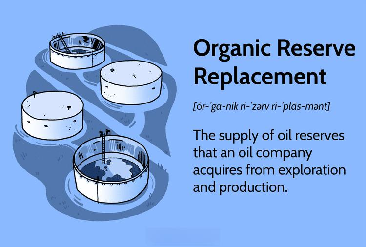

The oil and gas industry is an intricate sector where maintaining reserves is essential for ensuring long-term sustainability in meeting global energy demands. The steady replacement of reserves, termed as organic reserve replacement, has become a focal strategy, enabling companies to replenish their resources effectively without solely depending on acquisitions. This approach involves adding oil and gas reserves through exploration and production activities rather than purchasing existing reserves from other companies. Over time, sustaining a high reserve-replacement ratio (RRR) permits a company to assure investors and stakeholders of its ongoing viability and operational efficiency.

In recent years, algorithmic trading has begun to influence strategic decision-making within the industry, complementing traditional exploration and production techniques. This technology employs advanced mathematical models and software to automate trade execution and strategy, enhancing market operations and decision-making speed. The incorporation of these sophisticated algorithms can enable firms to adeptly navigate volatile market conditions and predict future trends, thereby informing more strategic exploration investments and reserve replacement strategies. Through the integration of algorithmic trading with organic reserve replacement practices, oil and gas companies may optimize their operational processes and improve the precision of reserve predictions.



This article will explore the combination of oil and gas organic reserve replacement and algorithmic trading, analyzing their combined impacts and potential synergies within the sector. By examining these elements, stakeholders can better understand the dynamics shaping the industry and strategically position themselves to address future challenges and leverage emerging opportunities.

## Table of Contents

## Understanding Organic Reserve Replacement

Organic reserve replacement in the oil and gas industry pertains to the augmentation of reserves through exploration and production activities as opposed to acquisitions or mergers. This method is crucial for a company’s sustainability, as it requires the ongoing discovery and development of new reserves to replace those extracted and sold. This practice not only ensures a continuous supply chain but also safeguards the company’s operational longevity.

A critical metric in this domain is the reserve-replacement ratio (RRR). The RRR is calculated as follows:

$$
\text{RRR} = \left( \frac{\text{Added Reserves}}{\text{Produced Reserves}} \right) \times 100\%
$$

An RRR exceeding 100% denotes successful replenishment of reserves, meaning the company has added more reserves than it has depleted over a given time frame. This indicates effective exploration and production activities, ensuring the company's resource base is consistently maintained or augmented.

For investors and analysts, a healthy RRR is a key indicator of a company’s long-term viability and operational efficiency. A sustained RRR over 100% implies that a company is effectively managing its resources, which can serve as a strategic advantage over competitors. As such, companies strive to keep their RRR at or above this threshold to demonstrate robust growth and adaptability in the face of market challenges.

In sum, continuous organic reserve addition is a strategic imperative for oil and gas companies committed to remaining competitive and sustainable in a dynamic industry landscape. This not only supports the company’s financial health but also aligns with broader energy demand trends.

## The Role of Exploration and Production

Exploration and production (E&P) are fundamental components of the oil and gas industry, vital for the identification and development of new reserves. Exploration activities encompass a range of geophysical and geochemical analyses, which are crucial in the preliminary identification of potential oil and gas reservoirs.

Seismic surveys are one of the most common techniques employed in exploration. These surveys involve sending sound waves into the ground and analyzing the reflected signals to map subsurface structures. The data obtained from seismic surveys helps geologists identify potential drilling locations by revealing the presence of formations that could contain hydrocarbons. Advanced processing techniques, such as 3D and 4D seismic imaging, have improved the accuracy of these surveys, enabling more precise identification of promising geological formations.

In addition to geophysical methods, geochemical analyses also play a prominent role in exploration. These analyses involve sampling and evaluating soil, rock, and fluid constituents to detect traces of hydrocarbons or other indicators of oil and gas presence. Geochemical methods provide valuable complementary data to geophysical surveys.

Exploratory drilling is the next step following the identification of promising sites through seismic and geochemical analyses. This drilling is conducted to verify the presence of hydrocarbons and assess their commercial viability. Exploratory holes provide critical information on reservoir characteristics, including size, pressure, temperature, and fluid content, which are essential for designing effective extraction strategies.

Companies involved in E&P activities vary in size and operational scope. Smaller firms often collaborate with E&P specialists, leveraging their technical expertise and resources. These partnerships can be mutually beneficial, as specialized firms provide the necessary skills and technology while gaining access to new geographic areas for exploration.

Larger corporations, on the other hand, frequently maintain in-house teams dedicated to E&P processes. This vertical integration allows them to control the entire exploration and production chain, from initial surveys to reservoir management and extraction. By optimizing resources and expertise across their operations, these corporations can efficiently explore new opportunities and maximize reserve replacement potential.

Successful exploration activities can significantly enhance a company's organic reserve profile. The discovery and development of new reserves affirm a company's capacity to sustain production levels, directly impacting its market position. A robust reserve base provides not only operational assurance but also strengthens investor confidence, affecting stock valuations and access to capital markets.

In summary, exploration and production involve a combination of advanced technologies and strategic partnerships that enable companies to identify and develop new oil and gas reserves. These efforts are critical for maintaining the industry's capacity to meet global energy demands and influence market dynamics significantly.

## Algorithmic Trading in the Oil and Gas Sector

Algorithmic trading in the oil and gas sector involves the use of computational algorithms and advanced software to automate trading processes and strategy formulation. Such systems execute trades based on pre-defined criteria, thereby minimizing human intervention and harnessing the power of modern computing to analyze market conditions swiftly. In the context of oil and gas, which often experiences volatile market fluctuations, [algorithmic trading](/wiki/algorithmic-trading) can enhance operational efficiency and rapid decision-making capabilities.

One core application of algorithmic trading in this sector is its ability to improve market operations by executing trades at optimal times and prices. This is achieved by analyzing vast datasets in real-time to identify patterns, trends, and anomalies that would be impossible for human traders to detect quickly. Algorithms can take into account a myriad of factors, including supply-demand dynamics, geopolitical events, and price data, to predict and capitalize on market movements.

Moreover, algorithmic trading assists in data analysis and predicting future trends, which are crucial for informed decision-making regarding exploration investments and reserve replacement strategies. By processing historical data and current market indicators, these algorithms can forecast potential future prices and identify investment opportunities with higher accuracy. For instance, [machine learning](/wiki/machine-learning) models can be employed to predict price trends based on historical [volatility](/wiki/volatility-trading-strategies) and trading [volume](/wiki/volume-trading-strategy) metrics.

Considerations such as stochastic modeling can also be integral to the algorithmic trading process. An example of such a model might involve calculating the expected price of a commodity using a geometric Brownian motion, which is a mathematical approach often applied to predict the behavior of asset prices over time. The formula for this model is:  

$$

S_t = S_0 \times \exp\left(\left(\mu - \frac{1}{2} \sigma^2\right) t + \sigma W_t\right) 
$$

where $S_t$ is the future stock price, $S_0$ is the current stock price, $\mu$ is the drift coefficient, $\sigma$ is the volatility coefficient, and $W_t$ is the Wiener process.

Python can be a tool of choice in algorithmic trading, providing libraries such as NumPy and pandas for data analysis, and scikit-learn for machine learning applications. Here's a basic example of how Python can be used:

```python
import numpy as np

# Parameters
S0 = 100  # Initial stock price
mu = 0.05  # Drift
sigma = 0.2  # Volatility
T = 1.0  # Time in years
dt = 1/252  # Time increment
steps = int(T/dt)

# Simulation of geometric Brownian motion
np.random.seed(42)
W = np.random.standard_normal(size=steps)
W = np.cumsum(W) * np.sqrt(dt)  # Wiener process
t = np.linspace(0, T, steps)
X = (mu - 0.5 * sigma**2) * t + sigma * W
S_t = S0 * np.exp(X)

# Display simulated prices
print(S_t)
```

This example simulates future stock prices, allowing traders to understand potential future scenarios and devise strategies accordingly.

By integrating algorithmic trading models into their strategic frameworks, oil and gas companies can enhance their ability to predict and respond to market changes, optimizing their exploration investments and reserve replacement approaches. Ultimately, the adoption of algorithmic trading mechanisms enables these companies to maintain a competitive edge in a challenging and dynamic industry.

## Integrating Algo Trading with Reserve Replacement Strategies

The integration of algorithmic trading into reserve replacement strategies marks a significant advancement in the oil and gas industry. By employing sophisticated algorithmic models, companies can effectively optimize the timing and execution of exploration activities and capital allocation. This technological synergy allows firms to navigate the complexities of market dynamics more efficiently, ensuring better resource management and financial outcomes.

Algorithmic trading models leverage vast amounts of market and operational data to generate actionable insights for reserve replacement. For instance, machine learning algorithms can analyze historical data, such as price fluctuations, geological surveys, and drilling outcomes, to predict future market trends and exploration success rates. By doing so, companies can better anticipate periods of favorable economic conditions for exploration investments, maximizing resource yield and return on investment.

These models can be implemented using programming languages such as Python, which offers powerful libraries for data analysis and machine learning. A basic implementation might involve using libraries like pandas for data manipulation and scikit-learn for predictive modeling:

```python
import pandas as pd
from sklearn.model_selection import train_test_split
from sklearn.ensemble import RandomForestRegressor

# Load dataset
data = pd.read_csv('market_and_drilling_data.csv')

# Split data into predictors and target
X = data.drop('reserve_success', axis=1)
y = data['reserve_success']

# Train-test split
X_train, X_test, y_train, y_test = train_test_split(X, y, test_size=0.2, random_state=42)

# Model creation
model = RandomForestRegressor(n_estimators=100, random_state=42)
model.fit(X_train, y_train)

# Predicting reserves success
predictions = model.predict(X_test)
```

Incorporating these predictions into strategic decision-making processes allows for refined planning in exploration and acquisitions. By timing exploration activities to align with predicted market demands and operational windows, firms enhance the efficiency and efficacy of their reserve replacement strategies.

Moreover, algorithmic trading has the potential to improve the accuracy of reserve predictions. By continuously updating models with real-time data, firms can adjust their reserve management strategies dynamically in response to changing market conditions. This adaptability is crucial in an industry characterized by volatility and uncertainty, enabling companies to maintain a competitive edge.

In summary, the integration of algorithmic trading approaches within reserve replacement strategies provides a means to enhance decision-making, optimize resource allocation, and improve predictive accuracy. These advances contribute to more efficient reserve management and long-term sustainability in the oil and gas industry.

## Financial Implications

Robust organic reserve replacement combined with smart trading strategies can significantly impact the financial landscape of oil and gas companies. A steady reserve replacement rate ensures resource availability and fosters investor confidence, which is crucial for financial stability. When companies successfully maintain or exceed a reserve-replacement ratio (RRR) of 100%, it suggests effective resource management and exploration success, translating into long-term viability.

Efficient cost management in exploration and production processes remains paramount, influencing perceptions of profitability and financial health. Two primary accounting methods are employed in the industry: Full Cost (FC) and Successful Efforts (SE). The Full Cost method aggregates all operational expenses, including unsuccessful exploration endeavors, into the book value of the reserves. This approach smooths out the reported earnings but can potentially mask inefficiencies. Conversely, the Successful Efforts method allows companies to capitalize only the costs associated with successful exploration activities. While this technique offers a clearer picture of operational efficiency, it may result in more volatile financial results. The choice between these methods directly affects financial statements, impacting investor sentiment and share value.

Investment in algorithmic trading infrastructure represents a strategic expenditure that could lead to substantial long-term cost efficiencies. Algorithmic trading harnesses complex mathematical models and data-driven strategies to optimize trading activities, ensuring rapid response to market fluctuations and enhancing decision-making precision. This technology aids companies in reducing transaction costs, minimizing market impact, and enhancing [liquidity](/wiki/liquidity-risk-premium). By accurately predicting market trends, algorithmic trading can inform timing and capital allocation decisions in exploration projects, refining overall reserve replenishment strategies.

For example, consider a company using a Python-based algorithm to analyze market data. The algorithm might leverage historical price trends and real-time data inputs to forecast future changes using statistical methods, such as ARIMA (Auto-Regressive Integrated Moving Average) models. The Python implementation could look like this:

```python
import pandas as pd
from statsmodels.tsa.arima.model import ARIMA

# Assume 'oil_prices' is a DataFrame holding historical oil prices
model = ARIMA(oil_prices['price'], order=(5, 1, 0))  # ARIMA model parameters
model_fit = model.fit()

# Forecast future prices
forecast = model_fit.forecast(steps=30)  # Forecast for the next 30 steps
print(forecast)
```

Such predictions allow for proactive adjustments in reserve replacement activities, protecting against adverse market shifts. As the industry increasingly integrates algorithmic trading with organic reserve replacement, companies that effectively merge these strategies are poised to gain a competitive edge. By balancing robust reserve management with advanced trading technologies, firms can improve financial performance, attract investment, and secure better returns in an ever-evolving market landscape.

## Conclusion

The convergence of organic reserve replacement and algorithmic trading represents a transformative shift in the oil and gas industry. This evolution is particularly significant in addressing the inherent uncertainties and fluctuating demands that characterize the energy sector. By enhancing a company's ability to replenish its reserves organically while leveraging advanced trading technologies, businesses can achieve sustained competitive advantages.

Organic reserve replacement serves as a foundational strategy to secure a stable supply of resources. By focusing on inherent capabilities—like exploration and production without relying on acquisitions—companies solidify their operational backbone. Meanwhile, algorithmic trading offers an edge by providing improved market intelligence and rapid decision-making capabilities. This integration allows for optimized resource management and financial decision-making, tailored to real-time market conditions.

For investors and stakeholders, the interplay between these two strategies highlights a crucial area of interest. As energy demands and market dynamics evolve, understanding these elements is vital for making informed investment decisions and strategic planning. Investors are likely to favor companies that demonstrate a robust reserve-replacement capability alongside sophisticated algorithmic trading practices, seeing them as better equipped to navigate the volatility and opportunities of the market.

In conclusion, as the oil and gas industry continues to evolve, the role of organic reserve replacement coupled with algorithmic trading will likely become more pronounced. Companies that effectively integrate these strategies position themselves for long-term success, marked not only by resource sustainability but also by financial and operational excellence in an increasingly competitive global landscape.

## References & Further Reading

[1]: Radchenko, P. (2020). ["Algorithmic Trading in Energy Markets."](https://www.researchgate.net/publication/376617284_Algorithmic_Trading_in_Energy_Markets_Navigating_the_Transition_to_Renewable_Resources) The Oxford Handbook of Energy and Environmental Finance.

[2]: Saberi, H., & Babaei, M. (2018). ["Application of Machine Learning in Oil Exploration."](https://www.sciencedirect.com/science/article/pii/S2096249521000429) Energy Exploration & Exploitation.

[3]: Lopez de Prado, M. (2018). ["Advances in Financial Machine Learning."](https://www.amazon.com/Advances-Financial-Machine-Learning-Marcos/dp/1119482089) John Wiley & Sons.

[4]: Wu, X. (2011). ["Integration of Quantitative Reservoir Evaluation Techniques."](https://www.jstor.org/stable/45049403) Society of Petroleum Engineers.

[5]: Chan, E. (2009). ["Quantitative Trading: How to Build Your Own Algorithmic Trading Business."](https://github.com/ftvision/quant_trading_echan_book) John Wiley & Sons.