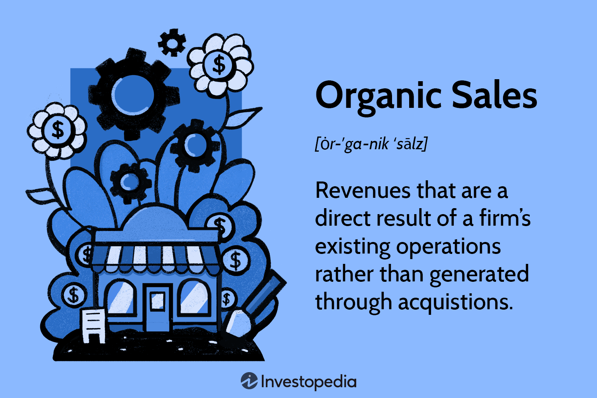

In today's dynamic business landscape, companies are constantly looking for effective strategies to drive sales and maintain a competitive edge. With the rapid evolution of technology, customer preferences, and market dynamics, businesses must adopt versatile approaches that integrate multiple facets of sales and marketing. This article explores an integrated approach to sales strategies, focusing on the synergy between organic sales, marketing benefits, and algo trading. These components, while distinct, offer complementary benefits that can enhance a company's ability to grow organically and sustainably.

Organic sales, characterized by revenue generated from a company's core activities without the influence of mergers or acquisitions, provide a clear measure of a company’s intrinsic growth. They serve as a testament to a business's operational strengths and its ability to engage with customers genuinely. As companies focus on intrinsic growth, they also leverage marketing to amplify their reach and engagement. Marketing efforts, particularly those that are data-driven, can transform how businesses interact with potential and existing customers, driving not just awareness but also long-term loyalty.



Algorithmic trading, or algo trading, introduces a modern dimension to this integrated approach by utilizing automated trading strategies to optimize financial outcomes. While traditionally associated with financial markets, the principles of algorithmic analysis can be adopted by companies to fine-tune their sales strategies in alignment with market trends. By integrating insights from algorithmic data, businesses can enhance decision-making processes, ensuring that sales strategies are not only efficient but also forward-looking.

The interplay of organic sales, strategic marketing, and algo trading forms a holistic approach that can result in sustainable business growth. Each element contributes uniquely to the overall strategy: organic sales through fundamental operational strengths, marketing through enhanced visibility and engagement, and algo trading through optimized decision-making. Understanding these concepts and their interplay is crucial for businesses aiming to optimize their sales and marketing efforts. Emphasizing this integrated model positions companies to not only react effectively to current market conditions but also anticipate future trends, thus retaining a competitive edge.

## Table of Contents

## Understanding Organic Sales and Their Benefits

Organic sales are revenues derived from a company's main business activities, excluding any influence from mergers or acquisitions. This revenue stream is a clear reflection of the company's ability to grow through its intrinsic strengths and operations, without external additions. Organic sales are often viewed as a pure measure of performance, indicating the effectiveness of the company's strategies, product offerings, and market position.

The process of generating organic sales is heavily reliant on creating genuine engagement and adding value for customers. By focusing on core operations, businesses can build trust and customer loyalty, which are essential for sustainable growth. Trust and loyalty are cultivated through consistent delivery of high-quality products or services, transparent communication, and excellent customer service.

Key benefits of focusing on organic sales include:

1. **Sustainable Revenue Growth**: Unlike sales growth through acquisitions, which might be unsustainable and subject to integration risks, organic sales growth indicates a healthy market demand for a company's offerings. It is driven by increased sales volumes and market penetration, reflecting steady and reliable growth.

2. **Lower Customer Acquisition Costs (CAC)**: By nurturing existing customer relationships and leveraging word-of-mouth referrals, companies can reduce their customer acquisition costs. Existing customers often contribute to organic sales growth as they are more likely to make repeat purchases and recommend the products or services to others, minimizing the expenditure on acquiring new customers.

3. **Enhanced Brand Credibility**: Businesses that achieve growth through organic sales often have a strong brand reputation. Brand credibility is strengthened as a result of consistent performance, customer satisfaction, and ethical business practices. This credibility acts as a competitive advantage in attracting new customers and gaining market share.

In conclusion, focusing on organic sales allows companies to capitalize on their inherent capabilities while fostering long-term relationships with customers. It requires a commitment to excellence in all aspects of the business, from product development to customer service. By leveraging these strengths, businesses can secure a stable revenue base and enhance their market presence.

## Effective Sales Strategies to Boost Organic Sales

Developing new products and services that align with current market demands is a crucial strategy for fostering organic growth. By conducting thorough market research and staying attuned to consumer preferences, businesses can identify gaps and opportunities in the market. This proactive approach enables companies to innovate and offer solutions that resonate with potential customers, thereby enhancing sales and market share.

Implementing targeted marketing campaigns is pivotal in boosting brand visibility and attracting the right audience. Targeted campaigns leverage demographic and behavioral data to reach specific customer segments. This ensures that marketing efforts are not only efficient but also effective in converting leads into sales. Techniques such as search engine optimization (SEO), pay-per-click advertising (PPC), and social media marketing can amplify a company's reach and engagement with its target audience.

Optimizing internal processes and fostering a customer-centric culture are key to enhancing customer satisfaction, which in turn supports organic sales growth. Streamlining operations through process improvements and technology integration can lead to more efficient service delivery. Additionally, a focus on understanding and addressing customer needs can build stronger relationships and increase customer retention. Tools such as customer feedback systems and Net Promoter Score (NPS) surveys provide valuable insights into customer experience and areas for improvement.

Incentive programs for employees serve as significant motivators to achieve sales targets, thereby driving sales growth further. Such programs can be structured around bonuses, commissions, or recognition awards, all designed to reward performance and incentivize employees. These programs not only boost morale but also align individual goals with organizational objectives, creating a culture of performance and accountability.

By combining these strategies, companies can establish a strong foundation for organic sales growth, ensuring long-term success in a competitive marketplace.

## The Role of Marketing in Enhancing Organic Sales

Marketing significantly enhances organic sales by creating brand awareness and engaging potential customers. At the heart of effective marketing strategies are data-driven approaches like search engine optimization (SEO) and content marketing, which considerably increase a brand's visibility. SEO, by optimizing a website's content and structure, helps it rank higher in search engine results, thereby attracting more organic traffic. Content marketing, on the other hand, focuses on creating valuable, relevant content that attracts and retains a clearly defined audience. Together, these strategies ensure that potential customers can easily find and interact with a brand online.

Customer relationship management (CRM) tools are also vital in transforming potential leads into long-term customers. These tools collect and analyze customer data, allowing companies to tailor their marketing strategies to meet individual customer needs and preferences. By nurturing customer relationships, companies can enhance customer satisfaction and foster loyalty, translating to increased sales over time.

Moreover, aligning marketing efforts with a company's core values and mission bolsters customer loyalty and brand credibility. When marketing campaigns reflect a brand's values, they resonate more with customers, creating an emotional connection that fosters trust and loyalty. This alignment ensures that the brand not only attracts new customers but also retains existing ones by reinforcing the company's commitment to its values and mission.

In summary, marketing plays a crucial role in enhancing organic sales through strategic initiatives that increase brand visibility and foster customer relationships. Emphasizing data-driven methods and aligning campaigns with core company values can significantly contribute to building a loyal customer base and driving long-term sales growth.

## Algo Trading: A Modern Boost to Sales Strategies

Algorithmic trading, often referred to as algo trading, involves the use of pre-programmed instructions to execute trades in financial markets. These algorithms are designed to execute orders based on various factors such as timing, price, and [volume](/wiki/volume-trading-strategy), without the need for human intervention. The integration of algo trading into a company's sales strategy can significantly optimize investment outputs, offering a modern advantage in today's competitive market.

Incorporating [algorithmic trading](/wiki/algorithmic-trading) strategies allows companies to achieve a competitive edge by ensuring efficient and swift trade executions. Algorithms can analyze massive volumes of data at lightning speed and execute trades at optimal prices, minimizing market impact and transaction costs. Moreover, by eliminating human error and emotion from trading, the overall efficiency of operations is improved, further enhancing profitability.

Algorithmic trading also enables businesses to diversify their revenue streams. By tapping into the insights generated from algorithmic analyses, companies can identify emerging trends in financial markets. This foresight allows businesses to align their sales strategies with predicted market movements, ensuring that they capitalize on new opportunities and mitigate risks.

Utilizing the vast amount of data processed through algorithmic trading assists companies in making more informed decisions. When algorithms analyze historical and real-time data, they offer insights that are crucial for strategic planning. For instance, [machine learning](/wiki/machine-learning) techniques can enhance these models by continuously updating their predictions, ensuring that the company remains adaptive to market changes. A basic Python implementation for a simple moving average crossover strategy might look like this:

```python
import pandas as pd

# Sample data frame with 'Close' prices
data = {'Close': [144, 148, 147, 149, 151, 152, 155, 157, 159, 160]}
df = pd.DataFrame(data)

# Calculate Moving Averages
df['Short_MA'] = df['Close'].rolling(window=3).mean()
df['Long_MA'] = df['Close'].rolling(window=5).mean()

# Generate buy/sell signals
df['Signal'] = 0
df.loc[df['Short_MA'] > df['Long_MA'], 'Signal'] = 1
df.loc[df['Short_MA'] < df['Long_MA'], 'Signal'] = -1

print(df)
```

This simple strategy suggests buying when the short-term moving average exceeds the long-term average, and selling when the opposite occurs. While simplistic, such strategies can be greatly expanded and refined through [deep learning](/wiki/deep-learning) algorithms and real-time data feeds.

Ultimately, the proper integration of algorithmic data analysis enhances overall sales performance by providing a data-driven foundation for strategic decision-making. As markets continue to evolve, those businesses leveraging algorithmic insights effectively are better positioned not only to react to changes but also to anticipate and exploit them proactively. Through advanced computational capabilities, algorithmic trading transforms how companies approach market engagement, creating a more dynamic and robust approach to sales strategies.

## Integrating Strategies for Maximum Impact

Combining insights from organic sales, effective marketing, and algo trading provides companies with a comprehensive framework to enhance their sales strategies. This integration allows for a more holistic view of sales performance and customer engagement, crucial for making informed decisions in a rapidly changing business environment.

Integrating organic sales data with marketing efforts enables businesses to better understand consumer behavior and preferences. By analyzing organic sales trends, companies can tailor their marketing strategies to target the right audience with precision, thereby increasing the effectiveness of their campaigns. For example, leveraging organic sales data can help identify which products or services are gaining traction without the influence of mergers or acquisitions, allowing marketing teams to focus their efforts on promoting these successful offerings.

Incorporating algorithmic trading insights into sales strategies provides an additional layer of sophistication. Algo trading offers quantitative data that can predict market trends, enabling firms to anticipate shifts in consumer demand and adjust their sales tactics accordingly. For instance, algorithmic models can analyze vast amounts of market data to identify patterns and correlations that might not be apparent from organic sales data alone. These insights can inform product development and pricing strategies, ensuring alignment with market conditions.

Continuous adaptation and realignment of these strategies with prevailing market trends are essential for sustained growth. Companies must remain agile, employing a feedback loop where sales data, marketing results, and algorithmic analyses are constantly evaluated and reoptimized. This iterative approach ensures that strategies remain relevant and effective, reducing the risk of obsolescence.

The integration of organic sales, marketing, and algo trading ensures that businesses are not merely reactive to external changes but also proactive in seizing opportunities. By synthesizing data from various sources, companies can anticipate market shifts and respond promptly, maintaining a competitive edge. This strategic blend empowers businesses to unlock the full potential of their sales and marketing efforts, paving the way for long-term success.

## Conclusion

The convergence of organic sales, marketing benefits, and algo trading represents an advanced strategy that aligns with contemporary business needs. In an era characterized by intense competition and rapidly changing market conditions, adopting this integrated model can foster sustainable business success. Organic sales emphasize the importance of core business operations and customer loyalty, while strategic marketing enhances brand visibility and customer engagement.

Moreover, algo trading introduces a data-driven approach, leveraging automated strategies and predictive analytics to optimize decision-making and revenue diversification. By incorporating algorithmic insights, businesses can anticipate market shifts and adjust their sales strategies accordingly.

Success in today's competitive environment hinges on the continuous assessment and refinement of these strategies to meet evolving market demands. Businesses should remain agile, ensuring that their sales approaches are both proactive and reactive to emerging trends. This adaptability not only ensures stability but also positions companies to exploit new opportunities.

A strategic blend of organic sales focused on internal strengths, marketing initiatives that boost brand presence, and the analytical power of algo trading unlocks the full potential of sales and marketing efforts. This integration creates a robust framework for achieving long-term growth and maintaining a competitive edge.

## References & Further Reading

[1]: Bergstra, J., Bardenet, R., Bengio, Y., & Kégl, B. (2011). ["Algorithms for Hyper-Parameter Optimization."](https://papers.nips.cc/paper/4443-algorithms-for-hyper-parameter-optimization) Advances in Neural Information Processing Systems 24.

[2]: ["Advances in Financial Machine Learning"](https://www.amazon.com/Advances-Financial-Machine-Learning-Marcos/dp/1119482089) by Marcos Lopez de Prado

[3]: ["Evidence-Based Technical Analysis: Applying the Scientific Method and Statistical Inference to Trading Signals"](https://books.google.com/books/about/Evidence_Based_Technical_Analysis.html?id=MeoJAQAAMAAJ) by David Aronson

[4]: ["Machine Learning for Algorithmic Trading"](https://github.com/stefan-jansen/machine-learning-for-trading) by Stefan Jansen

[5]: ["Quantitative Trading: How to Build Your Own Algorithmic Trading Business"](https://www.amazon.com/Quantitative-Trading-Build-Algorithmic-Business/dp/1119800064) by Ernest P. Chan