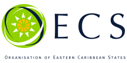

## Table of Contents

## What is the Organisation of Eastern Caribbean States (OECS)?

The Organisation of Eastern Caribbean States (OECS) is a group of islands in the Caribbean Sea that work together. It was started in 1981 to help these islands grow and work better together. The countries in the OECS are Antigua and Barbuda, Dominica, Grenada, Montserrat, St. Kitts and Nevis, Saint Lucia, St. Vincent and the Grenadines, Anguilla, and the British Virgin Islands.

The OECS helps its members in many ways. It makes it easier for people and goods to move between the islands. It also helps the islands make their laws and rules more alike, which makes it easier for them to work together. The OECS also works on projects to help the environment, education, and health in the region. By working together, the islands can be stronger and solve problems better than they could alone.

## Which countries are members of the OECS?

The Organisation of Eastern Caribbean States (OECS) has several member countries. These countries are Antigua and Barbuda, Dominica, Grenada, Montserrat, St. Kitts and Nevis, Saint Lucia, and St. Vincent and the Grenadines. These are the full members of the OECS.

There are also some countries that are part of the OECS but in a different way. These are called associate members. The associate members are Anguilla and the British Virgin Islands. They work with the OECS but do not have all the same rights and responsibilities as the full members.

## When was the OECS established?

The Organisation of Eastern Caribbean States (OECS) was established on June 18, 1981. This was when several small islands in the Caribbean decided to work together to help each other grow and solve problems.

The OECS started with seven countries: Antigua and Barbuda, Dominica, Grenada, Montserrat, St. Kitts and Nevis, Saint Lucia, and St. Vincent and the Grenadines. Later, Anguilla and the British Virgin Islands joined as associate members. By working together, these islands can be stronger and help each other in many ways.

## What are the main objectives of the OECS?

The main goal of the Organisation of Eastern Caribbean States (OECS) is to help its member countries work together and grow stronger. The OECS wants to make it easier for people and goods to move between the islands. This helps the islands trade with each other and makes it easier for people to visit family or find jobs in different countries. The OECS also helps the islands make their laws and rules more similar, which makes it easier for them to work together.

Another important goal of the OECS is to help its members with big projects that can improve life in the region. This includes working on projects to protect the environment, improve education, and make healthcare better. By working together, the islands can solve big problems that would be hard for them to handle alone. The OECS helps the islands be stronger and more able to help their people live better lives.

## How is the OECS structured?

The Organisation of Eastern Caribbean States (OECS) is made up of different parts that help it work well. The main part is the Authority, which is made up of the heads of government from each member country. They meet to make big decisions and set goals for the OECS. There is also the Council of Ministers, which is made up of ministers from each country who work on specific areas like finance, education, or health. They help carry out the plans made by the Authority. The OECS also has a Commission, which is like a group of experts who help run the day-to-day work of the OECS and make sure everything is going smoothly.

Another important part of the OECS is the Economic Union. This part helps the countries work together on things like trade and travel. It makes it easier for people and goods to move between the islands. The OECS also has a court, called the Eastern Caribbean Supreme Court, which helps settle disagreements between the countries. There are also special groups that focus on things like protecting the environment or improving education. All these parts work together to help the OECS reach its goals and help the member countries grow and work better together.

## What economic benefits do OECS member countries gain from the organization?

The OECS helps its member countries by making it easier for them to trade with each other. When goods can move freely between the islands, businesses can sell their products to more people. This can help businesses grow and create more jobs. The OECS also makes it easier for people to travel between the islands. This means workers can find jobs in different countries more easily, which can help them earn more money and support their families.

Another way the OECS helps its members is by working together on big projects. For example, the OECS can help countries build better roads or improve their schools. When countries work together, they can share the cost of these projects, which means they can do more than they could alone. This can help the economy grow because better roads and schools can attract more businesses and tourists to the islands. By working together, OECS countries can be stronger and more able to help their people live better lives.

## What role does the OECS play in regional security?

The OECS helps keep the region safe by working together on security issues. The countries in the OECS share information about crime and work together to stop it. They also have a special group called the Regional Security System (RSS) that helps with things like fighting crime, stopping drugs, and responding to disasters. By working together, the OECS countries can be stronger and better at keeping their people safe.

Another way the OECS helps with security is by making laws and rules more similar across the islands. This makes it easier for the countries to work together on security issues. For example, if all the countries have similar laws about crime, it's easier for them to help each other catch criminals who move between the islands. This teamwork helps make the whole region safer for everyone.

## How does the OECS facilitate educational and cultural exchanges among its members?

The OECS helps its member countries share education and culture by making it easier for students and teachers to move between the islands. They do this by having similar rules about education. This means a student from one island can go to school on another island without too much trouble. The OECS also has special programs where students from different countries can meet and learn together. This helps them understand each other's cultures better and make friends from other islands.

The OECS also works on projects that celebrate the culture of the region. They have events where people from different islands can share their music, dance, and art. This helps everyone learn about the different cultures in the OECS and feel more connected to each other. By working together on these projects, the OECS helps its members feel like they are part of a bigger family, even though they live on different islands.

## What are the key achievements of the OECS since its inception?

Since it started in 1981, the OECS has done a lot to help its member countries. One big thing they did was create the Eastern Caribbean Currency Union. This means all the countries use the same money, called the Eastern Caribbean Dollar. This makes it easier for them to trade with each other and helps keep their economies stable. The OECS also made it easier for people to move between the islands. Now, people can travel and work in different countries more easily, which helps them find better jobs and support their families.

The OECS has also worked hard to make the region safer. They started the Regional Security System (RSS), which helps the countries fight crime and respond to disasters together. This makes the whole area safer for everyone. Another big achievement is how the OECS has helped with education and culture. They have programs that let students from different islands learn together and celebrate each other's cultures. This helps the young people feel connected and understand each other better.

## How does the OECS interact with other regional and international organizations?

The OECS works with other groups in the Caribbean and around the world to help its member countries. It is part of the Caribbean Community (CARICOM), which is a bigger group of Caribbean countries that work together on things like trade and security. By being part of CARICOM, the OECS can have a stronger voice and work on bigger projects with other Caribbean countries. The OECS also works with the United Nations (UN) and other big groups like the World Bank and the International Monetary Fund (IMF). These groups help the OECS with money and advice to make the islands grow and solve problems.

The OECS also has special agreements with other countries and groups. For example, it has deals with the European Union (EU) to help with trade and development. The EU gives money and support to help the OECS countries build things like schools and hospitals. The OECS also works with the Organisation of American States (OAS) to help with things like democracy and human rights. By working with these other groups, the OECS can get help and share ideas to make life better for its people.

## What challenges does the OECS face in achieving its goals?

The OECS faces some challenges in reaching its goals. One big challenge is that the member countries are small islands with limited money and resources. This makes it hard for them to do big projects or solve big problems on their own. They need to work together and get help from other countries and groups to make things happen. Another challenge is that the islands are spread out over a big area of the Caribbean Sea. This can make it hard for them to communicate and work together all the time.

Another challenge is natural disasters like hurricanes and earthquakes. These can hurt the islands a lot and make it hard for them to focus on growing and working together. The OECS needs to be ready to help each other when these disasters happen. Also, the different islands have different cultures and ways of doing things. This can make it hard to agree on laws and rules that work for everyone. But by talking and working together, the OECS can find ways to overcome these challenges and help its member countries grow and be stronger.

## What future developments are anticipated for the OECS?

The OECS is looking forward to making things even better for its member countries in the future. One big plan is to work more on making the islands stronger against climate change. This means they will try to protect the environment and help the islands be ready for things like big storms and rising sea levels. The OECS also wants to help its members grow their economies more. They will work on making it easier for businesses to start and grow, which can help create more jobs and make life better for people.

Another thing the OECS is thinking about is making it even easier for people to move and work between the islands. This can help people find better jobs and support their families. The OECS also wants to keep working on education and culture. They will try to have more programs where students from different islands can learn together and share their cultures. By doing these things, the OECS hopes to help its member countries be stronger and happier in the future.

## References & Further Reading

[1]: Barnett, A., & Thapa, G. (2000). ["The Organization of Eastern Caribbean States."](https://www.cepal.org/en/publications/43952-foreign-direct-investment-and-growth-developing-countries-evidence-countries) World Bank.

[2]: "Algorithmic Trading: A Practitioner's Guide" by Jeffrey Bacidore

[3]: "Building Algorithmic Trading Systems: A Trader's Journey" by Kevin Davey

[4]: "The History and Development of the Eastern Caribbean Central Bank" by Wayne Sandiford and Dave Seerattan in Caribbean Money Market Brokers.

[5]: "Routledge Handbook of International Economic Law" - Chapter on Regional Economic Integration in the Caribbean by Chantal Ononina Charles

[6]: "High-Frequency Trading: A Practical Guide to Algorithmic Strategies and Trading Systems" by Irene Aldridge

[7]: Chlistalla, M. (2011). ["High-Frequency Trading – Better than its Reputation?"](https://c.mql5.com/forextsd/forum/168/high-frequency_trading_-_better_than_its_reputation.pdf) Deutsche Bank Research.