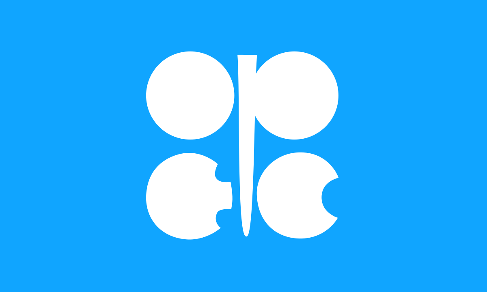

## Table of Contents

## What is the Organization of the Petroleum Exporting Countries (OPEC)?

The Organization of the Petroleum Exporting Countries, or OPEC, is a group of countries that work together to manage the supply of oil and its prices around the world. It was started in 1960 by five countries: Iran, Iraq, Kuwait, Saudi Arabia, and Venezuela. These countries wanted to have more control over their oil resources and to make sure they got a fair price for their oil. Today, OPEC has 13 member countries, mostly from the Middle East, Africa, and South America.

OPEC's main job is to set production levels for its members. By deciding how much oil each country should produce, OPEC can influence the global supply of oil. If they produce less oil, the price of oil usually goes up because there is less oil available. If they produce more oil, the price usually goes down because there is more oil available. OPEC meets regularly to talk about the oil market and make decisions about production levels. These decisions can have a big impact on the world economy because oil is used in so many things, like transportation and manufacturing.

## When was OPEC founded and why?

OPEC was founded on September 14, 1960. The countries that started it were Iran, Iraq, Kuwait, Saudi Arabia, and Venezuela. They came together because they wanted to have more control over their oil and to get a better price for it.

Before OPEC, big oil companies from other countries had a lot of power over the oil in these countries. The oil companies could decide how much to pay for the oil and how much oil to take out of the ground. The countries that had the oil wanted to change this. By working together in OPEC, they could have more say in the oil business and make sure they got a fair deal.

## Which countries are members of OPEC?

OPEC has 13 member countries. These countries are Algeria, Angola, Congo, Equatorial Guinea, Gabon, Iran, Iraq, Kuwait, Libya, Nigeria, Saudi Arabia, United Arab Emirates, and Venezuela.

These countries come from different parts of the world, mostly from the Middle East, Africa, and South America. They work together to decide how much oil they should produce and sell. By doing this, they can affect the price of oil around the world.

## What is the primary goal of OPEC?

The main goal of OPEC is to make sure that its member countries get a good price for their oil. They do this by working together to decide how much oil each country should produce. If they produce less oil, the price of oil usually goes up because there is less oil available. If they produce more oil, the price usually goes down because there is more oil available. By controlling the supply of oil, OPEC can influence the price and make sure that the countries that produce oil get a fair deal.

OPEC also wants to make sure that the oil market is stable. This means they try to avoid big changes in oil prices that can hurt the economy. They meet regularly to talk about the oil market and make decisions about production levels. These decisions are important because oil is used in so many things, like cars, planes, and factories. When OPEC makes decisions about oil production, it can affect the whole world's economy.

## How does OPEC influence global oil prices?

OPEC influences global oil prices by controlling how much oil its member countries produce. When OPEC decides to produce less oil, there is less oil available in the world. This makes the price of oil go up because people and companies still need oil, but there is not as much to go around. On the other hand, if OPEC decides to produce more oil, there is more oil available. This can make the price of oil go down because there is more oil than people need.

OPEC's decisions about oil production are important because oil is used in so many things, like cars, planes, and factories. When the price of oil changes, it can affect the cost of many things that people use every day. For example, if oil prices go up, it can make gasoline more expensive, which can make it more expensive to drive a car or fly on a plane. OPEC tries to keep the oil market stable by making decisions that help avoid big changes in oil prices that can hurt the economy.

## What are the main decision-making bodies within OPEC?

OPEC has two main decision-making bodies: the Conference and the Board of Governors. The Conference is the highest authority in OPEC. It is made up of one representative from each member country. The Conference meets twice a year to talk about the oil market and make big decisions about how much oil each country should produce. These meetings are important because the decisions made can affect the price of oil around the world.

The Board of Governors helps the Conference by doing the day-to-day work of OPEC. The Board of Governors is made up of one governor from each member country. They meet more often than the Conference, usually every three months. The Board of Governors makes sure that the decisions made by the Conference are followed and helps with other important tasks, like planning and budgeting. Together, these two bodies help OPEC manage the oil market and make sure its member countries get a good price for their oil.

## How does OPEC coordinate its oil production policies?

OPEC coordinates its oil production policies mainly through its two key decision-making bodies, the Conference and the Board of Governors. The Conference is the top authority and includes one representative from each member country. They meet twice a year to discuss the oil market and decide on how much oil each country should produce. These decisions are important because they can affect the price of oil around the world. The Conference makes the big decisions, and everyone in OPEC has to follow them.

The Board of Governors helps the Conference by doing the everyday work of OPEC. This group also has one governor from each member country, and they meet every three months. Their job is to make sure the Conference's decisions are carried out and to handle other important tasks, like planning and budgeting. By working together in these meetings, OPEC can set production levels that help keep the oil market stable and ensure that its member countries get a good price for their oil.

## What is the significance of OPEC's oil production quotas?

OPEC's oil production quotas are very important because they help control how much oil is available in the world. When OPEC decides on these quotas, they are telling each member country how much oil they should produce. If OPEC sets lower quotas, there will be less oil available, and the price of oil usually goes up. If they set higher quotas, there will be more oil available, and the price usually goes down. By setting these quotas, OPEC can influence the price of oil and make sure that its member countries get a good price for their oil.

These quotas are also important for keeping the oil market stable. Big changes in oil prices can hurt the economy, so OPEC tries to avoid them. By working together and agreeing on production levels, OPEC can help make sure that the oil market does not have big ups and downs. This is good for everyone who uses oil, like people driving cars or companies running factories, because it helps keep the cost of oil more predictable.

## How has OPEC's role evolved since its inception?

Since OPEC started in 1960, its role has changed a lot. At first, OPEC was formed because the countries that had oil wanted more control over it. They didn't like how big oil companies from other countries had so much power over their oil. By working together, these countries could decide how much oil to produce and make sure they got a good price for it. Over time, OPEC became more important in the world because oil became more important. As more people used oil for cars, planes, and factories, OPEC's decisions about how much oil to produce started to affect the whole world's economy.

Today, OPEC still helps its member countries get a good price for their oil, but it also tries to keep the oil market stable. This means they try to avoid big changes in oil prices that can hurt the economy. OPEC meets regularly to talk about the oil market and make decisions about how much oil each country should produce. They work with other countries that produce oil, like Russia, to make sure there is enough oil for everyone without causing big changes in prices. OPEC's role has grown to be about not just getting a good price for oil, but also making sure the world's economy stays stable.

## What challenges does OPEC face in the modern global energy market?

OPEC faces many challenges in the modern global energy market. One big challenge is the growing use of other types of energy, like solar, wind, and electric cars. These new energy sources are becoming more popular because they are better for the environment. As more people use them, the demand for oil might go down. This can make it harder for OPEC to keep oil prices high because there is less need for oil.

Another challenge is that more countries are producing oil now, not just OPEC countries. Countries like the United States and Canada have started to produce a lot of oil, which means there is more oil available in the world. This can make oil prices go down because there is more oil than people need. OPEC has to work hard to decide how much oil to produce so they can keep prices stable and make sure their member countries get a good price for their oil.

## How does OPEC interact with non-OPEC oil-producing countries?

OPEC works with non-OPEC oil-producing countries to help manage the global oil market. One important way they do this is through an agreement called OPEC+. This group includes OPEC countries and other big oil producers like Russia. They meet together to talk about the oil market and decide how much oil everyone should produce. By working together, they can make sure there is enough oil for everyone without causing big changes in prices.

Sometimes, OPEC and non-OPEC countries have different goals. OPEC countries want to keep oil prices high so they can get a good price for their oil. But some non-OPEC countries, like the United States, want lower oil prices because it can help their economy grow. These different goals can make it hard for OPEC and non-OPEC countries to agree on how much oil to produce. But they keep talking and trying to find a balance that works for everyone.

## What impact does OPEC have on global energy security and economic stability?

OPEC plays a big role in global energy security and economic stability. By deciding how much oil its member countries produce, OPEC can help make sure there is enough oil for everyone. This is important because oil is used in many things, like cars, planes, and factories. When there is enough oil, it helps keep the world's economy running smoothly. If there is not enough oil, it can cause problems, like higher prices for gas and other things people need every day.

OPEC also tries to keep oil prices stable. Big changes in oil prices can hurt the economy. If oil prices go up a lot, it can make things more expensive for people and businesses. If oil prices go down a lot, it can hurt countries that depend on selling oil. By working together and talking with other countries that produce oil, like Russia, OPEC tries to avoid these big changes. This helps make sure the world's economy stays stable and that people can get the oil they need at a fair price.

## References & Further Reading

[1]: Bergstra, J., Bardenet, R., Bengio, Y., & Kégl, B. (2011). ["Algorithms for Hyper-Parameter Optimization."](https://papers.nips.cc/paper/4443-algorithms-for-hyper-parameter-optimization) Advances in Neural Information Processing Systems 24.

[2]: ["Advances in Financial Machine Learning"](https://www.amazon.com/Advances-Financial-Machine-Learning-Marcos/dp/1119482089) by Marcos Lopez de Prado

[3]: ["Evidence-Based Technical Analysis: Applying the Scientific Method and Statistical Inference to Trading Signals"](https://www.amazon.com/Evidence-Based-Technical-Analysis-Scientific-Statistical/dp/0470008741) by David Aronson

[4]: ["Machine Learning for Algorithmic Trading"](https://github.com/stefan-jansen/machine-learning-for-trading) by Stefan Jansen

[5]: ["Quantitative Trading: How to Build Your Own Algorithmic Trading Business"](https://books.google.com/books/about/Quantitative_Trading.html?id=j70yEAAAQBAJ) by Ernest P. Chan