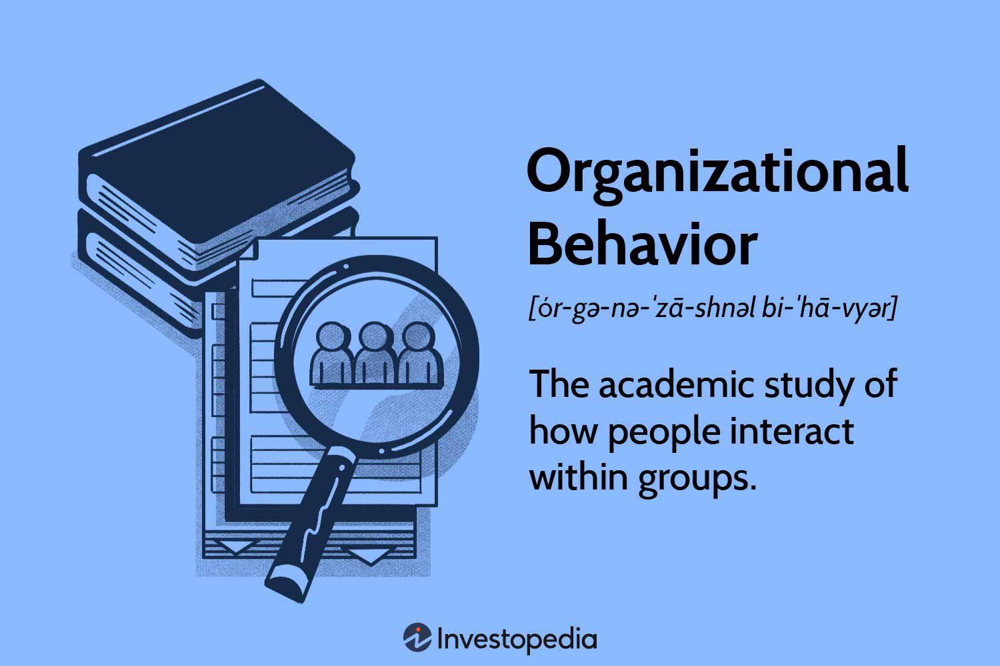

Business management is a multifaceted discipline that encompasses the planning, organization, coordination, and control of business activities. It plays a crucial role in shaping organizational behavior and workplace dynamics. Effective business management ensures that resources are utilized efficiently to achieve strategic goals. By fostering a culture of accountability and innovation, managers influence how individuals and groups operate within an organization, which in turn affects productivity and job satisfaction.

Algorithmic trading, a sophisticated business strategy, leverages computer algorithms to execute trades at optimal speed and efficiency in financial markets. It involves the use of mathematical models to make decisions about buying and selling securities. Often applied in high-frequency trading, algorithmic trading reduces human error, increases market liquidity, and can lead to more successful financial outcomes due to its ability to process vast amounts of data quickly and accurately.

Understanding the connection between business management and algorithmic trading is paramount in today's fast-paced business environment. Effective management ensures the smooth integration of algorithmic systems into existing business operations, enhancing decision-making processes and strategic planning. Furthermore, insights from organizational behavior and workplace dynamics are essential to tailor these technological implementations to meet human-centered needs, ultimately driving organizational success.

The article will cover key areas, including the core functions of business management, the significance of organizational behavior, the complexities of workplace dynamics, and the strategies behind algorithmic trading. These topics will be explored to demonstrate how their interplay can influence an organization's performance and competitive edge in the marketplace. Businesses that excel in combining these components often set themselves apart, leading to sustainable growth and innovation.

The modern business landscape demands a comprehensive understanding of the interconnected nature of these elements. Businesses that manage to adapt to this complex environment by integrating management practices with advanced trading strategies, while considering the human aspects of organizational behavior and workplace dynamics, position themselves for continued success. As such, there is an imperative for businesses to invest in these interdisciplinary approaches, fostering environments conducive to continuous learning and adaptation.

## Table of Contents

## Understanding Business Management

Business management encompasses the administrative and strategic activities undertaken to lead an organization towards achieving its objectives. Its core functions include planning, organizing, leading, and controlling. These functions allow managers to create structures and processes that align with organizational goals, ensuring efficient resource use and goal attainment. Strategic planning within business management involves setting long-term objectives and determining the best courses of action. This is fundamental to guiding operational decisions that maintain a company's competitive edge.

Effective management is crucial for driving productivity and innovation. Managers who implement well-structured business strategies foster an environment where employees feel empowered to contribute innovative ideas. Such managers often establish clear communication channels and provide the necessary resources for employees to excel in their roles. Productivity is also increased when management strategies include continuous process improvements and employee development programs aimed at enhancing skills.

Decision-making is a critical aspect of a manager's role. Managers influence company culture through their decisions, which impact employee morale and organizational dynamics. Decisions concerning hiring practices, ethical standards, and performance evaluations shape the workplace environment. Moreover, strategic decisions related to market positioning and product development significantly influence an organization's success.

Integrated management approaches are becoming increasingly important. These approaches include elements like organizational behavior, which examines how individuals and groups interact within an organization. Integrating such behavioral insights can lead to more cohesive teams and improved organizational performance. Managers who understand the dynamics of organizational behavior can better motivate employees, manage conflicts, and create a positive workplace culture that supports strategic objectives.

Examples of successful business management practices can be found in companies like Google and Toyota. Google’s management practices emphasize innovation and employee autonomy, contributing to its success as a tech giant. Toyota, known for its lean manufacturing system, focuses on efficiency and continuous improvement. These companies demonstrate how strategic management practices can lead to significant achievements.

Overall, understanding and implementing effective business management practices are essential for organizations aiming to achieve their strategic goals and maintain competitiveness in today's dynamic business environment.

## Exploring Organizational Behavior

Organizational behavior (OB) is the study of human behaviors within groups and organizations. It involves understanding how individuals and teams function, how interpersonal processes influence workplace dynamics, and how organizations can be designed for optimal performance. In business management, OB provides valuable insights into motivating employees, improving job satisfaction, and enhancing overall efficiency.

Understanding individual and group behavior is crucial for refining workplace dynamics. Individual behaviors are influenced by motivations, perceptions, attitudes, and personality, while group behaviors depend on team cohesion, conflict resolution, and communication. By understanding these behavior patterns, managers can foster an environment where employees collaborate effectively, leading to better problem-solving and innovation. A comprehensive grasp of these behaviors allows for better strategic planning and policies that align with the workforce's needs and facilitate smoother operations.

Psychological and sociological dimensions are key aspects of organizational behavior. Psychologically, factors such as motivation, stress, learning, and emotional intelligence determine how individuals perform and interact at work. Sociologically, group dynamics, social norms, and roles influence how organizational structures are maintained and adapted. These aspects underscore the importance of crafting policies and practices that account for human tendencies, ensuring that organizational goals align with employees’ personal and collective aspirations.

Organizational culture significantly impacts employee performance and satisfaction. Culture encompasses shared values, beliefs, and rituals that characterize an organization. A positive culture enhances commitment and productivity, whereas a negative culture can breed discontent and reduce overall effectiveness. For instance, a culture emphasizing innovation and flexibility often encourages employees to be more engaged and proactive, while a bureaucratic culture might hinder creativity and slow down decision-making processes. Therefore, assessing and fostering a healthy organizational culture is a pivotal managerial responsibility.

Leadership plays a crucial role in shaping effective organizational behavior. Leaders influence the work environment and establish the tone for communication, support, and accountability. Effective leaders possess qualities such as emotional intelligence, open communication, and vision, which inspire trust and motivate employees. Leadership styles, whether transformational, transactional, or participatory, directly impact team morale and success. By actively shaping organizational behavior through strategic leadership, companies can cultivate a dynamic, responsive, and resilient workplace. An example of a successful leadership approach is transformational leadership, which encourages adaptability and promotes a shared sense of purpose among employees, resulting in heightened engagement and superior performance.

## The Dynamics of Workplace Environment

Workplace dynamics encompass the interactions and relationships between employees within an organization and how these elements influence overall productivity and job satisfaction. This term includes various components such as communication patterns, organizational hierarchy, team collaboration, and conflict resolution. A cohesive understanding of workplace dynamics can significantly impact the efficiency and morale of a business environment.

Organizational structure and communication are two foundational elements influencing workplace dynamics. The organizational structure dictates how information flows within the company and determines the lines of authority. This structure can range from traditional hierarchies to flat organizational models, each presenting distinct communication dynamics. Hierarchical structures often facilitate a clear chain of command but may slow down decision-making processes due to multiple management layers. This can lead to potential communication barriers, affecting the speed and accuracy with which information is shared among employees.

Conversely, flat organizations encourage open communication and quicker decision-making since there are fewer bureaucratic hurdles. This can foster a more inclusive culture where employees feel empowered to contribute ideas. Effective communication strategies within these structures, such as regular meetings and transparent information-sharing practices, can significantly enhance workplace dynamics by fostering trust and collaboration among team members.

The advent of technology and the shift to remote work have revolutionized workplace interactions. Innovations such as video conferencing tools, instant messaging platforms, and collaborative software have transformed how employees connect and collaborate, regardless of their physical location. These technologies enable seamless communication, allowing teams to stay aligned with their goals. Nonetheless, remote work poses unique challenges to workplace dynamics, such as feelings of isolation among employees and difficulties in building team cohesion. Addressing these challenges involves leveraging technology to create virtual team-building exercises and using project management tools to maintain focus and accountability.

Effective conflict resolution and collaboration strategies are crucial in maintaining a harmonious workplace environment. Conflicts, if not managed appropriately, can disrupt workflows and damage professional relationships. Businesses can employ strategies such as mediation, active listening, and problem-solving techniques to address disputes constructively. Encouraging a culture of open dialogue where employees can express concerns without fear of retribution is vital. Additionally, fostering collaboration through cross-departmental projects and team-building activities can unite employees, leading to increased innovation and problem-solving capabilities.

Creating a positive work environment is essential for boosting employee morale and productivity. Organizations can achieve this by recognizing and rewarding employee achievements, offering professional development opportunities, and promoting work-life balance. A positive workplace culture encourages employees to take ownership of their roles, leading to enhanced job satisfaction and productivity. Furthermore, providing employees with the resources and support they need to succeed can significantly enhance workplace dynamics by fostering a sense of community and shared purpose.

In summary, understanding and optimizing workplace dynamics involves analyzing organizational structures, communication strategies, the impact of technology, and the ability to manage conflicts and promote collaboration. By creating a supportive and dynamic work environment, businesses can enhance their productivity, innovation, and overall success.

 to Algorithmic Trading

Algorithmic trading, often referred to as algo trading, is a method of executing trades in the financial markets using pre-programmed instructions and algorithms. These algorithms make decisions regarding the timing, price, and quantity of trades, devoid of human intervention. The primary purpose of [algorithmic trading](/wiki/algorithmic-trading) is to maximize efficiency, minimize trading costs, and capitalize on opportunities for profit in high-frequency trading environments. 

### Basic Components and Strategies

At its core, algorithmic trading comprises several key components: trade pattern recognition, price modeling, risk management, and execution algorithms. Pattern recognition involves using historical data to identify market trends and price movements, often employing statistical methods or [machine learning](/wiki/machine-learning) algorithms. Price modeling predicts future price movements, often utilizing mathematical models such as time series analysis.

Risk management within algorithmic trading is crucial, ensuring that the strategies deployed do not expose traders to untenable levels of risk. This involves setting parameters for stop-loss and take-profit orders, among other controls. Execution algorithms then determine how orders are placed in the market, optimizing factors such as speed and cost of execution.

Common strategies include statistical [arbitrage](/wiki/arbitrage), which exploits price discrepancies in correlated financial instruments; mean reversion, which capitalizes on the assumption that prices will revert to their historical averages; and [trend following](/wiki/trend-following), which seeks to profit from trading in the direction of established market trends.

### Algorithmic Trading in Business Management

Algorithmic trading fits into business management by aligning with the goals of operational efficiency and strategic financial planning. Financial managers utilize algorithmic trading systems to automate trading processes, thus reducing the human errors and biases associated with manual trading. This automation enables timely market entry and [exit](/wiki/exit-strategy), aligning with strategic business objectives such as cost reduction and profit maximization.

### Decision-Making for Financial Managers

In the decision-making processes of financial managers, algorithmic trading offers a systematic approach informed by data and analytics. By leveraging algorithms, financial managers gain insights into market trends and potential risks, enabling more informed decision-making. Moreover, the high data-processing capabilities of algorithmic systems allow managers to analyze large datasets swiftly, identifying opportunities and threats with precision.

### Benefits and Challenges

The adoption of algorithmic trading presents numerous benefits, including increased trading speed, improved accuracy in trade execution, and the ability to process vast amounts of market data in real-time. Additionally, the objectivity of algorithms eliminates the emotional and psychological factors that often cloud human judgment.

However, algorithmic trading also poses challenges. It requires substantial initial investment in infrastructure and software development. The reliance on algorithms also introduces risks such as technical failures and systemic risks, as evidenced by events like the 2010 Flash Crash. Furthermore, the competitive edge of algorithmic strategies diminishes over time as market participants catch up, necessitating constant innovation and adaptation.

In conclusion, while algorithmic trading offers remarkable enhancements to efficiency and decision-making in financial markets, it necessitates careful management and continual assessment to fully leverage its benefits while mitigating inherent risks.

## Intersecting Business Management and Algo Trading

Business management practices can significantly enhance the outcomes of algorithmic trading by providing structured decision-making frameworks and fostering an environment conducive to the effective use of algorithms. The integration of robust data analysis techniques, which are fundamental in both disciplines, allows for more informed decisions, optimizing trading strategies and results.

### Data Analysis and Decision-Making Frameworks

Data analysis is at the core of both business management and algorithmic trading. For algorithmic trading, historical data and real-time data analysis are critical for developing and executing strategies. Business management practices introduce systematic frameworks that help interpret complex datasets and extract actionable insights. One common practice is the use of predictive analytics to forecast market movements and identify profitable trading opportunities. These frameworks aid in developing algorithms that are not only responsive but also predictive.

In business management, decision-making models such as the SWOT analysis (Strengths, Weaknesses, Opportunities, Threats) can be adapted to assess trading strategies against various market conditions. Incorporating such frameworks into algorithmic trading enables managers to evaluate potential risks and benefits comprehensively, leading to optimized algorithmic performance.

### Organizational Culture and Algorithmic Strategies

An organization's culture significantly impacts how algorithmic trading strategies are implemented. A culture that encourages innovation and accepts data-driven approaches will likely see more successful integration of algorithmic strategies. Organizations that value continuous learning and knowledge sharing create an environment where traders and managers can collaborate to refine algorithms iteratively.

Moreover, an agile corporate culture supports swift adaptations to market changes, critical for successful algorithmic trading. Flexibility in organizational processes allows for quicker adjustments to algorithms in response to unexpected market shifts, enhancing trading performance.

### Case Studies

Numerous case studies highlight the benefits of integrating business management principles into algorithmic trading. For instance, JP Morgan has successfully utilized business management strategies alongside data analysis to improve trading outcomes. By embedding agile management techniques into their trading divisions, they've fostered a culture of innovation and quick response to market changes, leading to enhanced algorithmic performance.

Another example is Renaissance Technologies, known for its Medallion Fund, which blends quantitative analysis with a robust decision-making framework. Their success underscores the critical role of comprehensive business strategies in elevating trading algorithms' effectiveness.

### Future Trends

The intersection of business management and algorithmic trading is poised for transformative trends driven by advancements in technology and data science. Machine learning and [artificial intelligence](/wiki/ai-artificial-intelligence) are increasingly being integrated into trading algorithms, predicting future market trends with heightened accuracy. This trend points towards a future where business managers will need to be adept at understanding and implementing AI-driven strategies.

Furthermore, the rise of decentralized finance (DeFi) presents new challenges and opportunities. Business management principles will be crucial in navigating these emerging markets, ensuring that algorithmic strategies align with broader business objectives.

In conclusion, the synthesis of business management practices with algorithmic trading methodologies represents both a challenge and an opportunity for modern businesses. By leveraging data analysis and fostering an adaptive organizational culture, firms can significantly enhance their algorithmic trading outcomes, ensuring sustained competitive advantage in a rapidly evolving financial landscape.

## Conclusion

The examination of business management, organizational behavior, workplace dynamics, and algorithmic trading underscores a critical synergy necessary for contemporary business success. Business management provides the strategic framework through which organizations can align their resources, including human capital and technological tools like algorithmic trading, in pursuit of their goals. It is the backbone that ensures the effective implementation and integration of innovative practices within an organization. Organizational behavior offers insights into the complex interplay of individual and group dynamics, forming the foundation for creating conducive workplace environments that foster innovation and strategic thinking.

The relationship between workplace dynamics and organizational culture cannot be overstated. A nuanced understanding of these aspects can lead to cultivating a positive work environment that encourages collaboration, minimizes conflict, and enhances productivity. The inclusion of algorithmic trading into this matrix introduces a dimension of precision and speed in financial decision-making, aligning with the strategic objectives laid out by effective business management practices.

For businesses aiming to maintain a competitive edge, the integration of these elements is imperative. Organizational leaders must foster a culture that embraces data-driven decision-making, as exemplified by algorithmic trading, while still valuing the human elements that underpin organizational behavior and workplace dynamics. Through continuous learning and adaptation, businesses can not only keep pace with technological advancements but also optimize these technologies in accordance with their strategic vision.

The call to action is clear: businesses must evolve by embracing these interdisciplinary approaches, ensuring that they remain agile, responsive, and innovative. This involves nurturing an ongoing commitment to understanding and applying the principles of business management, while simultaneously embracing the advancements in organizational theory and trading technologies. By doing so, businesses can position themselves not just to survive, but to thrive in an ever-changing landscape.

## References & Further Reading

[1]: Bergstra, J., Bardenet, R., Bengio, Y., & Kégl, B. (2011). ["Algorithms for Hyper-Parameter Optimization."](https://papers.nips.cc/paper/4443-algorithms-for-hyper-parameter-optimization) Advances in Neural Information Processing Systems 24.

[2]: ["Advances in Financial Machine Learning"](https://www.amazon.com/Advances-Financial-Machine-Learning-Marcos/dp/1119482089) by Marcos Lopez de Prado

[3]: ["Evidence-Based Technical Analysis: Applying the Scientific Method and Statistical Inference to Trading Signals"](https://www.amazon.com/Evidence-Based-Technical-Analysis-Scientific-Statistical/dp/0470008741) by David Aronson

[4]: ["Machine Learning for Algorithmic Trading"](https://github.com/PacktPublishing/Machine-Learning-for-Algorithmic-Trading-Second-Edition) by Stefan Jansen

[5]: ["Quantitative Trading: How to Build Your Own Algorithmic Trading Business"](https://books.google.com/books/about/Quantitative_Trading.html?id=j70yEAAAQBAJ) by Ernest P. Chan