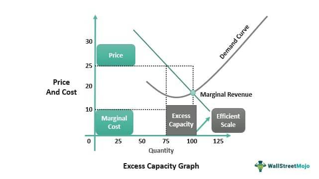

Business management, organizational economics, and economic theory are dynamically interconnected fields that significantly influence practical applications such as algorithmic trading. These disciplines offer a comprehensive framework for understanding how businesses can strategically navigate market complexities. They shape business strategies by providing insights into firm behavior, market operations, and decision-making processes, which are crucial in today's rapidly evolving economic landscape.

Organizational economics focuses on the internal transactions within firms, analyzing structures, governance, and resource allocations. By examining theories such as agency theory, transaction cost economics, and property rights theory, businesses can refine their internal processes for optimum performance. These theories enable firms to address conflicts of interest, minimize costs, and enhance efficiency, providing a competitive edge.



Economic theory extends these concepts to broader market behaviors, offering models and methods to predict and analyze financial trends. This theoretical foundation is pivotal in developing technologies like algorithmic trading, where high-speed decision-making and transaction efficiency are paramount. Algorithms leverage economic principles to minimize transaction costs and exploit market opportunities quickly, illustrating the practical impact of these intertwined fields.

The understanding and integration of these disciplines empower businesses to achieve operational excellence. By applying theories of organizational economics and economic strategies, firms can better position themselves in the competitive landscape. The digital era, marked by rapid technological advancements, further accentuates the need for such strategic integration, promising improved profitability and market adaptation.

In this article, we explore how these theories and practices synergize to drive business innovation, focusing on their implications in modern financial technologies and algorithmic trading. Through this exploration, we aim to provide insights into leveraging these ideas for achieving efficiency and competitive advantage in the digital marketplace.

## Table of Contents

## Understanding Organizational Economics

Organizational economics is a specialized subset of applied economics focused on understanding transactions within firms, distinct from those occurring in the broader market. This discipline encompasses several critical theories, including agency theory, transaction cost economics, and property rights theory, each offering valuable insights into the internal workings of organizations.

Agency theory investigates the relationship between principals (such as shareholders) and [agents](/wiki/agents) (such as managers), primarily addressing issues that arise from conflicts of interest and asymmetric information. It highlights the need for mechanisms like performance-based incentives and monitoring systems to align the interests of agents with those of the principals, thereby improving corporate governance and decision-making processes.

Transaction cost economics, initially popularized by economist Ronald Coase, examines the costs incurred during economic exchanges within a firm compared to those in the open market. These costs include search and information costs, bargaining and decision costs, and policing and enforcement costs. Understanding these costs allows firms to determine the most efficient way to organize economic activity, whether through internal hierarchy or market transactions, leading to an optimized organizational structure.

Property rights theory focuses on how the allocation and assignment of ownership rights affect organizational efficiency and function. By delineating clear property rights, firms can ensure better utilization of resources and more effective control over assets. This theory supports decisions regarding mergers, acquisitions, and ownership structures to align with strategic objectives, minimizing resource wastage and enhancing economic performance.

Analyzing these foundational theories and their applications enables businesses to enhance management strategies and improve economic outcomes. By effectively applying the principles of organizational economics, companies can optimize resource allocation and innovate management practices, ultimately achieving greater efficiency and competitive advantage in the marketplace.

## Key Concepts in Organizational Economics

Organizational economics is an essential part of understanding internal firm dynamics, with several key concepts that offer insights into effective decision-making and governance. The first of these concepts is agency theory, which examines the relationship between principals (such as shareholders) and agents (such as managers). This theory highlights the potential conflicts that can arise due to differing objectives between these parties. For example, managers might prioritize personal benefits over the shareholders' interests, leading to what's known as an "agency problem". Solutions to these conflicts often involve aligning incentives, such as performance-based compensation, to ensure agents act in the best interest of principals.

Another fundamental concept, transaction cost economics, focuses on the costs incurred during economic exchanges, either within a firm or in the open market. Transaction costs can include search and information costs, bargaining and decision costs, and policing and enforcement costs. Firms often weigh these costs when deciding whether to perform an activity internally or outsource it. Minimizing transaction costs is crucial for achieving competitive advantage and operational efficiency.

Property rights theory is concerned with the ways ownership rights impact organizational decisions and economic performance. Clear allocation of property rights can lead to more efficient organizational structures by reducing ambiguity about who controls and benefits from resources. This theory is particularly relevant when designing corporate governance structures where the distribution of rights can influence both firm behavior and market outcomes.

Finally, incomplete contracts theory addresses the limitations of formal contracts due to unforeseen contingencies and changing circumstances. Contracts cannot possibly specify every detail of an agreement, leading to gaps that parties must navigate. This uncertainty necessitates having flexible arrangements and governance structures that can adapt to unexpected events and effectively manage relationships between contracting parties.

These core concepts form a comprehensive framework for analyzing and optimizing internal economic activities. They guide the design of efficient organizational structures, helping firms achieve strategic alignment and enhanced economic performance. By applying these insights, businesses can tackle complex organizational challenges, improve governance, and ultimately realize greater economic efficiency.

## Integration of Economic Theory and Business Management

Economic theories provide a critical framework for strategic business management, playing a significant role in shaping decision-making processes and policy development. These theories offer models that assist firms in navigating complex market landscapes and enhancing their operational efficiencies.

One notable application of economic theory in business management is in organizational design. Economic principles inform the structuring of firms by analyzing how different organizational forms, such as hierarchies or networks, can influence cost efficiencies and productivity. For instance, transaction cost economics guides firms in determining whether to produce in-house or outsource certain functions, with the goal of minimizing costs and optimizing resource allocation.

Corporate governance is another area heavily influenced by economic theories. Agency theory, for instance, addresses the issues arising from the separation of ownership and control within a corporation. It provides insights into aligning the interests of managers (agents) and shareholders (principals) through incentive mechanisms and monitoring structures. This alignment is crucial for mitigating principal-agent conflicts and enhancing firm performance.

Contract management also benefits from the application of economic theories. The theory of incomplete contracts highlights the necessity of flexible contractual arrangements that can adapt to unforeseen circumstances. This adaptability allows firms to better manage risks and allocate their resources efficiently when faced with contractual uncertainties.

By leveraging economic theories, businesses can strategically minimize operational costs and improve efficiency. This is achieved through informed decision-making that aligns organizational activities with economic principles. For example, firms often use game theory to anticipate competitor behavior and devise strategies that offer a competitive edge in the market. Additionally, the application of these theories can facilitate innovation by encouraging the exploration of new business models and practices that may enhance competitiveness.

The practical integration of economic theories into business management fosters strategic competitiveness and adaptation to market changes. As businesses face evolving market dynamics and technological shifts, they can harness these theories to drive growth and sustainability. Economic models and analyses help businesses understand their environment and devise strategies that are not only cost-effective but also aligned with broader economic trends and consumer demands.

In summary, the integration of economic theory and business management provides a strategic advantage in navigating today's complex business environments. Businesses that effectively utilize these theories are better positioned to achieve growth, efficiency, and competitive success in the global market.

## Algorithmic Trading: An Application of Economic Principles

Algorithmic trading is a transformative approach in financial markets, where trades are executed by algorithms instead of human traders. This technique leverages a combination of computer science, statistical analysis, and economic theories to enhance the trading process. Central to [algorithmic trading](/wiki/algorithmic-trading) is the optimization of strategies to minimize transaction costs and capitalize on speed advantages.

From an economic perspective, agency theory significantly influences algorithmic trading. Agency theory addresses the conflicts that arise when decision-making responsibilities are delegated from principals (e.g., shareholders) to agents (e.g., managers or automated systems). In the context of algorithmic trading, the "agent" is the trading algorithm itself. These algorithms are programmed to execute trades in line with the objectives set by the principal, such as minimizing execution costs or maximizing trading profits. This relationship necessitates robust programming and oversight to ensure algorithms are aligned with the strategic goals of the trading entity.

Additionally, transaction cost economics is pivotal in the development and implementation of algorithmic trading strategies. This theory focuses on understanding and minimizing the costs associated with trading activities. In algorithmic trading, transaction cost economics informs the creation of algorithms that can efficiently respond to market changes by reducing the costs incurred during trading. These costs can include bid-ask spreads, market impact costs, and slippage. Algorithms are designed to mitigate these expenses through strategies like slicing large orders into smaller transactions to avoid influencing market prices significantly.

Algorithmic trading platforms are shaped by these economic principles to remain competitive. The platforms must swiftly adapt to real-time market data and fluctuations. For example, a trading algorithm might use a limit order to secure a better price or employ a time-weighted average price (TWAP) strategy to execute trades over a specified period, reducing the market impact.

Consider the Python code snippet utilized for a simple moving average crossover strategy—one of the most basic algorithmic trading strategies:

```python
import pandas as pd

def simple_moving_average(data, period):
    return data.rolling(window=period).mean()

# Assume 'prices' is a DataFrame containing stock prices with a DateTime index
prices['SMA_20'] = simple_moving_average(prices['Close'], 20)
prices['SMA_50'] = simple_moving_average(prices['Close'], 50)

# Generate buy and sell signals
prices['Buy_Signal'] = (prices['SMA_20'] > prices['SMA_50'])
prices['Sell_Signal'] = (prices['SMA_20'] < prices['SMA_50'])

```

This script calculates the 20-day and 50-day simple moving averages for a stock's closing prices and generates buy and sell signals based on their crossover. Although simplistic, such strategies lay the groundwork for more intricate algorithms used in practice, showcasing the quantitative methods driving algorithmic trading.

Algorithmic trading stands as an exemplary application of organizational economics and economic theory, demonstrating how these principles are operationalized in modern financial markets to achieve efficiencies and drive competitive advantage.

## Case Studies in Organizational Economics and Algo Trading

### Case Studies in Organizational Economics and Algo Trading

The application of organizational economics principles across industries is exemplified by the strategic approaches of companies like Amazon, Tesla, and Renaissance Technologies. Each of these firms demonstrates how the integration of economic theories into business operations can yield substantial competitive advantages and efficiency gains.

**Amazon's Data-Driven Management**

Amazon has become synonymous with data-driven decision-making, leveraging vast amounts of consumer data to refine its operations continuously. This approach aligns with the principles of organizational economics by optimizing transaction costs and solidifying its competitive edge. Amazon uses sophisticated algorithms to manage its supply chain, predict consumer preferences, and set dynamic pricing. By minimizing costs associated with inventory and distribution, Amazon enhances its market responsiveness and operational efficiency. The use of data-driven management allows Amazon to keep transaction costs low, a fundamental aspect of transaction cost economics, which posits that firms will organize transactions internally when internal transaction costs are lower than market transaction costs.

An example of Amazon's application of these concepts is its recommendation system, which employs [machine learning](/wiki/machine-learning) algorithms to increase sales through personalized suggestions. This system reduces search costs for consumers—a component of transaction costs—by efficiently matching users with products they are likely to purchase.

**Tesla's Vertical Integration and Transaction Cost Economics**

Tesla's strategic implementation of vertical integration offers a practical example of transaction cost economics and property rights theory. By owning its supply chain, including battery production and assembly plants, Tesla bypasses the transaction costs typically incurred through dependence on external suppliers. This vertical integration allows for higher control over production processes, reduces delays, and enhances product quality. 

According to transaction cost economics, vertical integration can be beneficial when the costs of coordinating with external suppliers outweigh the advantages of specialized third-party production. Tesla's ability to produce key vehicle components in-house thus illustrates how transaction cost economics can guide firms toward more efficient organizational structures.

**Algorithmic Trading and Renaissance Technologies**

Renaissance Technologies exemplifies the powerful use of economic theories within the domain of algorithmic trading. As one of the most successful hedge funds, Renaissance applies complex mathematical models and data analysis strategies to forecast stock market trends and execute trades. 

The firm integrates concepts such as agency theory and transaction cost economics into its trading practices. Algorithmic trading minimizes human error and discretionary biases, addressing issues related to agency problems—where the interests of traders (agents) may not align with those of investors (principals). Additionally, by employing high-frequency trading strategies, Renaissance Technologies reduces transaction costs by capitalizing on fleeting market inefficiencies, aligning with the principles of transaction cost economics.

These case studies reinforce the tangible benefits that can be achieved by integrating organizational economics into business strategies. From optimizing costs to enhancing control over production and leveraging technology for market advantages, the strategic application of these theories offers valuable lessons for firms seeking to thrive in a competitive landscape.

## Conclusion

The confluence of business management, organizational economics, and economic theory is a powerful driver in shaping the landscape of modern enterprises. By meticulously understanding and applying these concepts, firms are better equipped to navigate complex market dynamics and technological advancements, ensuring that they remain competitive and efficient in an ever-changing environment.

Algorithmic trading stands out as a prime example of how these disciplines can be harnessed to enhance financial efficiency and profitability. Through the strategic use of algorithms, firms can optimize trading strategies, significantly reducing transaction costs and increasing execution speed. This not only underscores the importance of economic theories such as transaction cost economics and agency theory but also highlights the transformative potential of integrating these principles into practical business applications.

As businesses continue to evolve, the principles of business management, organizational economics, and economic theory discussed will remain foundational to achieving operational excellence. The capability to adapt these theories to new technological frontiers will be crucial for firms aiming to maintain a competitive edge. For example, businesses may develop machine learning models that leverage historical data to predict market trends, optimizing decision-making processes and resource allocation:

```python
from sklearn.model_selection import train_test_split
from sklearn.ensemble import RandomForestRegressor
import pandas as pd

# Load historical market data
data = pd.read_csv('market_data.csv')

# Feature selection
features = data[['feature1', 'feature2', 'feature3']]
target = data['market_trend']

# Split data into training and test sets
X_train, X_test, y_train, y_test = train_test_split(features, target, test_size=0.2, random_state=42)

# Train a Random Forest model
model = RandomForestRegressor()
model.fit(X_train, y_train)

# Predict market trends
predictions = model.predict(X_test)
```

In conclusion, the strategic integration of business management theories, organizational economics, and economic concepts is not merely beneficial but crucial for future success in the digital economy. Companies that adeptly incorporate these principles will be well-positioned to achieve outstanding performance and sustain long-term growth in the increasingly competitive global market.

## References & Further Reading

[1]: Coase, R. H. (1937). ["The Nature of the Firm."](https://onlinelibrary.wiley.com/doi/full/10.1111/j.1468-0335.1937.tb00002.x) Economica, 4(16), 386-405.

[2]: Jensen, M. C., & Meckling, W. H. (1976). ["Theory of the Firm: Managerial Behavior, Agency Costs and Ownership Structure."](https://www.sciencedirect.com/science/article/pii/0304405X7690026X) Journal of Financial Economics, 3(4), 305-360.

[3]: Williamson, O. E. (1981). ["The Economics of Organization: The Transaction Cost Approach."](https://www.unige.ch/sciences-societe/socio/files/1114/0533/6204/Williamson_1981.pdf) American Journal of Sociology, 87(3), 548-577.

[4]: Hart, O., & Moore, J. (1990). ["Property Rights and the Nature of the Firm."](https://www.journals.uchicago.edu/doi/10.1086/261729) Journal of Political Economy, 98(6), 1119-1158.

[5]: Lopez de Prado, M. (2018). ["Advances in Financial Machine Learning."](https://www.amazon.com/Advances-Financial-Machine-Learning-Marcos/dp/1119482089) Wiley.

[6]: Aronson, D. (2007). ["Evidence-Based Technical Analysis: Applying the Scientific Method and Statistical Inference to Trading Signals."](https://www.amazon.com/Evidence-Based-Technical-Analysis-Scientific-Statistical/dp/0470008741) Wiley.

[7]: Chan, E. P. (2008). ["Quantitative Trading: How to Build Your Own Algorithmic Trading Business."](https://github.com/ftvision/quant_trading_echan_book) Wiley.

[8]: Jansen, S. (2018). ["Machine Learning for Algorithmic Trading."](https://github.com/stefan-jansen/machine-learning-for-trading) Packt Publishing.