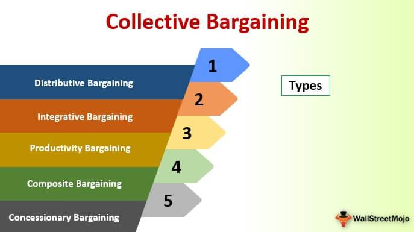

In today's rapidly evolving economic landscape, labor unions and collective bargaining face unprecedented challenges and opportunities due to the rapid advancements in technology. Traditionally, labor unions have acted as guardians of worker rights, advocating for fair wages, safer working conditions, and comprehensive benefits through collective bargaining. However, the emergence of algorithmic trading and automation has introduced complexities that require these traditional structures to reassess and adapt their strategies.

The advent of automation and algorithmic processes in the workplace has fundamentally shifted the dynamics between employers and employees. Automation promises efficiency and cost reduction for businesses but simultaneously poses threats to job security and may contribute to growing economic disparities. As machines and algorithms become capable of performing tasks previously handled by human workers, labor unions must find ways to navigate these challenges to maintain their relevance and efficacy.

Declining union membership exacerbates these issues, as more workers are employed in industries where automation predominates or where union presence has traditionally been lower. Moreover, automated systems and AI technologies often come with biases in their decision-making processes, raising concerns about fairness and accountability in the workplace. Labor unions increasingly recognize the need to advocate for transparency in these automated systems, ensuring that they do not undermine the fundamental rights of workers.

To address these changes, labor unions are exploring innovative strategies and collaborations. They are leveraging digital tools to enhance member engagement, formulating ethical guidelines for technology use, and engaging in policy discussions to shape the responsible implementation of automation and AI in the labor market. By embracing these technological transformations, unions aim to strengthen their role as staunch advocates for equitable labor practices in the digital age.

## Table of Contents

## Historical Context of Organized Labor Unions

Labor unions have a rich history that dates back to the Industrial Revolution, a period marked by rapid industrialization and significant changes in working conditions. During this era, the demand for labor soared as factories proliferated, causing a shift from agrarian work to industrial labor. Workers faced grueling conditions, including long hours, minimal pay, and unsafe environments. In response, labor unions emerged as a collective effort by workers to advocate for their rights and to counteract the adverse impacts of industrialization.

Unions initially focused on securing basic labor rights, such as fair wages, reasonable working hours, and safer working conditions. These early efforts laid the groundwork for significant labor reforms and legislation that would follow. One landmark moment in labor history was the establishment of the eight-hour workday, a demand popularized by the slogan "eight hours for work, eight hours for rest, eight hours for what we will." This movement culminated in notable victories, such as the Fair Labor Standards Act of 1938 in the United States, which established minimum wage and overtime pay standards.

Throughout history, unions have been instrumental in negotiating a broad array of worker benefits beyond basic wages and hours. They have been pivotal in securing healthcare benefits, pension plans, and other welfare measures that form the backbone of many workers' compensation packages today. By negotiating such benefits, unions have helped elevate the general standard of living for millions of workers and their families.

Despite their achievements, labor unions have faced challenges in recent decades, particularly a decline in membership. This trend can be attributed to various factors, including globalization, shifts in the labor market, and changes in laws governing union activities. However, unions remain influential in several key sectors, including education, healthcare, and transportation, where they continue to advocate for worker rights and improvements in employment conditions.

The legacy of labor unions is characterized by their relentless pursuit of worker rights and their adaptability to changing economic landscapes. They have historically been at the forefront of labor reforms, pushing for legislation that benefits both union and non-union workers. Today, as the economy evolves and new challenges arise, unions continue to play a critical role in shaping the labor market and advocating for fair employment practices. Their ability to adapt and respond to new conditions ensures that they remain a vital institution in the ongoing fight for worker rights.

## The Role of Collective Bargaining in Worker Protection

Collective bargaining is a foundational process in labor relations, entailing structured negotiations between labor unions and employers to enhance workplace conditions and establish favorable terms of employment for workers. This mechanism serves as a critical tool for unions to achieve higher wages, safer working environments, and comprehensive benefits for their members. Empirical evidence suggests that unionized workers often enjoy a wage premium compared to their non-unionized counterparts. This premium manifests because collective bargaining empowers workers to negotiate effectively, swinging the balance of power towards equitable outcomes.

Furthermore, the influence of unions extends beyond immediate members; they help set industry-wide standards. As unions negotiate better conditions, these achievements indirectly pressure non-unionized employers to improve their workers’ terms to attract and retain talent. This ripple effect has historically led to broader improvements in employment conditions, contributing to a more equitable labor market.

Despite facing various challenges, including decreasing membership over recent decades, there is a notable resurgence of interest in union membership, especially amongst younger demographics striving for economic security in a volatile job market. The modern labor landscape, marked by gig work and less secure employment, fuels this rejuvenated interest as workers seek the stability and protection that unions can provide.

The collective power harnessed through union membership remains a potent instrument in the advocacy for fair and just labor practices. Unions draw upon this collective strength to negotiate terms that respect the dignity and rights of workers, ensuring that their voices are not marginalized in a rapidly changing economic environment. Advocates assert that expanding union membership can bolster economic inequality reduction efforts, as unions have consistently been champions of equitable labor laws and practices. Hence, collective bargaining remains a crucial component of worker protection and empowerment in contemporary society.

## Challenges Facing Labor Unions in the Age of Technology

Labor unions today are confronted with the dual forces of global competition and rapid technological advancement, both of which pose significant challenges to their traditional operations. As automated systems and algorithms continue to infiltrate workplaces, unions find themselves grappling with how to integrate these technologies while safeguarding workers' rights.

The deployment of algorithmic management tools introduces complexities previously handled by human managers, raising concerns about bias, transparency, and fairness. For example, these tools may utilize algorithms to evaluate employee performance or make hiring and firing decisions. This shift can lead to decisions that lack the nuance and judgment provided by human oversight, potentially resulting in biased outcomes. Such biases could stem from flawed algorithms that do not account for diverse employee backgrounds or fail to respond equitably to various workplace situations.

For labor unions, perceived inflexibility is another hurdle in adapting to these technological shifts. Historically, unions have been seen as steadfast institutions with established processes that resist rapid changes. However, in a technology-driven economy, this perception can hinder their ability to effectively negotiate and address the dynamic needs of their membership.

Moreover, public trust in labor unions can be threatened by the same technological transformations that promise greater operational efficiencies. To maintain and rebuild this trust, unions must emphasize transparency and accountability in their dealings with both members and employers. By providing clear communication about how they plan to protect workers' interests in a technologically advanced workplace, unions can fortify their position as essential advocates for labor rights.

In addressing these challenges, unions must adopt proactive strategies to engage with technology. Collaborations with technologists and policy makers are crucial for ensuring that automated systems are designed and implemented with fairness and equity in mind. Additionally, training programs that equip union leaders and members with digital literacy can enhance their negotiating power and ability to advocate effectively for worker protections in an era dominated by technology.

## Impact of Algorithmic Trading and Automation on Labor

Algorithmic trading and automation have significantly transformed various sectors by enhancing efficiency and streamlining operations. However, they also introduce challenges to job security and workplace equality. Automation replaces tasks previously performed by humans, thereby threatening job stability. Algorithmic systems manage a growing number of decisions traditionally made by human managers, which raises questions about the fairness and transparency of these processes.

One major concern among workers is the potential bias in algorithm-driven decision-making processes. Algorithms are often designed based on existing data, which can perpetuate historical biases if not properly managed. This bias can manifest in hiring practices, task assignments, and performance evaluations, potentially leading to discriminatory outcomes. It underscores the need for robust auditing mechanisms to ensure impartiality in automated decisions.

Labor unions are actively advocating for greater transparency and accountability in automated processes to protect workers' rights. They call for algorithms to be designed and deployed with clear guidelines regarding their decision-making criteria. This advocacy emphasizes the importance of human oversight in algorithmic decisions to prevent unfair labor practices and ensure that workers' rights are upheld.

Collaboration between labor unions, technologists, and policymakers is crucial to establish fair practices and guidelines for using automated systems in the workplace. By working together, these stakeholders can formulate ethical standards that promote equality and protect worker interests. Such efforts are vital in maintaining trust in automated processes and ensuring that technology serves the broader goals of economic and social justice.

Educational initiatives are also underway to equip workers with the skills needed to navigate automated systems effectively. By understanding how these systems function, workers can better advocate for their rights and contribute to discussions on improving workplace technologies. This empowerment is key to fostering an environment where technological advancements are leveraged for the collective benefit of the workforce.

Additionally, unions strive to ensure that a human element remains integral to decision-making processes in the workplace. The presence of human oversight can mitigate the risks associated with full automation and provide a safety net for addressing grievances related to algorithmic management. By emphasizing the importance of the human [factor](/wiki/factor-investing), unions seek to balance efficiency with fairness in the modern workplace.

In conclusion, [algorithmic trading](/wiki/algorithmic-trading) and automation present both opportunities and challenges for labor. While they offer avenues for increased productivity, they also necessitate a reevaluation of employment practices to safeguard against job loss and discrimination. Through advocacy, education, and collaboration, labor unions aim to create a future where technology supports equitable and inclusive work environments.

## Opportunities for Labor Unions in the Digital Age

In the rapidly evolving landscape of the 21st century, labor unions stand at a crossroads, where embracing digital technology can redefine their role in advocating for workers. The integration of digital tools offers unions innovative avenues to organize and engage with their membership base more effectively. For instance, platforms designed for digital conferencing, membership management, and communication can significantly enhance outreach and mobilization efforts, ensuring that unions can maintain robust connections with workers across different sectors and geographical regions.

Technological literacy is increasingly becoming crucial for unions to influence policy-making, particularly concerning automation and [artificial intelligence](/wiki/ai-artificial-intelligence) (AI). By understanding and engaging with these technologies, unions are better positioned to participate in policy discussions and consultations with governments and industries. This involvement ensures that the voices of workers are not sidelined in conversations that will shape the future of work.

Moreover, unions have a pivotal role to play in establishing ethical guidelines for the use of technology within the workplace. As AI and automation become ubiquitous, questions around fairness, transparency, and accountability have come to the forefront. Labor unions can lead initiatives to develop and advocate for ethical technology standards that prevent exploitation and discrimination, ensuring that technological advancements benefit the workforce at large and uphold human rights.

Collaboration amongst unions at both national and international levels can fortify collective bargaining processes, facilitating the sharing of strategies and solutions to shared challenges posed by digital transformation. Through alliances, unions can exert more substantial influence and negotiate from a position of collective strength, potentially securing better outcomes for workers in terms of job security, working conditions, and benefits.

Ultimately, by embracing digital transformation, labor unions can significantly enhance their effectiveness as advocates for workers. This transformation involves adapting to new tools and methodologies while upholding fundamental principles of fairness and equity. By proactively engaging with technological changes, unions can ensure that they remain relevant and influential, safeguarding workers' rights in an increasingly digital economy.

## Conclusion

In today's rapidly advancing technological environment, the role of labor unions is as essential as ever in ensuring the protection of workers' rights. Unions must innovate and adapt to address the challenges presented by the digital age while leveraging new opportunities. Embracing technology is crucial for unions to secure fair labor practices and maintain their relevance. By integrating digital tools, unions can enhance their organizational capabilities and engage more effectively with their members.

Additionally, collaboration across various sectors is necessary to develop ethical standards for the use of technology in workplaces. Unions can play a leading role in creating frameworks that govern the responsible deployment of automation and AI, ensuring that these technologies enhance rather than undermine worker rights.

Unions that adopt a proactive approach by fostering partnerships with technologists, policymakers, and industry leaders can drive significant advancements in labor protections. This collaboration can result in the creation of policies and guidelines that ensure worker well-being is prioritized in the age of automation.

By embracing digital transformation and positioning themselves at the forefront of policy discussions regarding technology in the workplace, labor unions can continue to exert a positive influence in the labor market. This strategic evolution not only enhances their traditional role as advocates for worker rights but also ensures their ongoing effectiveness and impact in the modern economy.

## References & Further Reading

[1]: Brynjolfsson, E., & McAfee, A. (2014). ["The Second Machine Age: Work, Progress, and Prosperity in a Time of Brilliant Technologies."](https://psycnet.apa.org/record/2014-07087-000) W. W. Norton & Company.

[2]: Frey, C. B., & Osborne, M. A. (2017). ["The Future of Employment: How Susceptible are Jobs to Computerisation?"](https://www.sciencedirect.com/science/article/pii/S0040162516302244) Technological Forecasting and Social Change.

[3]: Acemoglu, D., & Restrepo, P. (2019). ["Automation and New Tasks: How Technology Displaces and Reinstates Labor."](https://www.aeaweb.org/articles?id=10.1257/jep.33.2.3) Journal of Economic Perspectives.

[4]: Dunlop, J. T. (1958). ["Industrial Relations Systems"](https://archive.org/details/industrialrelati0000dunl) by John Wiley & Sons.

[5]: Hodson, R., & Sullivan, T. A. (2012). ["The Social Organization of Work"](https://archive.org/details/socialorganizati0000hods_k5d0) by Cengage Learning.