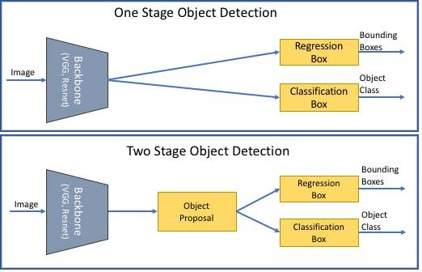

## Table of Contents

## What is oriented object detection in machine learning?

Oriented object detection in machine learning is a technique used to identify and locate objects in images or videos, but with a twist: it also determines the orientation or angle of these objects. Unlike traditional object detection, which only finds where an object is, oriented object detection tells us not just where an object is, but also how it's rotated. This is particularly useful in scenarios where the orientation of an object matters, such as in aerial imagery for detecting vehicles or ships, where knowing the direction they are facing can be crucial.

To perform oriented object detection, machine learning models are trained on datasets that include images with labeled objects and their orientations. These models learn to predict not only the bounding boxes around objects but also the angle of these boxes. For example, if a model detects a car, it will draw a box around it and also indicate if the car is facing left, right, or any other direction. This additional information can significantly enhance the utility of detection systems in applications like traffic management, urban planning, and surveillance, where understanding the orientation of objects can lead to better decision-making and analysis.

## How does oriented object detection differ from traditional object detection?

Oriented object detection and traditional object detection both aim to find objects in images or videos, but they do it in different ways. Traditional object detection looks for objects and draws a box around them. This box is always straight up and down, no matter which way the object is facing. For example, if you have a picture of a car, traditional detection will put a box around it, but it won't tell you if the car is facing left or right.

Oriented object detection goes a step further. It not only finds the object and draws a box around it, but it also makes sure the box is turned the same way as the object. So, if the car in the picture is facing to the left, the box will be turned to the left too. This extra information about the direction of the object can be very helpful in certain situations, like when you need to know which way a ship is pointing in a satellite image.

## What are the key components of an oriented object detection model?

An oriented object detection model has a few main parts that help it work well. First, it needs a way to find where objects are in a picture. This is usually done with something called a backbone network, which looks at the whole image and picks out important features. Then, there's a part called the detection head, which uses these features to guess where the objects are and draw boxes around them. But for oriented object detection, the model also needs to figure out which way the objects are facing. So, it has another part that predicts the angle of the box, making sure it matches the direction of the object.

The second important part is the training data. To teach the model how to do oriented object detection, you need lots of pictures where the objects are already labeled with their positions and angles. This data helps the model learn what different objects look like from different angles. During training, the model tries to match its guesses to the real labels, getting better over time. The last key component is the loss function, which tells the model how well it's doing. For oriented object detection, the loss function needs to consider not just if the box is in the right place, but also if it's turned the right way. This helps the model improve its guesses about both the location and the angle of the objects.

## What is DAFNe and how does it contribute to oriented object detection?

DAFNe stands for "Dense Anchor-Free Network." It's a type of [machine learning](/wiki/machine-learning) model that helps with oriented object detection. DAFNe works by looking at every part of an image and figuring out if there's an object there and which way it's pointing. It's different from older models because it doesn't need to guess where objects might be before it starts looking. Instead, it checks every spot in the picture, making it very good at finding objects that are close together or turned in different ways.

DAFNe contributes to oriented object detection by making the process more accurate and easier to use. It uses a special way of predicting the angle of objects, which helps it get the direction right more often. This is really helpful in situations where knowing the exact angle of an object is important, like in satellite images where you need to know which way a ship or a plane is pointing. By looking at the whole image all at once, DAFNe can find and correctly orient objects faster and better than many other methods.

## Can you explain the architecture of DAFNe?

DAFNe's architecture is designed to handle oriented object detection without using anchor boxes, which are pre-defined boxes used in many older detection models. Instead, DAFNe looks at every spot in an image to see if there's an object and which way it's pointing. It does this by first using a backbone network to pull out important features from the image. These features are then passed through a detection head, which is made up of two main parts: one part figures out where the objects are, and the other part figures out the angle of the objects. This way, DAFNe can find and correctly orient objects without needing to guess where they might be first.

The detection head in DAFNe uses a special method to predict the angle of objects. It uses what's called a "rotation-aware" approach, which means it's really good at figuring out the exact direction an object is facing. This is important because in many situations, like looking at satellite images of ships or planes, knowing the exact angle can make a big difference. By looking at every spot in the image and using this rotation-aware method, DAFNe can find and orient objects more accurately and quickly than many other models.

## What datasets are commonly used to train and evaluate oriented object detection models?

Common datasets used to train and evaluate oriented object detection models include the DOTA dataset, the HRSC2016 dataset, and the UCAS-AOD dataset. The DOTA dataset, which stands for Dataset for Object detection in Aerial images, is one of the largest and most widely used. It has lots of aerial images with objects like planes, ships, and cars, all labeled with their positions and angles. The HRSC2016 dataset focuses on ships and is good for testing how well a model can detect and orient ships in different situations. The UCAS-AOD dataset is smaller but still useful, with images of cars and planes, making it great for training models that need to detect these kinds of objects.

These datasets are important because they help researchers and developers test how well their oriented object detection models work. By using these datasets, people can see if their models can find objects correctly and get the angle right. This is really helpful for making models better and making sure they work well in real life, like in satellite images where knowing the exact direction of objects matters a lot.

## How do you evaluate the performance of an oriented object detection model?

To evaluate the performance of an oriented object detection model, you need to look at how well it finds objects and how accurately it guesses their angles. One common way to do this is by using metrics like precision, recall, and the F1 score. Precision tells you how many of the objects the model found are actually correct, while recall tells you how many of the real objects the model was able to find. The F1 score is a way to combine precision and recall into one number, giving you a good overall idea of how well the model is doing. For oriented object detection, there's also a special metric called the mean Average Precision (mAP), which looks at how well the model finds objects and gets their angles right at the same time.

Another important thing to check is how the model handles different angles. Sometimes, models can be good at finding objects that are facing one way but not as good when they're facing another way. To test this, you can use datasets like DOTA or HRSC2016, which have lots of images with objects at different angles. By running your model on these datasets, you can see if it works well no matter which way the objects are pointing. This is really important for making sure your model will work well in real life, where objects can be facing any direction.

## What are the challenges faced in training oriented object detection models?

Training oriented object detection models can be tricky because it's harder to guess the right angle of an object than just finding where it is. The model needs to learn not only to spot the object but also to figure out which way it's pointing. This means you need a lot of pictures where the objects are labeled with their exact positions and angles. If the dataset doesn't have enough examples of objects at different angles, the model might not learn to do a good job with all of them. Also, the model has to be smart enough to tell the difference between objects that look similar but are facing different ways, which can be really hard.

Another challenge is making sure the model works well even when objects are close together or partly hidden. In real life, objects often overlap or are only partly visible, which can confuse the model. It needs to learn how to find and orient objects in these tricky situations. Plus, training these models can take a lot of time and computer power because they have to look at every part of an image and guess the angle for each object. This means you need strong computers and a lot of patience to train the model well.

## How can data augmentation techniques improve the performance of oriented object detection models?

Data augmentation can really help oriented object detection models get better by making the training data bigger and more varied. When you use [data augmentation](/wiki/data-augmentation), you take the pictures you already have and change them a bit. You might turn them, flip them, zoom in or out, or even add a little noise. This makes it look like you have more pictures than you really do, and it helps the model see objects from different angles and in different situations. By showing the model lots of different views of the same object, it learns to recognize and orient objects no matter how they're turned or where they are in the picture.

One specific way data augmentation helps is by making sure the model can handle objects at any angle. Since oriented object detection needs to know which way objects are facing, it's important for the model to see lots of examples of objects at different angles. By turning and flipping the pictures in the dataset, you can make sure the model sees objects from all possible directions. This can make the model more accurate and better at guessing the right angle, even when objects are partly hidden or close together. In the end, data augmentation makes the model stronger and more useful in real life, where objects can be in all sorts of positions and angles.

## What are some state-of-the-art techniques used in oriented object detection besides DAFNe?

Besides DAFNe, another state-of-the-art technique for oriented object detection is the Rotated Region Proposal Network (RRPN). RRPN works by first finding areas in the image where objects might be, and then it guesses the angle of these areas. This helps the model draw boxes around objects that are turned in different ways. RRPN is good at finding objects that are close together or partly hidden because it looks at the whole image and tries to guess the right angle for each object. This makes it very useful for things like looking at satellite images where ships or planes might be facing any direction.

Another technique is the Gliding Vertex (GV) method. GV is different because it doesn't just draw a box around an object; it also looks at the corners of the box and moves them around to match the object's shape and angle better. This can make the model more accurate, especially when objects are at weird angles or partly hidden. By focusing on the corners, GV can help the model understand the exact shape and direction of objects, which is really helpful in situations where knowing the exact angle matters a lot, like in traffic management or urban planning.

## How do you implement an oriented object detection model like DAFNe in a practical application?

To implement an oriented object detection model like DAFNe in a practical application, you start by choosing a programming language and a [deep learning](/wiki/deep-learning) framework that you're comfortable with, like Python and PyTorch. You'll need to set up your development environment with these tools and make sure you have access to a powerful computer or a GPU to handle the training process. Next, you download and prepare your dataset, like DOTA or HRSC2016, which has images with labeled objects and their angles. You'll need to preprocess these images to make them ready for the model, which might involve resizing them or applying data augmentation techniques to increase the variety of your training data. Once your data is ready, you can start coding the DAFNe model, using the architecture described in research papers and adapting it to your specific needs.

After coding the model, you train it on your prepared dataset. This involves feeding the images into the model, letting it make predictions, and then comparing those predictions to the true labels to calculate the loss. You use this loss to update the model's parameters, making it better at finding and orienting objects over time. Once the model is trained, you need to test it on a separate set of images to see how well it performs. You'll use metrics like precision, recall, and mean Average Precision (mAP) to evaluate its accuracy. If the model performs well, you can deploy it into your application, whether that's a satellite image analysis tool, a traffic management system, or any other use case where knowing the orientation of objects is important.

## What are the future directions and potential improvements in oriented object detection research?

Future directions in oriented object detection research are likely to focus on making models more accurate and faster. One big area of improvement could be in handling objects that are really close together or partly hidden. Right now, models can struggle with these situations, so researchers might work on new ways to make models better at telling objects apart even when they're overlapping. Another thing researchers might look into is using less data to train models. If models can learn well with fewer images, it would be easier and cheaper to use them in real life. Also, making models smaller and faster could help them work on devices like phones or drones, where there isn't a lot of computer power.

Potential improvements could also come from using new kinds of data, like 3D images or videos. Right now, most models look at regular 2D pictures, but adding depth or movement could help models understand objects better. This could be especially useful for things like self-driving cars, where knowing the exact shape and angle of objects in 3D space is important. Researchers might also explore new ways to use [artificial intelligence](/wiki/ai-artificial-intelligence), like combining oriented object detection with other tasks like tracking objects over time or understanding what's happening in a scene. By working on these areas, researchers can make oriented object detection even more useful and powerful in the future.

## References & Further Reading

[1]: Xia, G.-S., Bai, X., Ding, J., Zhu, Z., & Belongie, S. (2018). ["DOTA: A Large-Scale Dataset for Object Detection in Aerial Images."](https://ieeexplore.ieee.org/document/8578516) Proceedings of the IEEE Conference on Computer Vision and Pattern Recognition (CVPR).

[2]: Liu, Z., Yuan, L., Weng, L., & Yang, Y. (2017). ["A High Resolution Optical Satellite Image Dataset for Ship Recognition and Some New Baselines."](https://pdfs.semanticscholar.org/e6a3/2b4df848fd74b43486c5232ebd362eb90416.pdf) arXiv:1609.04830.

[3]: Ding, J., Xue, N., Long, Y., Xia, G.-S., & Lu, Q. (2019). ["Learning RoI Transformer for Oriented Object Detection in Aerial Images."](https://ieeexplore.ieee.org/document/8953881) Proceedings of the IEEE Conference on Computer Vision and Pattern Recognition (CVPR).

[4]: Ma, Q., Shao, Z., & Wang, H. (2020). ["Arbitrary-Oriented Object Detection via Anchor-Free Mechanism."](https://www.tandfonline.com/doi/full/10.1080/22797254.2024.2431006) Pattern Analysis and Applications, 23, 1325-1335.

[5]: Zhou, X., Wang, D., & Krähenbühl, P. (2019). ["Objects as Points."](https://arxiv.org/abs/1904.07850) arXiv:1904.07850.

[6]: Ren, S., He, K., Girshick, R., & Sun, J. (2015). ["Faster R-CNN: Towards Real-Time Object Detection with Region Proposal Networks."](https://ieeexplore.ieee.org/document/7485869) IEEE Transactions on Pattern Analysis and Machine Intelligence, 39(6), 1137-1149.