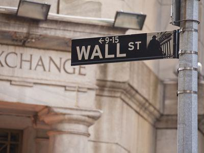

## Table of Contents

## What is Wall Street?

Wall Street is a famous street in New York City where many big banks and financial companies have their offices. It is known all over the world as the center of the financial world. The name "Wall Street" is often used to talk about the whole American financial industry, not just the street itself.

The New York Stock Exchange, which is one of the biggest stock markets in the world, is located on Wall Street. People come here to buy and sell stocks, which are small pieces of ownership in companies. The activities on Wall Street can affect the economy of the whole country and even the world. When people say "the stock market went up" or "the stock market went down," they are often talking about what happened on Wall Street.

## Where is Wall Street located?

Wall Street is in New York City, in the southern part of Manhattan. It's a short street that runs from Broadway to South Street, near the East River.

This area is famous because it's where you'll find the New York Stock Exchange and many big banks and financial companies. People from all over the world know Wall Street as the heart of the financial industry in the United States.

## What is the historical significance of Wall Street?

Wall Street got its name from a real wall that the Dutch built in the 1600s. Back then, New York was called New Amsterdam, and the Dutch wanted to keep the British out. The wall was made of wood and stretched across the island of Manhattan. Over time, the wall was taken down, but the name "Wall Street" stayed.

In the late 1700s, after the American Revolution, Wall Street became important for a different reason. It became the place where people started trading stocks and bonds. In 1792, a group of men made an agreement under a buttonwood tree on Wall Street. This agreement was the start of the New York Stock Exchange, which is now one of the biggest stock markets in the world. Because of this, Wall Street became known as the center of finance in the United States.

Today, Wall Street is still very important. It's where many big banks and financial companies have their offices. When people talk about the economy or the stock market, they often mention Wall Street. It's a symbol of the American financial system and has a big impact on the world's economy.

## How did Wall Street get its name?

Wall Street got its name from a wooden wall that the Dutch built in the 1600s. At that time, New York was called New Amsterdam, and the Dutch wanted to protect their settlement from the British. The wall stretched across the island of Manhattan, and it was meant to keep enemies out.

Over time, the wall was taken down, but the name "Wall Street" stayed. The street became important for a different reason in the late 1700s, after the American Revolution. It became the place where people started trading stocks and bonds. This is why Wall Street is now known as the center of finance in the United States.

## What was the original purpose of the wall on Wall Street?

The original purpose of the wall on Wall Street was to protect the Dutch settlement of New Amsterdam from attacks by the British. In the 1600s, the Dutch built a wooden wall across the island of Manhattan to keep their enemies out. This wall was a way to defend their land and keep their people safe.

Over time, the wall was taken down, but the name "Wall Street" stayed. The street became important for a different reason after the American Revolution in the late 1700s. It became the place where people started trading stocks and bonds, turning Wall Street into the center of finance in the United States.

## When was the wall on Wall Street built and by whom?

The wall on Wall Street was built in the 1600s by the Dutch. At that time, New York was called New Amsterdam, and the Dutch wanted to protect their settlement from the British. They built a wooden wall across the island of Manhattan to keep their enemies out. This wall was meant to defend their land and keep their people safe.

Over time, the wall was taken down, but the name "Wall Street" stayed. The street became important for a different reason after the American Revolution in the late 1700s. It became the place where people started trading stocks and bonds. This turned Wall Street into the center of finance in the United States.

## How did the wall on Wall Street influence the development of the area?

The wall on Wall Street was built by the Dutch in the 1600s to keep the British out of their settlement, New Amsterdam. The wall was made of wood and stretched across the island of Manhattan. It was meant to protect the Dutch people and their land. Even though the wall was taken down later, the name "Wall Street" stayed. This name reminds us of the wall that was once there.

After the American Revolution in the late 1700s, Wall Street became important for a different reason. It became the place where people started trading stocks and bonds. In 1792, a group of men made an agreement under a buttonwood tree on Wall Street. This agreement was the start of the New York Stock Exchange. Because of this, Wall Street became known as the center of finance in the United States. Today, many big banks and financial companies have their offices on Wall Street, and it is a symbol of the American financial system.

## What role did Wall Street play in the early American economy?

In the early days of the United States, Wall Street was very important for the economy. After the American Revolution in the late 1700s, people started trading stocks and bonds on Wall Street. This helped businesses grow and raise money. In 1792, a group of men made an agreement under a buttonwood tree on Wall Street. This agreement started the New York Stock Exchange, which became a big place for buying and selling stocks.

Wall Street became the center of finance in the United States. It helped the country's economy grow by making it easier for businesses to get money they needed. People could invest in companies and help them expand. This made Wall Street a key part of the early American economy and set the stage for it to become the financial powerhouse it is today.

## How has the symbolism of Wall Street evolved over time?

Wall Street started as a symbol of protection. In the 1600s, the Dutch built a wooden wall across Manhattan to keep the British out of their settlement, New Amsterdam. The wall was meant to defend the Dutch people and their land. Even after the wall was taken down, the name "Wall Street" stayed, reminding people of its original purpose.

Over time, Wall Street's symbolism changed a lot. After the American Revolution in the late 1700s, it became the place where people started trading stocks and bonds. This made Wall Street the center of finance in the United States. Today, Wall Street is known all over the world as a symbol of the American financial system. It stands for big banks, stock markets, and the economy. When people talk about the economy or the stock market, they often mention Wall Street.

## What are some key historical events that took place on Wall Street?

Wall Street has seen many important events over the years. In 1792, a group of men made an agreement under a buttonwood tree on Wall Street. This agreement was the start of the New York Stock Exchange. It was a big moment because it helped make Wall Street the center of finance in the United States. People could buy and sell stocks and bonds, which helped businesses grow and the economy to develop.

Another big event was the Wall Street Crash of 1929. This happened on October 29, 1929, and it is also called Black Tuesday. On that day, the stock market lost a lot of value very quickly. Many people lost their money and jobs. This crash led to the Great Depression, which was a very hard time for the whole country. It showed how powerful Wall Street could be in affecting the economy.

More recently, the 2008 financial crisis also had a big impact on Wall Street. It started with problems in the housing market and spread to the whole financial system. Big banks and financial companies on Wall Street were in trouble. The government had to step in to help. This crisis showed again how Wall Street can affect the economy of the whole world.

## How does Wall Street's name relate to its current financial role?

Wall Street got its name from a wooden wall that the Dutch built in the 1600s to keep the British out of their settlement, New Amsterdam. The wall was meant to protect the Dutch people and their land. Even though the wall was taken down later, the name "Wall Street" stayed. This name reminds us of the wall that was once there.

Over time, Wall Street became important for a different reason. After the American Revolution in the late 1700s, people started trading stocks and bonds on Wall Street. This helped businesses grow and raise money. Today, Wall Street is known all over the world as the center of finance in the United States. It stands for big banks, stock markets, and the economy. Even though the name comes from a wall that was meant to keep people out, now Wall Street is a place where people come together to make the economy work.

## What are the cultural and economic impacts of Wall Street's name globally?

Wall Street's name has a big impact on culture and the economy around the world. It is known everywhere as the heart of the American financial system. When people hear "Wall Street," they think of big banks, stock markets, and the economy. This name has become a symbol of money and power. Movies, books, and news stories often talk about Wall Street to show how the economy is doing. It's like a shorthand way to talk about the whole financial world.

Economically, Wall Street's name affects how people see the global market. When the stock market on Wall Street goes up or down, it can change how people feel about investing and spending money all over the world. If Wall Street is doing well, people might feel more confident about the economy. But if it's doing badly, people might worry and be more careful with their money. This shows how powerful Wall Street's name is in shaping the world's economy.

## References & Further Reading

[1]: ["The Origins of Wall Street"](https://www.history.com/topics/us-states/wall-street-timeline) by Nathan Hibbs

[2]: Pardo, R. (2008). ["The Evaluation and Optimization of Trading Strategies"](https://onlinelibrary.wiley.com/doi/book/10.1002/9781119196969), 2nd Edition. Wiley Trading.

[3]: Harris, L. (2003). ["Trading and Exchanges: Market Microstructure for Practitioners"](https://academic.oup.com/book/52292)

[4]: Aldridge, I. (2013). ["High-Frequency Trading: A Practical Guide to Algorithmic Strategies and Trading Systems"](https://books.google.com/books/about/High_Frequency_Trading.html?id=6l0DDQAAQBAJ), 2nd Edition. Wiley Finance.

[5]: ["Flash Boys: A Wall Street Revolt"](https://en.wikipedia.org/wiki/Flash_Boys) by Michael Lewis

[6]: MacKenzie, D. A. (2006). ["An Engine, Not a Camera: How Financial Models Shape Markets"](https://academic.oup.com/mit-press-scholarship-online/book/20588). MIT Press.

[7]: Jones, C. M. (2013). ["What Do We Know About High-Frequency Trading?"](https://papers.ssrn.com/sol3/papers.cfm?abstract_id=2236201) The Review of Financial Studies, 26(8), 1508-1539. 

[8]: SEC (2010). ["Concept Release on Equity Market Structure"](https://www.sec.gov/rules-regulations/2010/01/concept-release-equity-market-structure) (Release No. 34-61358).