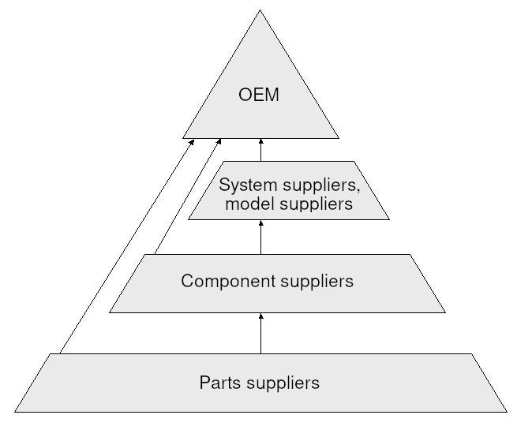

## Table of Contents

## What is an Original Equipment Manufacturer (OEM)?

An Original Equipment Manufacturer, or OEM, is a company that makes parts and equipment that may be sold by another company. For example, a car company might use engines made by another company. That engine-making company is the OEM. The car company puts the engine in their cars and sells them to customers. The customers might not know that the engine came from a different company.

OEMs are important because they help other companies make products faster and cheaper. Instead of making everything themselves, companies can buy parts from OEMs. This saves time and money. OEMs often make high-quality parts because they focus on making just those parts. This can make the final product better for the customer.

## How does an OEM differ from an aftermarket parts supplier?

An OEM, or Original Equipment Manufacturer, makes parts that are used in products sold by other companies. These parts are usually made while the product is being built. For example, a car company might use tires made by an OEM. The tires are put on the car before it is sold to customers. OEM parts are often made to fit perfectly with the product they are used in, and they are usually sold under the brand name of the company that sells the final product.

An aftermarket parts supplier, on the other hand, makes parts that are used to fix or improve a product after it has been sold. These parts are not used when the product is first made. For example, if someone wants to change the tires on their car after buying it, they might buy tires from an aftermarket supplier. Aftermarket parts can be cheaper or more expensive than OEM parts, and they might offer different features or styles. They are often sold under the supplier's own brand name, not the brand of the product they are used in.

## Can you provide examples of well-known OEMs in the automotive industry?

In the automotive industry, some well-known OEMs make parts that car companies use to build their vehicles. One example is Bosch, a company that makes many parts like fuel injectors, brakes, and electronics. Car companies buy these parts from Bosch and put them in their cars. Another example is Magna International, which makes things like seats, body parts, and powertrain components. Car companies use these parts when they build their cars.

Another big OEM in the automotive world is Denso, which makes parts like air conditioning systems, engine control units, and sensors. Car companies often use Denso's parts in their vehicles. Lastly, there's Continental, which makes tires, brakes, and safety systems. Car companies buy these parts from Continental to include in their cars. All these OEMs help car companies make their vehicles faster and better.

## What role does an OEM play in the supply chain?

An OEM plays a big role in the supply chain. They make parts that other companies use to build their products. For example, a car company might buy engines from an OEM instead of making them themselves. This helps the car company build cars faster and cheaper. The OEM makes sure the parts are good quality and ready on time so the car company can keep making cars.

OEMs are important because they help keep the supply chain running smoothly. If an OEM can't make enough parts, it can slow down the whole supply chain. For example, if the engine OEM has a problem, the car company might have to wait to get engines. This can make the car company fall behind on making cars. So, OEMs need to be reliable and good at what they do to help keep everything moving.

## How do OEMs ensure the quality of their products?

OEMs make sure their products are good by using strict rules and checks. They have special teams that watch over how things are made. These teams check the parts at different times during making to make sure they are right. They also use machines and tests to see if the parts are strong and work well. If something is not right, they fix it before sending it to the companies that use their parts.

OEMs also work with the companies that buy their parts to make sure everything fits and works well together. They might do tests together to see how the parts work in the final product. This helps them find and fix any problems early. By doing all these things, OEMs can make sure their parts are good and help the companies that use them make better products.

## What are the benefits of buying products directly from an OEM?

When you buy products directly from an OEM, you get parts that are made to fit perfectly with the original product. These parts are often made with the same high standards as the parts used when the product was first made. This means they will work well and last a long time. Also, buying from an OEM can be easier because you know the part will be right for your product. You don't have to worry about finding the right size or type of part.

Another benefit is that OEMs often offer good support and warranties. If something goes wrong with the part, you can usually get help from the OEM. They might fix it or give you a new one. This can save you money and time. Plus, buying directly from an OEM can sometimes be cheaper because you are not paying for someone else to sell the part to you. It's like buying from the source, which can be a good deal.

## How do OEMs collaborate with other companies in product development?

OEMs work closely with other companies to make new products. They start by talking about what the other company needs. The OEM then uses its knowledge to help design parts that will work well with the new product. They might make special parts just for that product. This helps the other company make something new and better. The OEM and the other company work together to test the parts and make sure they fit and work right.

During this process, the OEM and the other company share ideas and information. They might change the design of the parts a few times to make them even better. The OEM can also help the other company save time and money by making the parts quickly and well. This teamwork helps both companies make a good product that people will like. By working together, they can make sure the product is the best it can be before it goes to stores.

## What challenges do OEMs face in global markets?

OEMs face many challenges when they want to sell their parts in global markets. One big challenge is dealing with different rules in different countries. Each country might have its own rules about how products should be made and what they should be like. This can make it hard for OEMs to make parts that work everywhere. They might need to change how they make things or use different materials to follow these rules. Another challenge is the cost of moving parts around the world. It can be expensive to ship parts from one country to another, and this can make the parts more expensive for customers.

Another challenge for OEMs is understanding what people in different countries want. People in one country might like different things than people in another country. OEMs need to learn about these differences and make parts that people in each country will want to buy. This can be hard and take a lot of time. Also, OEMs might have to deal with competition from other companies in different countries. These companies might make similar parts but cheaper, which can make it hard for the OEM to sell their parts.

## How has the role of OEMs evolved with the rise of technology and automation?

The role of OEMs has changed a lot because of new technology and automation. Before, OEMs mostly made parts the old way, with people doing a lot of the work. But now, they use machines and computers to make parts faster and better. These machines can do things that people can't, like making very small or very exact parts. This helps OEMs make high-quality parts that fit perfectly in the products they go into. They also use technology to keep track of their parts and make sure they are always on time.

Automation has also changed how OEMs work with other companies. They can now share information and work together more easily using the internet and special software. This makes it easier for OEMs to help design new products and make sure their parts work well with them. Because of automation, OEMs can make more parts in less time, which helps the companies that use their parts make their products faster. This makes everything more efficient and helps OEMs stay important in the supply chain.

## What are the legal and regulatory considerations for OEMs?

OEMs have to follow many rules when they make parts. These rules can come from the government or from the companies that buy their parts. For example, a car company might have special rules about how strong a part needs to be. Governments might have rules about safety, like making sure parts don't catch fire or break easily. OEMs need to know all these rules and make sure their parts follow them. If they don't, they could get in trouble or have to pay money.

Another big thing for OEMs is patents and copyrights. These are special rights that stop other people from copying their parts. OEMs need to make sure they don't copy someone else's part, or they could get sued. They also need to protect their own parts with patents so no one else can copy them. This can be hard because the rules about patents are different in different countries. OEMs have to keep track of all these rules and make sure they are doing everything right.

## How do OEMs manage intellectual property rights?

OEMs take care of their intellectual property rights by getting patents and trademarks. A patent is like a special right that stops other people from copying their parts. OEMs need to apply for patents in different countries because the rules can be different everywhere. They also use trademarks to protect their brand names and logos. This helps people know that the parts come from them and not someone else. Managing these rights can be hard because it takes a lot of time and money to keep track of everything.

OEMs also have to make sure they don't copy someone else's parts. If they do, they could get sued and have to pay a lot of money. To avoid this, they do a lot of research before they start making a new part. They check to see if anyone else has a patent on something similar. If they find out someone else has a patent, they have to change their part or find another way to make it. This can slow down their work, but it's important to stay out of trouble.

## What future trends are likely to impact the operations of OEMs?

The future of OEMs will be shaped by new technology and changes in how people buy things. One big trend is the use of more smart technology and the Internet of Things (IoT). This means that parts made by OEMs will have to work with computers and the internet. For example, car parts might need to connect to the car's computer system. This can make the parts more complicated to make, but it also opens up new ways for OEMs to help their customers. They can make parts that do more things and work better with other technology.

Another trend is the move to more sustainable and green products. People are starting to care more about the environment, so companies want parts that are better for the planet. This means OEMs will need to find new ways to make parts that use less energy and create less waste. They might use new materials or new ways of making things. This can be hard, but it also gives OEMs a chance to be leaders in making eco-friendly parts. As these trends grow, OEMs will have to change how they work to stay important and meet what people want.

## References & Further Reading

[1]: Bergstra, J., Bardenet, R., Bengio, Y., & Kégl, B. (2011). ["Algorithms for Hyper-Parameter Optimization."](https://dl.acm.org/doi/10.5555/2986459.2986743) Advances in Neural Information Processing Systems 24.

[2]: ["Advances in Financial Machine Learning"](https://www.amazon.com/Advances-Financial-Machine-Learning-Marcos/dp/1119482089) by Marcos Lopez de Prado

[3]: ["Evidence-Based Technical Analysis: Applying the Scientific Method and Statistical Inference to Trading Signals"](https://www.amazon.com/Evidence-Based-Technical-Analysis-Scientific-Statistical/dp/0470008741) by David Aronson

[4]: ["Machine Learning for Algorithmic Trading"](https://github.com/PacktPublishing/Machine-Learning-for-Algorithmic-Trading-Second-Edition) by Stefan Jansen

[5]: ["Quantitative Trading: How to Build Your Own Algorithmic Trading Business"](https://books.google.com/books/about/Quantitative_Trading.html?id=j70yEAAAQBAJ) by Ernest P. Chan