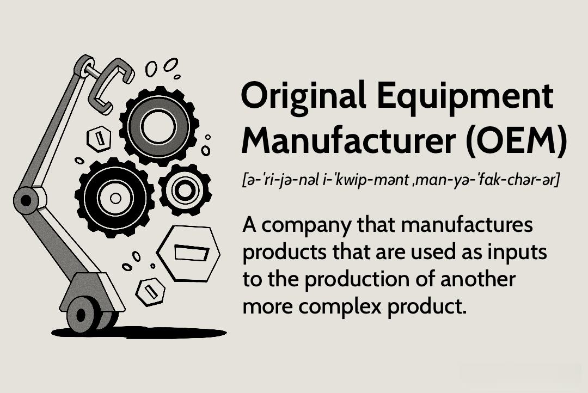

The intersection between Original Equipment Manufacturers (OEMs) and algorithmic trading represents an innovative fusion of traditional manufacturing and advanced financial technologies. In the manufacturing world, OEMs are entities that produce components or subsystems incorporated into the final products manufactured by other companies. This business model allows end-product manufacturers to leverage specialized expertise and focus on final assembly and branding, while OEMs handle the intricacies of component production. For instance, in the automotive industry, parts such as brakes, electrical systems, and exhaust systems may originate from various OEMs.

On the financial front, algorithmic trading, commonly abbreviated as algo trading, is characterized by the use of high-speed computing to execute trades automatically, based on established criteria such as timing, price, or quantity. Algorithms can rapidly process vast data streams, executing trades at speeds and volumes beyond human capability. This method of trading not only enhances market efficiency by tightening bid-ask spreads and boosting liquidity but also minimizes transaction costs due to reduced manual intervention.



This article explores the potential synergies between OEMs and algorithmic trading with the aim of improving manufacturing processes and market outcomes. Integrating these two domains could lead to enhanced production efficiency, driven by real-time data integration and predictive analytics. For example, market demand forecasts generated by trading algorithms could inform and optimize production schedules, aligning output closely with fluctuating market needs. By fusing OEM manufacturing capabilities with financial technology innovations, companies could achieve superior agility, increased operational efficiency, and commensurately improved market performance.

## Table of Contents

## Understanding OEMs in Manufacturing

An Original Equipment Manufacturer (OEM) is a key player in the manufacturing industry, providing components or parts that are integral to the products of other companies, which in turn market the finished product under their own brand. This arrangement is prevalent across various sectors, notably in the automotive industry. For instance, automotive parts like exhaust systems are often produced by OEMs. These parts are then incorporated into vehicles by major car brands, allowing them to focus on assembly and brand-specific features rather than the complexities of component manufacturing.

OEMs typically sell their products in bulk, offering a scale advantage that smaller manufacturers might struggle to achieve. This scale not only leads to reduced costs per unit but also enhances the quality consistency of the components. By concentrating on high-[volume](/wiki/volume-trading-strategy) production, OEMs can employ standardized processes and maintain rigorous quality control measures, ensuring uniformity and reliability in their offerings. The bulk manufacturing approach also allows OEMs to leverage economies of scale, leading to cost efficiencies that can be passed on to their clients, the original brand manufacturers.

Another significant benefit provided by OEMs is the facilitation of faster production cycles. Because OEMs supply ready-made components, companies can significantly reduce the time required for their manufacturing processes. Instead of designing and producing every single part from scratch, companies can procure these parts from OEMs, focusing resources instead on product innovation and customization. This not only speeds up the production cycle but also enables more responsive supply chain operations, as ready inventory can be quickly integrated into the assembly line.

In summary, OEMs hold a crucial position in manufacturing by offering components that simplify and expedite production processes for many companies. By doing so, they not only improve efficiency and quality consistency but also support more dynamic and responsive manufacturing operations.

## Algorithmic Trading and Its Impact on Manufacturing

Algorithmic trading utilizes complex algorithms to automate the execution of trades based on predefined criteria, offering significant potential for enhancing manufacturing processes. These algorithms can be adapted to the manufacturing sector to optimize supply chain logistics, akin to their role in financial markets where they streamline trade execution and manage large volumes of data swiftly. In manufacturing, algorithms can model supply chain dynamics to enhance efficiencies and reduce costs by predicting and mitigating potential bottlenecks.

For instance, algorithms can analyze data from various points along the supply chain and identify optimal routes for materials and products, thus reducing transit time and costs. This optimization can be particularly beneficial in global supply chains where variables such as shipping delays, customs processing, and fluctuating demand need to be managed effectively. By integrating [algorithmic trading](/wiki/algorithmic-trading) principles, manufacturing systems can dynamically adjust ordering and delivery schedules in response to real-time data inputs, minimizing idle time and inventory costs.

Predictive analytics, another powerful tool derived from algorithmic processes, allows manufacturers to forecast market demand accurately. By analyzing current and historical data, predictive models can anticipate future demand fluctuations, enabling manufacturers to align their production schedules accordingly. This capability not only helps in meeting customer demands promptly but also reduces the likelihood of overproduction, which can lead to waste and increased costs. For example, a manufacturer can leverage predictive analytics to adjust production output in line with seasonal demand patterns, ensuring an optimal balance between supply and demand.

Furthermore, the integration of these algorithms in manufacturing can facilitate a higher degree of automation and real-time decision-making. By constructing mathematical models that predict outcomes based on variable inputs, manufacturers can maintain agility in their operations. The use of programming languages such as Python allows for the implementation of [machine learning](/wiki/machine-learning) models that continually learn and adapt to new data inputs, refining their predictive accuracy over time.

```python
# Example: Simple Linear Regression using Python for Demand Forecasting

import pandas as pd
from sklearn.model_selection import train_test_split
from sklearn.linear_model import LinearRegression
import numpy as np

# Sample dataset: historical sales data
data = {'Days': [1, 2, 3, 4, 5], 'Sales': [200, 220, 250, 270, 300]}
df = pd.DataFrame(data)

# Features and target
X = df[['Days']]
y = df['Sales']

# Splitting the dataset into train and test sets
X_train, X_test, y_train, y_test = train_test_split(X, y, test_size=0.2, random_state=0)

# Linear regression model
model = LinearRegression()
model.fit(X_train, y_train)

# Predicting sales for the next day
predicted_sales = model.predict(np.array([[6]]))

print(f'Predicted Sales for next day: {predicted_sales[0]}')
```

This code snippet demonstrates a simple linear regression model, highlighting how manufacturers could forecast sales data based on historical trends. Through these approaches, algorithmic trading principles can be effectively leveraged to enhance decision-making and operational efficiency in manufacturing.

## The Role of Technology in OEM and Algorithmic Trading Integration

Technological advancements are pivotal in merging the efficiencies of Original Equipment Manufacturers (OEMs) with the precision of algorithmic trading systems. At the forefront, [artificial intelligence](/wiki/ai-artificial-intelligence) (AI) and machine learning algorithms enhance decision-making capacities by analyzing large datasets to identify patterns that influence both manufacturing and trading operations. This integration allows for the automation of complex processes and improvements in operational efficiency.

AI algorithms can facilitate the synchronization of manufacturing outputs with market dynamics. For instance, machine learning models can predict demand fluctuations, allowing OEMs to adjust production levels by feeding data into algorithmic trading systems, which optimize trading strategies accordingly. Such predictive modeling strengthens the supply chain by minimizing overproduction and stockouts.

Real-time data flow is a critical component of this integration. Automated systems equipped with sensors and IoT devices can transmit data from the manufacturing floor directly to financial markets. This connectivity enables instantaneous adjustments to production schedules based on real-time market conditions. The implementation of a robust infrastructure for data collection and dissemination is essential, where cloud computing and edge computing platforms can be utilized to process and distribute data swiftly across global networks.

Robust cybersecurity measures are indispensable to protect the integrated systems from potential threats. With sensitive data streaming through interconnected networks, OEMs and financial institutions must deploy advanced encryption protocols and intrusion detection systems. Regular security audits and the application of blockchain technology can also enhance security by ensuring data integrity and transparency.

The integration of these technological elements lays the foundation for a dynamic ecosystem where OEMs and algorithmic trading systems operate seamlessly. As technology continues to evolve, these systems will become more intelligent and adaptive, further optimizing both manufacturing efficiency and market responsiveness.

## Advantages of Integrating OEMs with Algorithmic Trading

Integrating Original Equipment Manufacturers (OEMs) with algorithmic trading offers a multitude of advantages that can significantly enhance both production and trading operations. One primary benefit is the enhancement of efficiency, as algorithms are adept at handling tasks that require intensive data processing and time-sensitive execution. By automating these processes, businesses can achieve faster decision-making and execution speeds, leading to improved operational effectiveness. 

Furthermore, this integration can lead to increased production quality and a reduction in waste, primarily through data-driven manufacturing processes. In traditional manufacturing, variability and inefficiencies often lead to increased waste and lower quality outputs. By employing algorithmic solutions, OEMs can optimize manufacturing parameters, ensuring that resources are utilized more effectively and products meet higher quality standards. Algorithms analyze vast amounts of data from production lines, identifying patterns and anomalies that may not be apparent to human operators, allowing for continuous improvements in the production process.

Additionally, there is potential for significant cost reductions due to the efficient allocation of resources and minimization of manual interventions. Automated systems driven by algorithms can optimize the supply chain and production scheduling, ensuring that materials are available exactly when needed, thus reducing inventory costs. These systems can also evaluate market trends and operational data to optimize production schedules, reducing downtime and enhancing overall resource utilization. The reduction in the need for manual interventions not only lowers labor costs but also minimizes the risks of human error, leading to more consistent results.

In Python, these efficiencies can be realized through various libraries and frameworks capable of processing large datasets and implementing machine learning models. For instance, using libraries such as NumPy and pandas, manufacturers can handle and analyze large datasets efficiently. Machine learning models built using libraries like TensorFlow or PyTorch can predict demand fluctuations and optimize production pipelines accordingly. By leveraging these technologies, OEMs can ensure that their operations are not only more cost-effective but also better aligned with market demands.

## Challenges and Considerations

Implementing advanced algorithmic systems within OEM and manufacturing environments poses several challenges and considerations. One of the most immediate hurdles is the substantial initial cost associated with deploying these sophisticated technologies. The integration of algorithmic trading systems necessitates investment in not only hardware and software but also in the infrastructure needed to support high-speed data processing and robust cybersecurity measures. These costs can be prohibitive, particularly for smaller OEMs that may lack the financial resources of their larger counterparts.

Another significant challenge is the complexity of aligning OEM production processes with the volatile market dynamics that are often influenced by algorithmic trading. Market fluctuations can lead to rapid changes in demand, requiring OEMs to adjust their production schedules swiftly. However, synchronizing production with these dynamic conditions requires real-time data analytics and predictive modeling, which can be difficult to implement effectively. Discrepancies between production timelines and market demands can lead to inefficiencies, such as overproduction or stockouts.

Moreover, the successful integration of algorithmic systems within OEM operations hinges on the availability of skilled personnel. Managing these systems demands expertise in algorithm design and a deep understanding of market behaviors and manufacturing workflows. Personnel must be capable of interpreting complex algorithmic outputs to make informed decisions about production and strategy. There is a growing need for professionals who possess a blend of skills in data science, engineering, and finance, highlighting the importance of targeted educational and training programs to build a workforce adept at navigating the intricacies of this integration.

Ultimately, while the integration of OEMs with algorithmic trading systems offers the potential for substantial efficiency gains, the associated challenges require careful planning and resource allocation. Addressing these challenges involves strategic investment in technology, the development of adaptable production processes, and the cultivation of a skilled and knowledgeable workforce.

## The Future of OEM and Algorithmic Trading Collaboration

Continued technological advances are poised to significantly enhance the synergies between Original Equipment Manufacturers (OEMs) and algorithmic trading systems, fostering a new era of integration and efficiency across both domains. As manufacturing processes become increasingly automated, algorithms will play an essential role in streamlining operations, optimizing resource allocation, and minimizing production timelines.

One of the key developments expected in this integrated future is the enhanced real-time linkage between production lines and trading floors, facilitated by Artificial Intelligence (AI) and Machine Learning (ML). These technologies can process vast amounts of data rapidly, enabling dynamic adjustments to production schedules in response to market fluctuations. For instance, ML models can predict demand shifts with high accuracy, allowing OEMs to fine-tune their manufacturing processes accordingly.

Moreover, AI-driven analytics can offer insights into market trends and consumer preferences, which can be directly translated into manufacturing directives. This can lead to a more responsive and adaptive production environment, where resources are allocated more efficiently, and waste is minimized. The integration of IoT (Internet of Things) devices can further enhance this process by providing real-time data from the production floor, enabling continuous monitoring and adjustments.

Python and similar programming languages play a pivotal role in developing the algorithms used for these applications. Through libraries such as TensorFlow and PyTorch, sophisticated models can be built to analyze and predict market trends and optimize production processes. For example:

```python
import tensorflow as tf

# Sample code to define a predictive model to optimize manufacturing based on market data
model = tf.keras.Sequential([
    tf.keras.layers.Dense(64, activation='relu', input_shape=(input_shape,)),
    tf.keras.layers.Dense(32, activation='relu'),
    tf.keras.layers.Dense(1)
])

model.compile(optimizer='adam', loss='mean_squared_error')

# Model training would involve large datasets of historical market and production data
model.fit(market_data, production_output, epochs=10, batch_size=32, validation_split=0.2)
```

As OEMs and algorithmic trading systems become more intertwined, the sector is likely to witness increased efficiency in both supply chain logistics and market operations. This will not only enhance production quality but also create new pathways for innovation, driven by the seamless fusion of data from diverse sources.

In conclusion, the future of OEM and algorithmic trading collaboration is promising, underpinned by cutting-edge technologies and a commitment to continuous improvement in manufacturing and trading strategies. With ongoing advancements, this interdependency is set to reshape both sectors, offering unprecedented opportunities for growth and innovation.

## Conclusion

The synthesis of Original Equipment Manufacturer (OEM) capabilities with algorithmic trading signifies a transformative opportunity in both the manufacturing and financial trading sectors. By bridging traditional manufacturing with the potent analytical and execution power of algorithms, companies can not only enhance their operational efficiencies but also respond to market dynamics with unprecedented speed and precision.

For successful integration, it is essential to consider technology, human resources, and strategic alignment. Technological infrastructure is foundational, requiring robust systems capable of handling vast amounts of data in real-time and making swift adjustments. The deployment of machine learning and artificial intelligence can significantly enhance predictive capabilities and operational efficiencies. For instance, using Python libraries like TensorFlow or PyTorch, manufacturers can develop models to predict demand patterns and optimize production schedules accordingly.

Human resources also play a crucial role in this integration. Skilled personnel are needed to manage, monitor, and interpret complex algorithmic systems, ensuring that both the manufacturing and trading components are in sync. Training programs and hiring strategies should focus on cultivating a workforce adept in both manufacturing processes and financial technologies.

Strategic alignment further involves seamless communication and coordination between manufacturing and financial teams. This synergy ensures that production objectives are aligned with market trends and trading strategies, leading to more coherent business operations.

As the industry evolves, maintaining up-to-date knowledge and adaptability becomes imperative for businesses. The pace of technological development implies that what is cutting-edge today might be standard tomorrow. Thus, companies must be proactive in adopting advancements, analyzing market changes, and experimenting with new methodologies.

In conclusion, the intersection of OEM capabilities and algorithmic trading offers promising potential for innovation. Companies that manage to integrate these elements thoughtfully will likely gain a competitive edge, marked by increased efficiency and adaptability in a rapidly changing economic landscape.

## References & Further Reading

[1]: Bergstra, J., Bardenet, R., Bengio, Y., & Kégl, B. (2011). ["Algorithms for Hyper-Parameter Optimization."](https://dl.acm.org/doi/10.5555/2986459.2986743) Advances in Neural Information Processing Systems 24.

[2]: ["Advances in Financial Machine Learning"](https://www.amazon.com/Advances-Financial-Machine-Learning-Marcos/dp/1119482089) by Marcos Lopez de Prado

[3]: ["Evidence-Based Technical Analysis: Applying the Scientific Method and Statistical Inference to Trading Signals"](https://www.amazon.com/Evidence-Based-Technical-Analysis-Scientific-Statistical/dp/0470008741) by David Aronson

[4]: ["Machine Learning for Algorithmic Trading"](https://github.com/PacktPublishing/Machine-Learning-for-Algorithmic-Trading-Second-Edition) by Stefan Jansen

[5]: ["Quantitative Trading: How to Build Your Own Algorithmic Trading Business"](https://books.google.com/books/about/Quantitative_Trading.html?id=j70yEAAAQBAJ) by Ernest P. Chan