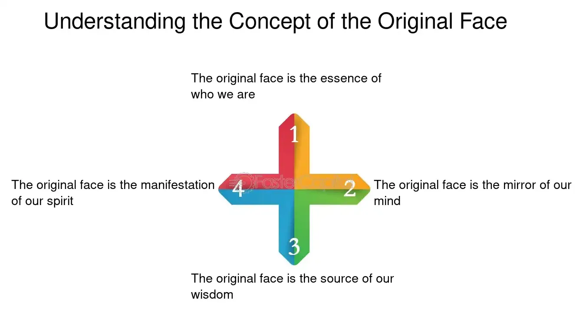

## Table of Contents

## What is the concept of Original Face?

The concept of Original Face comes from Zen Buddhism. It is a way to think about who we really are, deep down inside. The idea is that before we were born, and before our parents were born, we had a true self that was not affected by the world around us. This true self, or Original Face, is what Zen Buddhists try to find through meditation and self-reflection.

When people talk about Original Face, they are trying to get past all the things that make us different from each other, like our jobs, our families, and our worries. They want to see the pure, simple part of themselves that is the same in everyone. It's like trying to see the sky without any clouds. By understanding Original Face, people hope to find peace and a deeper connection with the world around them.

## How does the concept of Original Face originate?

The idea of Original Face comes from Zen Buddhism, which started in China a long time ago. It is based on a famous question that a Zen master named Linji Yixuan asked his students: "What was your original face before your parents were born?" This question is meant to make people think about who they really are, deep down inside, without all the things that life adds on.

Zen Buddhists believe that everyone has a true self that is not affected by the world around them. This true self, or Original Face, is what people try to find through meditation and thinking deeply about themselves. The idea is to get past all the things that make us different from each other, like our jobs, our families, and our worries, to see the pure, simple part of ourselves that is the same in everyone.

## What are the basic mechanisms behind Original Face?

The basic idea behind Original Face is to find your true self, the one that was there before you were born and before your parents were born. It's like trying to see who you are without all the things that life adds on, like your job, your family, and your worries. Zen Buddhists believe that everyone has this true self, and it's the same in everyone. They call it Original Face because it's the face you had before you were born, before anything in the world changed you.

To find your Original Face, you need to meditate and think deeply about yourself. This means sitting quietly and trying to let go of all the things that make you different from other people. It's not easy, and it takes a lot of practice. But the idea is that by doing this, you can see the pure, simple part of yourself that is the same in everyone. This can help you feel more at peace and more connected to the world around you.

## Can you explain the process of discovering one's Original Face?

Discovering your Original Face means trying to find the real you that was there before you were born. It's like peeling away all the layers of who you think you are—your job, your family, your worries—to see what's underneath. Zen Buddhists believe that everyone has this true self, and it's the same in everyone. It's called Original Face because it's the face you had before anything in the world changed you.

To find your Original Face, you need to meditate and think deeply about yourself. This means sitting quietly and trying to let go of all the things that make you different from other people. It's not easy, and it takes a lot of practice. You might sit in a quiet place, close your eyes, and focus on your breathing. As thoughts come into your mind, you gently let them go and try to stay focused on the present moment. The goal is to get past all the distractions and see the pure, simple part of yourself that is the same in everyone.

## What are the immediate benefits of practicing Original Face?

Practicing Original Face can help you feel calmer right away. When you sit quietly and focus on your breathing, you start to let go of your worries and stress. This can make you feel more relaxed and at peace. It's like taking a break from all the busy thoughts in your head and just being in the moment.

Another benefit is that you might feel more connected to other people. When you try to see your Original Face, you're trying to see the part of yourself that is the same in everyone. This can help you feel less alone and more part of the world around you. It's like realizing that, deep down, we're all the same, and that can make you feel closer to others.

## How does Original Face contribute to personal development?

Practicing Original Face can help you grow as a person by helping you understand who you really are. When you meditate and try to see your Original Face, you are trying to find the part of yourself that is not changed by the world around you. This can make you feel more at peace with yourself and help you see things more clearly. By letting go of the things that make you different from others, like your job or your worries, you can focus on what really matters and become a better, calmer person.

Another way Original Face helps with personal development is by making you feel more connected to other people. When you see your Original Face, you see the part of yourself that is the same in everyone. This can help you feel less alone and more part of the world around you. Understanding that everyone has this same true self can make you more understanding and kind to others. It can also help you build stronger relationships and feel more connected to the people in your life.

## What are some advanced techniques for deepening the practice of Original Face?

To deepen your practice of Original Face, you can try longer meditation sessions. Instead of just sitting for a few minutes, try sitting for 30 minutes or even an hour. During this time, focus on your breathing and try to let go of all the thoughts that come into your mind. This can help you go deeper into your meditation and get closer to seeing your Original Face. Another technique is to use koans, which are short, puzzling questions or stories that Zen Buddhists use to help them think in new ways. For example, you might think about the question, "What was your original face before your parents were born?" This can help you break through your usual way of thinking and see things differently.

Another advanced technique is to practice mindfulness in everyday life. This means trying to stay in the present moment and pay attention to what you are doing, no matter how small it is. Whether you are washing dishes, walking, or talking to someone, try to be fully there and not let your mind wander. This can help you see the world in a new way and get closer to your Original Face. Finally, you can try retreats where you spend time away from your normal life to focus completely on your practice. These retreats can be very helpful because they give you the time and space to really focus on finding your true self.

## How can Original Face be integrated into daily life?

You can bring the idea of Original Face into your everyday life by practicing mindfulness. This means trying to stay in the present moment and pay attention to what you are doing, no matter how small it is. Whether you are eating, walking, or talking to someone, try to be fully there and not let your mind wander. By doing this, you can start to see the world in a new way and get closer to your Original Face. It's like taking a little break from your busy thoughts and just being in the moment.

Another way to keep the practice of Original Face in your daily life is to take short breaks to meditate. You don't need a lot of time; even a few minutes can help. Find a quiet spot, sit down, and focus on your breathing. Let go of your worries and stress, and try to see the part of yourself that is the same in everyone. This can help you feel more at peace and more connected to the world around you. By doing this regularly, you can slowly get closer to understanding your true self.

## What psychological theories support the concept of Original Face?

The concept of Original Face can be linked to some ideas in psychology, like the idea of the "true self" in humanistic psychology. This idea says that everyone has a real, true part of themselves that is not changed by what happens in their life. Carl Rogers, a famous psychologist, talked about how people can grow and feel better by getting closer to their true self. This is similar to the idea of Original Face, where you try to see the part of yourself that was there before you were born, before the world changed you.

Another theory that might support Original Face is the concept of mindfulness from psychology. Mindfulness means paying attention to the present moment without judging it. It's about being aware of what you are doing and what is happening around you. This can help you let go of your worries and stress, which is a lot like what you do when you try to see your Original Face. By practicing mindfulness, you can get closer to understanding your true self and feel more at peace.

## Are there any scientific studies that validate the benefits of Original Face?

While there are no scientific studies specifically on Original Face, research on meditation and mindfulness can help show its benefits. Meditation is a big part of finding your Original Face, and studies have shown that it can make people feel calmer and less stressed. For example, a study by Harvard University found that meditation can change the brain in ways that help people feel happier and more focused. This is a lot like what people hope to get from seeing their Original Face - feeling more at peace and connected to the world.

Another area of research that might support Original Face is the study of self-awareness. Scientists have looked at how understanding your true self can help you grow as a person. A study in the Journal of Personality and Social Psychology found that people who feel more connected to their true self are happier and feel better about their lives. This idea of getting to know your true self is very similar to the goal of Original Face, where you try to see the part of yourself that is the same in everyone.

## How does Original Face compare to similar concepts in other cultures or philosophies?

The idea of Original Face in Zen Buddhism is similar to the concept of "Atman" in Hinduism. Atman is the true self or soul that is part of everything in the universe. Like Original Face, Atman is not changed by the world around it. It's the part of you that is the same in everyone. Both ideas are about finding a deeper, true part of yourself that is not affected by your job, your family, or your worries.

In Western philosophy, the concept of Original Face can be compared to the idea of the "true self" in existentialism. Existentialists believe that people can find their true self by living authentically and making their own choices. This is similar to Original Face because both ideas are about getting past the things that make us different from each other to find a deeper, true part of ourselves. By understanding this true self, people hope to feel more at peace and connected to the world around them.

## What are the long-term impacts of regularly practicing Original Face on mental health and well-being?

Regularly practicing Original Face can help your mental health a lot over time. It's like taking a break from all the busy thoughts in your head and just being in the moment. When you do this often, you start to feel calmer and less stressed. Studies show that meditation, which is a big part of Original Face, can change your brain in ways that make you happier and more focused. By trying to see your Original Face, you are trying to find the part of yourself that is the same in everyone, and this can make you feel more connected to the world around you. Over time, this can help you feel less alone and more at peace with yourself.

Another long-term impact of practicing Original Face is that it can help you grow as a person. When you try to see your Original Face, you are trying to understand who you really are, deep down inside. This can help you see things more clearly and make better choices in your life. By letting go of the things that make you different from others, like your job or your worries, you can focus on what really matters. This can make you a better, calmer person and help you build stronger relationships with the people around you. Over time, this can lead to a deeper sense of well-being and happiness.

## What is the original face value in MBS and how can it be understood?

The original face value in mortgage-backed securities (MBS) represents the total initial principal amount of mortgages that constitute a pool. This figure is foundational in evaluating an MBS, as it provides a baseline from which investors can assess the potential value and performance of the security at its inception. The original face value is a critical metric, conveying the aggregated amount loaned out through the underlying mortgages and setting the stage for subsequent cash flow projections and valuation analyses.

Upon issuance of an MBS, the original face value allows investors to evaluate the risk and return profile of the security, helping them decide whether or not to invest based on their risk tolerance and investment strategy. The calculation of the original face value is straightforward:

$$
\text{Original Face Value} = \sum_{i=1}^{n} P_i
$$

where $P_i$ is the original principal of each individual mortgage in the pool.

Over time, as borrowers make payments on these mortgages, the principal is gradually repaid. This repayment reduces the outstanding balance of the MBS pool, decreasing the face value. This reduction has direct implications for the market valuation and attractiveness of the MBS. As the pool’s principal decreases, the interest payments generated, which are based on the outstanding principal, will also diminish, potentially affecting the yield and market demand for the security.

The original face value is pivotal in structuring and pricing strategies concerning MBS investments. Analysts use it as a starting point to perform detailed cash flow analyses and assess the future performance of the security. Changes in the original face value over the life of the MBS influence both the expected return on investment and the amortization of the security itself.

Understanding these dynamics is essential for investors, particularly in assessing the risk associated with prepayment speeds and the potential for variations in interest and principal repayments. Consequently, a deep understanding of the original face value and its gradual reduction can significantly impact investment decisions related to MBS.

## References & Further Reading

[1]: Bergstra, J., Bardenet, R., Bengio, Y., & Kégl, B. (2011). ["Algorithms for Hyper-Parameter Optimization."](https://dl.acm.org/doi/10.5555/2986459.2986743) Advances in Neural Information Processing Systems 24.

[2]: ["Advances in Financial Machine Learning"](https://www.amazon.com/Advances-Financial-Machine-Learning-Marcos/dp/1119482089) by Marcos Lopez de Prado

[3]: ["Evidence-Based Technical Analysis: Applying the Scientific Method and Statistical Inference to Trading Signals"](https://www.amazon.com/Evidence-Based-Technical-Analysis-Scientific-Statistical/dp/0470008741) by David Aronson

[4]: ["Machine Learning for Algorithmic Trading"](https://github.com/stefan-jansen/machine-learning-for-trading) by Stefan Jansen

[5]: ["Quantitative Trading: How to Build Your Own Algorithmic Trading Business"](https://github.com/LucindaYa/quant-resources/blob/master/Quantitative%20Trading%20How%20to%20Build%20Your%20Own%20Algorithmic%20Trading%20Business.pdf) by Ernest P. Chan