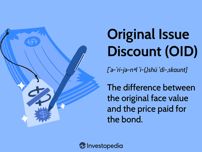

Understanding complex financial concepts such as the Original Issue Discount (OID) is important in finance. OID refers to the difference between a bond's face value and its lower initial price. This concept is crucial for investors and issuers, as it impacts yields, pricing strategies, and even tax implications. This article will focus on OID, how it is calculated, and its application in trading, especially algorithmic trading. We will provide examples of how OID is used in financial markets, showcasing its integration with algorithmic trading strategies. By the end of this article, readers will gain a comprehensive understanding of OID, its significance, and its modern relevance.

## Table of Contents



## Understanding Original Issue Discount (OID)

An Original Issue Discount (OID) arises when a bond or other debt instrument is issued at a price lower than its face value. Essentially, OID represents the difference between the bond's issue price and its face value. This difference captures the interest effectively payable to the investor over the life of the bond, recognized upon its maturity or when it is sold. Therefore, OID acts as a form of additional interest income realized by the investor as the bond matures or is eventually sold at face value.

OID is a crucial factor for both issuers and investors. For issuers, offering bonds at a discount can be a strategic move to attract investors in competitive or volatile market conditions. It essentially allows the issuer to reduce the effective interest cost, while still offering an attractive yield to prospective investors. The offering at a discount requires careful calculation to ensure the bond remains appealing compared to existing market interest rates and other financial instruments.

For investors, the OID affects the yield calculations as it influences the effective interest rate of the bond. The yield to maturity (YTM), which considers the total returns anticipated if the bond is held till it matures, incorporates the OID. This makes it a critical element in assessing the potential return on investment and in determining pricing strategies when comparing different bonds. By analyzing the OID, investors can gauge the profitability of investing in such instruments in light of their overall portfolio strategies.

In summary, an understanding of Original Issue Discount is vital for analyzing the potential returns from bond investments and for issuers to effectively price their offerings in line with market expectations.

## How OID Works

An Original Issue Discount (OID) arises when a bond or other debt instrument is sold at a price lower than its face value. The discount functions as an incentive for investors, granting them additional interest income when the bond matures or if it is sold. This reduction in initial purchase price makes the bond more attractive in competitive markets. 

The difference between the bond's face value and its issue price is not simply a lump sum gain for the investor; rather, it must be amortized over the bond's life. Amortization involves gradually recognizing this discount as interest income as the bond approaches its maturity date. This process aligns with accounting principles and provides a clearer view of an investment's performance over time.

For issuers, OID can be strategically employed to manage interest payments. By issuing bonds at a discount, companies can effectively offer a competitive yield without the immediate burden of high periodic interest payments. Instead, the "imputed interest" is spread across the bond's term, potentially easing cash flow pressures and aligning with the issuer's financial strategy.

The fundamental formula for calculating the OID is:

$$
\text{OID} = \text{Redemption Price} - \text{Issuance Price}
$$

Issuers and financial analysts must carefully consider market interest rates and investor expectations to determine an optimal issuance price. Appropriate pricing ensures attractiveness to investors while maintaining fiscal prudence for the issuer. The strategic issuance of OID bonds often reflects broader financial considerations, including [interest rate](/wiki/interest-rate-trading-strategies) environments and issuer creditworthiness.

## Calculation of OID

Calculating Original Issue Discount (OID) is a straightforward process that involves determining the difference between a debt instrument's redemption value and its issuance price. Specifically, the OID is calculated using the formula:

$$
\text{OID} = \text{Redemption Price} - \text{Issuance Price}
$$

This formula defines the amount by which the price at issuance is lower than the bond's face value, thereby representing the additional earnings for the investor upon maturity. 

In this context, the "Redemption Price" refers to the bond's face value or par value, which is the amount payable to the bondholder upon maturity. In contrast, the "Issuance Price" is the initial price at which the bond is sold to investors, which is below the par value in the case of OID bonds.

Financial practitioners involved in this calculation must take into account factors such as prevailing market interest rates, credit risk of the issuer, and economic conditions. These factors can significantly influence the bond's issuance price. To appropriately determine the issuance price, market yields on comparable debt instruments are often analyzed to align the bond's appeal with investor expectations and competitive market standards.

Moreover, regulatory aspects and accounting practices require that the OID be amortized over the life of the bond. This amortization is typically considered using the effective interest method, which aligns the accounting treatment with the recognition of interest income over time.

The calculation and strategic pricing of OID are critical for both issuers and investors as they influence investment returns and the relative attractiveness of bonds in the competitive bond market.

## Financial Examples of OID

Zero-coupon bonds are a quintessential example of financial instruments characterized by a significant original issue discount (OID). These bonds are issued at a discount to their face value and do not provide periodic interest payments. Instead, they accrue interest over the bond's life, and investors are rewarded with the difference between the purchase price and the face value at maturity. The lack of periodic interest payments makes zero-coupon bonds particularly sensitive to changes in interest rates, offering both opportunities and risks for investors looking to capitalize on interest rate fluctuations.

Corporate bonds also frequently employ OID as a strategy to attract investors, especially in environments marked by volatile interest rates. By issuing bonds at a discount, corporations can make their offerings more appealing, effectively compensating investors for the perceived risk or potential illiquidity. This approach is especially beneficial during periods when traditional interest payments might be financially burdensome for the issuer.

OID bonds are also a strategic component in distressed debt investing. In this context, investors target bonds issued by companies experiencing financial difficulties, often trading well below their face value due to heightened credit risk. The potential for substantial returns exists if the issuing company successfully restructures or emerges from distress. Investors keen on distressed debt may leverage OID bonds to acquire assets at a significant discount, banking on the issuer's recovery prospects to realize capital gains upon redemption or market value appreciation.

In sum, the application of OID in various bond types offers investors unique opportunities to navigate and potentially profit from fluctuating financial landscapes, whether through zero-coupon bonds, corporate bonds, or distressed debt strategies.

## OID in Algorithmic Trading

Algorithmic trading involves using advanced algorithms and high-speed data processing to enhance trading strategies and execution. Incorporating Original Issue Discount (OID) bonds within these strategies can provide significant advantages, especially by leveraging the differences in the purchase price and face value of bonds. These differences, or discounts, allow algorithms to optimize trading decisions based on current market conditions.

Analyzing yield curves and prevailing market interest rates is crucial when working with OID bonds in [algorithmic trading](/wiki/algorithmic-trading). Yield curves offer insights into interest rate expectations, which can help determine the present value of OID bonds. This analysis aids in identifying securities that are undervalued or overvalued, enabling better investment decisions.

Trading algorithms capitalize on pricing inefficiencies by rapidly processing data and executing trades faster than human traders. This speed allows algorithms to exploit short-term variations in asset prices that might occur due to market inconsistencies. With OID bonds, this capability is particularly valuable; algorithms can detect small differences in actual yield versus market yield expectations, suggesting potential profit opportunities. 

Algorithms achieve optimal returns by scanning large datasets for patterns or indications of mispricing in OID bonds. By incorporating [machine learning](/wiki/machine-learning) and [artificial intelligence](/wiki/ai-artificial-intelligence), these systems can improve their predictive models, ensuring more accurate forecasting of bond prices and interest rates over time.

Python code can be utilized to develop these algorithmic strategies:

```python
import numpy as np
import pandas as pd
from sklearn.linear_model import LinearRegression

# Sample function to predict OID bond price changes based on yield curve data
def predict_oid_bond_price(yield_curve_data, bond_data):
    # Prepare the dataset
    X = np.array(yield_curve_data).reshape(-1, 1)  # independent variable
    y = np.array(bond_data)  # dependent variable (bond prices)

    # Linear regression model to capture relationship between yields and bond prices
    model = LinearRegression().fit(X, y)

    # Predicting bond prices using the model
    future_yields = np.array([0.02, 0.025, 0.03]).reshape(-1, 1)  # example future yields
    predicted_prices = model.predict(future_yields)

    return predicted_prices

# Example usage
yield_curve_data = [0.015, 0.02, 0.025, 0.03]
bond_data = [97, 98, 99, 100]
predicted_prices = predict_oid_bond_price(yield_curve_data, bond_data)
print(predicted_prices)
```

Automated trading systems play a pivotal role in maximizing the benefits of OID investments. These systems quickly process large datasets, allowing for precise assessments of market trends and [volatility](/wiki/volatility-trading-strategies). By determining the optimal entry and [exit](/wiki/exit-strategy) points, traders can reduce risk and enhance returns. As technology continues to evolve, the integration of such sophisticated models with OID bonds will likely become an increasingly important aspect of investment strategies.

## Tax Implications of OID

Original Issue Discount (OID) is regarded as taxable interest income, governed by regulations set forth by the Internal Revenue Service (IRS) in the United States. This has significant implications for investors holding such financial instruments.

OID is technically considered a form of interest income, as the discount from the par value is realized over the bond's life. As a result, even though an investor doesn't receive this income in cash each year (except at maturity or sale), the IRS requires the investor to recognize a portion of this discount as income annually. This recognition occurs through a process known as "accretion," where the difference between the bond's issue price and face value is incrementally recognized as income each year.

To facilitate this process, at the end of each tax year, investors will receive IRS Form 1099-OID from the issuing entity or brokerage firm. This form details the amount of OID that should be declared as income for the tax year. The critical aspect of this taxation is that investors may owe taxes on income that they have not physically received, a concept known as "phantom income." 

Therefore, investors should be diligent in understanding these tax implications to optimize their investment strategies effectively. Failure to appropriately account for OID income could result in penalties or interest on under-reported income. Efficient tax planning may include setting aside funds to cover potential tax liabilities or using tax-advantaged accounts where possible. Knowledge of OID taxation allows investors to better align their portfolio management strategies with their tax planning objectives, ensuring compliance and optimizing after-tax returns.

In summary, the handling of OID in the tax framework underscores the importance for investors to integrate these considerations into their broader financial strategy to maintain both regulatory compliance and investment efficacy.

## Conclusion

The Original Issue Discount (OID) is a crucial element in financial markets, influencing investment strategies and yielding opportunities for both investors and issuers. By understanding OID, calculating its value, and incorporating it into algorithmic trading strategies, market participants can make more informed financial decisions. This integration helps unlock potential returns by leveraging market inefficiencies, particularly in how OID bonds are priced and traded.

A comprehensive grasp of OID involves not just its calculation, such as using the formula OID = Redemption Price - Issuance Price, but also understanding its broader implications. For instance, investors benefit from OID by realizing additional interest income, which can be strategically advantageous in certain market conditions. Issuers, on the other hand, can manage interest payments effectively by issuing OID bonds to attract capital at potentially lower costs.

Furthermore, staying informed about the tax implications of OID is essential, as OID is treated as taxable interest income. The Internal Revenue Service (IRS) requires the reporting of OID through specific forms, such as the Form 1099-OID. Ignoring these tax responsibilities can result in liabilities that undermine the financial benefits of OID investments.

Market conditions, including interest rate changes and yield curve dynamics, also play significant roles in the effectiveness of OID strategies. Algorithmic trading can provide a substantial edge by swiftly analyzing these conditions to identify optimal trading opportunities in OID securities. These automated systems can process large datasets to find patterns and pricing inefficiencies, thereby optimizing entry and exit points for investments.

In conclusion, mastering the intricacies of OID and its application in trading strategies offers substantial benefits. Investors and issuers alike can leverage these insights to navigate the financial markets more effectively, enhancing decision-making and maximizing returns. Staying current with tax laws and market trends is imperative for realizing the full potential of OID-related investments.

## References & Further Reading

[1]: Fabozzi, F. J. (2007). ["Fixed Income Analysis"](https://books.google.com/books/about/Fixed_Income_Analysis.html?id=lujLawVLS3YC). Wiley.

[2]: Mishkin, F. S., & Eakins, S. G. (2012). ["Financial Markets and Institutions"](https://books.google.com/books/about/Financial_Markets_and_Institutions_Globa.html?id=PPJFDwAAQBAJ). Pearson.

[3]: ["The Handbook of Fixed Income Securities"](https://www.amazon.com/Handbook-Fixed-Income-Securities-Ninth/dp/1260473899) by Frank J. Fabozzi

[4]: Lopez de Prado, M. (2018). ["Advances in Financial Machine Learning"](https://www.amazon.com/Advances-Financial-Machine-Learning-Marcos/dp/1119482089). Wiley.

[5]: IRS (2023). ["Publication 1212 (2023), Guide to Original Issue Discount (OID) Instruments"](https://www.irs.gov/publications/p1212). Internal Revenue Service.