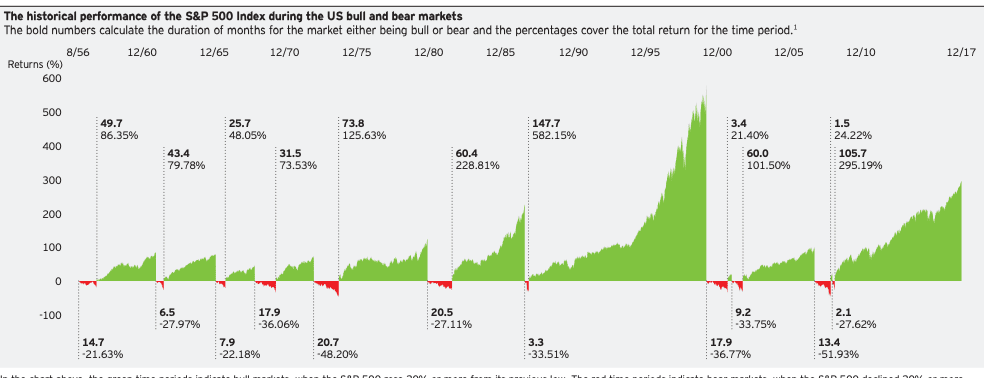

In the world of finance, terms like 'bull market' and 'bear market' are frequently used to describe stock market conditions. Understanding these terms is essential for investors and traders aiming to make informed decisions. A bull market generally indicates a period where stock prices are on the rise, driven by factors like economic growth, investor optimism, and strong market trends. Conversely, a bear market is identified by falling stock prices, often fueled by economic downturns, investor pessimism, and market uncertainties.

This article will provide a comprehensive guide that not only defines bull and bear markets but also explores other essential market terminologies. Additionally, it will examine the role of algorithmic trading (algo trading) in modern financial markets. Algorithmic trading uses advanced computer programs to execute trades automatically, based on pre-established criteria, offering efficiencies and opportunities that manual trading cannot achieve.



Whether you are a seasoned investor or a beginner, this guide aims to provide valuable insights and strategies. It will cover how market conditions influence trading decisions, crucial market terms, and how algorithmic trading is shaping today's financial landscape. By exploring these topics, readers will gain the knowledge necessary to navigate various market conditions and leverage modern trading tools effectively. Let's begin by exploring what exactly bull and bear markets are and how they influence trading decisions.

## Table of Contents

## Defining Bull and Bear Markets

A bull market is a period in the financial markets when the prices of securities are rising or are expected to rise. This market condition is typical for stock markets but can apply to anything that is traded, such as bonds, currencies, and commodities. The usual criteria to define a bull market are prices rising by at least 20%, often after a decline of 20% or more and before a second 20% decline. Bull markets are characterized by widespread optimism, investor confidence, and expectations that strong results will continue for an extended period.

Several factors contribute to the emergence of a bull market. Economic growth is a primary driver, as it leads to increased corporate profits, higher employment rates, and increased consumer spending. Investor confidence also plays a crucial role; when investors anticipate positive future results, they are more likely to buy securities, further driving up prices. Additionally, favorable market trends, such as low interest rates and pro-business policies, can also contribute to the creation of a bull market.

Conversely, a bear market is a condition where securities prices fall 20% or more from recent highs, often amid widespread pessimism and negative investor sentiment. This market environment can lead to a downward spiral where fear of continued losses compels additional selling, further driving down prices. Bear markets often result from a slowing economy, increasing unemployment, declining economic indicators, and shifts in monetary or fiscal policies. 

Indicators that may signal the onset of a bear market include a declining gross domestic product (GDP), rising interest rates, and various economic indicators like decreasing consumer spending and industrial production. These signals often cause investors to move away from equities, leading to sell-offs and declining market prices.

Throughout history, financial markets have experienced several notable bull and bear markets. The bull market of the 1920s, for example, is often cited as one of the most significant in history, characterized by rapid economic growth and a boom in stock prices, which eventually led to the Wall Street Crash of 1929 and the ensuing Great Depression. More recently, the bull market that began in 2009, following the financial crisis of 2007-2008, experienced the longest run in U.S. history, fueled by economic recovery, technological advancements, and low interest rates.

Similarly, history has seen some severe bear markets, such as the one triggered by the dot-com bubble burst in 2000, which saw a substantial decline in technology stocks, and the global financial crisis in 2008, which led to a sharp downturn in global markets due to subprime mortgage failures and the collapse of major financial institutions. Understanding these historical examples provides valuable insights into how bull and bear markets form and the strategies investors may employ to navigate these fluctuating conditions. These lessons also emphasize the importance of market indicators and economic signals when planning investment strategies during different market cycles.

## Essential Market Terminology

In the context of financial markets, understanding various key terminologies is crucial for informed decision-making. Beyond the concepts of bull and bear markets, several other terms significantly influence trading strategies and investment outcomes. 

**Market Correction** refers to a short-term decline in stock market prices, generally considered to be a fall of 10% or more from recent highs. Corrections are a natural part of market cycles and can present opportunities for astute investors to purchase undervalued assets.

A **Recession** is a prolonged period of economic decline, typically recognized as two consecutive quarters of negative GDP growth. Recessions impact market behavior by reducing consumer spending and corporate earnings, often leading to bear market conditions.

In contrast, **Recovery** denotes the phase following a recession, where economic activity resumes its upward trajectory. During this phase, markets often display a return to optimism, with rising asset prices and improving investor confidence.

Understanding **Market Cycles**—which include phases such as expansion, peak, contraction, and trough—helps investors anticipate potential changes in market conditions and adjust their strategies accordingly. Each phase affects asset allocation, risk assessment, and return expectations.

**Long and Short Positions** are fundamental concepts in trading. A long position involves buying an asset with the expectation that its price will rise, while a short position involves selling an asset the trader does not own, anticipating a price decrease. Mastery of these concepts aids in leveraging market trends effectively.

**Volatility** measures the degree of variation in an asset's price over time, with high volatility indicating significant price swings. Understanding volatility is vital for assessing the risk associated with different investment opportunities and developing appropriate hedging strategies.

**Liquidity** refers to how easily an asset can be bought or sold in the market without affecting its price. High liquidity indicates a stable market with many buyers and sellers, allowing for smooth transactions. In contrast, low liquidity can lead to price spikes due to limited trading activity.

For quick reference, a glossary summarizing these essential market terms provides investors with a valuable tool for enhancing their market literacy and refining their investment approaches.

## The Role of Algorithmic Trading in Modern Markets

Algorithmic trading, commonly referred to as algo trading, is a significant component of modern financial markets. At its core, it involves the use of computer programs to execute trades based on a set of predefined criteria. These programs can analyze vast volumes of data at high speeds, making swift decisions that human traders might not accomplish efficiently.

One of the primary advantages of algo trading is its ability to handle large data sets rapidly. Algorithms can scan multiple markets and various financial instruments simultaneously, identifying opportunities or risks within milliseconds. This high-frequency processing capability is essential in today's fast-paced trading environments, where successful trades often hinge on seconds if not milliseconds.

There are several types of [algorithmic trading](/wiki/algorithmic-trading) strategies:

1. **Market Making**: This strategy involves offering buy and sell quotes for a particular stock, aiming to profit from the spread between the bid and ask prices. Algorithms continuously adjust these quotes based on market conditions, maintaining a balance between risk and return.

2. **Trend Following**: As the name implies, this strategy looks to capitalize on the momentum of observed market trends. Algorithms detect price movements and execute trades aligned with these trends, whether bullish or bearish, often without any regard for fundamental analysis.

3. **Statistical Arbitrage**: This involves identifying and exploiting price differentials between related financial instruments. Algorithms use statistical methods to predict price movements and execute trades to profit from these discrepancies before they close.

Algo trading offers numerous benefits. It enhances trading efficiency by executing orders at optimal times and prices, thereby reducing transaction costs. By eliminating the need for human intervention, it reduces emotional bias that might affect decision-making. Furthermore, algo trading can identify and exploit market inefficiencies that might be invisible to human traders.

However, there are challenges and risks associated with algo trading. Technical failures, such as system outages or software bugs, can lead to significant financial losses. Additionally, the speed and [volume](/wiki/volume-trading-strategy) of trades can inadvertently trigger market anomalies, contributing to market [volatility](/wiki/volatility-trading-strategies). Concerns about market manipulation also arise, where algorithms might be used to create false market signals, misleading other market participants.

In conclusion, while algorithmic trading offers significant advantages in terms of speed and efficiency, it demands robust technological infrastructures and ethical considerations to mitigate inherent risks. As financial markets continue evolving, the role of algo trading is likely to expand, requiring ongoing advancements in technology and regulation.

## Impact of Market Trends on Algorithmic Trading

Algorithmic trading, with its reliance on speed and precision, is inherently influenced by market trends, particularly bull and bear markets. Different market conditions necessitate distinct algorithmic strategies to optimize trading outcomes and manage risks effectively.

Bull and bear markets each present unique challenges and opportunities for algorithmic trading. During bull markets, characterized by rising prices and investor optimism, algorithms might focus on [momentum](/wiki/momentum) strategies. These strategies attempt to capitalize on the continuous upward price movements typical in such markets. Conversely, in bear markets, marked by declining prices and investor pessimism, algorithms might employ strategies focused on identifying short-selling opportunities or exploiting market anomalies that arise from heightened volatility and fear.

Algorithms must be adaptive to changing conditions, and one critical component of this adaptability is the ability to handle volatility spikes. Algorithms can incorporate volatility indicators, such as the Average True Range (ATR) or the Volatility Index (VIX), to adjust their trading intensity or shift between strategies dynamically. For instance, an algorithm might reduce its position sizes during high volatility periods to manage risk more effectively.

Incorporating data analytics and [machine learning](/wiki/machine-learning) further refines algorithmic trading strategies. Machine learning models can process vast datasets to detect patterns or signals that are not immediately evident through traditional analysis. For example, employing a supervised learning model can help an algorithm predict price movements by analyzing historical price data, trading volumes, and other relevant market indicators. These models can be trained to recognize the onset of bull or bear trends, allowing algorithms to adjust their trading strategies proactively.

Case studies of algorithmic trading in diverse market conditions underscore the importance of adaptability. During the 2008 financial crisis, for instance, some algorithmic traders successfully identified opportunities amidst the broader market downturn. By leveraging statistical [arbitrage](/wiki/arbitrage) strategies, these algorithms exploited price discrepancies between related assets, achieving positive returns even as overall markets fell sharply.

An illustration of a Python-based algorithm might involve using a simple moving average (SMA) crossover strategy, with modifications based on market conditions:

```python
import numpy as np
import pandas as pd

# Load historical price data
data = pd.read_csv("price_data.csv")
data['SMA50'] = data['Close'].rolling(window=50).mean()
data['SMA200'] = data['Close'].rolling(window=200).mean()

# Define conditions for a bull market and a bear market
data['BullSignal'] = np.where(data['SMA50'] > data['SMA200'], 1, 0)
data['BearSignal'] = np.where(data['SMA50'] < data['SMA200'], -1, 0)

# Implement strategy adjustments based on market condition
data['Position'] = 0
data.loc[data['BullSignal'] == 1, 'Position'] = 1  # Enter position in bull market
data.loc[data['BearSignal'] == -1, 'Position'] = -1  # Enter position in bear market

# Execute strategy and calculate returns
data['MarketReturns'] = data['Close'].pct_change()
data['StrategyReturns'] = data['MarketReturns'] * data['Position'].shift(1)

# Evaluate the performance of the strategy
cumulative_returns = (1 + data['StrategyReturns']).cumprod() - 1
print("Strategy Performance:", cumulative_returns.iloc[-1])
```

This code snippet illustrates a basic response to market trends using SMAs to detect potential bullish or bearish conditions and adjust positions accordingly.

Successful algorithmic trading relies on an intricate balance of robust strategies, adaptive technology, and sophisticated data analytics to navigate the complexities posed by varying market trends. By progressively refining these elements, algorithmic trading continues to evolve as a powerful approach in the modern financial landscape.

## Strategies for Investors and Traders

Navigating bull and bear markets effectively requires a multifaceted strategy that encompasses diversification, risk management, and a deep understanding of market fundamentals. Here, we explore these aspects and introduce how algorithmic tools can enhance trading strategies regardless of market conditions. Additionally, we examine the efficacy of different investment approaches, such as passive and active investing, in various market environments.

### Diversification and Risk Management

Diversification is a critical element of any investment strategy, particularly when oscillating between bull and bear markets. By allocating investments across various asset classes such as stocks, bonds, commodities, and real estate, investors can mitigate risk and reduce the impact of volatility on their portfolio. Consider the correlation between assets: for instance, stocks and bonds often exhibit negative correlation, meaning they tend to move in opposite directions. By balancing these within a portfolio, an investor can potentially buffer against market downturns.

Risk management is equally vital, involving processes such as setting stop-loss orders to limit potential losses and using options to hedge against downside risk. Position sizing, calculated as a percentage of portfolio capital to be risked on each trade, helps control exposure:

$$
\text{Position Size} = \left( \frac{\text{Risk Capital}}{\text{Risk per Trade}} \right)
$$

This formula ensures that no single trade can significantly impact the overall portfolio.

### Leveraging Algorithmic Tools

Algorithmic trading tools provide investors and traders with new ways to refine strategies through data analysis and automated execution. Algorithms can process vast amounts of data rapidly, identifying patterns and executing trades based on predefined parameters, devoid of human emotion, which often leads to biased decisions. Common algorithmic strategies include:

1. **Market Making:** Algorithms quote both buy and sell prices to profit from the spread.
2. **Trend Following:** Algorithms identify and follow trends, entering trades when specific technical indicators are met.
3. **Statistical Arbitrage:** Algorithms exploit pricing inefficiencies between correlated securities.

These strategies can be tailored to perform optimally in varying market conditions, adjusting to the intricacies of both bull and bear markets.

### Investment Approaches: Passive vs. Active

Within the investment landscape, passive and active approaches offer distinct advantages and challenges, depending on the market environment:

- **Passive Investing:** This strategy involves holding a diversified portfolio designed to track a market index, such as the S&P 500. It typically incurs lower fees and, over the long term, often outperforms many actively managed funds, especially in bull markets where broad growth can be captured by index funds.

- **Active Investing:** Active investors actively select securities to outperform the market. While potentially lucrative in bear markets where skilled managers can mitigate losses by identifying undervalued securities, this approach involves higher fees and risk, as performance is reliant on the manager's expertise.

In conclusion, successful navigation through bull and bear markets depends on a blend of strategic diversification, rigorous risk management, and the judicious use of algorithmic trading tools. By choosing the appropriate investment approach tailored to both personal risk tolerance and market conditions, investors can enhance their potential for favorable returns.

## Conclusion

Understanding bull and bear markets is fundamental for anyone engaged in investing or trading. These terms are not merely labels; they reflect the underlying economic indicators and investor sentiments that influence market dynamics. Recognizing whether the market is experiencing a bullish or bearish phase provides critical insights into appropriate strategies for engaging with financial assets. Moreover, it allows investors to set realistic expectations for market returns and adjust their portfolios accordingly.

Familiarity with market terminology, like 'market correction', 'recession', and 'recovery', enhances an investor's ability to interpret economic signals and better anticipate market movements. Key terms such as volatility and [liquidity](/wiki/liquidity-risk-premium) are crucial for assessing risk and potential reward in various trading scenarios. A clear understanding of these concepts forms a foundation for making informed decisions, thereby minimizing unnecessary exposure to risk.

Algorithmic trading has transformed how trades are executed, offering speed and precision that are unattainable through manual trading. These computer-driven strategies operate on predefined criteria, enabling rapid responses to market changes and helping exploit opportunities that manual trading might miss. Keeping pace with technological advancements in algorithmic trading is imperative for modern investors seeking to capitalize on sophisticated market strategies. These technologies offer increased efficiency and reduced emotional biases, but they also demand a nuanced understanding of their intricacies and potential pitfalls.

As the financial landscape continues to evolve, a commitment to lifelong learning and adaptation becomes essential. Investors must stay informed about new developments in market trends, economic conditions, and technological innovations to remain competitive. This drive for continuous education is not just about acquiring information; it is about applying that knowledge strategically to navigate complex market environments successfully.

In summary, a thorough grasp of market dynamics, pertinent terminology, and algorithmic trading's impact can significantly enhance an investor's ability to make judicious investment choices. Through knowledge and strategy, one can successfully traverse any market condition, achieving long-term financial objectives.

## References & Further Reading

[1]: ["Advances in Financial Machine Learning"](https://www.amazon.com/Advances-Financial-Machine-Learning-Marcos/dp/1119482089) by Marcos Lopez de Prado

[2]: ["Evidence-Based Technical Analysis: Applying the Scientific Method and Statistical Inference to Trading Signals"](https://www.amazon.com/Evidence-Based-Technical-Analysis-Scientific-Statistical/dp/0470008741) by David Aronson

[3]: ["Machine Learning for Algorithmic Trading"](https://github.com/PacktPublishing/Machine-Learning-for-Algorithmic-Trading-Second-Edition) by Stefan Jansen

[4]: ["Quantitative Trading: How to Build Your Own Algorithmic Trading Business"](https://www.amazon.com/Quantitative-Trading-Build-Algorithmic-Business/dp/1119800064) by Ernest P. Chan

[5]: Bergstra, J., Bardenet, R., Bengio, Y., & Kégl, B. (2011). ["Algorithms for Hyper-Parameter Optimization."](https://dl.acm.org/doi/10.5555/2986459.2986743) Advances in Neural Information Processing Systems 24.