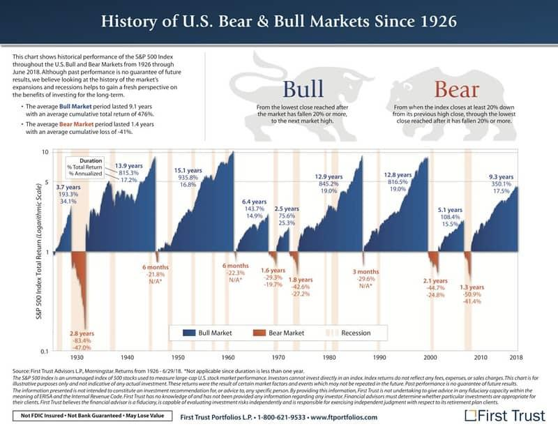

## Table of Contents

## What are bull and bear markets?

A bull market is when the stock market is doing well. Prices of stocks go up, and people feel confident about investing. This usually happens when the economy is strong, and people are making more money. During a bull market, you might hear people talking about how great it is to buy stocks because they think the prices will keep going up.

A bear market is the opposite. It's when the stock market is not doing well, and prices of stocks are going down. People start to feel worried and might sell their stocks because they think the prices will keep falling. Bear markets often happen when the economy is struggling, and people are not spending as much money. During these times, it can be hard to feel good about investing.

## How did the terms 'bull' and 'bear' originate in the stock market?

The terms 'bull' and 'bear' come from the way these animals attack. A bull attacks by thrusting its horns up into the air. This movement is like how stock prices go up in a bull market. People started using 'bull' to describe a strong, rising market because it reminded them of a bull's upward motion.

On the other hand, a bear swipes its paws downward when it attacks. This downward motion is similar to how stock prices fall in a bear market. So, people began calling a falling market a 'bear market' because it looked like a bear's way of attacking. These terms have been used for a long time to describe the ups and downs of the stock market.

## What are the key characteristics of a bull market?

A bull market is when the stock market is doing really well. Prices of stocks go up, and people feel good about buying them. They think the prices will keep going up, so more people want to invest. This makes the market even stronger. Companies also do well during this time because they can sell more products and make more money. When companies do well, their stock prices go up even more.

Another big part of a bull market is that the economy is usually strong. People have jobs and are making money, so they spend more. This spending helps businesses grow and makes the market even better. During a bull market, you'll hear people talking about how great it is to invest in stocks. They feel confident and excited about the future of the market.

## What are the key characteristics of a bear market?

A bear market is when the stock market is not doing well. Prices of stocks go down, and people start to feel worried. They think the prices will keep falling, so they sell their stocks. This makes the market even weaker. Companies might struggle during this time because people are not buying as much. When companies don't do well, their stock prices go down even more.

The economy is usually struggling during a bear market. People might lose their jobs or make less money, so they spend less. This can make businesses do worse and make the market even worse. During a bear market, you'll hear people talking about how risky it is to invest in stocks. They feel unsure and worried about the future of the market.

## What historical events have triggered bull markets?

One big event that started a bull market was the end of World War II. After the war ended in 1945, the economy started to grow a lot. People were happy the war was over, and they started spending more money. Companies made more products, and more people got jobs. This made the stock market go up a lot, and it lasted for many years. People called this time the "Post-War Boom."

Another event that caused a bull market was the dot-com boom in the late 1990s. During this time, a lot of new internet companies started, and people got really excited about them. They thought these companies would make a lot of money, so they bought their stocks. This made the stock market go up a lot. The excitement lasted until about 2000, and people remember this time as the "dot-com bubble."

## What historical events have triggered bear markets?

One big event that started a bear market was the Great Depression in 1929. It all started with the stock market crash that year, which people call "Black Tuesday." After the crash, stock prices kept going down for a long time. A lot of people lost their jobs and money. They couldn't buy things, so companies did badly too. This made the stock market even worse, and the bear market lasted for many years.

Another event that caused a bear market was the 2008 financial crisis. It started because a lot of banks made risky loans that people couldn't pay back. When the loans went bad, the banks lost a lot of money. This made people scared, and they started selling their stocks. Stock prices went down a lot, and it took a long time for the market to get better. People remember this time as a very hard bear market.

## How do bull and bear markets impact the economy?

Bull markets are good for the economy. When the stock market is doing well, companies can sell more products and make more money. This makes them want to grow and hire more people. When people have jobs, they spend more money, which helps the economy grow even more. During a bull market, people feel confident and happy about their money. They might buy new things like houses or cars, which helps businesses even more. So, a bull market makes the whole economy stronger and better.

Bear markets are bad for the economy. When the stock market is not doing well, companies might struggle to sell their products and make money. They might have to cut back and lay off workers. When people lose their jobs or worry about their money, they spend less. This can make the economy weaker and slower. During a bear market, people feel scared and unsure about the future. They might stop buying big things like houses or cars, which makes it even harder for businesses. So, a bear market can make the whole economy struggle.

## What are the psychological factors influencing bull and bear markets?

Bull markets are influenced by positive feelings and confidence. When people see the stock market going up, they feel good about their money and the future. This makes them want to buy more stocks because they think the prices will keep going up. This confidence can spread from person to person, making more people want to invest. When everyone feels good, they spend more money on things like houses and cars, which helps the economy grow even more. So, the good feelings in a bull market can make the market even stronger.

Bear markets are influenced by fear and worry. When people see the stock market going down, they start to feel scared about losing their money. This makes them want to sell their stocks because they think the prices will keep falling. This fear can also spread from person to person, making more people want to sell. When everyone feels worried, they spend less money on things like houses and cars, which can make the economy weaker. So, the bad feelings in a bear market can make the market even worse.

## How can investors identify the beginning of a bull or bear market?

Investors can tell a bull market is starting when they see stock prices going up for a while. Usually, this happens when the economy is getting better and more people are buying things. Companies start doing well because they sell more products, and this makes their stock prices go up. Another sign is when people start feeling more confident about their money and the future. They might start buying more stocks because they think the prices will keep going up. Watching these signs can help investors know when a bull market is beginning.

On the other hand, investors can spot the start of a bear market when they see stock prices going down for a while. This often happens when the economy is struggling, and people are not buying as much. Companies might have a hard time selling their products, and this makes their stock prices go down. Another big sign is when people start feeling scared and worried about their money. They might start selling their stocks because they think the prices will keep falling. By keeping an eye on these signs, investors can figure out when a bear market is starting.

## What strategies should investors use during a bull market?

During a bull market, investors should think about buying stocks. When the market is doing well, stock prices go up, and companies make more money. So, it's a good time to invest in stocks that you think will keep growing. You might want to look for companies that are doing well and have a strong future. This way, you can make more money as the market keeps going up. Also, it's a good idea to keep some of your money in safe places like savings accounts or bonds, just in case the market changes.

Another good strategy is to keep an eye on the market and not get too excited. It's easy to feel happy and confident when everything is going well, but you should still be careful. Don't put all your money into one stock or one type of investment. Instead, spread your money around different stocks and other investments. This way, if one thing doesn't do well, you won't lose all your money. And remember, even in a bull market, it's smart to have a plan for what you'll do if the market starts to go down.

## What strategies should investors use during a bear market?

During a bear market, it's important for investors to be careful and not panic. When stock prices are going down, it can be scary, but selling all your stocks right away might not be the best idea. Instead, think about keeping some of your money in safe places like savings accounts or bonds. These won't go up and down as much as stocks, so they can help protect your money. Also, if you have some extra money, you might want to buy stocks that are now cheaper because of the bear market. This can be a good chance to buy good companies at lower prices.

Another good strategy is to keep a long-term view. Bear markets don't last forever, and the market will start to go up again. So, don't make quick decisions based on fear. Instead, think about your goals for the future and stick to your plan. It's also a good idea to spread your money around different types of investments. This way, if one thing does badly, you won't lose all your money. Remember, even in a bear market, it's important to stay calm and think about what you want to achieve in the long run.

## How have technological advancements affected the dynamics of bull and bear markets?

Technological advancements have made a big difference in how bull and bear markets work. With the internet and computers, people can now get information about the stock market much faster. They can see what's happening with stock prices and the economy in real-time. This means that bull markets can start and grow faster because good news spreads quickly. People can buy stocks more easily online, which can make the market go up even more. But it also means that bad news can spread fast too, making bear markets start and get worse quicker.

Also, technology has changed how people invest. Now, there are computer programs and apps that can help people make decisions about buying and selling stocks. These tools can look at a lot of data and find patterns that might be hard for people to see. This can help investors make better choices during both bull and bear markets. But it also means that the market can change very quickly because a lot of people are using the same technology. So, technology has made bull and bear markets more fast-paced and sometimes more unpredictable.

## What are the strategies for investors and traders?

Navigating bull and bear markets effectively requires a multifaceted strategy that encompasses diversification, risk management, and a deep understanding of market fundamentals. Here, we explore these aspects and introduce how algorithmic tools can enhance trading strategies regardless of market conditions. Additionally, we examine the efficacy of different investment approaches, such as passive and active investing, in various market environments.

### Diversification and Risk Management

Diversification is a critical element of any investment strategy, particularly when oscillating between bull and bear markets. By allocating investments across various asset classes such as stocks, bonds, commodities, and real estate, investors can mitigate risk and reduce the impact of [volatility](/wiki/volatility-trading-strategies) on their portfolio. Consider the correlation between assets: for instance, stocks and bonds often exhibit negative correlation, meaning they tend to move in opposite directions. By balancing these within a portfolio, an investor can potentially buffer against market downturns.

Risk management is equally vital, involving processes such as setting stop-loss orders to limit potential losses and using options to hedge against downside risk. Position sizing, calculated as a percentage of portfolio capital to be risked on each trade, helps control exposure:

$$
\text{Position Size} = \left( \frac{\text{Risk Capital}}{\text{Risk per Trade}} \right)
$$

This formula ensures that no single trade can significantly impact the overall portfolio.

### Leveraging Algorithmic Tools

Algorithmic trading tools provide investors and traders with new ways to refine strategies through data analysis and automated execution. Algorithms can process vast amounts of data rapidly, identifying patterns and executing trades based on predefined parameters, devoid of human emotion, which often leads to biased decisions. Common algorithmic strategies include:

1. **Market Making:** Algorithms quote both buy and sell prices to profit from the spread.
2. **Trend Following:** Algorithms identify and follow trends, entering trades when specific technical indicators are met.
3. **Statistical Arbitrage:** Algorithms exploit pricing inefficiencies between correlated securities.

These strategies can be tailored to perform optimally in varying market conditions, adjusting to the intricacies of both bull and bear markets.

### Investment Approaches: Passive vs. Active

Within the investment landscape, passive and active approaches offer distinct advantages and challenges, depending on the market environment:

- **Passive Investing:** This strategy involves holding a diversified portfolio designed to track a market index, such as the S&P 500. It typically incurs lower fees and, over the long term, often outperforms many actively managed funds, especially in bull markets where broad growth can be captured by index funds.

- **Active Investing:** Active investors actively select securities to outperform the market. While potentially lucrative in bear markets where skilled managers can mitigate losses by identifying undervalued securities, this approach involves higher fees and risk, as performance is reliant on the manager's expertise.

In conclusion, successful navigation through bull and bear markets depends on a blend of strategic diversification, rigorous risk management, and the judicious use of [algorithmic trading](/wiki/algorithmic-trading) tools. By choosing the appropriate investment approach tailored to both personal risk tolerance and market conditions, investors can enhance their potential for favorable returns.

## References & Further Reading

[1]: ["Advances in Financial Machine Learning"](https://www.amazon.com/Advances-Financial-Machine-Learning-Marcos/dp/1119482089) by Marcos Lopez de Prado

[2]: ["Evidence-Based Technical Analysis: Applying the Scientific Method and Statistical Inference to Trading Signals"](https://www.amazon.com/Evidence-Based-Technical-Analysis-Scientific-Statistical/dp/0470008741) by David Aronson

[3]: ["Machine Learning for Algorithmic Trading"](https://github.com/PacktPublishing/Machine-Learning-for-Algorithmic-Trading-Second-Edition) by Stefan Jansen

[4]: ["Quantitative Trading: How to Build Your Own Algorithmic Trading Business"](https://www.amazon.com/Quantitative-Trading-Build-Algorithmic-Business/dp/1119800064) by Ernest P. Chan

[5]: Bergstra, J., Bardenet, R., Bengio, Y., & Kégl, B. (2011). ["Algorithms for Hyper-Parameter Optimization."](https://dl.acm.org/doi/10.5555/2986459.2986743) Advances in Neural Information Processing Systems 24.