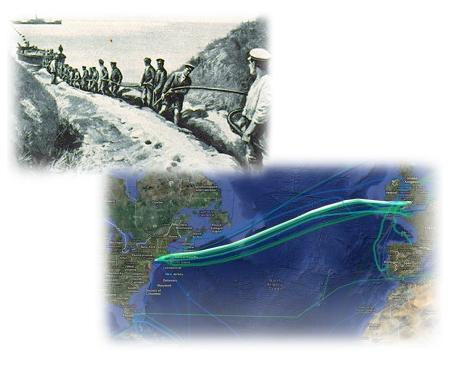

## Table of Contents

## What is the GBP/USD currency pair?

The GBP/USD currency pair is the exchange rate between the British pound (GBP) and the United States dollar (USD). It shows how many US dollars you need to buy one British pound. This pair is also known as "Cable" because of the old telegraph cable that was used to send exchange rates between the two countries.

People who trade currencies, called forex traders, watch the GBP/USD pair closely. It's one of the most traded currency pairs in the world. The rate can change because of things like economic news, interest rates, and political events in the UK and the US. If the GBP/USD rate goes up, it means the pound is getting stronger compared to the dollar. If it goes down, the pound is getting weaker.

## What is the nickname 'Cable' used for?

The nickname 'Cable' is used for the GBP/USD currency pair. This nickname comes from a long time ago when people used a special underwater cable to send messages about money between the UK and the US. This cable was important because it helped people know how much British pounds were worth in US dollars.

Today, even though we don't use that old cable anymore, people still call the GBP/USD pair 'Cable'. It's a reminder of how this exchange rate has been important for a long time. When someone talks about 'Cable' in the money world, they are talking about the rate between the British pound and the US dollar.

## When did the nickname 'Cable' for GBP/USD originate?

The nickname 'Cable' for the GBP/USD currency pair started a long time ago, back in the 1800s. It came from the first transatlantic telegraph cable that was laid between the UK and the US. This cable was used to send messages about money and exchange rates quickly between the two countries. Before this cable, it took a long time to get this information, but the cable made it much faster.

Because of this important cable, people started calling the GBP/USD exchange rate 'Cable'. Even though we don't use that old cable anymore, the name stuck. Today, when people in the money world talk about 'Cable', they are talking about how many US dollars you need to buy one British pound. It's a reminder of how this exchange rate has been important for a long time.

## Why was the transatlantic cable significant for GBP/USD trading?

The transatlantic cable was very important for GBP/USD trading because it made it much faster to share information about money between the UK and the US. Before the cable, it could take weeks to find out the exchange rate because people had to send messages by ship. But with the cable, news about exchange rates could travel quickly under the ocean, making trading easier and more accurate.

This fast communication helped make the GBP/USD pair one of the most important and watched currency pairs in the world. Traders could now react quickly to changes in the exchange rate, which helped them make better decisions about buying and selling pounds and dollars. The nickname 'Cable' for the GBP/USD pair reminds us of how this technology changed the way people trade currencies.

## How did the transatlantic cable impact currency exchange between the UK and the US?

The transatlantic cable made a big difference in how people exchanged money between the UK and the US. Before the cable, it took a long time to find out how many US dollars you could get for a British pound. People had to send messages by ship, which could take weeks. But when the cable was put in place, it let people send messages about money quickly under the ocean. This meant that traders could know the exchange rate almost right away.

Because of the cable, trading between the British pound and the US dollar became much easier and more accurate. Traders could react quickly to changes in the exchange rate, which helped them make better decisions about when to buy or sell. This fast communication made the GBP/USD pair one of the most important currency pairs to watch. The cable changed the way people traded currencies and made the world of money more connected.

## What were the technological advancements that led to the nickname 'Cable'?

The nickname 'Cable' for the GBP/USD currency pair came from a big technological advancement in the 1800s. People laid a special underwater cable between the UK and the US. This cable was used to send messages about money and exchange rates quickly. Before this cable, it took a long time to get this information because messages had to be sent by ship.

With the new cable, news about exchange rates could travel fast under the ocean. This made trading between the British pound and the US dollar much easier and more accurate. Traders could now react quickly to changes in the exchange rate, which helped them make better decisions about buying and selling. The nickname 'Cable' reminds us of how this technology changed the way people trade currencies.

## Can you describe the historical context of the GBP/USD trading during the time the nickname was coined?

During the time the nickname 'Cable' was coined, the world was changing a lot. It was the 1800s, and people were starting to use new technology to make life easier. One big change was the transatlantic cable, which was laid under the ocean to connect the UK and the US. This cable let people send messages about money and exchange rates much faster than before. Before the cable, it could take weeks to find out how many US dollars you could get for a British pound because messages had to be sent by ship. But with the cable, traders could know the exchange rate almost right away.

This fast communication made trading between the British pound and the US dollar much easier and more accurate. Traders could react quickly to changes in the exchange rate, which helped them make better decisions about when to buy or sell. The GBP/USD pair became one of the most important currency pairs to watch. The nickname 'Cable' came from this new technology and reminded people of how it changed the way they traded currencies. It was a time when the world was getting more connected, and the GBP/USD pair was at the center of this change.

## How has the usage of the term 'Cable' evolved over time in financial markets?

When the term 'Cable' was first used, it was all about the new transatlantic cable that made it quick to send messages about money between the UK and the US. This was a big deal in the 1800s because before the cable, it took a long time to know how many US dollars you could get for a British pound. The cable made trading easier and faster, so people started calling the GBP/USD exchange rate 'Cable'. It was a way to remember how this new technology changed the way people traded currencies.

Over time, even though we don't use that old cable anymore, the name 'Cable' has stuck around in the financial world. Today, when people in the money markets talk about 'Cable', they are still talking about the exchange rate between the British pound and the US dollar. The term has become a part of the language that traders use every day. It's a reminder of how important and watched the GBP/USD pair is, and how technology has always played a big role in making trading better and faster.

## What other nicknames or slang terms are used in forex trading for major currency pairs?

In [forex](/wiki/forex-system) trading, people use a lot of nicknames and slang terms for major currency pairs. One common one is 'Fiber' for the EUR/USD pair. This nickname comes from the fiber-optic cables that are used to send information quickly between Europe and the US. Another nickname is 'Gopher' for the USD/CAD pair, which stands for 'Go for Canadian dollars'. Traders use these nicknames to talk about the exchange rates in a quick and easy way.

Another popular nickname is 'Kiwi' for the NZD/USD pair. This comes from the national bird of New Zealand, which is also called a kiwi. The AUD/USD pair is often called 'Aussie', which is short for Australian dollar. These nicknames help traders remember which currencies they are talking about and make conversations about trading more fun and interesting.

There are also other nicknames like 'Swissie' for the USD/CHF pair, which stands for Swiss franc. And 'Loonie' is used for the USD/CAD pair, named after the bird on the Canadian dollar coin. These slang terms are part of the everyday language in the forex world and show how traders use fun and creative ways to talk about their work.

## How does the nickname 'Cable' reflect the historical trading relationship between the UK and the US?

The nickname 'Cable' for the GBP/USD currency pair shows how important the trading relationship between the UK and the US has been for a long time. Back in the 1800s, people used a special underwater cable to send messages about money quickly between these two countries. Before this cable, it took a long time to find out how many US dollars you could get for a British pound because messages had to be sent by ship. The cable made trading much easier and faster, so people started calling the GBP/USD exchange rate 'Cable'. This nickname reminds us of how this new technology changed the way people traded currencies.

Today, even though we don't use that old cable anymore, the name 'Cable' is still used in the financial world. It shows how the GBP/USD pair has always been a big deal in trading. The nickname is a reminder of the strong and important connection between the UK and the US in the world of money. It's a part of the everyday language that traders use and shows how technology has always played a big role in making trading better and faster.

## What are the current trading volumes and significance of the GBP/USD pair in the global forex market?

The GBP/USD pair is one of the most traded currency pairs in the global forex market. Every day, a lot of money changes hands when people buy and sell British pounds and US dollars. The exact amount can change, but it's usually one of the top three pairs in terms of trading [volume](/wiki/volume-trading-strategy). This means that many traders and big banks are always watching and trading this pair. The high trading volume makes it easier to buy and sell GBP/USD because there are always people ready to trade.

The GBP/USD pair is very important because it shows how strong the British pound is compared to the US dollar. This exchange rate can affect a lot of things, like how much it costs to buy things from the UK or the US, and how much money people make when they trade. Economic news, interest rates, and political events in both countries can make the GBP/USD rate go up or down. Because it's so important, many people pay close attention to what's happening with 'Cable'.

## How do modern communication technologies compare to the transatlantic cable in terms of their impact on forex trading?

Modern communication technologies have made forex trading a lot faster and easier compared to the old transatlantic cable. Back then, the cable was a big deal because it let people send messages about money quickly between the UK and the US. Now, with the internet and smartphones, traders can get information about exchange rates in just a few seconds. They can use apps and online platforms to trade anytime and anywhere. This means that they can react to changes in the market much faster than before.

These new technologies have also made the forex market more connected. Traders from all over the world can talk to each other and share information easily. This helps them make better decisions about buying and selling currencies. The old transatlantic cable was important because it started this kind of fast communication, but today's technologies have taken it to a whole new level. They have made the world of forex trading more open and accessible to everyone.

## References & Further Reading

[1]: Bergstra, J., Bardenet, R., Bengio, Y., & Kégl, B. (2011). ["Algorithms for Hyper-Parameter Optimization."](https://dl.acm.org/doi/10.5555/2986459.2986743) Advances in Neural Information Processing Systems 24.

[2]: ["Advances in Financial Machine Learning"](https://www.amazon.com/Advances-Financial-Machine-Learning-Marcos/dp/1119482089) by Marcos Lopez de Prado

[3]: ["Evidence-Based Technical Analysis: Applying the Scientific Method and Statistical Inference to Trading Signals"](https://www.amazon.com/Evidence-Based-Technical-Analysis-Scientific-Statistical/dp/0470008741) by David Aronson

[4]: ["Machine Learning for Algorithmic Trading"](https://github.com/stefan-jansen/machine-learning-for-trading) by Stefan Jansen

[5]: ["Quantitative Trading: How to Build Your Own Algorithmic Trading Business"](https://www.amazon.com/Quantitative-Trading-Build-Algorithmic-Business/dp/1119800064) by Ernest P. Chan