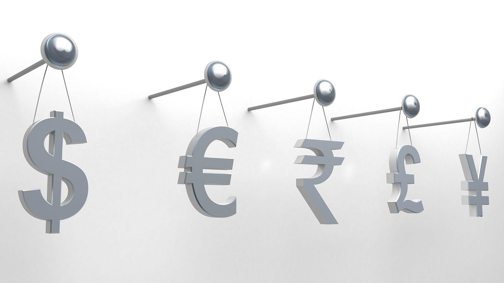

## Table of Contents

## What is a currency symbol?

A currency symbol is a special sign used to show the type of money being talked about. For example, the dollar sign ($) is used for the US dollar, and the euro sign (€) is used for the euro. These symbols help people quickly understand which currency is being used, making it easier to read prices and amounts.

Currency symbols are important in everyday life, especially when shopping, traveling, or doing business. They are used in stores, on price tags, in banks, and on computer screens. By using these symbols, it's easier for everyone to know the value of things in different countries without having to write out the full name of the currency.

## Why do we use currency symbols?

We use currency symbols to make it easy to see what kind of money we are talking about. Instead of writing out the whole name of the money, like "US dollars" or "euros," we can just use a simple sign like "$" or "€." This makes it quicker and easier for everyone to understand prices and amounts, especially when we are shopping or doing business.

Currency symbols are also important when we travel or do business with people from other countries. They help us know the value of things in different places without getting confused. For example, if you see a price with a "¥" symbol, you know it's in Japanese yen. This way, we can quickly understand and compare prices from around the world.

## What are the most common currency symbols used today?

The most common currency symbols used today are the dollar sign ($), the euro sign (€), the pound sign (£), the yen sign (¥), and the Chinese yuan sign (¥). The dollar sign is used for the US dollar and many other countries' dollars, like Canada and Australia. The euro sign is used by countries in the European Union that use the euro. The pound sign is for the British pound, and the yen sign is for the Japanese yen. The Chinese yuan also uses a similar symbol to the yen.

These symbols help people quickly understand what kind of money is being used. For example, if you see a price with a "$" sign, you know it's in dollars. If you see a "€" sign, it's in euros. This makes it easier to read prices and amounts, especially when shopping or traveling. Using these symbols saves time and helps avoid confusion when dealing with different currencies.

## How did the dollar sign ($) originate?

The dollar sign ($) has a few different stories about where it came from. One popular story says it started with the Spanish "Peso de Ocho," also called "Pieces of Eight." This coin had the letters "P" and "S" on it, which some people think turned into the "$" sign over time. Another story says the "$" sign comes from the letters "U" and "S" written together, standing for "United States."

No one knows for sure which story is right. But we do know that the dollar sign started being used a lot in the late 1700s and early 1800s. It became the official symbol for the US dollar in the 19th century. Today, the "$" sign is used not just for the US dollar but also for many other countries' dollars, like Canada and Australia.

## What is the history behind the euro symbol (€)?

The euro symbol (€) was created when the European Union decided to have a common currency. This happened in the late 1990s. A design competition was held to find the best symbol for the new currency. The winning design came from a graphic designer named Alain Billiet. His design was chosen because it looked simple and modern, and it was easy to recognize.

The euro symbol is based on the Greek letter epsilon (Є). This letter was chosen because it is the first letter of the word "Europe" in the Greek alphabet. The two parallel lines through the symbol represent stability. The euro officially started being used on January 1, 1999, and the symbol became a common sight in countries that use the euro. Today, the euro is used by millions of people across Europe, making it easier for them to buy things and travel between countries.

## Can you explain the origin of the British pound symbol (£)?

The British pound symbol (£) has a long history that goes back to the Middle Ages. The symbol comes from the Latin word "libra," which means "pound." In the old Roman system of weights, "libra" was used to measure weight, and it is where we get the word "pound" from. The symbol "£" is a fancy letter "L" that stands for "libra."

Over time, the symbol changed a bit but kept its main shape. By the late 1700s, the "£" symbol started to look more like what we see today. It became the official symbol for the British pound, which is the money used in the United Kingdom. Today, when you see the "£" symbol, you know it means British pounds, and it helps people quickly understand prices and amounts in the UK.

## What is the story behind the Japanese yen symbol (¥)?

The Japanese yen symbol (¥) has an interesting story. It was first used in the late 1800s when Japan started using the yen as its official money. The symbol comes from the Chinese character for "yen," which is written as "圓" in Japanese. This character means "round," which is a reference to the old round coins that were used.

The yen symbol (¥) was made simpler over time to make it easier to write and recognize. The two lines that go through the symbol are like the two strokes in the Chinese character "圓." Today, the yen symbol is used all over Japan to show prices and amounts. It helps people quickly understand that the money being talked about is in yen, making it easier to shop and do business.

## How have currency symbols evolved over time?

Currency symbols have changed a lot over time. In the old days, people used different signs and marks to show what kind of money they were using. These early symbols often came from letters or words in different languages. For example, the British pound symbol (£) comes from the Latin word "libra," which means "pound." As time went on, these symbols got simpler and easier to recognize. People started using them more often in everyday life, like on price tags and in shops.

Today, currency symbols are used all over the world to help people quickly understand what kind of money is being talked about. They have become a big part of how we buy things and do business. For example, the dollar sign ($) is used for the US dollar and many other countries' dollars. The euro sign (€) is used by countries in the European Union. These symbols help make things easier when we travel or shop in different places. They save time and help avoid confusion by showing the type of money at a glance.

## Are there any lesser-known currency symbols with interesting origins?

The Indian rupee symbol (₹) is a lesser-known currency symbol with a cool story. It was made in 2010 after a big contest where lots of people sent in their ideas. The winning design came from D. Udaya Kumar, a man who teaches at a college. The symbol looks like the letter "R" with two lines going through it. The "R" stands for "rupee," and the lines are like the "=" sign in the old Indian number system. This symbol helps people know they are looking at Indian money.

Another interesting symbol is the Russian ruble sign (₽). It was made official in 2013, but people had been using different signs for the ruble for a long time. The new symbol looks like the letter "P" with a short line going through it. The "P" comes from the first letter of "ruble" in the Russian alphabet. This symbol makes it easy for people to see that the money is in rubles, which is what they use in Russia.

## How do cultural and historical factors influence the design of currency symbols?

Cultural and historical factors play a big role in how currency symbols are designed. Each symbol often comes from the language or writing system of the country it represents. For example, the British pound symbol (£) comes from the Latin word "libra," which shows how old Roman ways of measuring things influenced the symbol. The Japanese yen symbol (¥) comes from the Chinese character for "yen," showing how Japan's history with China affected its money sign. These symbols are not just random marks; they tell a story about where the money comes from and the people who use it.

History also shapes how currency symbols look over time. As countries change and grow, their money symbols can change too. The Indian rupee symbol (₹) is a good example. It was made in 2010 to show India's place in the world today, but it also uses old Indian number signs to connect with the country's past. The same goes for the Russian ruble sign (₽), which uses the first letter of "ruble" in the Russian alphabet. These symbols are a mix of old and new, showing how a country's history and culture come together in something as simple as a money sign.

## What role do international standards play in the use and recognition of currency symbols?

International standards help make sure that currency symbols are used and recognized the same way all over the world. Groups like the International Organization for Standardization (ISO) set rules for how currency symbols should look and be used. These rules help avoid confusion when people from different countries are doing business or traveling. For example, the ISO says that the dollar sign ($) should always be used for the US dollar, and the euro sign (€) should be used for the euro. This makes it easier for everyone to understand prices and amounts no matter where they are.

These standards also help with things like computer systems and money exchanges. When everyone uses the same symbols in the same way, it's easier for computers to read and understand money amounts. This is important for banks and businesses that work with money from different countries. By following these international standards, people can trust that the currency symbols they see mean the same thing everywhere, making it simpler to buy things, travel, and do business around the world.

## How might future technological advancements affect the development of new currency symbols?

Future technology might change how we make and use new currency symbols. As more people use digital money and online shopping, we might see new symbols that work better on computer screens and phones. These symbols could be easier to read on small screens or even use special technology like emojis or animations to make them stand out. If we start using more digital money, like cryptocurrencies, we might need new symbols that show these new types of money in a clear way.

Also, technology could help us make new symbols faster and easier. With computers and design software, people can try out lots of different ideas quickly. This means we might see more contests and ideas from all over the world, just like with the Indian rupee symbol. As technology keeps changing, the way we think about and use money will change too, and that could lead to new and different currency symbols that fit with the future.

## References & Further Reading

Davies, G. (2002). *A History of Money: From Ancient Times to the Present Day*. University of Wales Press.  
This book provides a comprehensive examination of the development of money throughout human history, covering its evolution from barter systems to modern digital currencies. It offers insights into how money has shaped economic and social systems over the centuries.

Prasad, E. S. (2014). *The Dollar Trap: How the U.S. Dollar Tightened Its Grip on Global Finance*. Princeton University Press.  
Prasad explores the dominance of the U.S. dollar in global finance, particularly following the 2008 financial crisis. The book analyzes the economic and geopolitical factors contributing to the dollar's enduring influence as the world's primary reserve currency.

Popper, N. (2015). *Digital Gold: Bitcoin and the Inside Story*. Harper.  
This work dives into the origins and rise of Bitcoin, offering an insightful narrative of the [cryptocurrency](/wiki/cryptocurrency) movement. Popper discusses the technology's potential to revolutionize financial systems and the challenges associated with digital currency adoption.

Chan, E. P. *Algorithmic Trading: Winning Strategies and Their Rationale*.  
Chan's work focuses on [algorithmic trading](/wiki/algorithmic-trading) strategies and the underlying logic that makes them successful. It provides a detailed guide to designing and implementing algorithmic trading systems, highlighting key considerations for trading currencies and other financial instruments.

Kroszner, R. S., & Obstfeld, M. (2014). *Lessons from the Financial Crisis*. Federal Reserve Bank of Kansas City Symposium.  
This publication presents analyses and retrospectives on the 2008 financial crisis. Kroszner and Obstfeld discuss the crisis's impact on global markets, the responses from financial institutions and governments, and the lessons learned to prevent future economic disruptions.

These references provide a well-rounded understanding of the history, significance, and contemporary issues surrounding currency and financial markets, offering further insights into topics discussed in the article.

