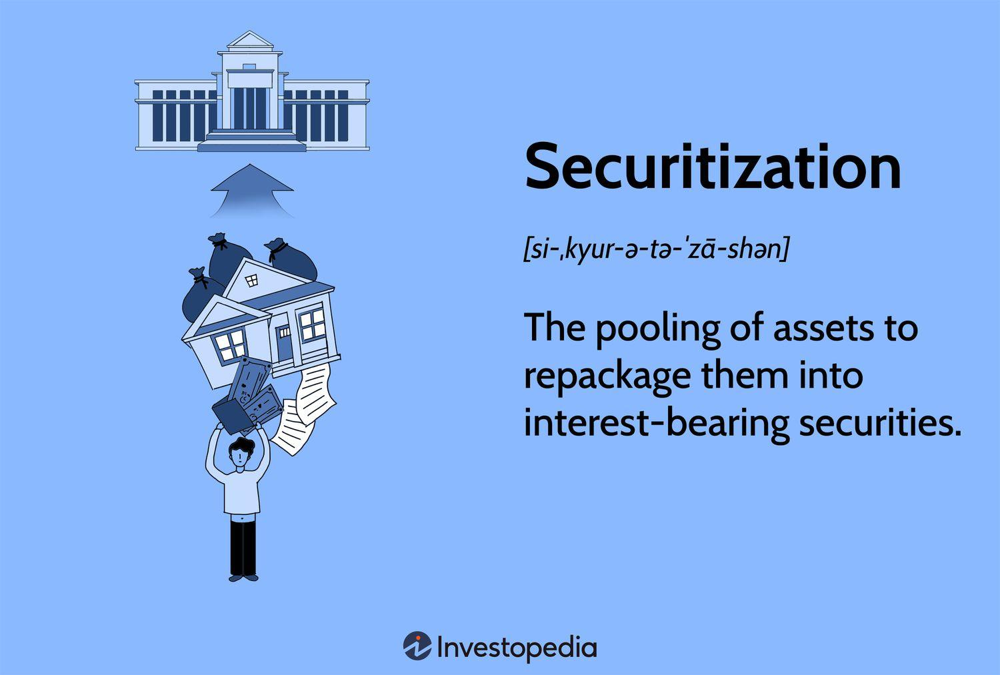

Securitization is a financial practice that has significantly altered the landscape of modern finance. At its core, securitization involves transforming illiquid assets into liquid securities by pooling various types of contractual debt, such as mortgage loans, auto loans, or credit card receivables, and then selling their cash flows to third-party investors as interest-bearing securities. This process not only provides funding flexibility for lenders but also opens up new avenues for investment, thereby catalyzing the expansion of financial markets.

The significance of securitization extends beyond its basic mechanics; it plays a vital role in facilitating liquidity and risk distribution in financial systems worldwide. It allows financial institutions to offload risk from their balance sheets, thereby enabling them to maintain capital adequacy. Furthermore, it transforms the nature of financial assets, allowing investors to access a diversified portfolio with varying risk profiles. These capabilities underscore why securitization is a powerful tool in modern finance.

The upcoming discussion focuses on several pivotal areas: the origins and evolution of securitization, an in-depth analysis of debt securitization, its impact on the history of finance, and the intersection with algorithmic trading. Understanding the historical trajectory of these elements is crucial, as it provides valuable insights into the current financial practices and regulatory landscapes. For instance, the rise of securitization has been linked to significant financial events, including the 2008 financial crisis, demonstrating both its transformative potential and inherent risks.

As we navigate the complexities of this financial innovation, it is important to have a comprehensive grasp of securitization's evolution over time. Such an understanding not only enriches our perspective on current financial systems but also equips policymakers, financial institutions, and investors with the knowledge needed to harness the benefits of securitization, while cautiously managing its risks. This exploration will shed light on the dynamic interplay between securitization and the broader financial ecosystem, setting the stage for ongoing developments and potential future innovations.

## Table of Contents

## What is Securitization?

Securitization is a financial process that involves the transformation of illiquid financial assets into marketable securities. This transformation enables the conversion of various types of debt obligations into investment opportunities accessible to a broader range of investors. The core idea behind securitization is to pool together assorted debt instruments—such as mortgages, car loans, and credit card receivables—and then sell the consolidated assets as bonds or other forms of securities to investors.

The process begins with the origination of individual loans or receivables, which are then pooled together by a financial entity, often referred to as the "originator." These pooled assets are transferred to a "special purpose vehicle" (SPV), which is a legal entity created to isolate financial risk. The SPV then issues securities backed by the asset pool, which are sold to investors. The cash flow from the underlying debt obligations—interest and principal repayments—serves as the source for the periodic payments to the holders of the securitized instruments.

This process is significant for several reasons. Firstly, it provides [liquidity](/wiki/liquidity-risk-premium) to the originators of the loans, allowing them to issue more loans or invest in other areas. Secondly, it allows investors to gain exposure to a diversified pool of assets, thereby spreading risk. Investors who purchase securitized products, such as mortgage-backed securities (MBS) or asset-backed securities (ABS), are essentially buying a share in the cash flows generated by the underlying debt obligations.

Securitization has expanded investment opportunities by creating a wide array of financial instruments that cater to different risk-return profiles. For example, in the case of MBS, different tranches are created to distribute the risk and reward among investors. Higher tranches offer lower risk but also lower returns, while lower tranches provide higher returns at increased risk. This stratification allows different types of investors, from conservative to risk-seeking, to participate according to their risk appetite.

In summary, securitization plays a pivotal role in global financial markets by providing a mechanism for liquidity creation, risk distribution, and investment diversification. Its ability to transform illiquid assets into tradable securities has been a key facilitator in expanding investment opportunities and optimizing resource allocation within the financial system.

## Origins and Evolution of Securitization

Securitization first emerged in the United States during the late 1960s and early 1970s, a period characterized by significant transformations in the financial landscape. The practice began with the securitization of mortgage loans, driven by the housing finance challenges and regulatory changes of the era. One of the earliest milestones in this development was the creation of the Government National Mortgage Association (Ginnie Mae) in 1968, which began to offer mortgage-backed securities (MBS) guaranteed by the U.S. government. These securities allowed for the pooling of individual mortgage loans, which were then sold to investors, providing a new source of liquidity to the housing market.

The concept expanded significantly in the 1980s with the introduction of a broader range of asset-backed securities (ABS), beyond the traditional MBS. This period saw the creation of instruments backed by credit card receivables, auto loans, and student loans. The evolution of securitization during this time was facilitated by financial innovations that enabled more complex structuring of these pooled assets. Key to this development was the expansion of the secondary mortgage market by institutions like Fannie Mae and Freddie Mac, which further structured and supported these financial products.

Several economic and regulatory factors played a significant role in the rise of securitization. Economically, the need for increased capital and liquidity spurred financial institutions to adopt securitization as a means of efficiently managing their portfolios. By converting illiquid assets into tradable securities, banks could free up capital and diversify risk. This practice also attracted a wider range of investors, thus expanding the capital pool available for various sectors.

On the regulatory side, the deregulation of financial markets in the late 20th century, particularly during the Reagan and Thatcher administrations, contributed to the proliferation of securitization. These changes included relaxing restrictions on the activities of commercial banks and allowing greater participation by institutional investors in securitized products. Furthermore, advances in credit rating methodologies provided investors with the necessary analysis to assess risk, thus supporting the expansion of these products.

In the 21st century, securitization practices continued to evolve with the advent of new technologies and risk management strategies. The lead-up to the 2008 financial crisis represents both a peak and a turning point for securitization, as excessive risk-taking and lack of transparency in some securitized products played a significant role in the crisis. Post-crisis reforms, such as the Dodd-Frank Act in the United States, aimed to improve accountability and transparency in securitization markets.

Overall, securitization has become a staple of modern finance, constantly adapting to economic conditions and regulatory frameworks. With technological advances and evolving financial strategies, securitization practices continue to influence global financial systems.

## Debt Securitization: A Closer Look

Debt securitization is an essential component of modern financial markets, enhancing liquidity and enabling broader access to investment opportunities. This process involves converting a pool of various debt obligations, such as loans, into marketable securities. These securities are typically categorized into mortgage-backed securities (MBS) and asset-backed securities (ABS), each serving distinct functions and structures within the financial system.

**Mortgage-Backed Securities (MBS)**

Mortgage-Backed Securities are created by bundling a collection of mortgage loans, which are then sold to investors in the form of bonds. This structure offers regular payments, typically derived from the interest and principal repayments made by homeowners on the underlying mortgages. The primary types of MBS are pass-throughs and collateralized mortgage obligations (CMOs).

- **Pass-Through MBS**: In pass-through structures, payments from mortgage borrowers pass directly through to the MBS holders. This process is relatively straightforward and illustrates how cash flows are distributed to investors based on their share of the pool.

- **Collateralized Mortgage Obligations (CMOs)**: CMOs are more complex and involve the creation of different tranches, each with distinct risk and return characteristics. Tranches are designed to cater to varying investor risk appetites by segmenting cash flows based on prepayment risk and interest rate exposure.

**Asset-Backed Securities (ABS)**

Asset-Backed Securities extend the securitization process to other forms of debt outside mortgages, including credit card receivables, auto loans, and student loans. The main difference between ABS and MBS lies in the nature of the underlying assets. 

- **Structure of ABS**: Similar to MBS, ABS consist of multiple tranches, offering different maturity profiles and risk-adjusted returns. Investors in senior tranches usually receive priority in payments, making them less risky compared to those in subordinate tranches.

**Supporting Liquidity in Financial Markets**

Both MBS and ABS play a crucial role in supporting market liquidity. By transforming illiquid assets (like individual loans) into liquid securities, they enable lenders to recycle capital. This increase in re-allocable capital allows lenders to issue more loans, thereby promoting credit availability and economic growth.

The process of securitization also enables risk sharing. Originators can balance their portfolios by offloading risk to a diverse range of investors, who, in turn, benefit from potentially higher yields than traditional fixed-income securities. This interaction enhances market efficiency, providing liquidity not only to primary lenders but also to secondary markets that trade these securitized products.

In summary, debt securitization, through MBS and ABS, provides a mechanism for financial institutions to manage risk while bolstering liquidity in global capital markets. These instruments enable diverse investment opportunities and maintain a flow of credit across the economy, illustrating the dynamic interplay between securitized products and financial stability.

## Impact on Financial History

Securitization has significantly impacted financial markets over various eras, leading to transformative changes in banking practices and risk management. Initially, securitization provided a mechanism for financial institutions to convert illiquid assets into liquid ones, thereby enhancing capital flow and improving market efficiency. By pooling assorted types of debt and selling them as securities, such as mortgage-backed securities (MBS) and asset-backed securities (ABS), banks could offload risk from their balance sheets. This allowed them to extend more credit and facilitated a redistribution of risk across a broader spectrum of investors.

Historically, securitization has enabled banks to manage risk more effectively through instruments that allowed them to achieve a diversified portfolio. By spreading credit risk exposure across numerous investors, financial institutions could alleviate the impact of individual loan defaults. This practice also encouraged the development of sophisticated risk management techniques and models that could better predict defaults and price these securities accordingly.

One of the most significant impacts of securitization was observed during the 2008 financial crisis. While securitization initially served as a tool for risk management and liquidity enhancement, it also contributed to systemic risk when mismanaged. The proliferation of complex financial products, such as collateralized debt obligations (CDOs) and credit default swaps (CDS), obscured the true risk associated with these instruments. Financial institutions underestimated the risk of default on underlying mortgage loans, amplified by the aggressive lending practices and the assumption that housing prices would continuously rise.

When the housing bubble burst, the securities based on these risky mortgages plummeted in value, leading to massive losses for financial institutions globally. The lack of transparency in securitized products and the over-reliance on credit ratings exacerbated the crisis, underscoring the need for improved risk assessment and regulatory oversight in securitization practices.

The response to this crisis has been a reevaluation of securitization's role in financial markets and the implementation of more stringent regulations. Regulatory bodies worldwide have introduced new measures to enhance transparency, improve risk assessment models, and ensure that originators retain a portion of the risk associated with securitized products. These changes aim to restore confidence in the securitization process while safeguarding the financial system against future crises.

In summary, while securitization has broadened investment opportunities and enhanced the functioning of financial markets, it has also highlighted the critical need for robust risk management frameworks and regulatory oversight. The lessons learned from past financial disruptions continue to shape the evolution of securitization practices in the modern financial landscape.

## Algorithmic Trading and Securitization

Algorithmic trading, the use of computer programs to execute trades at high speeds and volumes, has become a defining feature of modern financial markets. Its origins trace back to the 1970s with the advent of electronic exchanges, and it gained significant traction in the early 21st century. The rise of [algorithmic trading](/wiki/algorithmic-trading) is largely attributed to advancements in technology, which allow for the processing of massive data sets and the execution of trades within milliseconds. This form of trading now represents a significant portion of market activity, particularly in equities, futures, and foreign exchange markets.

Algorithmic trading's interaction with securitization markets is multifaceted. Securitized products, such as mortgage-backed securities (MBS) and asset-backed securities (ABS), are often traded in high volumes, making them ideal candidates for algorithmic trading strategies. Algorithms can be designed to identify [arbitrage](/wiki/arbitrage) opportunities, manage risk, and optimize trade execution by analyzing pricing anomalies and other market inefficiencies quickly. This interaction has enhanced the liquidity of securitized markets, facilitating the rapid buying and selling of securities without substantially affecting their prices.

While there are considerable benefits to using algorithms in trading securitized products, including increased market efficiency and liquidity, there are also inherent risks. One significant risk is related to market [volatility](/wiki/volatility-trading-strategies). Algorithms can contribute to sudden spikes in volatility through rapid sell-offs triggered by market signals, potentially exacerbating market crashes. Moreover, the complexity of these programs can lead to errors or unintended behaviors, such as the infamous "Flash Crash" of 2010, where a massive, automated sell-off caused a temporary but severe stock market plunge.

Another risk involves model risk and over-reliance on quantitative models, which may not account for all market scenarios or unexpected events, leading to significant financial losses. Furthermore, algorithmic trading can lead to reduced market transparency, as high-frequency trading firms often employ proprietary strategies that are not openly disclosed, creating an asymmetry of information.

To capitalize on algorithmic trading while minimizing its risks, financial institutions and regulators are continually developing more robust risk management practices and monitoring systems. Implementing circuit breakers, which temporarily halt trading in response to substantial market declines, and adopting stricter oversight on algorithm development and deployment are some measures employed to mitigate associated risks.

In conclusion, algorithmic trading has fundamentally transformed the trading of securitized products by enhancing efficiency and liquidity. However, it also presents new challenges that require advanced risk management and regulatory frameworks to ensure the stability and integrity of the financial markets.

## Technological Advances and the Future of Securitization

Recent technological advancements are significantly reshaping the landscape of securitization. These innovations are poised to enhance efficiency, transparency, and risk management, offering substantial improvements over traditional methods.

**Blockchain Technology in Securitization**

Blockchain technology stands out as a transformative force in the securitization process. Its decentralized ledger system ensures transparency by providing an immutable record of transactions, thereby reducing the risk of fraud and improving trust among investors. The ability of blockchain to automate processes through smart contracts can streamline the creation, management, and transfer of securitized assets. Smart contracts automatically execute predefined actions when specific conditions are met, reducing the need for intermediaries and minimizing transaction costs.

For example, using blockchain, asset pooling, a critical step in securitization, can be managed with increased accuracy and speed. The blockchain can maintain a precise and constantly updated ledger of underlying assets, enhancing both the granularity and reliability of data available to investors. Furthermore, the use of tokenization—digitizing an asset and representing it on the blockchain—can increase liquidity by allowing assets to be divided into smaller, more tradable units.

**Artificial Intelligence and Machine Learning**

Artificial Intelligence (AI) and Machine Learning (ML) are emerging as pivotal technologies in improving the analytical capabilities of financial institutions in securitization. These technologies facilitate the processing and analysis of vast amounts of data to identify patterns, assess risks, and inform decision-making processes. AI algorithms can evaluate the creditworthiness of securities more accurately than traditional methods, enhancing risk assessment models.

AI can also be employed to monitor market trends and predict changes, allowing institutions to react swiftly to shifting economic conditions. By employing predictive analytics, financial institutions can optimize the structuring and pricing of securitized products, ultimately maximizing investment returns while minimizing risk.

**Speculation on Future Developments**

Looking to the future, the integration of blockchain, AI, and other emerging technologies in securitization is likely to continue evolving. One potential development is the creation of decentralized financial platforms, where securitization could occur entirely within a blockchain-based ecosystem, facilitating direct transactions between issuers and investors.

Furthermore, advancements in AI might lead to the development of more sophisticated risk modeling tools, capable of simulating an array of economic scenarios to enhance the robustness of securitized products. These tools can lead to more dynamic and responsive strategies for managing portfolios of securitized assets.

As AI technology continues to mature, the potential for entirely automated decision-making systems in securitization could emerge, where AI systems autonomously manage the entire lifecycle of securitized assets, from issuance to management and redemption.

Incorporating these technological advances could fundamentally alter how financial institutions approach securitization, making it more efficient, transparent, and accessible, ultimately leading to a more robust global financial system. The future of securitization lies in the seamless integration of traditional financial expertise with cutting-edge technology to create a more resilient and adaptable market environment.

## Conclusion

Securitization has fundamentally transformed financial landscapes by converting illiquid assets into marketable securities. This process, which initially gained traction in the late 20th century, continues to offer diverse investment opportunities while supporting liquidity in financial markets. Understanding its origins and evolution helps to decipher the complexities of modern financial systems and provides insight into both its benefits and vulnerabilities.

The examination of debt securitization, including mechanisms like mortgage-backed and asset-backed securities, reveals how these instruments have underpinned significant shifts in banking practices and risk management. The 2008 financial crisis highlights the dual nature of securitization—its capacity to amplify both growth and risk within global markets. The rise of algorithmic trading has further intertwined with securitization, influencing trading dynamics with both positive innovations and increased systemic risk.

Recent technological advancements are poised to redefine securitization further. Blockchain and [artificial intelligence](/wiki/ai-artificial-intelligence) suggest new paradigms in managing and trading securitized products, potentially enhancing transparency and efficiency. The exploration of these technologies highlights a future where securitization remains a vital component of financial strategy.

Given its profound impact, understanding securitization's trajectory is not just academic; it's crucial for navigating future financial challenges and opportunities. The ongoing study and adaptation of securitization practices will be essential for those involved in shaping global finance, ensuring that the balance between innovation and risk is maintained.

## References & Further Reading

[1]: Gorton, G. B., & Metrick, A. (2012). ["Securitization"](https://www.nber.org/papers/w18611). Annual Review of Financial Economics, 4, 1–24.

[2]: Fabozzi, F. J., & Kothari, V. (2008). ["Securitization: The Tool of Financial Transformation."](http://depot.som.yale.edu/icf/papers/fileuploads/2495/original/07-07.pdf) CFA Digest, 38(2), 89-97.

[3]: Schwarcz, S. L. (1994). ["The Alchemy of Asset Securitization."](https://scholarship.law.duke.edu/faculty_scholarship/988/) Stanford Journal of Law, Business & Finance, 1, 133-154.

[4]: Pozsar, Z., Adrian, T., Ashcraft, A., & Boesky, H. (2010). ["Shadow Banking."](https://www.newyorkfed.org/research/epr/2013/0713adri.html) Federal Reserve Bank of New York Staff Reports, no. 458.

[5]: Jobst, A. A. (2008). ["Back to Basics – What is Securitization?"](https://www.imf.org/external/pubs/ft/fandd/2008/09/pdf/basics.pdf) IMF Working Paper No. 08/1.