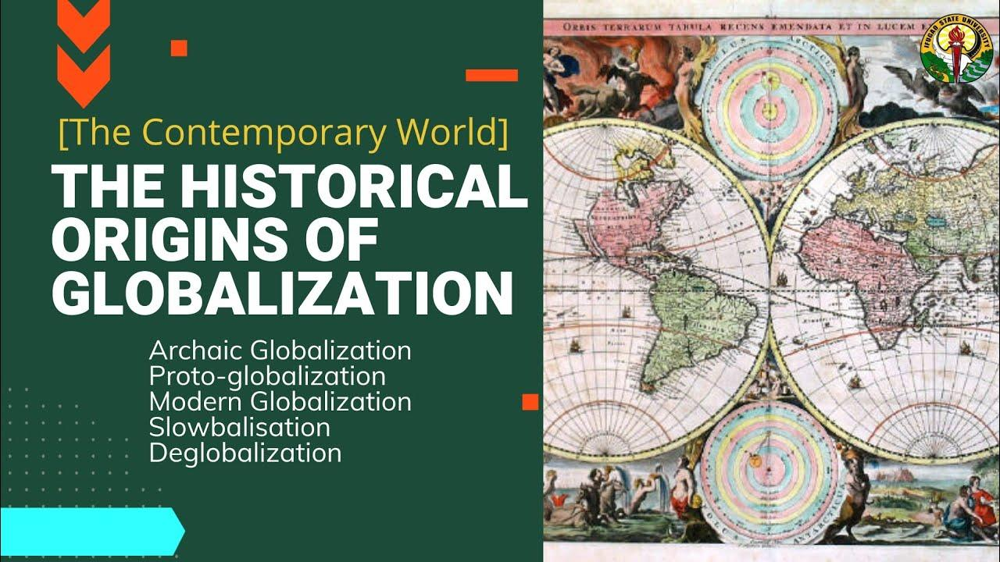

## Table of Contents

## What is globalization?

Globalization is when countries around the world become more connected and work together more. It means that people, goods, and information can move more easily from one country to another. This happens because of better technology, like the internet and faster transportation. Globalization also means that businesses can sell their products in many different countries, not just their own.

Because of globalization, people can learn about different cultures and try foods from all over the world. It can also help countries grow their economies by trading with each other. But, globalization can also cause problems. Some people worry that it can make rich countries richer and poor countries poorer. It can also be hard for local businesses to compete with big international companies.

## When did globalization begin?

Globalization started a long time ago, but it really picked up speed in the last few hundred years. People have been trading and traveling across the world for thousands of years. For example, the Silk Road was an ancient trade route that connected Asia and Europe. But globalization as we know it today began to grow much faster in the 19th century, thanks to things like steamships and the telegraph, which made it easier and quicker to move goods and messages around the world.

In the 20th century, globalization got even bigger because of new technology. Airplanes, telephones, and later the internet made it easier for people to connect and do business across the world. After World War II, countries started working together more to create rules for trade and to help each other's economies grow. This led to more international trade and investment, which is a big part of globalization today.

## What were the earliest forms of globalization?

The earliest forms of globalization started thousands of years ago when people began to trade with others far away from their homes. One of the first big examples of this was the Silk Road. The Silk Road was a network of trade routes that connected China and the Mediterranean. People used these routes to trade silk, spices, and other goods. This helped different cultures learn about each other and share ideas.

Another early form of globalization was the spread of religions and ideas. For example, Buddhism started in India and spread to other parts of Asia through trade and travel. Similarly, the spread of the Roman Empire helped spread Roman culture and ideas to different parts of Europe and the Mediterranean. These early forms of globalization were slow because travel and communication were not as fast as they are today, but they laid the groundwork for the more connected world we have now.

## How did trade routes contribute to early globalization?

Trade routes were very important for early globalization because they helped people from different places connect and share things. The Silk Road is a good example. It was a long path that went from China all the way to the Mediterranean. People used it to trade silk, spices, and other goods. This trading helped different cultures learn about each other. They shared not just goods, but also ideas, like how to make things or new ways of thinking.

Another way trade routes helped with early globalization was by spreading religions and ideas. For example, Buddhism started in India but spread to other parts of Asia because of trade. Traders and travelers brought their beliefs with them, and this helped Buddhism grow in new places. The same thing happened with the Roman Empire. As the Romans traded and conquered new lands, they spread their culture and ideas to different parts of Europe and the Mediterranean. These early trade routes were slow compared to today, but they were the start of a more connected world.

## What role did the Silk Road play in the origins of globalization?

The Silk Road was a big part of how globalization started. It was a long path that went from China to the Mediterranean. People used it to trade things like silk and spices. This trading helped people from different places learn about each other. They didn't just trade goods; they also shared ideas and ways of doing things. This made the world more connected, even though it was slow because travel was hard back then.

The Silk Road also helped spread religions and cultures. For example, Buddhism started in India but spread to other parts of Asia because of the Silk Road. Traders and travelers brought their beliefs with them, and this helped Buddhism grow in new places. The Silk Road showed how trade can bring people together and make the world feel smaller, which is a big part of what globalization is all about.

## How did colonialism influence the spread of globalization?

Colonialism played a big role in spreading globalization. When countries like Britain, Spain, and France took over other lands, they set up trade routes and brought their own ways of doing things to those places. This helped connect different parts of the world more closely. For example, the British Empire traded goods like tea, cotton, and opium between places like India, China, and Britain. This trade made the world more connected and helped spread ideas and cultures.

Colonialism also helped spread languages and religions. When countries took over other lands, they often made the people there speak their language and follow their religion. This is how English became widely spoken in places like India and parts of Africa. It also helped spread Christianity to many parts of the world. By doing this, colonialism helped make the world more connected, which is a key part of globalization. But, it's important to remember that colonialism also caused a lot of harm and suffering to the people in the colonies.

## What technological advancements facilitated early globalization?

Early globalization was helped a lot by new technology. One big thing was the invention of the steamship. Steamships made it faster and easier to travel across oceans. This meant that goods could be moved from one country to another more quickly. Another important technology was the telegraph. The telegraph let people send messages across long distances very fast. This helped businesses and governments talk to each other more easily, even if they were far apart.

Another technology that helped early globalization was the railroad. Railroads made it easier to move goods and people within countries and between countries that were close to each other. This helped trade grow and made it easier for people to travel and learn about different places. All these technologies together made the world feel smaller and more connected, which is what globalization is all about.

## How did the Industrial Revolution impact globalization?

The Industrial Revolution had a big impact on globalization. It started in the late 1700s and brought new machines and ways of making things. This made it easier and faster to produce goods like cloth and steel. Because of this, countries could make more things to trade with other countries. The steam engine was a key part of the Industrial Revolution. It powered ships and trains, which made it easier to move goods and people around the world. This helped trade grow a lot and made the world more connected.

The Industrial Revolution also changed how people worked and lived. Factories needed more workers, so people moved from the countryside to cities. This made cities grow bigger and more crowded. The new ways of making things also meant that countries needed more raw materials, like cotton and iron. This led to more trade and sometimes to countries taking over other lands to get these materials. Overall, the Industrial Revolution made the world more connected and helped globalization grow by making trade easier and faster.

## What were the economic theories that supported early globalization?

One of the main economic theories that supported early globalization was the idea of free trade. Free trade means that countries can trade with each other without many rules or taxes getting in the way. People like Adam Smith, who wrote a famous book called "The Wealth of Nations," believed that free trade was good for everyone. He thought that if countries could trade freely, they could focus on making the things they were best at and then trade those things with other countries. This would make everyone richer because they could get more of what they needed.

Another important theory was comparative advantage. This idea was explained by David Ricardo, another economist. Comparative advantage means that even if one country is better at making everything, it should still trade with other countries. Each country should focus on making the things it can make most efficiently and then trade those things for things that other countries make better. This theory helped support globalization because it showed that trade could help all countries, not just the richest ones. Both of these theories helped people see the benefits of trading with other countries, which is a big part of globalization.

## How did communication technologies evolve to support globalization?

Communication technologies have played a big role in making the world more connected, which is what globalization is all about. Early on, the telegraph was a big step forward. It let people send messages across long distances very quickly. This was important for businesses and governments because they could talk to each other even if they were far apart. Later, the telephone came along and made it even easier for people to talk to each other, no matter where they were. These technologies helped trade grow because people could make deals and share information faster.

Then came the internet, which changed everything. The internet made it possible for people to share information almost instantly. This helped businesses reach customers all over the world and made it easier for people to learn about different cultures. Email, video calls, and social media let people communicate in new ways. All these technologies made the world feel smaller and more connected, which helped globalization grow. Without these communication technologies, it would be much harder for people and businesses to work together across the world.

## What were the major international agreements or organizations that emerged to manage globalization?

Some big international agreements and organizations were created to help manage globalization. One of the most important ones is the World Trade Organization (WTO). The WTO was set up to make sure countries follow fair rules when they trade with each other. It helps countries talk about trade problems and find ways to solve them. Another important organization is the International Monetary Fund (IMF). The IMF helps countries that are having money problems by giving them loans and advice. It also works to make the world's money system more stable.

Another key organization is the United Nations (UN). The UN helps countries work together on many different issues, like peace, health, and the environment. It has special groups, like the United Nations Conference on Trade and Development (UNCTAD), that focus on helping poorer countries grow their economies through trade. These organizations and agreements are important because they help make sure that globalization works in a way that is fair and helps everyone, not just the richest countries.

## How have modern theories of globalization evolved from its historical origins?

Modern theories of globalization have grown a lot from how people thought about it in the past. At first, globalization was mostly about trade and moving goods from one place to another. People like Adam Smith and David Ricardo focused on how countries could get richer by trading with each other. They talked about ideas like free trade and comparative advantage. These ideas helped countries see the benefits of working together and trading. But as the world changed, so did the theories about globalization. Now, people think about globalization in many different ways, not just about trade.

Today, globalization is seen as much more than just trading goods. It's about how people, ideas, and cultures connect all over the world. Modern theories look at how technology, like the internet, has made the world smaller and more connected. They also talk about how globalization can affect things like the environment, human rights, and inequality between rich and poor countries. Some people worry that globalization can make rich countries richer and poor countries poorer. Others think it can help spread good ideas and help everyone. These new ways of thinking about globalization show how much the world has changed since the early days of trade routes and colonialism.

## References & Further Reading

[1]: Irwin, D. A. (2020). ["Free Trade under Fire, Fifth Edition"](https://www.jstor.org/stable/j.ctvr0qr9q). Princeton University Press.

[2]: Friedman, T. L. (2005). ["The World Is Flat: A Brief History of the Twenty-first Century"](https://psycnet.apa.org/record/2005-13366-000). Farrar, Straus and Giroux.

[3]: Lopez de Prado, M. (2018). ["Advances in Financial Machine Learning"](https://www.amazon.com/Advances-Financial-Machine-Learning-Marcos/dp/1119482089). Wiley.

[4]: Aronson, D. (2006). ["Evidence-Based Technical Analysis: Applying the Scientific Method and Statistical Inference to Trading Signals"](https://www.amazon.com/Evidence-Based-Technical-Analysis-Scientific-Statistical/dp/0470008741). Wiley.

[5]: Jansen, S. (2020). ["Machine Learning for Algorithmic Trading"](https://github.com/stefan-jansen/machine-learning-for-trading). Packt Publishing.

[6]: Chan, E. P. (2008). ["Quantitative Trading: How to Build Your Own Algorithmic Trading Business"](https://github.com/ftvision/quant_trading_echan_book). Wiley.