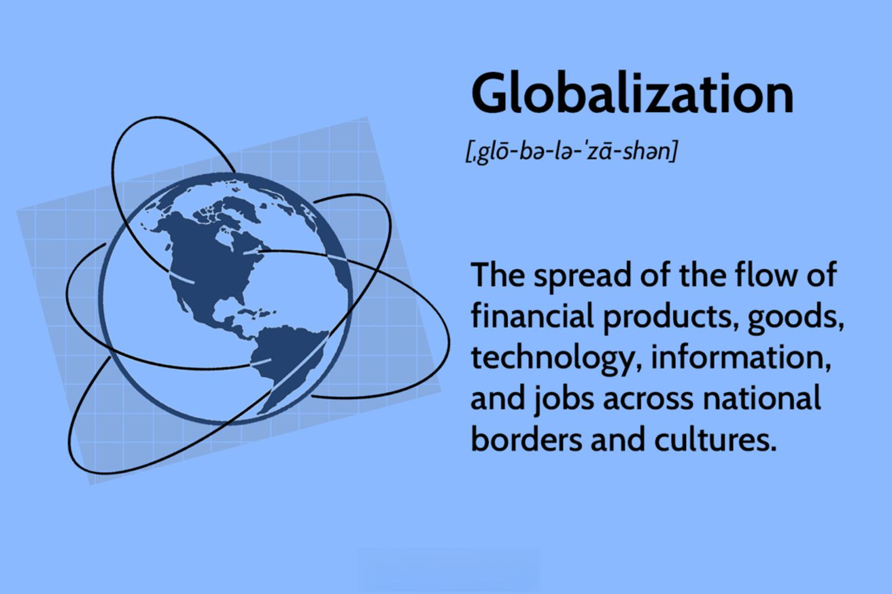

Globalization refers to the process by which economies, societies, and cultures have become interconnected through a worldwide network of trade, communication, technology, and finance. It has significantly shaped the modern world, dismantling geographical and cultural barriers and fostering a more integrated global community. Its influence is evident in various sectors, including economic development, technological advancement, and cultural exchange.

The interconnectedness of economic history, international trade, and algorithmic trading plays a crucial role in globalization's narrative. Economic history provides a backdrop of transformative events, such as the Industrial Revolution and the establishment of multinational trade agreements, that propelled economies from local to global spheres. These developments laid the groundwork for international trade, which serves as the engine of globalization. By enabling the exchange of goods, services, and cultural commodities, international trade facilitates economic growth and development on a global scale. Simultaneously, the advent of technology has introduced algorithmic trading, revolutionizing financial markets by leveraging computer algorithms to execute trades with precision and speed.

This article aims to explore the evolution and interplay of globalization, international trade, and algorithmic trading. By examining these elements, we can gain insights into their collective impact on global markets and the broader economic landscape. Understanding the historical context and current dynamics is essential for comprehending the role of globalization in today's interconnected world.

In the current economic landscape, appreciating these concepts has become increasingly important. As globalization continues to influence global policy, international trade negotiations, and financial markets, the ability to adapt and respond to these changes is crucial for businesses, policymakers, and investors. Understanding how economic history, trade agreements, and technological innovations such as algorithmic trading converge provides valuable insights for navigating the complexities of the modern global economy. This article seeks to elucidate these connections and encourage a deeper understanding of the forces shaping our world today.

## Table of Contents

## The Economic History of Globalization

Globalization, a process that has significantly shaped the modern world, finds its roots in antiquity but gained substantial momentum with specific historical milestones. Its origins can be traced back to the establishment of trade routes that connected distant civilizations, fostering cultural and economic exchanges. One of the earliest examples is the Silk Road, which enabled the exchange of goods, ideas, and technologies between the East and the West, illustrating early globalization's role in facilitating economic development and cultural diffusion.

The Industrial Revolution, commencing in the late 18th century, marked a pivotal shift in economic history, serving as a catalyst for dramatic transformations in production capabilities and global trade dynamics. This period introduced technological advancements such as the steam engine and mechanized manufacturing, which significantly increased production efficiency and capacity. As a result, there was a substantial increase in goods available for trade, further intensifying international economic exchanges and contributing to the development of a global economy.

Trade routes, established during different eras, played a crucial role in globalization by connecting disparate markets, thus facilitating the flow of goods and services across vast distances. These routes were not limited to physical trade but also were conduits for the exchange of information, culture, and innovations. Critical trade networks, like the maritime routes employed during the Age of Exploration, enabled European powers to access new markets and resources, laying the groundwork for future global trade systems.

The impact of these events on international trade and economic development was profound. With the advent of more efficient production techniques and transportation methods, goods could be produced in one location and consumed in another, thousands of miles away. This transition enabled economies to specialize in the production of goods for which they had a comparative advantage, thereby enhancing economic efficiency and increasing global production capacities.

The transition from local to global economies has had significant implications. Economies became increasingly interdependent, with local markets being influenced by global supply and demand dynamics. This shift necessitated new economic policies and frameworks to manage international trade and economic relations, leading to the establishment of institutions such as the World Trade Organization (WTO) to regulate and promote international commerce.

The interplay between globalization and trade policy has led to increased economic growth in many regions. However, it has also introduced challenges such as economic inequality and cultural homogenization. As economies transitioned from local to global structures, they experienced unprecedented growth opportunities but also faced the pressures of global competition and market [volatility](/wiki/volatility-trading-strategies).

In summary, the economic history of globalization is characterized by transformative events like the Industrial Revolution and the establishment of extensive trade routes. These developments have reshaped economic landscapes, forging closer ties between nations and paving the way for a highly interconnected global economy. Understanding these historical shifts is crucial in grasping the complexities and dynamics of contemporary globalization.

## International Trade: The Engine of Globalization

International trade has been a cornerstone of globalization, serving as a vital conduit for the exchange of goods, services, and capital across international borders. By promoting economic interdependence, trade has accelerated globalization, fostering greater connectivity and integration of the world economy.

Trade agreements and policies have been instrumental in facilitating global market access. The establishment of trade agreements such as the General Agreement on Tariffs and Trade (GATT) and its successor, the World Trade Organization (WTO), has led to the reduction of tariffs and the removal of trade barriers. These multilateral frameworks have encouraged countries to engage more openly in international trade, thus increasing the flow of goods and services across borders. Regional trade agreements such as the North American Free Trade Agreement (NAFTA) and the European Union (EU) further illustrate how collaborative policies have enhanced regional commerce and integration.

The benefits of international trade are manifold. For many economies, it provides access to a broader range of goods and services, fostering competition and innovation. It allows countries to specialize in the production of goods where they have a comparative advantage, thereby increasing efficiency and economic growth. For example, nations rich in natural resources can focus on their extraction and export, while others may specialize in manufacturing or services. Additionally, trade increases consumer choice, reduces prices, and boosts job creation in export industries.

However, international trade presents challenges. Economies may become overly dependent on foreign markets, exposing them to global economic fluctuations. Trade imbalances can also arise, leading to tensions between trading partners. Additionally, there is the risk of deindustrialization in developed countries, where industries might relocate to nations with cheaper labor costs, leading to job losses.

Several case studies highlight successful trade partnerships and their economic impact. The trade relationship between China and the United States exemplifies this dynamic. Despite geopolitical tensions, the bilateral trade [volume](/wiki/volume-trading-strategy) has grown significantly over the past decades, benefiting both economies. China's export-driven growth strategy has lifted millions out of poverty, while the U.S. benefits from affordable consumer goods. Another example is the EU's single market, which allows goods, services, capital, and people to move freely among member states, significantly boosting intra-regional trade and economic stability.

In conclusion, international trade serves as a powerful engine of globalization. Through well-crafted trade agreements and policies, it has opened up global markets, offering numerous benefits while posing notable challenges. Understanding these dynamics is crucial for policymakers to harness trade's full potential while mitigating its adverse effects.

## The Rise of Algorithmic Trading

Algorithmic trading, commonly referred to as algo trading, refers to the use of computer algorithms to execute trading orders based on predetermined criteria, such as time, price, and volume. This form of trading relies on vast datasets and mathematical models to make informed decisions with minimal human intervention. Algorithmic trading was introduced into global markets during the late 1970s and early 1980s when stock exchanges began the transition from traditional open outcry systems to electronic trading platforms. With the advent of computerized trading, market participants were able to implement strategies that were faster and more complex than ever before.

Technological advancements have been central to the proliferation of [algorithmic trading](/wiki/algorithmic-trading). The exponential growth in computing power, alongside improvements in data analytics and [machine learning](/wiki/machine-learning), has transformed how trading algorithms are developed and deployed. High-frequency trading ([HFT](/wiki/high-frequency-trading-strategies)), a subset of algo trading, takes advantage of these technological innovations to execute large volumes of orders at extremely high speeds, sometimes within microseconds. This requires robust infrastructure, including low-latency networks and direct market access, enabling traders to gain competitive advantages in executing trades quickly.

The benefits of algorithmic trading are numerous. One of the primary advantages is the increased efficiency it brings to financial markets. By using algorithms to manage trades, organizations can process large volumes of transactions rapidly, which enhances [liquidity](/wiki/liquidity-risk-premium) and reduces market spreads. Additionally, algorithmic trading minimizes human error, such as those stemming from emotional decision-making or manual input mistakes. As a result, it can improve the consistency and reliability of trading outcomes, contributing to overall market stability.

However, despite its advantages, algorithmic trading faces challenges and controversies. The "flash crash" of May 6, 2010, highlighted the potential for algo trading systems to contribute to extreme market volatility. During this event, algorithms triggered by a single trade order led to a rapid, unexplained plunge in the U.S. stock market, followed by a quick recovery, demonstrating the potential risks of automated trading systems. Additionally, the opacity of these complex algorithms raises concerns about market fairness and the potential for manipulative practices. There are ongoing debates about the ethical implications and regulatory oversight necessary to ensure that algorithmic trading benefits the broader financial ecosystem without undermining its integrity.

In summary, algorithmic trading represents a significant evolution in market operations, driven by technological advancements and the need for greater market efficiency. However, the complexity and speed inherent in algo trading systems also introduce challenges and raise questions about the need for appropriate regulatory frameworks to ensure market stability and fairness.

## The Interconnection: Impact on Global Markets

Globalization, international trade, and algorithmic trading form a synergistic triad influencing the fabric of global financial markets. Globalization facilitates the seamless flow of goods, services, and capital across borders, establishing an interconnected economic environment. This integration is fueled by international trade, which acts as a conduit for economic interactions, enabling countries to capitalize on their comparative advantages. Algorithmic trading further enhances this dynamic by leveraging technology to automate and optimize trading processes, increasing the velocity and volume of trade in global markets.

The interplay between these elements has profound implications for global financial markets. Globalization expands market access, allowing multinational companies to diversify operations and investments across different regions. This diversification mitigates risk and contributes to market stability. However, it also increases the complexity and interdependency of financial systems, as disturbances in one region can rapidly propagate globally.

International trade, by reducing trade barriers and fostering economic cooperation, encourages economic growth and innovation. Trade agreements like the North American Free Trade Agreement (NAFTA) and the European Union (EU) have demonstrated how reducing tariffs and establishing common market standards can boost trade activity and economic integration. Yet, international trade is not without challenges. Trade imbalances, protectionist policies, and geopolitical tensions can disrupt market stability and necessitate strategic interventions.

Algorithmic trading, driven by advancements in computational technologies and data analytics, has revolutionized financial markets. By enabling high-frequency trading, algorithms can execute large volumes of transactions at unprecedented speeds and with a high degree of precision. Despite its efficiency, algorithmic trading poses challenges, including market volatility and the potential for systemic risk due to algorithm malfunctions or unintended consequences of automated decision-making processes.

The critical importance of understanding these dynamics lies in their influence on investment strategies and policy-making. For investors, insights into how globalization enhances market reach, how trade policies shape economic landscapes, and how algorithmic trading impacts liquidity and price discovery are crucial for making informed decisions. Policymakers, on the other hand, must balance the benefits of open markets and technological innovation with measures that safeguard against market disruptions and protect national economic interests.

Recent economic trends underscore the impact of this interplay. The 2008 global financial crisis highlighted the vulnerability of interconnected markets, where the collapse of financial institutions in the United States triggered a worldwide recession. In contrast, the COVID-19 pandemic illustrated how supply chain disruptions, exacerbated by international trade dependency, led to global economic slowdowns. Algorithmic trading, during these periods, played a dual role—maintaining market liquidity but also contributing to heightened market volatility.

In conclusion, the intersection of globalization, international trade, and algorithmic trading demands continuous analysis and adaptation. Understanding these forces is essential for stakeholders aiming to navigate the complexities of modern financial markets and leverage the opportunities of a globally integrated economy.

## The Future of Globalization and Trade in the Age of Algorithms

Globalization and trade are entering a transformative phase as new technologies, particularly algorithmic trading, reshape economic landscapes. The digital age is fostering a more integrated global market, characterized by rapid information exchange and advanced data analytics. Predicting the future of globalization involves examining these technological advancements and their economic implications.

**International Trade in the Digital Age**

The digital revolution continues to impact international trade by diminishing geographical barriers and enabling instant communication across borders. E-commerce platforms, digital payment systems, and blockchain technology are all pivotal in optimizing supply chains and enhancing transparency in transactions. This evolution promotes a more level playing field, facilitating entry for small and medium-sized enterprises (SMEs) into global markets. However, digital trade also poses challenges, such as cybersecurity risks and digital inequality, which need to be addressed as technology becomes more ubiquitous.

**The Future of Algorithmic Trading**

Algorithmic trading represents a significant shift in financial markets, where the use of advanced mathematical models and high-speed algorithms is revolutionizing the way trades are executed. This approach increases market liquidity, reduces human error, and enhances decision-making speed. However, the rise of algorithmic trading also raises concerns about market volatility and systemic risk, as evidenced by events like the 2010 Flash Crash. To address these concerns, regulators and financial institutions must develop strategies to ensure market stability while promoting innovation.

**Adapting to Changes**

Economies must adapt to technological advancements to remain competitive. This adaptation involves investing in digital infrastructure and education to equip the workforce with necessary skills. Governments and policymakers should work to balance technological integration with measures that protect against its potential downsides, such as job displacement or increased financial instability.

Moreover, international cooperation is essential for establishing standardized regulations that can govern digital trade and algorithmic trading. Collaboration between nations can help mitigate risks and optimize the benefits of these technologies, ensuring sustainable economic growth and stability.

In conclusion, the integration of digital technologies in globalization and trade promises transformative impacts that can reshape economic landscapes. By understanding these trends and preparing for potential challenges, economies can strategically position themselves in the digital age.

## Conclusion

In this article, we have explored the profound connections between globalization, international trade, and algorithmic trading. These elements form a complex network that drives the modern economic landscape, with each component influencing and amplifying the effects of the others. Globalization has facilitated the expansion of international trade, breaking down barriers and enabling countries to access broader markets. In turn, international trade has acted as a catalyst for globalization by integrating economies and fostering interdependence. This integration has created a fertile environment for technological advancements, such as algorithmic trading, to thrive.

Algorithmic trading, characterized by its use of complex algorithms and computational power, has revolutionized financial markets. It enhances market efficiency and reduces the possibility of human error. However, its rise has also introduced challenges, including market volatility and ethical concerns. The interplay between these elements is integral to understanding current economic dynamics and requires continuous examination and adaptation.

Ongoing research is crucial to deepen our understanding of these interconnections. By analyzing how globalization shapes trade, how trade policies impact economic growth, and how algorithmic trading influences market behavior, we can better navigate the ever-evolving global economy. Stakeholders, including policymakers, investors, and businesses, must remain vigilant and informed to successfully adapt to these changes.

Readers are encouraged to reflect on how these trends intersect in their own economic contexts. Consideration of the broader implications of globalization, trade policies, and technological advancements will be critical in shaping future strategies and ensuring sustainable economic growth in an increasingly interconnected world.

## References & Further Reading

[1]: Irwin, D. A. (2020). ["Free Trade under Fire, Fifth Edition"](https://www.jstor.org/stable/j.ctvr0qr9q). Princeton University Press.

[2]: Friedman, T. L. (2005). ["The World Is Flat: A Brief History of the Twenty-first Century"](https://psycnet.apa.org/record/2005-13366-000). Farrar, Straus and Giroux.

[3]: Lopez de Prado, M. (2018). ["Advances in Financial Machine Learning"](https://www.amazon.com/Advances-Financial-Machine-Learning-Marcos/dp/1119482089). Wiley.

[4]: Aronson, D. (2006). ["Evidence-Based Technical Analysis: Applying the Scientific Method and Statistical Inference to Trading Signals"](https://www.amazon.com/Evidence-Based-Technical-Analysis-Scientific-Statistical/dp/0470008741). Wiley.

[5]: Jansen, S. (2020). ["Machine Learning for Algorithmic Trading"](https://github.com/stefan-jansen/machine-learning-for-trading). Packt Publishing.

[6]: Chan, E. P. (2008). ["Quantitative Trading: How to Build Your Own Algorithmic Trading Business"](https://github.com/ftvision/quant_trading_echan_book). Wiley.