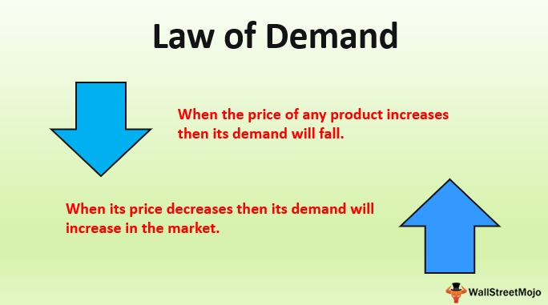

## Table of Contents

## What is the basic concept of supply and demand?

Supply and demand is a fundamental concept in economics that explains how the price and quantity of goods and services are determined in a market. It's based on the idea that the price of something will naturally find a level where the amount people want to buy (demand) matches the amount that's available (supply). When there's a lot of something and not many people want it, the price tends to go down. On the other hand, if there's not much of something and a lot of people want it, the price tends to go up.

This balance between supply and demand can shift. For example, if a new technology becomes popular, demand might increase, pushing prices up if the supply can't keep up. Conversely, if a new way to produce something makes it easier and cheaper to make, the supply might increase, which could lower the price if demand stays the same. Understanding these shifts helps businesses decide how much to produce and what to charge, and it helps consumers understand why prices change.

## Who are the key economists associated with the development of the supply and demand theory?

The theory of supply and demand was developed over time by many economists, but a few stand out for their contributions. One key figure is Adam Smith, often called the father of modern economics. In his book "The Wealth of Nations" published in 1776, Smith talked about how prices are influenced by the forces of supply and demand. He explained that when there's a lot of something, the price goes down, and when there's not enough, the price goes up. This idea became a foundation for understanding markets.

Another important economist is Alfred Marshall. In the late 19th century, Marshall refined the theory of supply and demand in his book "Principles of Economics." He introduced the concept of the supply and demand curve, which is a graph that shows how the price of a good or service changes based on how much people want it and how much is available. Marshall's work helped make the theory more precise and easier to understand, and it's still used in economics today.

## How did the concept of supply and demand evolve historically?

The idea of supply and demand started a long time ago, but it became more clear with Adam Smith's book "The Wealth of Nations" in 1776. Adam Smith explained that prices go up when there's not enough of something and people want it a lot. He also said prices go down when there's too much of something and not many people want it. This was a big step in understanding how markets work. Before Adam Smith, people didn't have a clear way to explain why prices changed, but his ideas helped everyone see that it's all about how much people want something and how much of it there is.

Later on, in the late 1800s, Alfred Marshall made the idea of supply and demand even clearer. He wrote a book called "Principles of Economics" where he used graphs to show how supply and demand work. These graphs, called supply and demand curves, made it easy to see how prices change when supply or demand changes. Marshall's work helped people understand that both supply and demand are important, and they work together to decide the price of things. His ideas are still used today to teach people about economics and how markets work.

Over time, other economists have added to the theory of supply and demand. They've looked at things like how people's tastes change, how new technology can affect supply, and how government rules can change both supply and demand. All these ideas have helped make the theory of supply and demand more complete and useful for understanding the world around us.

## What are the earliest known references to supply and demand principles?

The earliest known references to principles similar to supply and demand can be traced back to ancient civilizations. In ancient Mesopotamia, around 1750 BC, the Code of Hammurabi included laws that set prices for goods and services. These laws suggest an understanding that prices could change based on how much of something was available and how much people needed it. For example, during times of scarcity, prices might go up, showing an early grasp of the basic idea of supply and demand.

In ancient Greece, around 300 BC, the philosopher Aristotle wrote about how prices could be influenced by the amount of goods available and the number of people who wanted them. In his book "Politics," Aristotle discussed how a shortage of goods could lead to higher prices, and how an abundance could lead to lower prices. These observations by Aristotle are some of the earliest written records that show an understanding of the relationship between supply and demand, even if the concept was not yet formalized as it is today.

## How did the Industrial Revolution influence the development of supply and demand theory?

The Industrial Revolution, which started in the late 1700s, had a big impact on how people thought about supply and demand. Before the Industrial Revolution, most things were made by hand, and it was hard to make a lot of them quickly. But with new machines and factories, people could make more things faster and cheaper. This meant that the supply of goods could change a lot more than before. Economists started to see that when factories could make more of something, the price might go down if people didn't want more of it. This helped them understand that supply and demand were not just about what people wanted, but also about how much could be made.

During the Industrial Revolution, the way people bought and sold things also changed. More people moved to cities to work in factories, and they needed to buy things like food and clothes. This created bigger markets where supply and demand could be seen more clearly. Economists like David Ricardo and Thomas Malthus, who lived during this time, started to write about how these changes affected prices and wages. They saw that when there were more workers than jobs, wages might go down, and when there were more goods than people wanted to buy, prices might drop. These ideas helped shape the theory of supply and demand into what we know today.

## What role did Adam Smith play in formalizing the law of supply and demand?

Adam Smith played a big role in making the idea of supply and demand clear. In his book "The Wealth of Nations," which came out in 1776, he explained how prices go up when there's not enough of something and people want it a lot. He also said prices go down when there's too much of something and not many people want it. Before Adam Smith, people didn't have a good way to explain why prices changed, but his ideas helped everyone see that it's all about how much people want something and how much of it there is.

Smith's work was important because it gave people a way to understand markets better. He talked about how the "invisible hand" of the market helps balance supply and demand. This means that when people buy and sell things, they help set prices in a way that makes sense for everyone. Smith's ideas about supply and demand are still used today to help people understand how prices are set and how markets work.

## How have different economic schools of thought interpreted the law of supply and demand?

Different economic schools of thought have their own ways of looking at the law of supply and demand. The classical economists, like Adam Smith and David Ricardo, see supply and demand as the main forces that set prices in a free market. They believe that if markets are left alone, supply and demand will naturally find a balance that's good for everyone. They think that prices will go up when there's not enough of something and people want it a lot, and prices will go down when there's too much of something and not many people want it.

On the other hand, Keynesian economists, led by John Maynard Keynes, think that supply and demand can sometimes get stuck and not find a balance on their own. They believe that during tough times, like a recession, people might not spend enough money, even if prices are low. This can lead to too many goods and not enough demand, which keeps prices low and makes it hard for the economy to get better. Keynesians say that the government should step in to help balance supply and demand by spending money or changing taxes to get the economy moving again.

Lastly, the Austrian School of economics, with thinkers like Ludwig von Mises and Friedrich Hayek, focuses on how individual choices affect supply and demand. They believe that prices are important signals that help people decide what to buy and sell. They think that if the government tries to control prices or the economy too much, it can mess up these signals and make it harder for supply and demand to work properly. Austrian economists argue that markets should be as free as possible so that supply and demand can find their own balance naturally.

## What are some of the major criticisms of the traditional supply and demand model?

Some people say the traditional supply and demand model doesn't always work the way it's supposed to. One big criticism is that it doesn't take into account things like how much money people have or how they feel about buying things. For example, if people don't have enough money, they might not buy things even if the price goes down. Also, if people think a product is bad for the environment, they might not want to buy it no matter how cheap it gets. These things can make the model less accurate because it assumes people will always buy more if the price is lower.

Another criticism is that the model can be too simple for real life. In the real world, there are lots of other things that can affect prices, like government rules, big companies controlling the market, or sudden changes like a natural disaster. The traditional model doesn't always show how these things can change supply and demand. For example, if a government puts a tax on something, it can make the price go up even if there's a lot of it and people want it. So, while the supply and demand model is helpful, it might not explain everything that happens in the economy.

## How does the law of supply and demand apply to modern global markets?

The law of supply and demand still works in today's global markets, but it's a bit more complicated because the world is so connected. When something is made in one country, it can be sold all over the world. This means that if a lot of people in different countries want the same thing, the price can go up everywhere. For example, if there's a new phone that everyone wants, and there aren't enough of them, the price might go up no matter where you are. On the other hand, if a country makes a lot of something and not many people want it, the price might go down, and that country might try to sell it to other countries at a lower price.

Global markets also have to deal with things like trade rules and money exchange rates. If a country puts a tax on something coming from another country, it can make the price go up even if there's a lot of it. Also, if the money in one country gets weaker compared to another country's money, it can make things from that country cheaper for people in other places. All these things can change how supply and demand work in the global market, making it more complex than just looking at how much people want something and how much there is.

## What are the mathematical models used to represent supply and demand?

The main way economists show supply and demand with math is by using something called supply and demand curves. These are lines on a graph that show how the price of something changes based on how much people want it and how much is available. The demand curve usually goes down from left to right, which means that when the price goes down, people want to buy more of it. The supply curve goes up from left to right, showing that when the price goes up, people want to make and sell more of it. Where these two lines cross is called the equilibrium point, and that's where the amount people want to buy matches the amount that's available, setting the price.

Another way to look at supply and demand with math is by using equations. For demand, you might see an equation like Qd = a - bp, where Qd is the amount people want to buy, a is the most they'd buy if it was free, b is how much the amount they want changes with the price, and p is the price. For supply, the equation might look like Qs = c + dp, where Qs is the amount people want to sell, c is the least they'd sell if the price was zero, d is how much the amount they want to sell changes with the price, and p is the price. When Qd equals Qs, that's the equilibrium point where the market is balanced.

## How have technological advancements affected the dynamics of supply and demand?

Technological advancements have changed how supply and demand work by making it easier and faster to make things. With new machines and computers, factories can make more products quicker and cheaper than before. This means the supply of goods can go up a lot. For example, if a new machine helps a company make more cars faster, there will be more cars available, which might make the price go down if people don't want more cars. Also, technology helps companies know what people want by looking at data from the internet and social media. This helps them make just the right amount of things people want, keeping supply and demand in balance.

Technology also changes how people buy things, which affects demand. With the internet, people can buy things from anywhere in the world without leaving their homes. This makes it easier for them to find what they want, and they might buy more because it's so convenient. Online shopping and apps also let people see prices from different sellers, so they can choose the cheapest one. This can make prices go down because sellers have to compete more. Plus, new technology like smartphones and apps can make people want new things, increasing demand for the latest gadgets and services.

## What are the future trends and potential shifts in the application of supply and demand theory?

In the future, the way we think about supply and demand might change because of new technology and global changes. One big trend is the use of data and computers to predict what people will want. Companies can use information from the internet and social media to see what people are interested in before they even start making things. This can help them make just the right amount of products, so there's not too much or too little. Also, with more people buying things online, the way we buy and sell things is changing. This might make prices change faster because people can see and compare prices from all over the world.

Another thing that could change how supply and demand works is the focus on being good to the environment. More and more, people want things that don't hurt the planet. This can change what companies make and how they make it. For example, if people want more electric cars instead of gas cars, the demand for electric cars will go up, and the demand for gas cars will go down. This can also affect the supply of things like batteries and the materials needed to make them. As the world tries to be more sustainable, the way we think about what we want and what's available might shift a lot.

## References & Further Reading

[1]: Smith, Adam. (1776). ["The Wealth of Nations"](https://www.ibiblio.org/ml/libri/s/SmithA_WealthNations_p.pdf). An Inquiry into the Nature and Causes of the Wealth of Nations.

[2]: Marshall, Alfred. (1890). ["Principles of Economics"](https://en.wikipedia.org/wiki/Principles_of_Economics_(Marshall_book)). 

[3]: Lopez de Prado, M. (2018). ["Advances in Financial Machine Learning"](https://www.amazon.com/Advances-Financial-Machine-Learning-Marcos/dp/1119482089). Wiley.

[4]: Chan, E. P. (2009). ["Quantitative Trading: How to Build Your Own Algorithmic Trading Business"](https://github.com/ftvision/quant_trading_echan_book). Wiley.

[5]: Jansen, S. (2020). ["Machine Learning for Algorithmic Trading: Predictive models to extract signals from market and alternative data for systematic trading strategies with Python"](https://www.amazon.com/Machine-Learning-Algorithmic-Trading-alternative/dp/1839217715). 

[6]: Kearns, M., & Nevmyvaka, Y. (2013). ["Machine Learning for Market Microstructure and High-Frequency Trading"](https://www.cis.upenn.edu/~mkearns/papers/KearnsNevmyvakaHFTRiskBooks.pdf). High-Frequency Trading: New Realities for Traders, Markets and Regulators, Risk Books.