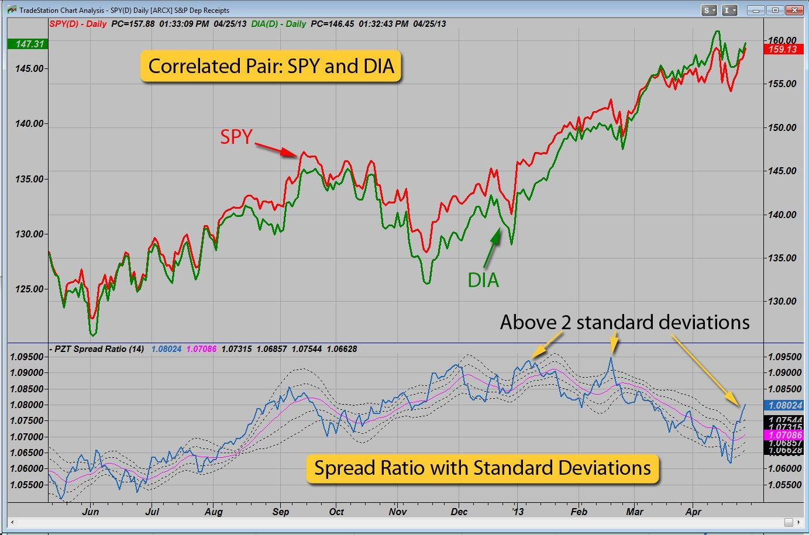

The financial trading landscape has been significantly reshaped with the rise of algorithmic trading. In this modern trading approach, statistical models and algorithms are extensively employed to make precise and timely trading decisions. Among these models, the Ornstein-Uhlenbeck (OU) process stands out for its mean-reverting properties, making it particularly valuable in strategies focusing on mean reversion and pairs trading.

The OU process is renowned for its ability to model financial instruments that exhibit mean-reverting behaviors. In contrast to random walks, where values drift without a defined path, the OU process embodies the tendency of a variable to revert to its long-term mean over time. Such a process is mathematically expressed through a stochastic differential equation (SDE) given by:



$$

dX_t = \theta (\mu - X_t)dt + \sigma dW_t 
$$

where $X_t$ is the process value, $\mu$ is the long-term mean, $\theta$ represents the speed of mean reversion, $\sigma$ is the volatility of the process, and $dW_t$ denotes a Brownian motion component. The parameters $\theta$, $\mu$, and $\sigma$ are crucial in defining the dynamics of the OU process.

This article highlights the significance of the Ornstein-Uhlenbeck process in algorithmic trading and explores its application across various financial instruments. We provide a comprehensive analysis of the mathematical foundations underlying the OU process, detailing its implementation in trading strategies. Moreover, we discuss the process’s distinct advantages over other stochastic models, which include its ability to capture the mean-reversion trait in financial variables, thereby offering traders a statistically robust tool to identify and exploit market inefficiencies.

In addition to theoretical insights, the article offers a practical guide for employing the OU process in mean reversion trading strategies. This includes the application of Python simulations to illustrate the OU process’s behavior and effectiveness in real trading scenarios. Readers will gain valuable knowledge on the implementation techniques and potential of the OU process as a pivotal strategy in algorithm-driven trading environments.

## Table of Contents

## Understanding the Ornstein-Uhlenbeck Process

The Ornstein-Uhlenbeck (OU) process is a notable continuous-time stochastic process recognized for its mean-reverting characteristics. In this model, a variable exhibits a tendency to move towards a long-term mean over time, which is especially valuable in contexts where stability around a mean value is desired. 

Mathematically, the OU process is expressed through a stochastic differential equation (SDE) of the form:

$$

dX_t = \theta (\mu - X_t) dt + \sigma dW_t
$$

Here, $X_t$ represents the variable of interest at time $t$. The parameter $\mu$ denotes the long-term mean to which the process reverts. The mean reversion speed is indicated by $\theta$, which dictates how quickly deviations from $\mu$ are corrected over time. $\sigma$ is the [volatility](/wiki/volatility-trading-strategies) coefficient, reflecting the degree of randomness or noise in the system, and $dW_t$ is the increment of a Wiener process, commonly known as Brownian motion.

The OU process was initially introduced to model the velocity of a particle undergoing Brownian motion, illustrating how such a particle's velocity returns towards zero over time. This original implementation has expanded significantly, with the OU process being employed in diverse fields such as quantitative finance, where its parameters can be calibrated to model various economic indicators and financial instruments.

Key features that define the OU process include:

1. **Mean Reversion**: Unlike geometric Brownian motion, where variables can drift indefinitely, the OU process ensures a pull towards a central value, making it ideal for modeling interest rates, exchange rates, or the spread between correlated assets in pairs trading.

2. **Volatility Control**: The volatility parameter $\sigma$ governs the intensity of random fluctuations around $\mu$, allowing for better control over the risk profile of modeled processes.

3. **Speed of Reversion**: The speed parameter $\theta$ is crucial as it dictates how quickly the variable reverts to the mean after a deviation. A higher $\theta$ results in faster reversion, which is beneficial for capturing short-term market dynamics.

4. **Stationarity**: The process is stationary, meaning its statistical properties are constant over time, providing reliable modeling of financial variables expected to remain stable around a historical mean.

These characteristics make the Ornstein-Uhlenbeck process a robust tool for financial modeling, particularly where mean-reverting dynamics are anticipated, and random walks are not suitable.

## Applications in Algorithmic Trading

The mean-reverting nature of the Ornstein-Uhlenbeck process makes it highly effective in various [algorithmic trading](/wiki/algorithmic-trading) strategies. One of the most notable applications is in pairs trading, a strategy that focuses on exploiting the statistical relationship between two correlated assets. The OU process models the spread between these assets, effectively identifying when the spread diverges from its mean and signaling potential trading opportunities. This modeling allows traders to capitalize on the expectation that such divergences will revert to the mean, facilitating profitable trades during these reversion events.

In the field of [interest rate](/wiki/interest-rate-trading-strategies) modeling, the OU process underpins the Vasicek model, which is one of the pioneering models for interest rate dynamics. This model captures the typical behavior of interest rates as they fluctuate around a long-term mean. The Vasicek model is described by the stochastic differential equation:

$$
dX_t = \theta(\mu - X_t)dt + \sigma dW_t
$$

where $X_t$ represents the interest rate at time $t$, $\mu$ is the long-term mean level, $\theta$ indicates the speed at which the rate reverts to the mean, $\sigma$ is the volatility, and $dW_t$ denotes the increment of a Wiener process. Through this framework, the OU process ensures that interest rates remain bounded and return to their historical averages over time, providing a robust methodology for pricing interest rate derivatives.

The OU process is also invaluable in asset pricing, particularly in modeling bond yields and other financial instruments that display mean-reverting characteristics. These models assist in ensuring that yields oscillate within historically observed boundaries, thus offering more accurate predictions and pricing. By embedding the OU process into such pricing models, it helps maintain financial stability and predictability, vital components for risk management and strategic financial planning.

The practical implementation of the OU process in these applications showcases its adaptability and effectiveness in capturing complex market behaviors, illustrating its fundamental role in modern algorithmic trading strategies.

## Implementing the OU Process in Mean Reversion Trading

The Mean Reversion Cloud indicator, based on the Ornstein-Uhlenbeck (OU) process, is a sophisticated tool for identifying overbought or oversold conditions in financial markets. This indicator utilizes the Exponentially Weighted Moving Average (EWMA) to dynamically calculate a mean price level, surrounded by volatility bands that reflect the market's variability. 

To implement this tool, traders should start by configuring the indicator on trading platforms like TradingView. This involves setting key parameters such as the decay [factor](/wiki/factor-investing) and volatility threshold, which dictate how quickly the indicator responds to market changes and the sensitivity of the volatility bands. By analyzing crossovers between the current price and these bands, traders can identify potential reversal zones, where prices are likely to revert to the mean.

When prices deviate significantly from the calculated mean, it suggests potential buy or sell opportunities. For example, if the price falls below the lower volatility band, it may indicate an oversold condition, signaling a potential buy opportunity. Conversely, if the price exceeds the upper volatility band, it may suggest an overbought condition, indicating a potential sell opportunity.

To enhance the accuracy and profitability of trades, it's beneficial to backtest the strategy using historical data. This involves applying the OU process-based indicator to past market conditions to evaluate its effectiveness and refine its parameters. Additionally, traders often combine the OU process with other technical indicators such as the Relative Strength Index (RSI) or the Moving Average Convergence Divergence (MACD). These indicators can provide supplementary confirmation, helping to filter out false signals and improve decision-making in volatile markets.

Through careful implementation and strategy optimization, traders can leverage the OU process to exploit mean-reversion opportunities, potentially gaining an edge in algorithmic trading environments.

## Simulating the Ornstein-Uhlenbeck Process in Python

Simulating the Ornstein-Uhlenbeck (OU) process in Python requires a clear understanding of its stochastic differential equation (SDE) and the appropriate discretization method. The SDE for the OU process is expressed as:

$$
dX_t = \theta (\mu - X_t) dt + \sigma dW_t
$$

where $X_t$ is the process, $\mu$ is the long-term mean, $\theta$ is the speed of mean reversion, $\sigma$ is the volatility, and $dW_t$ is the Wiener process or Brownian motion component. The equation highlights how the process tends to revert to its mean over time, with adjustments for randomness.

To simulate the OU process, the Euler-Maruyama discretization is often employed. This method numerically integrates the SDE to produce a time series path of the process. The discrete version of the OU process can be approximated as:

$$
X_{t+\Delta t} = X_t + \theta (\mu - X_t) \Delta t + \sigma \sqrt{\Delta t} \epsilon_t
$$

Here, $\Delta t$ is the time step, and $\epsilon_t$ is a standard normal random variable. 

A sample Python code implementation might look like this:

```python
import numpy as np
import matplotlib.pyplot as plt

def simulate_ou_process(theta, mu, sigma, X0, T, dt):
    N = int(T / dt)  # Number of time steps
    t = np.linspace(0, T, N)
    X = np.zeros(N)
    X[0] = X0

    for i in range(1, N):
        dW = np.random.normal(loc=0.0, scale=np.sqrt(dt))
        X[i] = X[i-1] + theta * (mu - X[i-1]) * dt + sigma * dW

    return t, X

# Parameters
theta = 0.15  # Speed of mean reversion
mu = 5.0  # Long-term mean
sigma = 0.3  # Volatility
X0 = 5.5  # Initial value
T = 10.0  # Total time
dt = 0.01  # Time step

# Simulation
t, X = simulate_ou_process(theta, mu, sigma, X0, T, dt)

# Plotting
plt.plot(t, X)
plt.title('Ornstein-Uhlenbeck Process Simulation')
plt.xlabel('Time')
plt.ylabel('X(t)')
plt.grid(True)
plt.show()
```

This code snippet sets initial values, including the mean reversion speed ($\theta$), volatility ($\sigma$), and other parameters, before simulating and plotting the OU process trajectory.

Simulating under different parameter settings enables traders to understand the process's behavior under various market scenarios and tailor their strategies accordingly. This approach helps in visualizing how quickly the process reverts to the mean and the extent of volatility, providing valuable insights for model validation and strategy refinement.

## Conclusion

The Ornstein-Uhlenbeck (OU) process stands as a formidable instrument in the toolkit of algorithmic trading. Its primary allure lies in its capacity to model mean-reversion with precision, offering traders a statistically sound framework for identifying potential trading opportunities where asset prices oscillate around a stable long-term mean. By leveraging its mathematical foundation rooted in stochastic calculus, the OU process grants traders the ability to anticipate and capitalize on market corrections, thereby enhancing profitability.

A significant advantage of the OU process is its adaptability across varying market conditions. It provides a consistent methodology for analyzing markets characterized by noise and volatility, ensuring that traders can maintain a structured approach without succumbing to random price fluctuations. The process can be formalized by the stochastic differential equation:

$$
dX_t = \theta(\mu - X_t)dt + \sigma dW_t
$$

where $\theta$ represents the speed of reversion, $\mu$ is the long-term mean, $\sigma$ denotes volatility, and $dW_t$ is the Wiener process component. This robustness ensures that the OU framework can be seamlessly integrated with other quantitative models to refine insights and improve trading outcomes.

As more sophisticated trading algorithms emerge, the relevance of the Ornstein-Uhlenbeck process is likely to grow. It provides a foundation upon which traders can build refined strategies, incorporating elements such as [machine learning](/wiki/machine-learning) to fine-tune the parameters dynamically based on evolving market data. The ongoing innovation within algorithmic trading is poised to enhance the utility of the OU process further, ensuring its continued significance in financial modeling and optimization. With its deep-rooted mathematical elegance and practical applicability, the OU process offers a compelling model for traders focused on harnessing mean-reverting phenomena within the complex tapestry of modern financial markets.

## References & Further Reading

[1]: Uhlenbeck, G. E., & Ornstein, L. S. (1930). ["On the Theory of the Brownian Motion."](https://link.aps.org/doi/10.1103/PhysRev.36.823) Physical Review.

[2]: Vasicek, O. (1977). ["An Equilibrium Characterization of the Term Structure."](https://www.sciencedirect.com/science/article/pii/0304405X77900162) Journal of Financial Economics.

[3]: Avellaneda, M., & Lee, J.-H. (2010). ["Statistical Arbitrage in the US Equities Market."](https://papers.ssrn.com/sol3/papers.cfm?abstract_id=1153505) Quantitative Finance.

[4]: Gatheral, J. (2006). ["The Volatility Surface: A Practitioner's Guide."](https://www.wiley.com/en-us/The+Volatility+Surface%3A+A+Practitioner%27s+Guide-p-9780471792512) Wiley.

[5]: Lo, A. W., & MacKinlay, A. C. (1990). ["When Are Contrarian Profits Due to Stock Market Overreaction?"](https://www.jstor.org/stable/2962020) Review of Financial Studies.

[6]: Cartea, Á., Jaimungal, S., & Penalva, J. (2015). ["Algorithmic and High-Frequency Trading."](https://assets.cambridge.org/97811070/91146/frontmatter/9781107091146_frontmatter.pdf) Cambridge University Press.