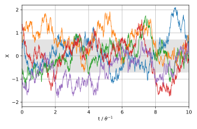

## Table of Contents

## What is the Ornstein-Uhlenbeck process?

The Ornstein-Uhlenbeck process is a type of mathematical model used to describe how something changes over time. It is often used in finance and physics to model things like stock prices or the movement of particles. The key idea is that the thing being modeled tends to move towards a certain average value, but it also experiences random fluctuations. Imagine a ball attached to a spring: it will always try to return to its resting position, but it can be pushed around randomly.

In simpler terms, the Ornstein-Uhlenbeck process is like a tug-of-war between a force pulling something back to a mean value and random pushes in different directions. Over time, the thing being modeled will hover around the mean value but will never stay still because of the random fluctuations. This makes it useful for modeling real-world situations where things tend to revert to a norm but are also subject to unpredictable changes.

## What are the key components of the O-U process?

The Ornstein-Uhlenbeck (O-U) process has three main parts that help it work. The first part is the mean reversion level, which is like a target value that the process always tries to get back to. Imagine it as a magnet pulling the process towards it. The second part is the speed of mean reversion, which tells us how quickly the process moves back to the target value. If it's fast, the process snaps back quickly; if it's slow, it takes its time.

The third part is the volatility, which is all about the random ups and downs the process experiences. This is like someone shaking the process around randomly, making it jump away from the target value in unpredictable ways. Together, these three parts—the target value, the speed of getting back to it, and the random shaking—make the O-U process a good model for things that tend to hover around an average but also get pushed around by chance.

## How is the O-U process different from a random walk?

The Ornstein-Uhlenbeck (O-U) process and a random walk are both ways to describe how things change over time, but they work differently. A random walk is like a drunk person stumbling around: each step is completely random and has no memory of where it's been before. It can go anywhere without any pull back to a starting point. This means that over time, a random walk can wander far away from where it started, and there's no force trying to bring it back.

On the other hand, the O-U process is like a ball attached to a spring. It has a special spot, called the mean reversion level, that it always tries to get back to. Even though it gets pushed around by random forces, there's always a tug pulling it towards this special spot. This means that over time, the O-U process will usually stay close to its mean reversion level, unlike a random walk that can end up anywhere.

## What is the mathematical formula for the O-U process?

The Ornstein-Uhlenbeck (O-U) process can be described using a simple formula. Imagine you have a value, let's call it X, that changes over time. The formula that shows how X changes is: dX = θ(μ - X)dt + σdW. Here, θ is the speed at which X tries to get back to its average value, μ is the average value itself, σ is how much random shaking there is, and dW is a tiny random change that happens over a very short time, dt.

Let's break this down a bit more. The part θ(μ - X)dt shows that X is always trying to move towards μ, its average value. If X is above μ, this part will be negative, pulling X down. If X is below μ, this part will be positive, pushing X up. The speed of this movement is controlled by θ. The other part, σdW, adds random changes to X. These changes can make X jump around, but the pull towards μ keeps it from wandering too far. Together, these two parts make the O-U process a good way to model things that hover around an average but also get pushed around by chance.

## Can you explain the mean reversion property of the O-U process?

The mean reversion property of the Ornstein-Uhlenbeck (O-U) process is like a rubber band pulling something back to its normal spot. Imagine you have a ball attached to a spring. No matter where you push the ball, the spring will always try to bring it back to the middle. In the O-U process, this middle spot is called the mean reversion level. If the value of the process, which we can call X, is above this level, the process will try to pull X back down towards the mean. If X is below the mean, it will try to push X back up.

This pulling or pushing towards the mean happens at a certain speed, which we call the speed of mean reversion. It's like how fast the spring snaps the ball back to the middle. The faster the speed, the quicker X will move back to the mean. But even as the process is trying to get back to the mean, it gets pushed around by random changes. These random changes can make X jump away from the mean, but the mean reversion property keeps pulling it back, so it usually stays close to the mean over time.

## How is the O-U process used in financial modeling?

In financial modeling, the Ornstein-Uhlenbeck (O-U) process is often used to predict how things like interest rates or stock prices might change over time. Imagine you want to guess where interest rates will be in the future. The O-U process helps by saying that interest rates will try to go back to a normal level, but they'll also get pushed around by unexpected events. This is useful because it matches how we see interest rates behaving in real life: they hover around a typical value but can jump around due to surprises in the economy.

For example, if you're a bank trying to set interest rates for loans, you might use the O-U process to figure out what rates might be in the future. The model would tell you that rates will try to get back to a certain average, but they'll also be affected by things like changes in the economy or government policies. By understanding this, you can make better guesses about future rates and set your loan rates in a way that makes sense for your bank and your customers.

## What are the applications of the O-U process in physics?

In physics, the Ornstein-Uhlenbeck (O-U) process is used to understand how particles move around in a fluid or gas. Imagine you have a tiny particle floating in water. It gets pushed around by the water molecules, but it also feels a force pulling it back to a certain spot. The O-U process helps scientists predict where this particle will be over time, showing that it will usually stay close to its starting point but will also wander a bit because of the random pushes from the water.

Another use of the O-U process in physics is in studying how temperatures change in a system. Think of a room where you want to keep the temperature steady. The O-U process can model this by showing that the temperature will try to stay at a certain level, but it can also go up or down a bit because of random changes. This helps scientists figure out how to design systems that keep temperatures stable, even when unexpected things happen.

## How can the O-U process be simulated using a computer?

To simulate the Ornstein-Uhlenbeck (O-U) process on a computer, you need to break down time into small steps and use the O-U formula to update the value of your process at each step. Imagine you're tracking how a value, let's call it X, changes over time. You start with an initial value for X and then use the formula dX = θ(μ - X)dt + σdW to figure out how X changes in each tiny time step. Here, θ is how fast X tries to get back to its average value μ, σ is how much random shaking there is, and dW is a small random change that happens over the tiny time step dt. You keep doing this for many steps, and you'll see X moving around but always trying to get back to μ.

For the computer to do this, you need to generate random numbers to represent the dW part of the formula. These random numbers can be created using a random number generator, which is a tool in most programming languages. Every time you update X, you add a bit of randomness to it, which makes it jump around. But because of the θ(μ - X)dt part, X will always feel a pull back towards μ. By running this simulation many times, you can see how X behaves over time and how it tends to hover around μ but also gets pushed around by the random changes.

## What are the statistical properties of the O-U process?

The Ornstein-Uhlenbeck (O-U) process has a few important statistical properties that help us understand how it behaves. One key property is its mean, which is the average value the process tries to get back to. This mean is called the mean reversion level, and over time, the process will hover around this level. Another important property is the variance, which tells us how much the process jumps around. The variance of the O-U process depends on how much randomness there is and how fast the process tries to get back to its mean. If there's a lot of randomness, the process will jump around more, making the variance larger. If the process tries to get back to its mean quickly, the variance will be smaller because it won't have time to wander far.

Another statistical property of the O-U process is its autocorrelation, which shows how the value of the process at one time is related to its value at another time. In the O-U process, the autocorrelation decreases as time goes by, but it never goes to zero. This means that if you know where the process was a little while ago, you can guess where it is now better than if you had no information at all. The speed at which the autocorrelation decreases depends on how quickly the process tries to get back to its mean. The faster it tries to get back, the quicker the autocorrelation drops. These properties make the O-U process useful for modeling things that tend to stay close to an average value but also get pushed around by random changes.

## How does the choice of parameters affect the behavior of the O-U process?

The choice of parameters in the Ornstein-Uhlenbeck (O-U) process really changes how it behaves. The first parameter, called the mean reversion level, is like a magnet that pulls the process back to a certain spot. If you change this level, you're basically moving where the process wants to go back to. So, if you set it higher, the process will try to get to a higher spot, and if you set it lower, it will aim for a lower spot. The second parameter, the speed of mean reversion, is like how strong the magnet is. If you make it faster, the process will snap back to the mean reversion level quicker. If you make it slower, it will take its time getting back.

The third parameter, called volatility, is all about the random shaking that the process feels. If you increase the volatility, the process will jump around more and can get further away from the mean reversion level. If you decrease it, the process will stay closer to the mean because there's less randomness pushing it around. Together, these parameters shape how the O-U process moves. By changing them, you can make the process behave more like what you're trying to model, whether it's something in finance or physics.

## What are some advanced variations of the O-U process?

One advanced variation of the Ornstein-Uhlenbeck (O-U) process is the time-varying O-U process. In this version, the parameters like the mean reversion level, the speed of mean reversion, and the volatility can change over time. Imagine you're trying to model interest rates, and you know that what's considered "normal" for interest rates can change depending on the economy. With a time-varying O-U process, you can let the mean reversion level move around, so your model stays accurate even when the world changes. This makes it a good tool for modeling things that don't just hover around one fixed average but might have an average that shifts over time.

Another advanced version is the multivariate O-U process, where you model more than one thing at the same time. Think of it like trying to predict both stock prices and interest rates together. In this case, the different things you're modeling can affect each other. If interest rates go up, it might push stock prices down, and the O-U process can capture this relationship. By using a multivariate O-U process, you can see how these different factors move together and influence each other, making your predictions more realistic and useful.

A third variation is the O-U process with jumps, which adds sudden big changes to the model. Imagine you're modeling stock prices, and sometimes there are big news events that make the prices jump up or down a lot. The O-U process with jumps can include these sudden changes, making it better at capturing real-world behavior where things don't just change smoothly but can also have big leaps. This makes the model more flexible and able to handle unexpected events that can shake things up a lot.

## How can the O-U process be estimated from empirical data?

To estimate the parameters of the Ornstein-Uhlenbeck (O-U) process from real data, you start by collecting a series of observations over time. Imagine you're tracking how the temperature in a room changes every hour. You need to figure out three things: the mean reversion level, the speed of mean reversion, and the volatility. One common way to do this is by using a method called maximum likelihood estimation. This method tries different values for the parameters and picks the ones that make the observed data most likely to happen. It's like guessing the rules of a game by watching how it's played and then tweaking your guesses until they fit best.

Once you have these estimated parameters, you can check how well they work by comparing the O-U process they create with your actual data. If the model fits well, it means the parameters are a good guess of how things work in real life. You might use a computer program to do all this, as it can handle the math and calculations much faster than a person. By tweaking the parameters and running the model over and over, you can find the best fit for your data. This way, you can use the O-U process to make predictions about how things will change in the future, based on what you've seen in the past.

## What is the Ornstein-Uhlenbeck Process and how can it be understood?

The Ornstein-Uhlenbeck (OU) process is a notable continuous-time stochastic process recognized for its mean-reverting characteristics. In this model, a variable exhibits a tendency to move towards a long-term mean over time, which is especially valuable in contexts where stability around a mean value is desired. 

Mathematically, the OU process is expressed through a stochastic differential equation (SDE) of the form:

$$

dX_t = \theta (\mu - X_t) dt + \sigma dW_t
$$

Here, $X_t$ represents the variable of interest at time $t$. The parameter $\mu$ denotes the long-term mean to which the process reverts. The mean reversion speed is indicated by $\theta$, which dictates how quickly deviations from $\mu$ are corrected over time. $\sigma$ is the [volatility](/wiki/volatility-trading-strategies) coefficient, reflecting the degree of randomness or noise in the system, and $dW_t$ is the increment of a Wiener process, commonly known as Brownian motion.

The OU process was initially introduced to model the velocity of a particle undergoing Brownian motion, illustrating how such a particle's velocity returns towards zero over time. This original implementation has expanded significantly, with the OU process being employed in diverse fields such as quantitative finance, where its parameters can be calibrated to model various economic indicators and financial instruments.

Key features that define the OU process include:

1. **Mean Reversion**: Unlike geometric Brownian motion, where variables can drift indefinitely, the OU process ensures a pull towards a central value, making it ideal for modeling interest rates, exchange rates, or the spread between correlated assets in pairs trading.

2. **Volatility Control**: The volatility parameter $\sigma$ governs the intensity of random fluctuations around $\mu$, allowing for better control over the risk profile of modeled processes.

3. **Speed of Reversion**: The speed parameter $\theta$ is crucial as it dictates how quickly the variable reverts to the mean after a deviation. A higher $\theta$ results in faster reversion, which is beneficial for capturing short-term market dynamics.

4. **Stationarity**: The process is stationary, meaning its statistical properties are constant over time, providing reliable modeling of financial variables expected to remain stable around a historical mean.

These characteristics make the Ornstein-Uhlenbeck process a robust tool for financial modeling, particularly where mean-reverting dynamics are anticipated, and random walks are not suitable.

## What are the applications in algorithmic trading?

The mean-reverting nature of the Ornstein-Uhlenbeck process makes it highly effective in various [algorithmic trading](/wiki/algorithmic-trading) strategies. One of the most notable applications is in pairs trading, a strategy that focuses on exploiting the statistical relationship between two correlated assets. The OU process models the spread between these assets, effectively identifying when the spread diverges from its mean and signaling potential trading opportunities. This modeling allows traders to capitalize on the expectation that such divergences will revert to the mean, facilitating profitable trades during these reversion events.

In the field of [interest rate](/wiki/interest-rate-trading-strategies) modeling, the OU process underpins the Vasicek model, which is one of the pioneering models for interest rate dynamics. This model captures the typical behavior of interest rates as they fluctuate around a long-term mean. The Vasicek model is described by the stochastic differential equation:

$$
dX_t = \theta(\mu - X_t)dt + \sigma dW_t
$$

where $X_t$ represents the interest rate at time $t$, $\mu$ is the long-term mean level, $\theta$ indicates the speed at which the rate reverts to the mean, $\sigma$ is the volatility, and $dW_t$ denotes the increment of a Wiener process. Through this framework, the OU process ensures that interest rates remain bounded and return to their historical averages over time, providing a robust methodology for pricing interest rate derivatives.

The OU process is also invaluable in asset pricing, particularly in modeling bond yields and other financial instruments that display mean-reverting characteristics. These models assist in ensuring that yields oscillate within historically observed boundaries, thus offering more accurate predictions and pricing. By embedding the OU process into such pricing models, it helps maintain financial stability and predictability, vital components for risk management and strategic financial planning.

The practical implementation of the OU process in these applications showcases its adaptability and effectiveness in capturing complex market behaviors, illustrating its fundamental role in modern algorithmic trading strategies.

## How can you simulate the Ornstein-Uhlenbeck Process in Python?

Simulating the Ornstein-Uhlenbeck (OU) process in Python requires a clear understanding of its stochastic differential equation (SDE) and the appropriate discretization method. The SDE for the OU process is expressed as:

$$
dX_t = \theta (\mu - X_t) dt + \sigma dW_t
$$

where $X_t$ is the process, $\mu$ is the long-term mean, $\theta$ is the speed of mean reversion, $\sigma$ is the volatility, and $dW_t$ is the Wiener process or Brownian motion component. The equation highlights how the process tends to revert to its mean over time, with adjustments for randomness.

To simulate the OU process, the Euler-Maruyama discretization is often employed. This method numerically integrates the SDE to produce a time series path of the process. The discrete version of the OU process can be approximated as:

$$
X_{t+\Delta t} = X_t + \theta (\mu - X_t) \Delta t + \sigma \sqrt{\Delta t} \epsilon_t
$$

Here, $\Delta t$ is the time step, and $\epsilon_t$ is a standard normal random variable. 

A sample Python code implementation might look like this:

```python
import numpy as np
import matplotlib.pyplot as plt

def simulate_ou_process(theta, mu, sigma, X0, T, dt):
    N = int(T / dt)  # Number of time steps
    t = np.linspace(0, T, N)
    X = np.zeros(N)
    X[0] = X0

    for i in range(1, N):
        dW = np.random.normal(loc=0.0, scale=np.sqrt(dt))
        X[i] = X[i-1] + theta * (mu - X[i-1]) * dt + sigma * dW

    return t, X

# Parameters
theta = 0.15  # Speed of mean reversion
mu = 5.0  # Long-term mean
sigma = 0.3  # Volatility
X0 = 5.5  # Initial value
T = 10.0  # Total time
dt = 0.01  # Time step

# Simulation
t, X = simulate_ou_process(theta, mu, sigma, X0, T, dt)

# Plotting
plt.plot(t, X)
plt.title('Ornstein-Uhlenbeck Process Simulation')
plt.xlabel('Time')
plt.ylabel('X(t)')
plt.grid(True)
plt.show()
```

This code snippet sets initial values, including the mean reversion speed ($\theta$), volatility ($\sigma$), and other parameters, before simulating and plotting the OU process trajectory.

Simulating under different parameter settings enables traders to understand the process's behavior under various market scenarios and tailor their strategies accordingly. This approach helps in visualizing how quickly the process reverts to the mean and the extent of volatility, providing valuable insights for model validation and strategy refinement.

## What is the conclusion?

The Ornstein-Uhlenbeck (OU) process stands as a formidable instrument in the toolkit of algorithmic trading. Its primary allure lies in its capacity to model mean-reversion with precision, offering traders a statistically sound framework for identifying potential trading opportunities where asset prices oscillate around a stable long-term mean. By leveraging its mathematical foundation rooted in stochastic calculus, the OU process grants traders the ability to anticipate and capitalize on market corrections, thereby enhancing profitability.

A significant advantage of the OU process is its adaptability across varying market conditions. It provides a consistent methodology for analyzing markets characterized by noise and volatility, ensuring that traders can maintain a structured approach without succumbing to random price fluctuations. The process can be formalized by the stochastic differential equation:

$$
dX_t = \theta(\mu - X_t)dt + \sigma dW_t
$$

where $\theta$ represents the speed of reversion, $\mu$ is the long-term mean, $\sigma$ denotes volatility, and $dW_t$ is the Wiener process component. This robustness ensures that the OU framework can be seamlessly integrated with other quantitative models to refine insights and improve trading outcomes.

As more sophisticated trading algorithms emerge, the relevance of the Ornstein-Uhlenbeck process is likely to grow. It provides a foundation upon which traders can build refined strategies, incorporating elements such as [machine learning](/wiki/machine-learning) to fine-tune the parameters dynamically based on evolving market data. The ongoing innovation within algorithmic trading is poised to enhance the utility of the OU process further, ensuring its continued significance in financial modeling and optimization. With its deep-rooted mathematical elegance and practical applicability, the OU process offers a compelling model for traders focused on harnessing mean-reverting phenomena within the complex tapestry of modern financial markets.

## References & Further Reading

[1]: Uhlenbeck, G. E., & Ornstein, L. S. (1930). ["On the Theory of the Brownian Motion."](https://link.aps.org/doi/10.1103/PhysRev.36.823) Physical Review.

[2]: Vasicek, O. (1977). ["An Equilibrium Characterization of the Term Structure."](https://www.sciencedirect.com/science/article/pii/0304405X77900162) Journal of Financial Economics.

[3]: Avellaneda, M., & Lee, J.-H. (2010). ["Statistical Arbitrage in the US Equities Market."](https://papers.ssrn.com/sol3/papers.cfm?abstract_id=1153505) Quantitative Finance.

[4]: Gatheral, J. (2006). ["The Volatility Surface: A Practitioner's Guide."](https://www.wiley.com/en-us/The+Volatility+Surface%3A+A+Practitioner%27s+Guide-p-9780471792512) Wiley.

[5]: Lo, A. W., & MacKinlay, A. C. (1990). ["When Are Contrarian Profits Due to Stock Market Overreaction?"](https://www.jstor.org/stable/2962020) Review of Financial Studies.

[6]: Cartea, Á., Jaimungal, S., & Penalva, J. (2015). ["Algorithmic and High-Frequency Trading."](https://assets.cambridge.org/97811070/91146/frontmatter/9781107091146_frontmatter.pdf) Cambridge University Press.