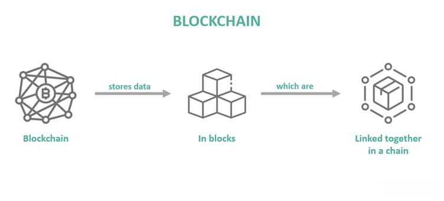

## Table of Contents

## What is an orphan block in blockchain?

An orphan block in blockchain is a block that is not part of the main chain. This happens when two miners find a valid block at almost the same time. The network has to choose which block to add to the main chain. The block that is not chosen becomes an orphan block.

Orphan blocks are not completely useless. They can still be used to verify transactions. However, they do not contribute to the security of the blockchain like the blocks in the main chain do. Over time, as more blocks are added to the main chain, orphan blocks become less important.

## How does an orphan block occur?

An orphan block happens when two miners solve a block at the same time. Imagine two miners, let's call them Miner A and Miner B, are working on the same block. They both find the solution at almost the same moment. When this happens, the blockchain network has to decide which block to add to the main chain.

The network usually chooses the block that most miners see first. The block that is not chosen becomes an orphan block. It's like the network saying, "We'll use this block, but we'll keep the other one just in case." Orphan blocks don't get the rewards that miners usually get, but they can still help verify transactions. Over time, as more blocks are added to the main chain, orphan blocks become less important.

## What is the difference between an orphan block and a stale block?

An orphan block and a stale block are similar but not exactly the same. An orphan block happens when two miners find a solution to a block at the same time. The network has to choose one block to add to the main chain, and the block that is not chosen becomes an orphan block. It's like the network saying, "We'll use this block, but we'll keep the other one just in case."

A stale block, on the other hand, is a block that a miner has worked on but didn't finish in time. By the time the miner finishes the block, the network has already moved on to a new block. So, the miner's block becomes stale because it's no longer needed. Both orphan and stale blocks don't get the rewards that miners usually get, but they can still help verify transactions.

## How do orphan blocks affect the blockchain network?

Orphan blocks can make the blockchain network a bit slower. When two miners find a block at the same time, the network has to choose which one to use. This can cause a small delay because the network needs time to decide. But, this delay is usually very short, and the network keeps working well.

Orphan blocks don't hurt the blockchain's safety. They can still help check if transactions are real. But, they don't add to the chain's strength like the main blocks do. Over time, as more blocks are added to the main chain, orphan blocks become less important and don't affect the network much.

## What happens to the transactions in an orphan block?

When a block becomes an orphan, the transactions inside it don't disappear. They are still important and need to be added to the blockchain. The network will put these transactions into a new block or into another block that is being made. This way, the transactions still get to be part of the blockchain, just not in the original orphan block.

This process helps keep the blockchain working smoothly. Even though the orphan block itself is not part of the main chain, the transactions it contains are not lost. They are moved to another block, making sure that the blockchain stays accurate and complete.

## How can miners prevent creating orphan blocks?

Miners can't completely stop orphan blocks from happening, but they can do some things to make them less likely. One way is to use faster internet connections. If a miner can send their solved block to the network quicker, there's a better chance that their block will be the one the network chooses. Another way is to work with other miners in mining pools. When miners work together, they can share information faster and have a better chance of getting their block added to the main chain.

Even with these efforts, orphan blocks can still happen because the timing of solving a block is hard to control. It's a bit like a race where everyone starts at the same time, but the finish line keeps moving. Miners can try their best to be faster and more connected, but sometimes, two miners will still finish at the same time, leading to an orphan block. So, while miners can take steps to reduce the chances, they can't eliminate the problem entirely.

## What is the impact of orphan blocks on mining profitability?

Orphan blocks can make mining less profitable for miners. When a miner finds a block but it becomes an orphan, they don't get the reward for that block. This means they spent time and energy solving the block, but they didn't get paid for it. If a miner has a lot of orphan blocks, it can add up and make their overall earnings lower.

To reduce the chance of orphan blocks, miners can use faster internet connections or join mining pools. Faster internet helps get their solved block to the network quicker, making it more likely to be added to the main chain. Mining pools let miners work together and share resources, which can help them be more efficient. Even with these efforts, orphan blocks can still happen, so miners always have to think about this risk when they plan their mining activities.

## How do different blockchain protocols handle orphan blocks?

Different blockchain protocols handle orphan blocks in their own ways, but the main goal is always to keep the blockchain working smoothly. In Bitcoin, when two miners find a block at the same time, the network chooses the block that most miners see first. The other block becomes an orphan. Bitcoin's system is designed to quickly move on and add new blocks, so orphan blocks don't cause big problems. The transactions in the orphan block are put into new blocks, making sure they are still part of the blockchain.

Ethereum handles orphan blocks a bit differently. Ethereum uses a system called "GHOST" (Greedy Heaviest Observed Subtree) to deal with orphan blocks. This system gives some rewards to miners of orphan blocks, which helps keep mining fair and encourages miners to keep working even if their block becomes an orphan. Like Bitcoin, Ethereum also makes sure that the transactions in orphan blocks are added to the blockchain, but the GHOST protocol helps manage the impact of orphan blocks better.

## Can orphan blocks be reintroduced into the blockchain?

Orphan blocks themselves cannot be directly reintroduced into the blockchain. Once a block becomes an orphan, it is no longer part of the main chain. The blockchain network chooses one block to add to the main chain, and the other block stays as an orphan. 

However, the transactions inside an orphan block can be added to the blockchain. The network will put these transactions into a new block or into another block that is being made. This way, the transactions are still included in the blockchain, even though the original orphan block is not.

## What are the security implications of orphan blocks?

Orphan blocks don't really make the blockchain less safe. They are just blocks that didn't get added to the main chain because two miners found a solution at the same time. The blockchain still works well and stays secure because the network quickly chooses one block and keeps going. The transactions in the orphan block are put into new blocks, so they are still part of the blockchain.

However, orphan blocks can be used in some ways to try and trick the network. If someone wanted to mess with the blockchain, they could try to make a lot of orphan blocks to slow things down. But this is hard to do and doesn't usually work because the network is good at choosing the right blocks and keeping things moving. So, while orphan blocks don't hurt the blockchain's safety directly, they can be part of bigger tricks if someone is trying to cause trouble.

## How do orphan rates vary across different blockchain networks?

Orphan rates can be different for each blockchain network. In Bitcoin, the orphan rate is usually low, around 1% or less. This is because Bitcoin has a lot of miners and a strong network, so it can quickly choose which block to add to the main chain. But, if the network gets busy or if miners are far away from each other, the orphan rate can go up a bit.

In Ethereum, the orphan rate is also low, but it can be a bit higher than Bitcoin's because Ethereum's blocks come faster. Ethereum uses a special system called GHOST to help with orphan blocks. This system gives some rewards to miners of orphan blocks, which can make the orphan rate a bit lower. But, like Bitcoin, if the network is busy or if miners are not well connected, the orphan rate can go up.

## What research has been conducted on optimizing orphan block management?

Researchers have been working on ways to make orphan block management better. They want to make the blockchain faster and more fair for miners. One big idea is to change how the network picks which block to add to the main chain. Instead of just choosing the first block it sees, the network could look at other things, like how many miners support each block. This could help lower the number of orphan blocks and make mining more profitable for everyone.

Another area of research is about giving miners rewards for finding orphan blocks. Some blockchains, like Ethereum, already do this with the GHOST system. Researchers are studying how to make this system even better. They are looking at ways to share rewards more fairly among miners and make sure that the blockchain stays safe and works well, even with more orphan blocks. By trying out these new ideas, researchers hope to make blockchain networks stronger and more efficient.

## References & Further Reading

[1]: Nakamoto, S. (2008). ["Bitcoin: A Peer-to-Peer Electronic Cash System."](https://nakamotoinstitute.org/library/bitcoin/) 

[2]: Buterin, V. (2013). ["A Next-Generation Smart Contract and Decentralized Application Platform."](https://www.semanticscholar.org/paper/A-NEXT-GENERATION-SMART-CONTRACT-%26-DECENTRALIZED-Buterin/0dbb8a54ca5066b82fa086bbf5db4c54b947719a) Ethereum White Paper.

[3]: Narayanan, A., Bonneau, J., Felten, E., Miller, A., & Goldfeder, S. (2016). ["Bitcoin and Cryptocurrency Technologies: A Comprehensive Introduction."](https://press.princeton.edu/books/hardcover/9780691171692/bitcoin-and-cryptocurrency-technologies) Princeton University Press.

[4]: Gandal, N., & Halaburda, H. (2016). ["Can We Predict the Winner in a Market with Network Effects? Competition in Cryptocurrency Market."](https://papers.ssrn.com/sol3/papers.cfm?abstract_id=2832836) Journal of Industrial Economics.

[5]: Antonopoulos, A. M. (2014). ["Mastering Bitcoin: Unlocking Digital Cryptocurrencies."](https://books.google.com/books/about/Mastering_Bitcoin.html?id=IXmrBQAAQBAJ) O'Reilly Media.

[6]: Biais, B., Bisiere, C., Bouvard, M., & Casamatta, C. (2019). ["The Blockchain Folk Theorem."](https://papers.ssrn.com/sol3/papers.cfm?abstract_id=3108601) The Review of Economic Studies.

[7]: Gandal, N., Hamrick, J. T., Moore, T., & Oberman, T. (2018). ["Price Manipulation in the Bitcoin Ecosystem."](https://tylermoore.utulsa.edu/jme17.pdf) Journal of Monetary Economics.

[8]: Mougayar, W. (2016). ["The Business Blockchain: Promise, Practice, and Application of the Next Internet Technology."](https://books.google.com/books/about/The_Business_Blockchain.html?id=CEsPDAAAQBAJ) Wiley.

[9]: Bonneau, J., Miller, A., Clark, J., Narayanan, A., Kroll, J. A., & Felten, E. W. (2015). ["Sok: Research Perspectives and Challenges for Bitcoin and Cryptocurrencies."](https://ieeexplore.ieee.org/document/7163021) IEEE Symposium on Security and Privacy.