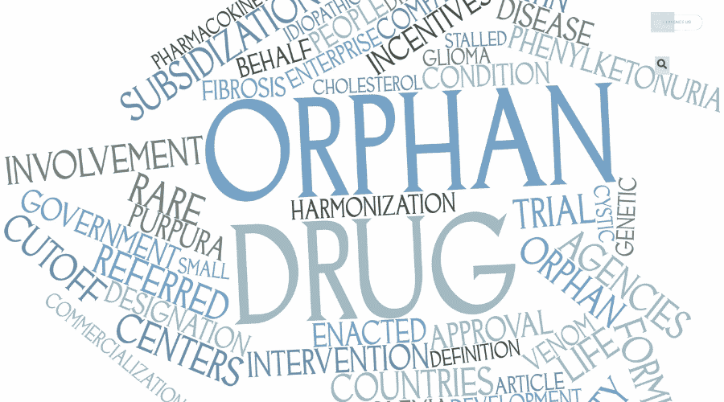

In recent years, the pharmaceutical industry has experienced remarkable progress in developing orphan drugs designed to treat rare diseases. Orphan drugs are essential for addressing the unmet medical needs of small patient populations, often suffering from conditions with limited treatment options. This specialization not only meets healthcare requirements but also presents pharmaceutical companies with distinct financial and strategic advantages. Orphan drugs benefit from exclusive marketing rights, tax incentives, and regulatory assistance, which contribute to their potential profitability despite the limited market size.

Simultaneously, the finance sector has been transformed by the advent of algorithmic trading, where advanced mathematical models and cutting-edge technology intersect to refine trading decisions. Algorithmic trading uses automated processes to strategically execute trades at speeds and efficiencies unattainable by human traders. The integration of sophisticated algorithms allows investors to capitalize on minute market fluctuations, thereby optimizing their trading performance across various sectors, including pharmaceuticals.



This article examines the intersection between orphan drug designation and algorithmic trading. We will explore the potential implications and opportunities this convergence offers to investors. By analyzing how these two domains align, investors can leverage the exclusive rights and regulatory frameworks associated with orphan drugs to inform and enhance their trading strategies. Understanding the incentives underlying orphan drug development can provide key insights into stock market behaviors and investment opportunities within the healthcare market. Moreover, this nuanced perspective enables stakeholders to navigate this specialized segment more effectively, potentially maximizing returns while supporting advancements in the treatment of rare diseases.

## Table of Contents

## Understanding Orphan Drug Designation

Orphan drug designation is a critical mechanism employed by regulatory bodies, such as the U.S. Food and Drug Administration (FDA) and the European Medicines Agency (EMA), to foster the development of therapeutics for rare diseases, also referred to as orphan diseases. These conditions are characterized by their low prevalence, often affecting fewer than 200,000 individuals in the United States, as defined by the Orphan Drug Act of 1983. In the European Union, a disease is considered rare if it affects fewer than 5 in 10,000 people.

The primary incentives for orphan drug designation include exclusive marketing rights upon approval, tax credits for qualified clinical testing, and assistance in the drug development process. In the U.S., successful designation can lead to seven years of market exclusivity post-approval, whereas the EU offers ten years. This exclusivity prevents direct competition from other manufacturers, enabling the originating company to recoup research and development costs.

Tax incentives are also a significant financial motivator. For instance, in the United States, a company can receive up to 25% tax credit on clinical testing expenses, alleviating the substantial costs associated with clinical trials. Moreover, in many cases, fees associated with regulatory applications, such as the Prescription Drug User Fee, may be waived.

Despite their lucrative potential, the market for orphan drugs is inherently limited due to the rarity of the diseases they treat. This smaller market presents unique challenges. Pharmaceutical companies must balance the high costs of development with the limited patient pool, necessitating higher prices to achieve profitability. However, these higher prices can limit access to medication for patients without comprehensive insurance or adequate reimbursement frameworks.

Investors are presented with both opportunities and challenges in this niche market. The promise of exclusivity and incentives makes orphan drugs attractive investments; however, the small market size and the need for substantial capital investment can increase financial risk. Investors must carefully weigh these factors when considering involvement in the orphan drug sector.

Orphan drug designation thus serves as an essential tool in addressing unmet medical needs for rare diseases, aligning the financial interests of pharmaceutical companies with public health goals. The resulting drugs can significantly improve patient outcomes while offering viable economic returns, provided the inherent risks are properly managed.

## Pharmaceutical Financial Incentives

The development of orphan drugs is supported by various financial incentives designed to encourage pharmaceutical companies to invest in treatments for rare diseases. These incentives are crucial given the substantial costs associated with drug development and the limited market potential due to the small patient populations affected by rare conditions.

One of the primary incentives is tax credits for clinical trials. In the United States, for example, the Orphan Drug Tax Credit (ODTC) allows companies to claim a credit of up to 25% of qualified clinical trial expenses, effectively lowering the financial burden of bringing a new drug to market. This reduction in out-of-pocket costs makes it more feasible for companies to pursue niche pharmaceutical innovations that might otherwise be financially prohibitive.

Additionally, orphan drug designation provides fee waivers for regulatory submissions, including those associated with New Drug Applications (NDA) and Biologics License Applications (BLA). These waived fees can represent significant savings, as the costs of these regulatory processes can run into millions of dollars.

Another critical incentive is the grant of market exclusivity. In the U.S., orphan drugs benefit from seven years of market exclusivity following approval, while in the European Union, this period extends to ten years. During this time, no competitor can market a similar drug for the same indication, even if the competitor demonstrates bioequivalence. This exclusivity ensures a temporary monopoly, allowing the sponsoring company to recoup research and development expenses.

For entrepreneurs, these financial incentives reduce the inherent risks of drug development. The high failure rates of drugs during clinical trials and the resource-intensive nature of pharmaceutical R&D make risk mitigation vital. The combination of tax benefits, reduced regulatory fees, and guaranteed market protection post-approval creates a more favorable financial landscape, incentivizing investment in treatments for rare diseases. 

The structured financial support for orphan drugs exemplifies legislative and regulatory efforts to spur innovation where traditional market mechanisms falter due to inadequate demand. These incentives have resulted in a growing number of orphan drug approvals, highlighting their effectiveness in stimulating pharmaceutical advancements for underserved patient communities.

## Algorithmic Trading in Pharmaceuticals

Algorithmic trading utilizes sophisticated computer algorithms to streamline trading strategies in financial markets, enhancing efficiency and responsiveness. In the pharmaceutical sector, this approach is particularly beneficial, given the dynamic and volatile nature of drug development and approval processes. Algorithmic trading systems monitor a wide array of market signals, such as drug approvals, mergers, and key economic indicators, to facilitate rapid and informed trading decisions. These systems can track high-frequency data points across various platforms, enabling traders to respond swiftly to emerging opportunities or risks.

The specific application of [algorithmic trading](/wiki/algorithmic-trading) to orphan drugs involves the development of algorithms that consider the unique regulatory milestones and market exclusivity periods associated with these drugs. Orphan drugs, aimed at treating rare diseases, undergo a distinct approval process that can cause significant movements in pharmaceutical stock prices. By factoring in these regulatory events, such as FDA or EMA approval notifications, trading algorithms can anticipate stock movements and adjust positions accordingly.

For example, when a pharmaceutical company receives orphan drug designation, it typically experiences a positive stock market reaction due to the anticipated market exclusivity and reduced competition. Algorithmic trading systems can integrate this information, alongside timelines for clinical trials and expected approval dates, to refine trading strategies. Python algorithms can be employed to analyze patterns and predict fluctuations in stock prices. A simplified example of such a strategy could involve retrieving real-time stock data through APIs, processing this data to assess market sentiment and trends, and executing trades based on predetermined conditions.

```python
import numpy as np
import pandas as pd
from sklearn.linear_model import LogisticRegression
from trading_api import get_real_time_stock_data, execute_trade

# Fetch real-time stock data
stock_data = get_real_time_stock_data('PHARMA_COMPANY')

# Process data to find significant changes
stock_data['Price Change'] = stock_data['Close'] - stock_data['Open']

# Define a simple algorithmic strategy
def trading_strategy(stock_data):
    model = LogisticRegression()
    X = stock_data[['Price Change']].values
    y = (stock_data['Close'] > stock_data['Open']).astype(int)
    model.fit(X, y)

    predictions = model.predict(X)
    if predictions[-1]:  # If the last prediction is positive
        execute_trade('BUY', 'PHARMA_COMPANY')
    else:
        execute_trade('SELL', 'PHARMA_COMPANY')

# Execute the trading strategy
trading_strategy(stock_data)
```

This approach enables traders to leverage insights from regulatory milestones and market conditions, optimizing their investments in pharmaceutical stocks associated with orphan drug programs. By systematically incorporating information about approvals, exclusivity timelines, and market responses, algorithmic trading not only heightens efficiency but also enhances profitability in the context of orphan drug investments.

## The Intersection of Orphan Drug Designation and Algo Trading

Investors and traders can leverage algorithmic trading strategies to capitalize on the unique opportunities presented by orphan drug designations. These designations, which confer benefits such as market exclusivity and potential stock market reactions, create specific market conditions that can be strategically navigated using advanced algorithms.

Algorithmic trading offers the capability to integrate key information, including pending drug approvals and exclusivity timelines, into trading models. Such integration enables traders to optimize positions in pharmaceutical stocks engaged in orphan drug programs. By programming algorithms to account for these critical regulatory milestones, traders can anticipate stock movements that often follow announcements of orphan drug status or related regulatory decisions. For example, when a pharmaceutical company announces an orphan drug designation, the resulting market reaction can be swift and significant, providing opportunities for algorithm-driven trades.

Understanding the cyclical phases of drug development is crucial for refining prediction models used in algorithmic trading strategies. The drug development process, which includes phases such as clinical trials and regulatory approvals by institutions like the FDA, influences stock prices at various stages. Algorithms can be designed to recognize patterns and trends associated with these phases, thereby forecasting potential stock price fluctuations. For instance, the probability of a successful Phase III clinical trial could be factored into an algorithmic model to predict a rise in stock price upon a favorable outcome.

In Python, traders can construct an algorithmic trading model as follows:

```python
import pandas as pd
from datetime import datetime
from sklearn.ensemble import RandomForestClassifier

# Load dataset of pharmaceutical stocks with orphan drug designations
stocks_data = pd.read_csv('stocks_data.csv')

# Filter data for relevant features: approval dates, trial phases, exclusivity periods
data_features = stocks_data[['approval_date', 'trial_phase', 'exclusivity']]

# Convert approval date to a numerical format for model compatibility
data_features['approval_date'] = pd.to_datetime(data_features['approval_date'])
data_features['approval_date'] = data_features['approval_date'].map(datetime.toordinal)

# Target variable: stock performance (binary classification: up/down)
target = stocks_data['stock_performance']

# Train a Random Forest Classifier to predict stock movement
model = RandomForestClassifier(n_estimators=100, random_state=42)
model.fit(data_features, target)

# Predict stock movement for new data
new_data = pd.DataFrame({
    'approval_date': [datetime.now().toordinal()],
    'trial_phase': [3], # Assuming phase III as a hypothetical scenario
    'exclusivity': [7]  # Hypothetical exclusivity period in years
})

predicted_movement = model.predict(new_data)
print("Predicted Stock Movement:", "Up" if predicted_movement[0] == 1 else "Down")
```

This script demonstrates the potential for incorporating [machine learning](/wiki/machine-learning) techniques, such as random forest classifiers, into algorithmic trading strategies. By utilizing historical data on orphan drug designations and corresponding stock performances, alongside real-time data inputs, traders can develop sophisticated models to predict and respond to market changes.

The ability to navigate complex data sets and rapidly evolving market conditions is crucial in this niche segment of the pharmaceutical industry. As algorithmic trading continues to advance, the integration of regulatory insights with quantitative models will likely enhance the efficacy and profitability of trading strategies centered around orphan drug designations.

## Regulatory Considerations and Challenges

Obtaining orphan drug status is a complex process that demands a thorough understanding of regulatory frameworks in both the United States and Europe. The U.S. Food and Drug Administration (FDA) and the European Medicines Agency (EMA) have specific criteria that a pharmaceutical compound must meet to qualify as an orphan drug. In the U.S., the disease or condition for which the drug is intended must affect fewer than 200,000 individuals. Similarly, the EMA defines a rare condition as one affecting no more than five in 10,000 people in the European Union.

One of the primary challenges in this process is justifying the medical necessity of the drug. Pharmaceutical companies must demonstrate that the drug addresses an unmet medical need or offers significant improvements over existing treatments. This can involve providing comprehensive clinical evidence and robust data to support the drug's potential benefits. Such proof is crucial for gaining the confidence of regulatory bodies and meeting the stringent criteria for orphan designation. Additionally, financial and time investments in clinical trials are substantial, with no guarantee of success.

Furthermore, proving the drug's superiority over existing treatments is essential. This superiority can be depicted either in terms of efficacy or safety profile. Pharmaceutical companies often face hurdles in designing studies that can statistically demonstrate these advantages. Meeting regulatory timelines also poses a significant challenge. Both the FDA and EMA have specific timelines for submission, review, and approval, and any deviation can delay the drug's market entry, affecting financial forecasts and trading strategies.

Algorithmic traders should be cognizant of these regulatory hurdles as they can have profound implications for stock performance. Delays in regulatory approval or failures to meet medical necessity criteria can lead to significant [volatility](/wiki/volatility-trading-strategies) in a company's stock price. Traders can incorporate monitoring of regulatory submissions, updates, and approvals into their algorithmic models. Such models could consider timing elements such as expected review periods and historical approval rates to forecast stock movements. By understanding the regulatory landscape and its impact on orphan drug development, traders can better manage risks and anticipate potential market fluctuations.

## Conclusion

The convergence of orphan drug designation and algorithmic trading presents innovative opportunities for investors and pharmaceutical companies. The unique status granted to orphan drugs offers significant financial incentives such as tax credits and market exclusivity, which can considerably reduce the economic risks of drug development. These incentives create a lucrative environment for pharmaceutical firms focusing on rare diseases, allowing them to address unmet medical needs while optimizing their financial outcomes.

In parallel, the application of algorithmic trading in the pharmaceutical sector enhances the ability to make informed investment decisions based on real-time financial data and regulatory milestones. Algorithms can be programmed to monitor developments such as orphan drug designations and market exclusivity expirations, enabling traders to predict stock market reactions and optimize their portfolios accordingly. This synchronization of financial strategies with regulatory milestones can lead to maximized returns and reduced volatility in investments linked to orphan drug companies.

As the sectors of orphan drug development and algorithmic trading continue to evolve, stakeholders must stay informed of regulatory changes and market trends. Adaptation to these dynamics, through continuous learning and the refinement of algorithms, will be key to maintaining a competitive edge. By strategically leveraging these opportunities, investors and pharmaceutical companies can effectively navigate and capitalize on the niche market that orphan drugs represent, ensuring both financial success and contributions to global health advancements.

## References & Further Reading

[1]: ["The Orphan Drug Act: Implementation and Impact"](https://oig.hhs.gov/reports/all/2001/the-orphan-drug-act-implementation-and-impact/) by Aaron S. Kesselheim, MD, JD, MPH, Health Affairs.

[2]: [FDA Orphan Drug Designation Database](https://www.accessdata.fda.gov/scripts/opdlisting/oopd/index.cfm) - U.S. Food and Drug Administration.

[3]: ["Advances in Financial Machine Learning"](https://www.amazon.com/Advances-Financial-Machine-Learning-Marcos/dp/1119482089) by Marcos Lopez de Prado.

[4]: ["Quantitative Trading: How to Build Your Own Algorithmic Trading Business"](https://www.amazon.com/Quantitative-Trading-Build-Algorithmic-Business/dp/1119800064) by Ernest P. Chan.

[5]: ["Orphan Drugs in the United States: An Examination of Patents and Orphan Drug Exclusivity"](https://rarediseases.org/wp-content/uploads/2021/03/NORD-Avalere-Report-2021_FNL-1.pdf) by Duke University Margolis Center for Health Policy.

[6]: ["Algorithmic and High-Frequency Trading"](https://assets.cambridge.org/97811070/91146/frontmatter/9781107091146_frontmatter.pdf) by Álvaro Cartea, Sebastian Jaimungal, and José Penalva.

[7]: ["Evidence-Based Technical Analysis: Applying the Scientific Method and Statistical Inference to Trading Signals"](https://www.amazon.com/Evidence-Based-Technical-Analysis-Scientific-Statistical/dp/0470008741) by David Aronson.