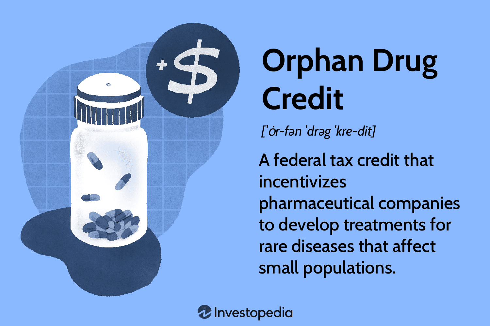

## Table of Contents

## What is an Orphan Drug?

An Orphan Drug is a medicine that is developed to treat a rare disease. These diseases affect only a small number of people, so drug companies might not want to make these medicines because they won't make much money from them. To help, governments give special help to these drugs, like tax breaks and longer time to sell the drug without competition.

These special helps are called "orphan drug designation." They encourage drug companies to research and make drugs for rare diseases. This is important because people with rare diseases often have no other treatment options. By giving these incentives, more people with rare diseases can get the medicines they need.

## What is the Orphan Drug Tax Credit?

The Orphan Drug Tax Credit is a special help from the government for companies that make medicines for rare diseases. These medicines are called orphan drugs. The tax credit lets companies get back some of the money they spend on making these drugs. It's like a reward for working on treatments that only a few people need.

This tax credit is important because it encourages companies to spend time and money on research for rare diseases. Without this help, companies might not want to make these drugs because they won't make much money from them. By giving this tax credit, more people with rare diseases can have a chance to get the medicines they need.

## Who qualifies for the Orphan Drug Tax Credit?

The Orphan Drug Tax Credit is for companies that make medicines for rare diseases. These medicines are called orphan drugs. To qualify, the drug must be for a disease that affects fewer than 200,000 people in the United States. The company also needs to get a special approval from the government, called an orphan drug designation, before they can get the tax credit.

Once a company gets this approval, they can claim the tax credit. The credit lets them get back some of the money they spent on making the drug. This helps them because making medicines for rare diseases can be expensive and they won't make much money from selling them. The tax credit makes it easier for companies to work on these important medicines.

## How does the Orphan Drug Tax Credit benefit pharmaceutical companies?

The Orphan Drug Tax Credit helps pharmaceutical companies by giving them money back for the costs of making medicines for rare diseases. These medicines are called orphan drugs. Making these drugs can be very expensive, and since only a few people need them, companies might not make much money from selling them. The tax credit helps by letting companies get back some of the money they spent. This makes it easier for them to work on these important medicines without losing too much money.

This tax credit also encourages companies to do more research on rare diseases. Without the tax credit, companies might not want to spend time and money on these drugs because they won't make much profit. But with the tax credit, they can get some of their money back, which makes it more worth it for them to try to help people with rare diseases. This means more people who have these rare diseases can have a chance to get the medicines they need.

## What are the eligibility criteria for obtaining the Orphan Drug Tax Credit?

To get the Orphan Drug Tax Credit, a company needs to make a medicine for a rare disease. The disease must affect fewer than 200,000 people in the United States. The company also needs to get a special approval from the government, called an orphan drug designation, before they can get the tax credit. This approval shows that the medicine is for a rare disease and helps the company get the tax credit.

Once a company gets this approval, they can claim the tax credit. The credit lets them get back some of the money they spent on making the drug. This is important because making medicines for rare diseases can be very expensive, and companies won't make much money from selling them. The tax credit helps them by giving them some of their money back, which makes it easier for them to work on these important medicines.

## How is the Orphan Drug Tax Credit calculated?

The Orphan Drug Tax Credit is calculated based on the money a company spends on making a medicine for a rare disease. The credit lets the company get back 25% of the money they spent on what's called "qualified clinical testing expenses." These expenses are the costs of testing the medicine to make sure it works and is safe for people with the rare disease.

To get this credit, the company needs to keep good records of all the money they spent on these tests. They then use these records to figure out how much money they can get back. This tax credit helps companies because making medicines for rare diseases can be very expensive, and they won't make much money from selling them. By getting some of their money back, it's easier for them to keep working on these important medicines.

## What is the process for applying for the Orphan Drug Tax Credit?

To apply for the Orphan Drug Tax Credit, a company first needs to get a special approval from the government called an orphan drug designation. This approval shows that the medicine they are making is for a rare disease that affects fewer than 200,000 people in the United States. The company applies for this designation by sending a request to the U.S. Food and Drug Administration (FDA). The request should include information about the disease, the medicine, and why it's needed.

Once the company gets the orphan drug designation, they can start working on the medicine and keeping track of all the money they spend on testing it. This testing is called "qualified clinical testing." After the testing is done, the company can claim the tax credit on their tax return. They need to fill out a special form called Form 8820 and attach it to their tax return. The tax credit lets them get back 25% of the money they spent on the testing, which helps them because making medicines for rare diseases can be very expensive.

## Can the Orphan Drug Tax Credit be combined with other tax incentives?

Yes, the Orphan Drug Tax Credit can be combined with other tax incentives. This means that a company making a medicine for a rare disease can get more than one kind of help from the government. For example, they might also get a tax break for doing research and development, or they might get help with the costs of making the medicine. These extra incentives can make it even easier for companies to work on medicines for rare diseases.

Combining these tax incentives can be a big help for companies. It can make up for the high costs of making these medicines and the fact that they won't make much money from selling them. By getting more help from the government, companies are more likely to spend time and money on research for rare diseases. This means more people with these diseases can have a chance to get the medicines they need.

## What are the common challenges faced when applying for the Orphan Drug Tax Credit?

Applying for the Orphan Drug Tax Credit can be hard because it takes a lot of work to get the special approval called the orphan drug designation. Companies need to show the FDA that their medicine is for a rare disease that affects fewer than 200,000 people in the United States. This means they have to do a lot of research and write a good request to the FDA. If they don't do this right, they might not get the approval they need to get the tax credit.

Another challenge is keeping track of all the money spent on testing the medicine. Companies need to keep very good records of their "qualified clinical testing expenses" because these are the costs they can get back 25% of. If they don't keep good records, they might not be able to claim the full amount of the tax credit. This can make the process of applying for the tax credit more complicated and time-consuming.

## How have recent legislative changes affected the Orphan Drug Tax Credit?

Recent changes in the law have made some changes to the Orphan Drug Tax Credit. Before, companies could get back 50% of the money they spent on testing their medicine for rare diseases. But now, the credit has been lowered to 25%. This means companies get less money back than before. The change was made to help save money for the government, but it might make it harder for companies to work on medicines for rare diseases.

Even with this change, the Orphan Drug Tax Credit is still very important. It helps companies by giving them some money back for the costs of making medicines that only a few people need. This encourages them to keep doing research on rare diseases. Without this help, companies might not want to spend time and money on these drugs because they won't make much profit. So, even though the credit is smaller now, it still plays a big role in helping people with rare diseases get the medicines they need.

## What are some case studies of companies that have successfully utilized the Orphan Drug Tax Credit?

One company that has successfully used the Orphan Drug Tax Credit is BioMarin Pharmaceutical. They make a medicine called Vimizim, which helps people with a rare disease called Morquio A syndrome. This disease affects only a very small number of people, so without the tax credit, BioMarin might not have been able to spend the money needed to make Vimizim. The tax credit helped them get back some of the money they spent on testing the medicine, which made it possible for them to keep working on it. Now, people with Morquio A syndrome have a treatment that can help them live better lives.

Another example is Alexion Pharmaceuticals, which makes a drug called Soliris. Soliris treats a rare disease called paroxysmal nocturnal hemoglobinuria (PNH). This disease is very hard to live with, and before Soliris, there were no good treatments. The Orphan Drug Tax Credit helped Alexion by giving them money back for the costs of making Soliris. This made it easier for them to do the research and testing needed to bring the medicine to people who need it. Thanks to the tax credit, many people with PNH now have a medicine that can help them.

## What are the future prospects and potential reforms for the Orphan Drug Tax Credit?

The future of the Orphan Drug Tax Credit looks like it will keep helping companies make medicines for rare diseases. People with these diseases really need these medicines, and the tax credit makes it easier for companies to do the research and testing they need. But there might be some changes coming. Some people think the credit should be even smaller than it is now, or that there should be more rules about who can get it. These changes could make it harder for companies to use the credit, but they might also make sure the money is used in the best way possible.

There are also ideas about making the process of getting the tax credit easier. Right now, it can be hard for companies to get the special approval they need and to keep track of all their costs. If the process was simpler, more companies might be able to use the tax credit to help people with rare diseases. No matter what changes happen, the main goal will still be to make sure people with rare diseases can get the medicines they need. The Orphan Drug Tax Credit is a big part of that, and it will keep being important in the future.

## References & Further Reading

[1]: Wellman-Labadie, O., & Zhou, Y. (2010). ["The US Orphan Drug Act: Rare Disease Research Stimulator or Commercial Opportunity?"](https://pubmed.ncbi.nlm.nih.gov/20036435/). Health Policy.

[2]: Bryson, P., & Fox, J. (2019). ["Understanding the Orphan Drug Act: How Policy Drives Innovation in Rare Disease Drug Development."](https://link.springer.com/article/10.1007/s12038-024-00425-y). Global Forum.

[3]: Grabowski, H., & Kyle, M. (2007). ["Generic Competition and Market Exclusivity Periods in Pharmaceuticals."](https://onlinelibrary.wiley.com/doi/10.1002/mde.1356). Managerial and Decision Economics.

[4]: Avorn, J. (2015). ["The Orphan Drug Act: Institutional Innovation and Evolution."](https://pubmed.ncbi.nlm.nih.gov/31935033/). The New England Journal of Medicine.

[5]: Orphan Products: Hope for People With Rare Diseases (FDA Consumer Article). ["Orphan Drug Designation Program."](https://pubmed.ncbi.nlm.nih.gov/14986582/). U.S. Food and Drug Administration.