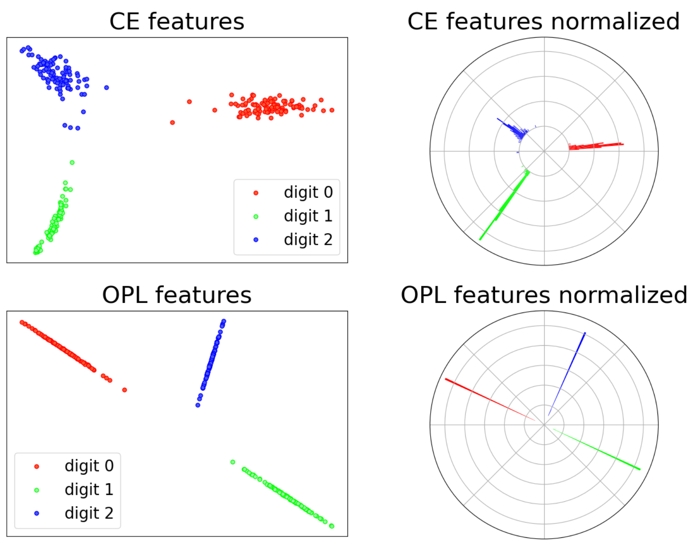

## Table of Contents

## What are orthogonal features in the context of data analysis?

Orthogonal features in data analysis are like different pieces of information that don't overlap or influence each other. Imagine you're looking at a set of data about cars. If you have one feature that is the car's color and another that is the car's engine size, these are orthogonal because knowing the color doesn't tell you anything about the engine size, and vice versa. They are independent of each other, which means they provide unique information that helps in understanding the data better without any redundancy.

In practical terms, using orthogonal features can make your data analysis more efficient and accurate. When features are orthogonal, it's easier to build models because each feature contributes new information without duplicating what other features already tell you. This is especially useful in machine learning, where models can become more powerful and less complex when they use features that are independent of each other. By ensuring your features are orthogonal, you can avoid issues like multicollinearity, which can complicate your analysis and lead to less reliable results.

## How do orthogonal features differ from correlated features?

Orthogonal features are like different pieces of a puzzle that don't overlap. They give you new information that you can't get from the other pieces. For example, if you're looking at data about houses, the size of the house and the color of the walls are orthogonal features. Knowing the size doesn't tell you anything about the color, and knowing the color doesn't tell you anything about the size. They are independent, so they help you understand the data better without repeating information.

On the other hand, correlated features are pieces of information that do overlap or influence each other. If you look at the same house data, the size of the house and the number of rooms are correlated features. Usually, a bigger house has more rooms, so knowing the size gives you a good guess about the number of rooms. When features are correlated, they can make your data analysis trickier because they might be telling you the same thing in different ways, which can lead to confusion or less accurate results.

Using orthogonal features in your analysis is like having a clear, organized set of information. It makes it easier to build models and understand what's going on. Correlated features, while useful in some cases, need careful handling to make sure they don't mess up your results. Keeping an eye on whether your features are orthogonal or correlated can really help you get the most out of your data.

## Why are orthogonal features important in machine learning models?

Orthogonal features are important in machine learning models because they help make the models simpler and more accurate. When features are orthogonal, it means they give you different pieces of information that don't overlap. This is like having different tools in a toolbox, each doing a unique job. In a machine learning model, this means each feature can help the model learn something new without repeating what other features already told it. This makes the model easier to understand and less likely to get confused by the data.

Another reason orthogonal features are important is that they help avoid a problem called multicollinearity. Multicollinearity happens when features are too similar or correlated, which can make the model's predictions less reliable. By using orthogonal features, you reduce the chance of this happening because each feature is independent. This leads to more stable and trustworthy models. In the end, using orthogonal features helps you build better machine learning models that can make more accurate predictions and are easier to work with.

## Can you explain the concept of orthogonality in linear algebra as it relates to features?

In linear algebra, orthogonality means that two vectors are at right angles to each other. Imagine you have two arrows on a piece of paper. If one arrow points straight up and the other points straight to the side, they are orthogonal because they don't overlap at all. In the context of features, if you think of each feature as a vector, orthogonal features are like these arrows. They give you information that doesn't overlap, so knowing one feature doesn't help you predict the other.

When we use orthogonal features in data analysis, it's like using these non-overlapping arrows to understand our data better. Each feature adds new information without repeating what other features already tell us. This makes our models simpler and more accurate because each piece of information is unique. It's like having different tools in a toolbox, each doing a specific job without getting in the way of the others.

## How can one identify orthogonal features in a dataset?

To identify orthogonal features in a dataset, you can start by looking at how each feature relates to the others. One way to do this is by calculating the correlation between features. If two features have a correlation close to zero, it means they are not related to each other and might be orthogonal. You can use a correlation matrix to see all the correlations at once. If you see a lot of zeros or very small numbers in the matrix, those are good signs that the features are orthogonal.

Another method to identify orthogonal features is by using a technique called Principal Component Analysis (PCA). PCA helps you find new features that are combinations of your original ones, and these new features are guaranteed to be orthogonal. By applying PCA to your dataset, you can see which original features contribute the most to these new orthogonal features. This can give you a good idea of which of your original features are already close to being orthogonal.

In summary, checking the correlation between features and using PCA are two practical ways to find out if your features are orthogonal. Both methods help you understand how independent your features are from each other, which is important for making your data analysis and machine learning models work better.

## What are the benefits of using orthogonal features in regression analysis?

Using orthogonal features in regression analysis makes things simpler and more accurate. When features are orthogonal, they don't overlap or influence each other. This means each feature gives new information that the others don't. In regression, this helps the model understand the data better because it's not confused by features that are too similar. It's like having different tools, each doing its own job without getting in the way of the others. This makes the model easier to build and understand.

Another big benefit is that orthogonal features help avoid a problem called multicollinearity. Multicollinearity happens when features are too similar, which can mess up the model's predictions. By using orthogonal features, you reduce the chance of this happening because each feature is independent. This leads to more reliable results. In the end, using orthogonal features in regression analysis helps you build better models that can make more accurate predictions and are easier to work with.

## How does the use of orthogonal features impact model interpretability?

Using orthogonal features makes it easier to understand how a model works. When features don't overlap and give different pieces of information, it's like having clear, separate pieces of a puzzle. Each piece tells you something new without repeating what the others already said. This makes it simpler to see how each feature affects the model's predictions. If you change one feature, you can see its impact clearly without it getting mixed up with other features.

This clarity helps a lot in explaining the model to others. When features are orthogonal, you can talk about them one at a time without worrying that they're influencing each other. This makes the model's decisions easier to explain and understand. It's like having a straightforward story instead of a complicated one where everything is connected. As a result, people can trust the model more because they can see exactly how it uses the data to make predictions.

## What techniques can be used to transform correlated features into orthogonal features?

One way to turn correlated features into orthogonal ones is by using a technique called Principal Component Analysis (PCA). PCA is like a tool that takes your original features and mixes them up to create new ones. These new features, called principal components, are guaranteed to be orthogonal to each other. They don't overlap, so each one gives you different information. By using PCA, you can take features that were too similar and turn them into new, independent features that are easier to work with.

Another method is called orthogonalization, which is a bit like straightening out tangled strings. If you have two features that are correlated, you can use a process to make one of them independent of the other. This is often done using something called the Gram-Schmidt process. It's like adjusting one feature so it doesn't overlap with the other anymore. After doing this, you end up with features that are orthogonal and give you unique information, making your data easier to analyze and your models more accurate.

## Can you discuss a real-world example where orthogonal features improved model performance?

Imagine a company that makes cars and wants to predict how much fuel a car will use. They have data on things like the car's weight, engine size, and the number of cylinders. At first, these features are correlated because bigger engines and more cylinders usually mean heavier cars, and all of these can affect fuel use. But when they use PCA to turn these features into orthogonal ones, they get new features that each tell them something different about fuel use without repeating information. This makes their prediction model simpler and more accurate because it's easier for the model to understand what each feature means.

In another example, a hospital wants to predict how long patients will stay based on their health data. They have features like age, blood pressure, and cholesterol levels. These features can be correlated because older people might have higher blood pressure and cholesterol. By using orthogonalization techniques, the hospital can make these features independent of each other. This helps their model see the unique impact of each feature on the length of stay, leading to better predictions. The model becomes easier to understand and trust because each piece of information is clear and separate.

## How do orthogonal features affect the dimensionality of a dataset?

Using orthogonal features can help reduce the dimensionality of a dataset in a smart way. When you have a lot of features that are correlated, it's like having a bunch of similar pieces of information. This can make your dataset bigger and harder to work with. But if you use techniques like PCA to turn these correlated features into orthogonal ones, you can create new features that are simpler and don't overlap. This means you can keep the important information but with fewer features, which makes your dataset easier to handle.

For example, imagine you're studying students' performance in school. You have features like the number of hours they study, their attendance, and their test scores. These features might be correlated because students who study more might also have better attendance and higher test scores. By using PCA, you can create new orthogonal features that capture the main things about students' performance without repeating information. This way, you end up with a smaller set of features that still tell you everything you need to know, making your analysis simpler and more effective.

## What are the potential drawbacks or limitations of relying on orthogonal features?

Relying on orthogonal features can sometimes make things more complicated. If you have to use techniques like PCA to turn your original features into orthogonal ones, it can be hard to understand what the new features mean. The original features, like the car's weight or a student's study hours, are easy to understand. But the new orthogonal features are like mixes of the old ones, which can be confusing. This might make it harder to explain your model to others or to use it in real life.

Another problem is that you might lose some information when you turn correlated features into orthogonal ones. Sometimes, the relationships between features are important for understanding your data. For example, if you know that bigger engines usually mean more fuel use, that's useful information. When you make features orthogonal, you might lose these connections, which can make your model less accurate or less useful for certain tasks. So, while orthogonal features can make things simpler, they might also hide important details about your data.

## How can advanced techniques like Principal Component Analysis (PCA) be used to create orthogonal features?

Principal Component Analysis (PCA) is like a tool that helps you take a bunch of features that might be similar or connected and turn them into new features that don't overlap. Imagine you have data about cars, like their weight, engine size, and fuel use. These features can be related because bigger engines might mean heavier cars that use more fuel. When you use PCA, it mixes these features together to create new ones called principal components. These new features are special because they are orthogonal, which means they give you different pieces of information without repeating anything. This makes it easier for your model to understand the data and make better predictions.

Using PCA to create orthogonal features can be really helpful, but it can also be a bit tricky. The new features, or principal components, might be hard to understand because they are mixes of the old ones. For example, the first principal component might be a combination of weight and engine size, but it's not clear exactly what it means. This can make it harder to explain your model to others or to use it in real life. Still, PCA is a powerful way to simplify your data and make your models work better by turning correlated features into independent, orthogonal ones.

## What is Understanding Orthogonal Features?

Orthogonal features are a key concept in data science, particularly in the fields of [algorithmic trading](/wiki/algorithmic-trading) and [machine learning](/wiki/machine-learning). They refer to variables within a dataset that are independent or uncorrelated with one another. This lack of correlation means that changes in one feature do not explain changes in another, which is beneficial for constructing models that avoid overfitting—one of the most common pitfalls in predictive modeling.

In mathematical terms, two vectors are orthogonal if their dot product is zero. Consider two vectors $\mathbf{a}$ and $\mathbf{b}$. They are orthogonal if:

$$

\mathbf{a} \cdot \mathbf{b} = 0 
$$

In the context of trading algorithms, employing orthogonal features helps improve the predictive power and generalizability of models. By using uncorrelated features, models are less likely to be swayed by random noise in the data, leading to more stable and reliable predictions. This is especially important in trading, where the financial environment can be highly volatile and noisy.

In machine learning, orthogonality is critical for feature selection and dimensionality reduction techniques. For instance, Principal Component Analysis (PCA) transforms original features into a new set of orthogonal components, ordered by the amount of variance they explain. This transformation not only simplifies the dataset but also highlights the most important features, aiding in model interpretability.

In data science, creating orthogonal features often involves mathematical transformations that reduce feature correlation. Techniques like Singular Value Decomposition (SVD) and Independent Component Analysis (ICA) are employed to achieve this. These methods dissect feature interdependencies and reconstruct datasets to highlight independent factors, enhancing model robustness and accuracy.

In summary, the application of orthogonal features in trading algorithms plays a crucial role in model performance. By focusing on independent variables, traders and data scientists can build models that predict market movements with greater accuracy and less susceptibility to noise, ultimately leading to improved trading strategies.

## References & Further Reading

[1]: Jolliffe, I. T. (2002). ["Principal Component Analysis."](https://link.springer.com/book/10.1007/b98835) Springer Series in Statistics, Springer-Verlag.

[2]: Hyvärinen, A., Karhunen, J., and Oja, E. (2001). ["Independent Component Analysis."](https://onlinelibrary.wiley.com/doi/book/10.1002/0471221317) John Wiley & Sons.

[3]: Marcos López de Prado. (2018). ["Advances in Financial Machine Learning."](https://www.amazon.com/Advances-Financial-Machine-Learning-Marcos/dp/1119482089) Wiley.

[4]: Aronson, D. R. (2007). ["Evidence-Based Technical Analysis: Applying the Scientific Method and Statistical Inference to Trading Signals."](https://onlinelibrary.wiley.com/doi/book/10.1002/9781118268315) Wiley.

[5]: Chan, E. (2009). ["Quantitative Trading: How to Build Your Own Algorithmic Trading Business."](https://github.com/ftvision/quant_trading_echan_book) John Wiley & Sons.

[6]: Jansen, S. (2020). ["Machine Learning for Algorithmic Trading."](https://github.com/stefan-jansen/machine-learning-for-trading) Packt Publishing.

[7]: Mardia, K. V., Kent, J. T., & Bibby, J. M. (1979). ["Multivariate Analysis."](https://www.wiley.com/en-us/Multivariate+Analysis,+2nd+Edition-p-9781118738023) Academic.

[8]: Murphy, John J. (1999). ["Technical Analysis of the Financial Markets: A Comprehensive Guide to Trading Methods and Applications."](https://www.amazon.com/Technical-Analysis-Financial-Markets-Comprehensive/dp/0735200661) New York Institute of Finance.