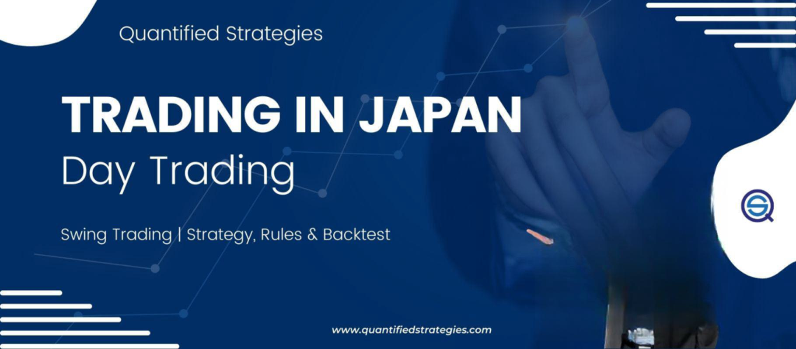

Japan stands as a significant force in the global financial markets, characterized by its advanced stock exchanges and vibrant securities environment. Among these, the Osaka Stock Exchange (OSE) holds substantial importance. Now integrated into the Japan Exchange Group (JPX), the OSE is pivotal within Japan's financial system, with a particular emphasis on derivatives trading. The OSE has not only adapted to but also spearheaded various advancements in financial trading, reflecting the broader economic evolution of Japan.

In recent years, algorithmic trading has emerged as a prominent feature of Japan's financial markets. This form of trading utilizes complex algorithms and cutting-edge technology to execute trades with efficiency and at speeds unattainable by human traders alone. High-frequency trading, a subset of algorithmic trading, has notably influenced the pace and nature of transactions on exchanges like the OSE, offering both opportunities and challenges in terms of market behavior and regulation.

This article aims to provide an in-depth understanding of the Osaka Stock Exchange's heritage, its transformation over the decades, and the integral role of algorithmic trading within Japan's financial sphere. By examining these facets, we highlight Japan's innovative journey through financial modernization and its ongoing impact on global markets.

## Table of Contents

## Historical Evolution of the Osaka Stock Exchange

The Osaka Stock Exchange (OSE) has a rich history that dates back to Japan's Edo Period, a time when regional rice markets served as the primitive exchanges for trading. These early transactions laid the groundwork for the development of more formal exchanges, where commodities such as rice were the primary focus. By the Meiji Restoration in the late 19th century, Japan was eager to modernize its economy, and the formal establishment of the Osaka Stock Exchange in 1878 marked a significant step forward.

The original purpose of the OSE was to facilitate the trading of corporate stocks and bonds. However, over the years, it has evolved to become a key player in derivatives trading. Derivatives are financial instruments whose value depends on the value of other underlying financial assets, such as securities, commodities, or market indexes. The establishment of a comprehensive derivatives market allowed the OSE to expand its product offerings and play a vital role in risk management and speculative activities.

One of the most transformative periods for the Osaka Stock Exchange came in 2013, when it merged with the Tokyo Stock Exchange (TSE). This unification led to the formation of the Japan Exchange Group (JPX), which consolidated trading operations across Japan. The merger was driven by the need to increase efficiency, reduce costs, and enhance the global competitiveness of Japanese financial markets. It also allowed for the pooling of technological resources and expertise, which helped to streamline operations and offer a more cohesive platform for financial transactions.

The historical development of the Osaka Stock Exchange reflects the broader trajectory of financial modernization in Japan. This progression not only strengthened Japan's domestic financial infrastructure but also facilitated its integration into global markets. By adapting to changes in market demands and embracing the trading of complex financial instruments, the OSE has successfully navigated various economic challenges and remains a central component of Japan's financial ecosystem.

## Key Products and Offerings of the Osaka Stock Exchange

The Osaka Exchange, a crucial component of Japan's financial landscape, offers a diverse range of financial products, primarily focusing on equities and derivatives. It specializes in stock index futures, government bond futures, and options, facilitating a comprehensive trading experience for investors. Among its notable offerings, the Nikkei 225 Futures stand out as a premier product. These futures provide traders with the means to gain exposure to Japan's leading stock market index, the Nikkei 225, which comprises 225 large, publicly owned companies listed on the Tokyo Stock Exchange. The ability to trade these futures allows for hedging and speculative opportunities based on the movements of the broader Japanese equity market.

In addition to these established products, the Osaka Exchange made a significant advancement in 2020 through the introduction of commodities futures trading. This initiative included the launch of gold futures, marking a pivotal moment for the exchange as Japan's first integrated platform for both financial and commodities futures. By offering commodities alongside traditional financial instruments, the Osaka Exchange aims to provide diversified trading opportunities, catering to a wide array of investment strategies.

This approach not only attracts domestic investors but also enhances Japan's appeal to international traders seeking to participate in a comprehensive and integrated marketplace. Through its varied product offerings and strategic initiatives, the Osaka Exchange underscores its commitment to evolving and expanding within the global financial markets.

## Algorithmic Trading in Japanese Financial Markets

Algorithmic trading, increasingly prevalent in Japanese financial markets, employs advanced computational algorithms to execute trades with precision and speed, unattainable by human traders. This technological advancement is especially prominent on the Osaka Exchange, where high-frequency trading ([HFT](/wiki/high-frequency-trading-strategies)) firms exploit rapid market fluctuations to optimize trading strategies. HFT relies on algorithms that analyze market data in real-time, executing orders within microseconds to capitalize on narrow price differentials, thereby enhancing market [liquidity](/wiki/liquidity-risk-premium) and efficiency.

In Japan, the Financial Services Agency (FSA) plays a crucial role in regulating [algorithmic trading](/wiki/algorithmic-trading). The FSA has implemented robust regulatory frameworks designed to ensure transparent and fair trading practices while safeguarding investor interests. These regulations mandate stringent risk management protocols for firms engaged in algorithmic trading, ensuring that trading algorithms do not destabilize market conditions. Firms must also conduct thorough testing and validation of their trading algorithms to prevent anomalies that could lead to market manipulation or systemic risks.

The Japanese market's regulatory environment aims to balance innovation and market integrity. By fostering a competitive yet secure trading ecosystem, Japan maintains its competitive edge in the global financial arena. This approach not only promotes investor confidence but also attracts international market participants by showcasing the robustness of its regulatory oversight.

Algorithmic trading's role on the Osaka Exchange underscores the transformative impact of technology on financial markets, streamlining operations and enabling the rapid execution of large volumes of trades. As the technology evolves, ongoing collaboration between regulators and market participants will be crucial to address emerging challenges and sustain market growth.

## Impact of Algorithmic Trading on Market Dynamics

Algorithmic trading has significantly transformed the landscape of the Japanese financial markets, particularly influencing market liquidity and efficiency. By automating trades using algorithms, traders can execute transactions at speeds and scales unattainable through manual methods. This rapid execution has contributed to reduced bid-ask spreads, as algorithmic traders are able to constantly quote and update prices, enabling tighter spreads. Additionally, transaction costs have decreased as the frequency of trades increases and market competition intensifies.

However, the benefits of algorithmic trading do not come without criticisms. High-frequency trading (HFT), a subset of algorithmic trading characterized by extremely high-speed and short-term trades, has sparked concerns about market manipulation and systemic risk. Critics argue that HFT can exploit market inefficiencies, sometimes leading to unfair advantages over traditional traders. This concern is exacerbated during periods of high market [volatility](/wiki/volatility-trading-strategies), where HFT might engage in practices like "[momentum](/wiki/momentum) ignition", aiming to mislead other market participants and profit from induced trends.

The Japanese financial markets, governed by the Financial Services Agency (FSA), face the challenge of balancing the advantages of algorithmic trading with the need to maintain market stability. Japanese regulators focus on ensuring that automated trading practices do not compromise the fairness and integrity of the market. Regulatory measures are constantly evaluated to protect against systemic risks that could arise from the scale and speed at which algorithmic trades operate.

Overall, the impact of algorithmic trading on market dynamics in Japan highlights the dual nature of technological advancements. While it undeniably enhances liquidity and efficiency, the potential risks necessitate vigilant regulatory oversight to ensure a stable and equitable trading environment.

## Pros and Cons of Trading on the Osaka Stock Exchange

The Osaka Stock Exchange, now part of the Japan Exchange Group, offers numerous advantages to traders and investors. One of the primary benefits is access to large and liquid markets. With Japan being the third-largest economy in the world, the exchange provides extensive opportunities to invest in a wide array of financial instruments, from equities to derivatives. This liquidity ensures that trades can be executed efficiently and with minimal price impact, which is crucial for both institutional and individual investors.

Moreover, the Osaka Stock Exchange provides a diverse range of trading instruments, including equities, futures, options, and, more recently, commodities futures like gold. This diversity allows investors to implement various strategies, from hedging risks to speculative trading, catering to different investment goals and risk tolerance levels.

Japan's stable economic environment further enhances the attractiveness of trading on the Osaka Stock Exchange. Despite challenges, Japan maintains a robust legal system and sound monetary policy, which contribute to a predictable and secure trading landscape. This stability can be particularly appealing to foreign investors looking for reliable markets.

However, there are also notable downsides. One significant disadvantage is the relatively higher transaction costs associated with trading on the Osaka Stock Exchange. Various taxes and fees can erode investment returns, making the market less attractive for cost-sensitive traders. For instance, the Financial Services Agency regulates taxes on transactions and capital gains, which can add to the overall cost of trading.

Additionally, Japan faces demographic challenges, primarily its aging population, which could impact long-term economic growth prospects. An aging population can lead to a shrinking workforce, increased social security burdens, and slower economic expansion, potentially affecting market performance. Furthermore, Japan's heavy dependency on exports makes its economy susceptible to global economic shifts and trade tensions, posing a risk to investors focused on the Osaka Stock Exchange.

In conclusion, while trading on the Osaka Stock Exchange offers substantial benefits through its liquidity, variety of instruments, and stable environment, investors should also consider the implications of higher costs and macroeconomic challenges. Assessing these factors thoroughly is essential for informed decision-making in this prominent financial market.

## Conclusion

The Osaka Stock Exchange is a testament to Japan’s enduring legacy and innovative spirit within the global financial landscape. Having evolved from a regional commodity market to a pivotal player in the international trading system, it illustrates Japan's commitment to modernizing its financial sector. This evolution is marked by the strategic integration of advanced trading technologies, including algorithmic trading, which has redefined market operations with increased efficiency and liquidity.

As algorithmic trading continues to advance, so too does its impact on market dynamics and the regulatory landscape. The complex algorithms used in this type of trading allow for rapid trade execution and decision-making, presenting both opportunities and challenges. While they significantly enhance market veracity and narrow bid-ask spreads, they also introduce concerns related to market manipulation and systemic risk. Consequently, the balance between technological innovation and regulatory oversight remains critical. Japanese financial authorities, primarily through the Financial Services Agency, have established stringent regulations to ensure that the benefits of algorithmic trading are realized while safeguarding the integrity of financial markets.

For investors and traders, staying informed about these evolving dynamics and regulatory changes is vital for leveraging opportunities in Japan's markets. This involves understanding both the benefits and limitations inherent in trading on platforms like the Osaka Stock Exchange. The exchange’s rich array of products, including derivatives like the Nikkei 225 Futures, offers extensive exposure to Japan's economy. However, navigating this landscape requires a keen awareness of economic influences, such as demographic shifts and dependency on export markets, which may impact market performance.

Thus, the Osaka Stock Exchange not only highlights Japan's historical and ongoing influence on global finance but also underscores the necessity for continuous adaptation in the face of technological and regulatory developments. As such, it serves as both a key player in the world market and a mirror reflecting the broader shifts occurring in the financial sector.

## References & Further Reading

[1]: Masahiro Kuroki, "The Evolution of the Japanese Stock Market: Tokyo and Osaka in the Twentieth Century," Business History Review, Vol. 87, No. 4, 2013. [Link](https://en.wikipedia.org/wiki/Iori_Yagami)

[2]: Kazuhiko Iwasaki & Michael A. Crew, "The Deregulation of the Japanese Financial Markets," Journal of Industrial Organization Education, Vol. 3, No. 1, 2009. [Link](https://www.degruyter.com/view/j/jioe.2009.3.issue-1/jioe.2009.3.1.1003/jioe.2009.3.1.1003.xml)

[3]: Yoshihoro Takeda, "The Japan Exchange Group: Mergers and Modernization," Asian Economic and Financial Review, Vol. 7, No. 1, 2017. [Link](https://aeafr.org/articles/japan-exchange-group-mergers-modernization)

[4]: Aris Stouraitis & Phoon Kok Fai, "Algorithmic Trading in Asia: The View from Japan," CFA Institute, 2017. [Link](https://scholars.hkbu.edu.hk/en/persons/STOURA)

[5]: Izumi Watanabe & Masayuki Yoshikawa, "High-Frequency Trading and the Challenge of Regulation in Japanese Markets," Financial Review by the Ministry of Finance Japan, 2018. [Link](https://www.mof.go.jp/pri/research/division/souken_rep/2025-6e.html)

[6]: Farhad Malik & Kotaro Tsuru, "Impact of High-Frequency Trading in Asian Markets," Journal of Economic Surveys, Vol. 30, No. 5, 2016. [Link](https://onlinelibrary.wiley.com/doi/abs/10.1111/joes.12170)