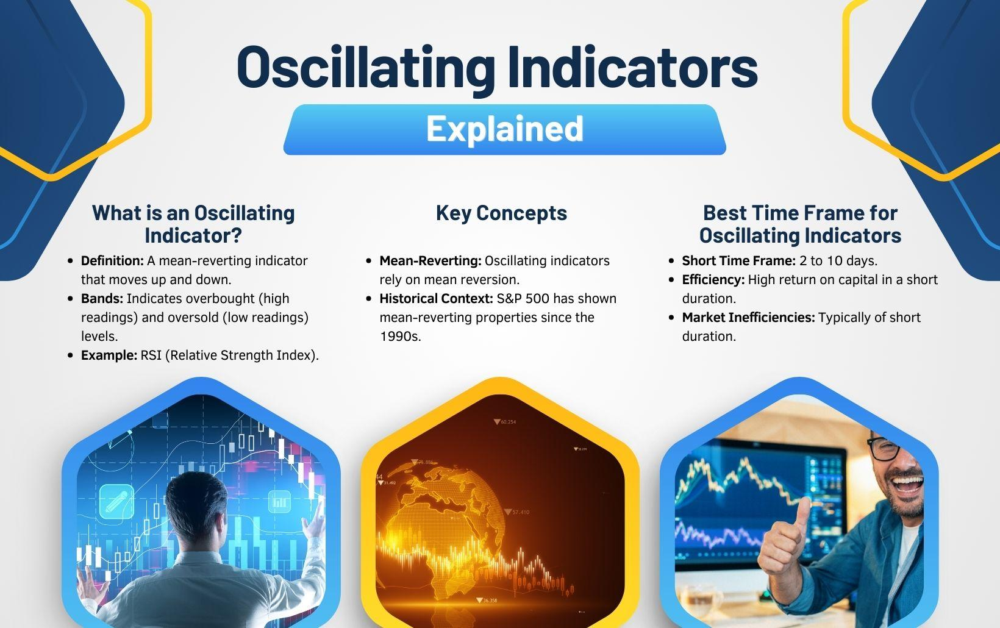

## Table of Contents

## What are oscillating indicators in technical analysis?

Oscillating indicators in technical analysis are tools that traders use to predict future price movements of a security. These indicators move back and forth between set levels, usually between 0 and 100, and help traders understand if a security is overbought or oversold. Overbought means the price might be too high and could drop soon, while oversold means the price might be too low and could rise soon.

Common oscillating indicators include the Relative Strength Index (RSI), the Stochastic Oscillator, and the Moving Average Convergence Divergence (MACD). Traders watch these indicators to spot potential buy or sell signals. For example, if the RSI goes above 70, it might be a sign that the security is overbought, and if it drops below 30, it could mean the security is oversold. By using these indicators, traders can make more informed decisions about when to buy or sell.

## How do oscillating indicators differ from trend-following indicators?

Oscillating indicators and trend-following indicators are two types of tools that traders use to understand the market. Oscillating indicators move between set levels and help traders see if a security is overbought or oversold. They are useful for spotting when a price might change direction. Common oscillating indicators include the Relative Strength Index (RSI) and the Stochastic Oscillator. These indicators are great for short-term trading because they can signal when a price might reverse soon.

Trend-following indicators, on the other hand, help traders see the direction of a trend and stay in trades longer. They are designed to follow the price movement and keep traders in a position as long as the trend continues. Examples of trend-following indicators include moving averages and the Average Directional Index (ADX). These indicators are useful for traders who want to ride a trend and make profits over a longer period. While oscillating indicators are better for spotting quick changes, trend-following indicators are better for understanding and following longer trends.

## What are the most common types of oscillating indicators used in trading?

The most common types of oscillating indicators used in trading are the Relative Strength Index (RSI), the Stochastic Oscillator, and the Moving Average Convergence Divergence (MACD). The RSI measures how fast and how much a security's price has changed. It moves between 0 and 100, and traders watch it to see if a security is overbought or oversold. If the RSI goes above 70, it might mean the security is overbought and could drop soon. If it goes below 30, it might mean the security is oversold and could rise soon.

The Stochastic Oscillator also moves between 0 and 100 and helps traders see if a security is overbought or oversold. It compares a security's closing price to its price range over a certain period. When the Stochastic Oscillator goes above 80, it might mean the security is overbought. When it goes below 20, it might mean the security is oversold. The Moving Average Convergence Divergence (MACD) is a bit different. It shows the relationship between two moving averages of a security's price. Traders use it to spot changes in the strength, direction, momentum, and duration of a trend. When the MACD line crosses above the signal line, it might be a buy signal, and when it crosses below, it might be a sell signal.

## How does the Relative Strength Index (RSI) work as an oscillating indicator?

The Relative Strength Index (RSI) is a popular oscillating indicator used in trading to understand if a security's price is overbought or oversold. It works by measuring the speed and change of price movements. The RSI moves between 0 and 100. If the RSI goes above 70, it might mean the security is overbought, which could suggest that the price might drop soon. If the RSI goes below 30, it might mean the security is oversold, which could suggest that the price might rise soon.

Traders use the RSI to spot potential buy or sell signals. For example, if the RSI moves from below 30 to above 30, it could be a sign to buy the security because it might be moving out of an oversold state. On the other hand, if the RSI moves from above 70 to below 70, it could be a sign to sell the security because it might be moving out of an overbought state. By watching these levels, traders can make more informed decisions about when to enter or [exit](/wiki/exit-strategy) trades.

## Can you explain the Moving Average Convergence Divergence (MACD) and its use as an oscillator?

The Moving Average Convergence Divergence (MACD) is a popular tool that traders use to understand the trend and momentum of a security's price. It works by looking at the difference between two moving averages of the price. One is a fast moving average, usually 12 periods, and the other is a slow moving average, usually 26 periods. The difference between these two moving averages is the MACD line. There's also a signal line, which is usually a 9-period moving average of the MACD line. When the MACD line crosses above the signal line, it might be a sign to buy the security because it suggests the price could go up. When the MACD line crosses below the signal line, it might be a sign to sell the security because it suggests the price could go down.

The MACD can also be used as an oscillator. Traders look at a histogram, which shows the distance between the MACD line and the signal line. When the histogram bars get taller, it means the difference between the MACD and signal lines is growing, which can show strong momentum in the price movement. If the bars are above the zero line, it suggests bullish momentum, and if they're below the zero line, it suggests bearish momentum. When the bars start to get shorter, it might mean the momentum is slowing down, which could signal a possible change in the price direction. By using the MACD as an oscillator, traders can better understand the strength and direction of a security's price movement.

## What is the Stochastic Oscillator and how is it calculated?

The Stochastic Oscillator is a tool that traders use to see if a security's price is overbought or oversold. It compares the closing price of a security to its price range over a certain period, usually 14 days. This helps traders understand if the price might go up or down soon. The Stochastic Oscillator moves between 0 and 100. If it goes above 80, it might mean the security is overbought, and if it goes below 20, it might mean the security is oversold. Traders watch these levels to decide when to buy or sell.

To calculate the Stochastic Oscillator, you need to find three numbers: the highest high, the lowest low, and the closing price of the security over the chosen period. The formula for the Stochastic Oscillator is: %K = (Current Close - Lowest Low) / (Highest High - Lowest Low) * 100. Here, "Current Close" is the most recent closing price, "Lowest Low" is the lowest price in the period, and "Highest High" is the highest price in the period. The result, %K, is the raw Stochastic value. Traders often use a 3-period moving average of %K, called %D, to smooth out the data and make it easier to read. By using these calculations, traders can get a clearer picture of whether a security's price is likely to change direction soon.

## How can oscillating indicators help identify overbought and oversold conditions?

Oscillating indicators help traders see if a security's price is overbought or oversold. They do this by moving between set levels, usually between 0 and 100. When an oscillating indicator like the Relative Strength Index (RSI) goes above 70, it might mean the security is overbought. This means the price might be too high and could drop soon. On the other hand, if the RSI goes below 30, it might mean the security is oversold. This means the price might be too low and could rise soon. By watching these levels, traders can spot when the price might change direction.

The Stochastic Oscillator works in a similar way. It compares the closing price of a security to its price range over a certain time. If the Stochastic Oscillator goes above 80, it might mean the security is overbought. If it goes below 20, it might mean the security is oversold. Traders use these signals to decide when to buy or sell. By understanding if a security is overbought or oversold, traders can make better decisions about entering or exiting trades.

## What are the key settings and parameters to consider when using oscillating indicators?

When using oscillating indicators, the key settings and parameters you need to think about are the time period and the overbought and oversold levels. The time period is how many days or periods the indicator looks at to calculate its values. For example, the Relative Strength Index (RSI) often uses a 14-day period. A shorter time period can make the indicator more sensitive to price changes, while a longer time period can make it smoother and less likely to give false signals. You can change the time period to fit your trading style and the security you're looking at.

The overbought and oversold levels are also important. These are the points where the indicator suggests the price might be too high or too low. For the RSI, the common overbought level is 70 and the oversold level is 30. For the Stochastic Oscillator, the overbought level is usually 80 and the oversold level is 20. You can adjust these levels based on how the security usually moves. If you find the standard levels give too many false signals, you might want to change them to better fit the security's behavior.

## How do traders use oscillating indicators to generate buy and sell signals?

Traders use oscillating indicators to spot when a security might be ready to change direction. They look at the levels of the indicator to see if it's overbought or oversold. For example, if the Relative Strength Index (RSI) goes above 70, it might mean the security is overbought and could drop soon. This could be a sign to sell. On the other hand, if the RSI goes below 30, it might mean the security is oversold and could rise soon. This could be a sign to buy. By watching these levels, traders can decide when to enter or exit trades.

Another way traders use oscillating indicators is by looking at crossovers. For example, with the Moving Average Convergence Divergence (MACD), traders watch for the MACD line to cross above or below the signal line. If the MACD line crosses above the signal line, it might be a buy signal because it suggests the price could go up. If the MACD line crosses below the signal line, it might be a sell signal because it suggests the price could go down. By using these crossovers, traders can spot potential changes in the security's price direction and make timely trading decisions.

## What are the limitations and potential pitfalls of relying on oscillating indicators?

Oscillating indicators can be helpful, but they have some limitations. One big problem is that they can give false signals. This means they might tell you to buy or sell when the price doesn't actually change direction. For example, a security might stay overbought for a long time, so selling just because the indicator says it's overbought might make you miss out on more gains. Another issue is that oscillating indicators can be slow to react. By the time the indicator shows a change, the price might have already moved a lot, and you might miss the best time to trade.

Another pitfall is that oscillating indicators work best in markets that move up and down a lot. If the market is moving in one direction for a long time, the indicators might not be very useful. They can also be hard to use if you don't set the right time periods and levels. If you use the wrong settings, you might get too many false signals or miss out on good trades. So, it's important to understand the security you're trading and adjust the indicator settings to fit its behavior.

## How can oscillating indicators be combined with other technical analysis tools for better results?

Oscillating indicators work better when you use them with other tools in technical analysis. One good way is to use them with trend-following indicators like moving averages. For example, if the RSI shows a security is oversold and the price is also below a long-term moving average, it might be a strong sign to buy. This can help you make sure the price is likely to go up. Another way is to use them with chart patterns. If the Stochastic Oscillator shows a security is overbought and you see a bearish chart pattern like a head and shoulders, it might be a good time to sell.

You can also use oscillating indicators with support and resistance levels. If the MACD gives a sell signal and the price is near a strong resistance level, it could mean the price is about to drop. This can help you make better trading decisions. By combining oscillating indicators with other tools, you can get a clearer picture of what might happen next with the price. This way, you can avoid false signals and make more accurate trades.

## What advanced techniques can experts use to refine the signals from oscillating indicators?

Experts can refine the signals from oscillating indicators by using a technique called divergence. Divergence happens when the price of a security moves in one direction, but the oscillating indicator moves in the opposite direction. For example, if the price is going up but the RSI is going down, it might mean the price is about to change direction. By watching for these divergences, experts can spot when a trend might be losing strength and get ready for a possible price reversal.

Another advanced technique is to use multiple time frames. Experts might look at the same oscillating indicator on different time frames, like daily and weekly charts. If the RSI shows a security is oversold on both time frames, it might be a stronger sign to buy. By comparing the signals across different time frames, experts can get a better sense of whether a signal is reliable and make more informed trading decisions.

## What are Oscillating Indicators?

Oscillating indicators are essential tools in technical analysis designed to fluctuate within a defined range. These indicators are employed to identify market momentum, pinpoint potential reversal points, and assess market conditions such as overbought or oversold assets. They provide traders with critical insights that aid in making informed decisions.

A key characteristic of oscillating indicators is their bounded scale, typically ranging from 0 to 100. This bounded nature allows traders to quantify the intensity of price movements and make predictions on potential market reversals or continuations. By evaluating where the indicator stands within this range, traders can assess whether an asset is overbought (typically indicated by values above 70 or 80, depending on the specific indicator) or oversold (values below 30 or 20).

Among the most commonly utilized oscillators in trading are:

1. **Relative Strength Index (RSI):** Introduced by J. Welles Wilder, the RSI is a momentum oscillator that measures the speed and change of price movements. It is primarily used to identify overbought or oversold conditions, calculated as follows:
$$
   RSI = 100 - \left( \frac{100}{1 + RS} \right)

$$

   where $RS$ is the average gain of "up" periods during a specified time frame divided by the average loss of "down" periods.

2. **Stochastic Oscillator:** Developed by George Lane, the Stochastic Oscillator compares a particular closing price to a range of its prices over a certain period. It is comprised of two lines, %K and %D, and is formulated as:
$$
   \%K = \frac{(C - L)}{(H - L)} \times 100

$$

   where $C$ is the most recent closing price, $L$ is the lowest price over the lookback period, and $H$ is the highest price over the lookback period. The %D line is a moving average of the %K.

3. **Williams %R:** Developed by Larry Williams, the Williams %R is a momentum indicator similar to the Stochastic Oscillator but plotted on a negative scale from -100 to 0. It demonstrates the current closing price relative to the highest high over a given period:
$$
   \%\text{R} = \frac{(H_n - C)}{(H_n - L_n)} \times (-100)

$$

   where $H_n$ and $L_n$ are the highest high and the lowest low over the past $n$ periods.

4. **Bollinger Bands:** Introduced by John Bollinger, Bollinger Bands consist of a middle band, typically a 20-day simple moving average, and two outer bands representing two standard deviations above and below the middle band. While they are not oscillators by strict definition, their use in conjunction with oscillating indicators helps interpret volatility and potential price reversals.

Oscillating indicators, by capturing the [momentum](/wiki/momentum) and condition of market prices, are indispensable tools in [algorithmic trading](/wiki/algorithmic-trading), aiding traders in anticipating market moves and adjusting their strategies accordingly.

## What are the key oscillating indicators in algorithmic trading?

Oscillating indicators are pivotal in algorithmic trading for their ability to signal potential market reversals and assess market momentum. Here's a closer look at four key oscillating indicators widely used in algorithmic trading:

**Relative Strength Index (RSI):** The RSI is a momentum oscillator that evaluates the speed and magnitude of price changes. The formula for RSI is as follows:

$$

RSI = 100 - \left(\frac{100}{1 + RS}\right) 
$$

where $RS$ is the average of $x$ days' up closes divided by the average of $x$ days' down closes. RSI values range from 0 to 100; traditionally, an RSI above 70 suggests that an asset may be overbought, while an RSI below 30 indicates that it might be oversold. It's particularly useful in identifying buying or selling opportunities when the market shows signs of potentially reversing its current trend.

**Williams %R:** This oscillator operates similarly to the Stochastic Oscillator, focusing on market momentum. Williams %R is calculated using the formula:

$$

\%R = \left(\frac{\text{Highest High} - \text{Close}}{\text{Highest High} - \text{Lowest Low}}\right) \times -100 
$$

The values range from -100 to 0. A reading below -80 is considered oversold, and a reading above -20 is considered overbought. Williams %R helps traders identify potential reversal points in a market.

**Bollinger Bands:** These consist of a middle band (a simple moving average) and two outer bands, which are standard deviations away from the middle band. The formula for the upper and lower bands is:

$$
\text{Upper Band} = \text{SMA}(n) + k \times \text{SD}(n)
\] 

$$
\text{Lower Band} = \text{SMA}(n) - k \times \text{SD}(n)
$$

where $n$ is the number of periods, $\text{SMA}(n)$ is the simple moving average of $n$ periods, $k$ is the number of standard deviations, and $\text{SD}(n)$ is the standard deviation over the same period. Bollinger Bands provide a visual measure of price volatility, indicating whether prices are high or low on a relative basis.

**Stochastic Oscillator:** This tool compares a particular closing price to a range of prices over a specific period. It is calculated by:

$$

\%K = \left(\frac{C - L_{14}}{H_{14} - L_{14}}\right) \times 100 
$$

where $C$ is the most recent closing price, $L_{14}$ is the lowest price over the last 14 sessions, and $H_{14}$ is the highest price over the same period. The stochastic values range from 0 to 100. A reading above 80 suggests overbought conditions, while below 20 indicates oversold conditions. This oscillator is effective for monitoring overbought and oversold levels.

Each of these oscillating indicators offers a unique perspective on market dynamics and, when used judiciously, can greatly enhance the efficacy of algorithmic trading strategies.

## What is a Case Study on Williams %R?

Williams %R stands out among oscillating indicators due to its stability and effectiveness in short-term trading scenarios. It evaluates the momentum of a financial instrument by comparing its closing price with the highest high over a defined lookback period. This comparison allows traders to identify overbought or oversold conditions with precision. The formula for calculating Williams %R is:

$$
\text{Williams \%R} = \frac{\text{Highest High} - \text{Close}}{\text{Highest High} - \text{Lowest Low}} \times -100
$$

In this formula, the "Highest High" and "Lowest Low" are determined over a specified period, commonly 14 days. The negative sign ensures that the indicator oscillates between 0 and -100, with readings closer to 0 indicating overbought conditions, and those nearer to -100 suggesting oversold market conditions.

During [backtesting](/wiki/backtesting), Williams %R exhibited low average maximum drawdowns, highlighting its potential in safeguarding traders against large losses. Its performance stability in various market conditions makes it especially appealing for traders focusing on short-term strategies. By consistently identifying reversal points, this indicator enhances decision-making processes, offering a tactical advantage in managing risks and enhancing profitability.

For traders who prioritize minimizing drawdown and enhancing trading stability, Williams %R remains a robust tool. Below is a simple Python script to calculate Williams %R:

```python
def williams_percent_r(highs, lows, closes, period=14):
    williams_r = []
    for i in range(len(closes) - period + 1):
        high = max(highs[i:i+period])
        low = min(lows[i:i+period])
        current_close = closes[i + period - 1]
        wr = ((high - current_close) / (high - low)) * -100
        williams_r.append(wr)
    return williams_r

# Example usage:
highs = [130, 132, 135, 127, 130, 134, 136, 138, 133, 129, 128, 127, 128, 130]
lows = [127, 128, 130, 126, 127, 130, 131, 133, 130, 127, 125, 126, 126, 128]
closes = [128, 131, 133, 127, 129, 132, 135, 137, 132, 128, 127, 126, 127, 129]

williams_r_values = williams_percent_r(highs, lows, closes)
print(williams_r_values)
```

The code calculates Williams %R values using historical high, low, and close prices for a given period. Traders can utilize such scripts to automate analysis and incorporate Williams %R into their algorithmic trading strategies effectively.

## What is a Glossary of Terms?

Relative Strength Index (RSI): An indicator used to measure the speed and change of price movements. RSI is typically used to identify overbought or oversold conditions in a market. The RSI values range from 0 to 100, where a value above 70 indicates that an asset might be overbought, and a value below 30 suggests the asset could be oversold. The formula for RSI is:

$$

\text{RSI} = 100 - \frac{100}{1 + \frac{\text{Average Gain}}{\text{Average Loss}}}
$$

Williams %R: This is a momentum oscillator that measures overbought or oversold conditions in a market. It compares the current closing price with the highest high for the lookback period, which typically consists of 14 periods. The values range from -100 to 0, with readings below -80 indicating oversold conditions and readings above -20 indicating overbought conditions. The formula is:

$$
\text{Williams \%R} = \frac{\text{Highest High} - \text{Close}}{\text{Highest High} - \text{Lowest Low}} \times -100
$$

Stochastic Oscillator: This indicator compares a particular closing price to a range of prices over a specified period. It is expressed as a percentage, with values ranging from 0 to 100. A reading above 80 is generally considered overbought, while a reading below 20 is seen as oversold. The stochastic oscillator is represented with two lines: the %K line and the %D line, where %D is a moving average of %K. The basic formula for %K is:

$$
\%K = \frac{\text{Current Close} - \text{Lowest Low}}{\text{Highest High} - \text{Lowest Low}} \times 100
$$

The %D line is usually a 3-day simple moving average of the %K value.

## References & Further Reading

[1]: Wilder, J. W. (1978). ["New Concepts in Technical Trading Systems."](https://books.google.com/books/about/New_Concepts_in_Technical_Trading_System.html?id=WesJAQAAMAAJ) Trend Research.

[2]: Lane, G. (1984). ["Introducing the Stochastic."](https://www.scribd.com/document/127286067/Lane-s-Stochastics-1984-1998) Technical Analysis of Stocks & Commodities.

[3]: Williams, L. (1987). ["How I Made One Million Dollars Last Year Trading Commodities."](https://www.amazon.com/Made-Million-Dollars-Trading-Commodities/dp/0930233107) Windsor Books.

[4]: Bollinger, J. (1992). ["Using Bollinger Bands."](https://books.google.com/books/about/Bollinger_on_Bollinger_Bands.html?id=MVrJdo8VOnIC) Technical Analysis of Stocks & Commodities, Volume 10.

[5]: Pring, M. J. (2002). ["Technical Analysis Explained: The Successful Investor's Guide to Spotting Investment Trends and Turning Points."](https://www.amazon.com/Technical-Analysis-Explained-Fifth-Successful/dp/0071825177) McGraw-Hill.