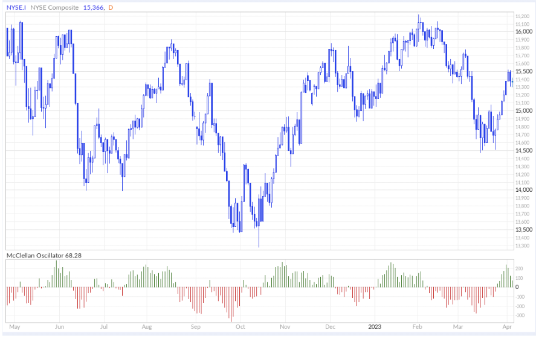

Algorithmic trading has brought significant transformation to financial markets by utilizing sophisticated algorithms that automate trade execution. A pivotal component of this approach is the generation of signals through technical indicators, with oscillators playing a particularly crucial role. Oscillators, originating from electronic systems, have become invaluable tools within trading strategies due to their ability to provide dynamic insights into market conditions.

The concept of oscillators in electronics primarily involves generating periodic waveforms, which form the backbone of numerous technologies from clocks to radio frequency generators. These electronic oscillators serve crucial functions by producing stable signals that synchronize processes or transmit data. This foundational electronic principle has found a novel application within algorithmic trading. Oscillators like the Relative Strength Index (RSI) and Moving Average Convergence Divergence (MACD) function as momentum indicators, aiding traders in recognizing potential buy or sell signals by assessing overbought or oversold conditions.



Innovative integration of oscillator-based techniques into trading platforms enhances the capability of traders to execute more strategic decisions. By leveraging the computational efficiency of algorithms, oscillators help in identifying patterns and trends, thereby enabling trades to be made with precision and confidence. The application of oscillators in this context aligns with the endeavor to minimize human error and capitalize on market opportunities with minimal latency.

Understanding the operational mechanics and implications of oscillators is crucial for traders seeking to refine and elevate their trading methodologies. Oscillators offer unique perspectives by distilling complex data into actionable insights, subsequently informing the development of more nuanced and effective trading strategies. As technology and data analytics advance, the role of oscillators in algorithmic trading will likely continue to expand, offering new opportunities to enhance trade efficiency and profitability.

## Table of Contents

## The Role of Oscillators in Electronics and Trading

Oscillators play a vital role in both electronics and trading by serving distinct yet parallel functions in these domains. In electronics, oscillators are integral components that generate periodic waveforms. These waveforms are essential for a myriad of applications, ranging from the timing functions in simple wristwatches to the sophisticated communication signals in satellite systems. Electronic oscillators can be categorized into several types, including harmonic oscillators like Wien bridge and phase-shift oscillators, and relaxation oscillators such as astable multivibrators. Each type provides different waveform outputs critical for electronic systems' operation and synchronization.

In financial trading, oscillators function as momentum indicators that assist traders in identifying overbought or oversold conditions and potential market reversals. These indications are derived from price data and help to predict movements within financial markets. Several oscillators are pivotal in this context, with the Stochastic Oscillator, Relative Strength Index (RSI), and Moving Average Convergence Divergence (MACD) being predominant tools. 

1. **Stochastic Oscillator:** This indicator compares a specific closing price of an asset to a range of its prices over a certain period. The aim is to predict turning points by assessing price momentum. The formula for the Stochastic Oscillator is:
$$
   \text{Stochastic} = \frac{(C - L)}{(H - L)} \times 100

$$

   where $C$ is the most recent closing price, $L$ is the lowest price over a specified period, and $H$ is the highest price over the same period.

2. **Relative Strength Index (RSI):** The RSI measures the speed and change of price movements. It evaluates recent price changes to identify conditions where an asset might be overbought or oversold. The formula for calculating RSI is:
$$
   \text{RSI} = 100 - \frac{100}{1 + \frac{\text{Average gain}}{\text{Average loss}}}

$$

   Values above 70 indicate overbought conditions, while those below 30 suggest oversold conditions.

3. **Moving Average Convergence Divergence (MACD):** The MACD tracks the difference between two exponential moving averages (EMAs) of a security’s price. An MACD line and a signal line are used to indicate buy or sell signals. The equation for MACD is:
$$
   \text{MACD} = \text{EMA}_{\text{short-term}} - \text{EMA}_{\text{long-term}}

$$

   Crossovers between the MACD line and the signal line can depict trend direction and strength.

These oscillators are integrated into [algorithmic trading](/wiki/algorithmic-trading) platforms, enabling the automation of decision-making processes based on predefined criteria. Automated systems utilize oscillator signals to execute trades when certain thresholds are crossed, minimizing the need for manual interventions. This automation enhances the efficiency and speed of trading operations, providing a competitive edge in fast-moving financial markets. By leveraging these oscillators, traders can make informed decisions, maximize returns, and reduce exposure to risk through systematic analysis and execution.

## Oscillator Types and Their Applications in Trading

Different oscillators in trading algorithms provide varied insights by analyzing price data through distinct methods. Among them, the Relative Strength Index (RSI), the Moving Average Convergence Divergence (MACD), and the Stochastic Oscillator are widely utilized due to their specific capabilities in identifying market trends and reversals.

The Relative Strength Index (RSI) is a [momentum](/wiki/momentum) oscillator that measures the speed and change of price movements. It is typically used to identify overbought or oversold conditions in a market. RSI values range from 0 to 100, where an RSI above 70 generally indicates an overbought condition, suggesting a possible price decline, whereas an RSI below 30 suggests an oversold condition, indicating a potential price increase. The mathematical formula for RSI is:

$$
RSI = 100 - \left( \frac{100}{1 + RS} \right)
$$

where $RS$ (Relative Strength) is the average of $n$ days' up closes divided by the average of $n$ days' down closes.

The Moving Average Convergence Divergence (MACD) is another crucial oscillator employed to ascertain the trend strength and direction. It is based on the relationship between two exponential moving averages (EMAs) of a security's price. The MACD is calculated by subtracting the 26-period EMA from the 12-period EMA. To further enhance this analysis, a nine-day EMA of the MACD, known as the "signal line," is used as a trigger for buy and sell signals. The formula for the MACD is:

$$
MACD = EMA_{12} - EMA_{26}
$$

The Stochastic Oscillator compares a particular closing price of a security to its price range over a specific period. It operates on the premise that prices tend to close near the extremes of the recent range during an upward or downward trend. The values range from 0 to 100, with readings over 80 typically indicating overbought conditions, while readings below 20 signal oversold conditions. The Stochastic Oscillator can be calculated using the formula:

$$
\%K = \frac{(C - L_{14})}{(H_{14} - L_{14})} \times 100
$$

where $C$ is the most recent closing price, $L_{14}$ is the lowest price over the last 14 sessions, and $H_{14}$ is the highest price during the same period.

Each oscillator type provides different insights based on its calculation and application, allowing traders to tailor their strategies. While the RSI focuses on the speed and change of price movements, the MACD emphasizes trend strength and momentum, and the Stochastic Oscillator assesses closing prices relative to a price range. Understanding these differences enables traders to choose the most appropriate tool for specific market conditions and objectives.

## Algorithmic Trading and Oscillator Signal Integration

Algorithmic trading systems capitalize on oscillators by embedding their signal-generating capabilities into the automated execution of trades. The automation process utilizes a trading algorithm, a set of programmed rules, to make informed decisions without human intervention. These algorithms are designed to interact with financial markets by analyzing oscillator signals, interpreting market data, and executing trades when certain conditions are met. 

For instance, traders can configure their trading algorithms to initiate buy or sell orders when oscillators cross specific thresholds. A common example is the Relative Strength Index (RSI), which oscillates between 0 and 100. Traders often use predefined levels, such as 30 and 70, as indicators of potential market reversals. An algorithm might be programmed to trigger a buy order when the RSI dips below 30, suggesting an oversold condition, and to execute a sell order when it exceeds 70, indicating an overbought situation. Such pre-programmed criteria facilitate swift trading actions that human traders might miss due to latency or emotional hesitation.

Moreover, to enhance the robustness of trading strategies, algorithms can be designed to confirm oscillator signals with other indicators. For example, a moving average could act as a trend confirmation tool for oscillator signals. When the Stochastic Oscillator suggests a buy condition, the algorithm might also check if the price is above a moving average before executing a trade. This multi-indicator approach reduces the likelihood of false signals and increases the reliability of the trade decision.

The integration of oscillators into algorithmic trading systems significantly improves the speed and precision of trading decisions. Unlike human traders, algorithms can process vast amounts of data rapidly, identify patterns, and execute trades in milliseconds, providing a competitive edge in fast-moving markets. This rapid execution is particularly advantageous in high-frequency trading environments, where split-second decisions can yield substantial profits.

Algorithmic trading also addresses the issue of emotional biases, which can lead to suboptimal trading decisions during high-stress situations or volatile market conditions. By relying on a predefined set of rules, algorithmic systems operate free from human emotions, ensuring that trades are executed purely based on logic and objective data analysis. This rational approach can lead to more consistent performance across various market conditions, allowing traders to maintain discipline and adherence to their strategies.

In summary, the integration of oscillator signals in algorithmic trading strategies enables traders to automate and optimize their decision-making processes. By programming algorithms to act on specific oscillator thresholds and confirmations, traders can achieve faster, more disciplined trades, effectively mitigating both delay and emotional interference. This sophisticated approach is indicative of the potential advancements in trading technology, marking a significant shift in how market participants strategize and execute trades.

## Technological Advances and Future Prospects

Continuous advancements in computational power and [machine learning](/wiki/machine-learning) have significant implications for oscillator-based trading strategies. With the increase in processing capabilities, trading algorithms can incorporate more complex models and execute high-frequency trades with precision. This evolution enables the exploitation of minute price discrepancies that human traders cannot efficiently capture.

One promising area is the development of adaptive oscillators. These oscillators are capable of self-optimization by adjusting their parameters based on historical performance and prevailing market conditions. An adaptive oscillator could, for example, modify its sensitivity to price changes in volatile markets versus stable ones, thus providing more accurate and timely signals.

Artificial Intelligence (AI) integration stands to further enhance the accuracy and effectiveness of oscillators in trading. Machine learning algorithms can process vast amounts of market data to identify patterns that traditional models may miss. By applying supervised or unsupervised learning techniques, AI can refine oscillator parameters dynamically, leading to improved predictions of market movements. A model could be constructed using Python's popular libraries such as TensorFlow or Sklearn to illustrate how AI models might refine oscillator signals:

```python
import numpy as np
from sklearn.ensemble import RandomForestRegressor
from sklearn.model_selection import train_test_split

# Example data
prices = np.random.rand(1000)  # hypothetical price data
features = np.column_stack([prices[i: -10+i] for i in range(10)])  # create past price windows

# Labels: simulate oscillator signal
oscillator_signal = np.sign(np.diff(prices[:990]))

# Train-test split
X_train, X_test, y_train, y_test = train_test_split(features[:-1], oscillator_signal, test_size=0.2, random_state=42)

# Model training
model = RandomForestRegressor(n_estimators=100, random_state=42)
model.fit(X_train, y_train)

# Prediction
predictions = model.predict(X_test)
```

The potential for AI to transform oscillator functionalities lies in its ability to learn from data, allowing for predictive models that consider a multitude of market factors, thereby increasing profitability while reducing risk.

As the field progresses, a comprehensive understanding of oscillator signal applications will become increasingly crucial. Continuous innovation will yield novel approaches to optimizing trading strategies, demanding agility from traders and software engineers alike to harness these advancements effectively. The future trajectory of trading will likely be defined by how well these emergent technologies are incorporated into automated systems, pushing the boundaries of financial innovation.

## Challenges and Considerations

Oscillators are essential tools in algorithmic trading due to their ability to provide insights into market momentum, typically indicating overbought or oversold conditions. However, their utility is not without challenges. A significant risk associated with oscillators is the potential for generating false signals, especially during volatile market conditions. Such market environments are characterized by rapid price fluctuations that can cause oscillators to provide misleading indications of market trends. Traders need to be aware of this risk, as reliance solely on oscillator signals can lead to incorrect trade decisions.

Over-reliance on a single oscillator poses another challenge. Each oscillator has its own strengths and weaknesses, and utilizing only one can lead to suboptimal decision-making. For example, while the Relative Strength Index (RSI) might suggest a market is overbought, the Moving Average Convergence Divergence (MACD) might indicate a strong upward trend. Therefore, diversifying the use of indicators by combining oscillators with other technical analysis tools can provide a more holistic view of market conditions.

Backtesting is crucial in developing reliable oscillator-based strategies. This process involves testing a trading strategy on historical market data to evaluate its performance before using it in live trading. Backtesting allows traders to assess the potential viability and risks of a strategy based on oscillator signals. It is necessary to ensure that the chosen oscillator strategy is sufficiently robust to perform well in various market conditions.

Algorithmic traders must also navigate the evolving landscape of regulatory changes and market unpredictability. Regulations can impact how algorithms can operate, requiring traders to remain adaptable and compliant. Additionally, the inherently unpredictable nature of financial markets demands constant vigilance to adjust strategies as needed.

Finally, effective risk management strategies are vital when using oscillators in trading. These strategies help mitigate potential losses, which can arise from false signals or sudden market shifts. Implementing measures such as stop-loss orders, position sizing, and leveraging risk-reward ratios can protect traders against adverse market movements. A comprehensive approach that integrates oscillator signals with robust risk management ensures a more resilient and effective trading strategy.

## Conclusion

The synergy between oscillator signal generation in electronics and algorithmic trading presents significant opportunities for modern traders. Oscillators, as pivotal components in electronics, have been leveraged to enhance trading strategies by automating decision-making processes. By understanding and correctly implementing these tools within algorithmic systems, traders can access more intelligent and profitable trading decisions.

The integration of oscillators enables traders to automate the analysis of market conditions, identify trends, and execute trades with precision and speed that surpass manual capabilities. Algorithms based on oscillator signals can react swiftly to market dynamics, reducing the impact of time lags inherent in human analysis. This automation also diminishes emotional biases, allowing decision-making processes to remain consistent and objective.

While challenges such as false signals during volatile markets exist, technological advancements continue to offer novel methods for optimizing and refining trading strategies. Developments in computational power, machine learning, and [artificial intelligence](/wiki/ai-artificial-intelligence) contribute to the evolution of oscillator-based trading techniques, promising increased accuracy and efficiency. For example, future enhancements involving adaptive oscillators—capable of self-optimizing based on market performance—promise to further fine-tune trading algorithms.

Traders equipped with in-depth knowledge of oscillator functions and their application in automated systems can better navigate the complexities of financial markets. Adequate risk management strategies and diversification of technical indicators can mitigate potential losses, making oscillator-based systems more resilient. As the field progresses, the adept harnessing and innovation of these tools will significantly shape the future of trading. Ultimately, the ability to adapt and evolve with advancing technology will determine a trader's success in capitalizing on the opportunities presented by oscillator integration in algorithmic trading.

## References & Further Reading

[1]: Bergstra, J., Bardenet, R., Bengio, Y., & Kégl, B. (2011). ["Algorithms for Hyper-Parameter Optimization."](https://dl.acm.org/doi/10.5555/2986459.2986743) Advances in Neural Information Processing Systems 24.

[2]: ["Advances in Financial Machine Learning"](https://www.amazon.com/Advances-Financial-Machine-Learning-Marcos/dp/1119482089) by Marcos Lopez de Prado

[3]: ["Evidence-Based Technical Analysis: Applying the Scientific Method and Statistical Inference to Trading Signals"](https://www.amazon.com/Evidence-Based-Technical-Analysis-Scientific-Statistical/dp/0470008741) by David Aronson

[4]: ["Machine Learning for Algorithmic Trading"](https://github.com/stefan-jansen/machine-learning-for-trading) by Stefan Jansen

[5]: ["Quantitative Trading: How to Build Your Own Algorithmic Trading Business"](https://www.amazon.com/Quantitative-Trading-Build-Algorithmic-Business/dp/1119800064) by Ernest P. Chan