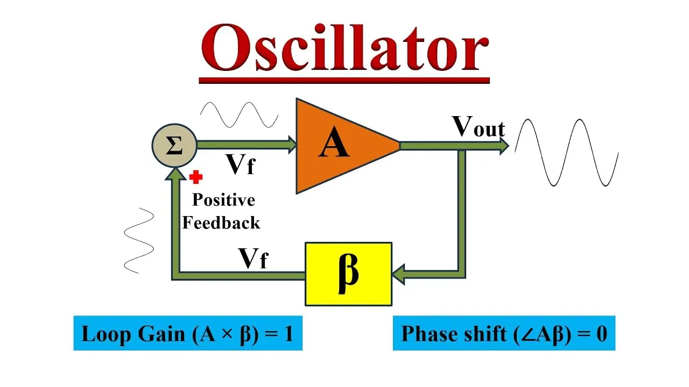

## Table of Contents

## What is an oscillator?

An oscillator is a device or a circuit that produces a repeating signal, like a wave or a vibration. It's like a metronome for music, but instead of ticking, it makes a continuous back-and-forth movement. This movement can be in the form of sound, electricity, or even light. Oscillators are used in many things around us, from clocks and radios to computers and musical instruments.

In simple terms, an oscillator works by taking energy and turning it into a regular pattern. Imagine pushing a swing: if you push it at just the right time, the swing keeps going back and forth smoothly. Oscillators do something similar, but they use different kinds of energy, like electricity, to keep their pattern going. This regular pattern, or oscillation, is what makes them useful in so many devices we use every day.

## What are the basic types of oscillators?

Oscillators come in different types, but the two main kinds are harmonic and relaxation oscillators. Harmonic oscillators make a smooth, continuous wave that looks like a sine wave. Think of it like the smooth swing of a pendulum. These are used in things like radio transmitters and clocks because they keep time very accurately. Examples include the LC oscillator, which uses inductors and capacitors, and the crystal oscillator, which uses a piece of crystal to keep the wave steady.

Relaxation oscillators, on the other hand, work differently. They build up energy until they reach a certain point, then they release it suddenly, creating a wave that looks more like a sharp up-and-down pattern. It's like filling a bucket with water until it overflows, then starting to fill it again. These are often used in electronic circuits where you need a quick switch, like in timers or some types of lights. Examples include the astable multivibrator and the neon-lamp relaxation oscillator.

Both types of oscillators are important and used in different ways. Harmonic oscillators are great for keeping time and making smooth signals, while relaxation oscillators are useful for quick on-off actions. Understanding these basic types helps in knowing how many of our everyday devices work.

## How does an oscillator generate a signal?

An oscillator generates a signal by converting energy into a repeating pattern. Imagine a swing that you push at just the right time to keep it moving back and forth. In an oscillator, energy, like electricity, is used to create this back-and-forth movement. This movement can be smooth, like a sine wave, or sharp, like a quick on-off switch. The type of energy and how it's used decides the kind of signal the oscillator makes.

There are two main ways an oscillator can work. The first way is like a smooth swing, called a harmonic oscillator. It uses energy to make a steady, smooth wave. This is useful for things like keeping time in a clock or sending signals in a radio. The second way is like filling a bucket until it overflows, called a relaxation oscillator. It builds up energy until it reaches a point where it suddenly releases it, making a sharp signal. This is good for things like timers or lights that need to switch on and off quickly. Both types use energy to create a repeating pattern, but they do it in different ways to make different kinds of signals.

## What is the difference between a harmonic and relaxation oscillator?

A harmonic oscillator makes a smooth, continuous wave, like the steady swing of a pendulum. It's great for keeping time accurately, like in clocks or sending signals in radios. The wave it makes looks like a smooth up-and-down curve, called a sine wave. This type of oscillator uses energy to keep the wave going smoothly. Think of it like pushing a swing at just the right time to keep it moving back and forth without stopping.

A relaxation oscillator works differently. It builds up energy until it reaches a certain point, then suddenly releases it, making a sharp up-and-down pattern. Imagine filling a bucket with water until it overflows, then starting to fill it again. This type of oscillator is useful for quick on-off actions, like in timers or certain lights. The wave it makes is not smooth but has sharp changes, which is good for things that need to switch quickly.

Both types of oscillators turn energy into a repeating pattern, but they do it in different ways. Harmonic oscillators are like a smooth swing, while relaxation oscillators are like a bucket that overflows and starts again. Understanding these differences helps in knowing how different devices around us work.

## What are the key components of an oscillator circuit?

The key parts of an oscillator circuit are an energy source, a way to store energy, and a way to control the energy. The energy source can be a battery or power supply, which gives the energy needed to make the circuit work. The energy storage part can be a capacitor, which holds energy like a bucket holds water, or an inductor, which stores energy in a magnetic field. These parts work together to keep the energy flowing in a repeating pattern.

The control part of the circuit is very important. It can be a resistor, which limits how fast the energy flows, or a transistor, which acts like a switch to turn the energy on and off. Some circuits also use a crystal, which helps keep the pattern steady and accurate. Together, these parts make sure the energy moves in a way that creates a repeating signal, which is what makes the oscillator work.

In some oscillators, like relaxation oscillators, there's also a part that decides when to release the stored energy. This can be a threshold device, like a neon lamp, which lights up when the energy reaches a certain level. All these parts work together to turn the energy into a repeating pattern, making the oscillator useful in many devices we use every day.

## How do feedback mechanisms work in oscillators?

Feedback mechanisms are like the secret behind how oscillators keep their signals going. Imagine you're pushing a swing. If you push at the right time, the swing keeps going back and forth. In an oscillator, feedback is like that push. It takes some of the signal the oscillator makes and sends it back into the circuit. This helps the oscillator keep making the signal over and over.

There are two types of feedback: positive and negative. Positive feedback is like cheering someone on to keep going. It makes the signal stronger and helps the oscillator keep its pattern. Negative feedback is like gently correcting someone to stay on track. It helps the oscillator stay stable and accurate. Both types of feedback are important to make sure the oscillator works well and keeps making its signal.

## What is the role of frequency stability in oscillator design?

Frequency stability is really important in oscillator design because it helps the oscillator keep making the same signal over and over without changing. Think of it like a metronome that keeps a steady beat for music. If the metronome's beat changes, the music gets out of sync. In the same way, if an oscillator's frequency isn't stable, devices like radios or clocks won't work right. They need the signal to stay the same to keep time or send information correctly.

To make sure an oscillator has good frequency stability, designers use things like special crystals or careful circuit design. These help the oscillator keep its frequency steady even when things like temperature or power change. It's like making sure the metronome's spring is strong and the weight is just right, so it keeps ticking at the same speed no matter what. Good frequency stability means the oscillator can be trusted to do its job well in all sorts of devices.

## How can the frequency of an oscillator be controlled or adjusted?

The frequency of an oscillator can be controlled or adjusted by changing the parts that store and control the energy in the circuit. For example, in an LC oscillator, you can change the frequency by using different sizes of inductors or capacitors. A bigger capacitor or inductor will make the frequency lower, while a smaller one will make it higher. It's like changing the length of a pendulum to make it swing faster or slower. By [picking](/wiki/asset-class-picking) the right parts, you can set the frequency to what you need.

Another way to adjust the frequency is by using a variable component, like a variable capacitor or a potentiometer. These parts let you change the frequency while the oscillator is working. Turning a knob or moving a slider can make the frequency go up or down. This is useful in things like radios, where you need to tune to different stations. By adjusting these parts, you can find the right frequency for what you're doing.

## What are the applications of oscillators in electronic devices?

Oscillators are used in many electronic devices to create signals that make them work. They are like the heartbeat of these devices, keeping everything in sync. In radios, oscillators help tune into different stations by making a signal that matches the station's frequency. Clocks and watches use oscillators to keep time accurately, making sure the seconds tick by at the right pace. In computers, oscillators help control the timing of operations, making sure everything happens in the right order.

Oscillators are also important in music and sound systems. They generate the signals that create different tones and pitches in musical instruments and audio equipment. For example, in a synthesizer, oscillators make the basic sounds that can be changed to create different music. In addition, oscillators are used in timers and control systems, like in washing machines or microwave ovens, to start and stop different functions at the right times. They help make sure these devices work smoothly and efficiently.

## How do crystal oscillators work and why are they preferred in some applications?

Crystal oscillators work by using a tiny piece of quartz crystal to make a very steady signal. When electricity is put through the crystal, it starts to vibrate at a very exact frequency. This vibration is like a very steady beat that doesn't change much, even if the temperature or other things around it change. The crystal's steady beat is used to make the signal that the oscillator sends out. This makes crystal oscillators very good at keeping time accurately, like in watches and clocks, or sending signals at the right frequency, like in radios.

Crystal oscillators are preferred in some applications because they are very stable and accurate. For example, in computers and communication devices, it's important for the signals to be exactly right so everything works together properly. Crystal oscillators can keep their frequency steady, which helps these devices work well. They are also used in things like GPS systems and cell phones, where a tiny change in the signal can make a big difference. Because crystal oscillators are so reliable, they are a top choice for many important electronic devices.

## What are the challenges in designing high-frequency oscillators?

Designing high-frequency oscillators can be tricky because they need to work at very fast speeds. One big challenge is keeping the signal stable. At high frequencies, even tiny changes can mess things up. Things like temperature or the parts getting older can make the frequency change. So, designers need to use special parts and careful planning to make sure the oscillator stays steady. It's like trying to keep a fast-moving car on the road without it swerving.

Another challenge is dealing with noise and interference. When signals move fast, they can pick up extra noise from other parts of the circuit or from outside. This noise can mess with the signal and make it hard to use. Designers need to use special ways to block this noise, like using shields or special circuits. It's like trying to have a clear conversation in a noisy room; you need to find a way to block out the extra sounds to hear clearly.

## How do phase-locked loops enhance the performance of oscillators?

Phase-locked loops, or PLLs, help make oscillators work better by keeping their signals steady and on track. Imagine you're trying to walk in step with someone else. If you start to get out of sync, you adjust your steps to match theirs again. A PLL does something similar with an oscillator's signal. It compares the oscillator's signal to a steady reference signal and makes small adjustments to keep them in sync. This helps the oscillator stay at the right frequency, even if things like temperature or power change.

PLLs are really useful in devices where the signal needs to be exact, like in radios or cell phones. They help the oscillator stay locked onto the right frequency, so the device can work well. By keeping the signal steady, PLLs make sure the oscillator can do its job without getting thrown off by small changes. This makes the whole device more reliable and accurate, which is important for things like communication and timing.

## What is the Role of Oscillators in Electronics and Trading?

Oscillators play a vital role in both electronics and trading by serving distinct yet parallel functions in these domains. In electronics, oscillators are integral components that generate periodic waveforms. These waveforms are essential for a myriad of applications, ranging from the timing functions in simple wristwatches to the sophisticated communication signals in satellite systems. Electronic oscillators can be categorized into several types, including harmonic oscillators like Wien bridge and phase-shift oscillators, and relaxation oscillators such as astable multivibrators. Each type provides different waveform outputs critical for electronic systems' operation and synchronization.

In financial trading, oscillators function as momentum indicators that assist traders in identifying overbought or oversold conditions and potential market reversals. These indications are derived from price data and help to predict movements within financial markets. Several oscillators are pivotal in this context, with the Stochastic Oscillator, Relative Strength Index (RSI), and Moving Average Convergence Divergence (MACD) being predominant tools. 

1. **Stochastic Oscillator:** This indicator compares a specific closing price of an asset to a range of its prices over a certain period. The aim is to predict turning points by assessing price momentum. The formula for the Stochastic Oscillator is:
$$
   \text{Stochastic} = \frac{(C - L)}{(H - L)} \times 100

$$

   where $C$ is the most recent closing price, $L$ is the lowest price over a specified period, and $H$ is the highest price over the same period.

2. **Relative Strength Index (RSI):** The RSI measures the speed and change of price movements. It evaluates recent price changes to identify conditions where an asset might be overbought or oversold. The formula for calculating RSI is:
$$
   \text{RSI} = 100 - \frac{100}{1 + \frac{\text{Average gain}}{\text{Average loss}}}

$$

   Values above 70 indicate overbought conditions, while those below 30 suggest oversold conditions.

3. **Moving Average Convergence Divergence (MACD):** The MACD tracks the difference between two exponential moving averages (EMAs) of a security’s price. An MACD line and a signal line are used to indicate buy or sell signals. The equation for MACD is:
$$
   \text{MACD} = \text{EMA}_{\text{short-term}} - \text{EMA}_{\text{long-term}}

$$

   Crossovers between the MACD line and the signal line can depict trend direction and strength.

These oscillators are integrated into [algorithmic trading](/wiki/algorithmic-trading) platforms, enabling the automation of decision-making processes based on predefined criteria. Automated systems utilize oscillator signals to execute trades when certain thresholds are crossed, minimizing the need for manual interventions. This automation enhances the efficiency and speed of trading operations, providing a competitive edge in fast-moving financial markets. By leveraging these oscillators, traders can make informed decisions, maximize returns, and reduce exposure to risk through systematic analysis and execution.

## What are the different types of oscillators and their applications in trading?

Different oscillators in trading algorithms provide varied insights by analyzing price data through distinct methods. Among them, the Relative Strength Index (RSI), the Moving Average Convergence Divergence (MACD), and the Stochastic Oscillator are widely utilized due to their specific capabilities in identifying market trends and reversals.

The Relative Strength Index (RSI) is a [momentum](/wiki/momentum) oscillator that measures the speed and change of price movements. It is typically used to identify overbought or oversold conditions in a market. RSI values range from 0 to 100, where an RSI above 70 generally indicates an overbought condition, suggesting a possible price decline, whereas an RSI below 30 suggests an oversold condition, indicating a potential price increase. The mathematical formula for RSI is:

$$
RSI = 100 - \left( \frac{100}{1 + RS} \right)
$$

where $RS$ (Relative Strength) is the average of $n$ days' up closes divided by the average of $n$ days' down closes.

The Moving Average Convergence Divergence (MACD) is another crucial oscillator employed to ascertain the trend strength and direction. It is based on the relationship between two exponential moving averages (EMAs) of a security's price. The MACD is calculated by subtracting the 26-period EMA from the 12-period EMA. To further enhance this analysis, a nine-day EMA of the MACD, known as the "signal line," is used as a trigger for buy and sell signals. The formula for the MACD is:

$$
MACD = EMA_{12} - EMA_{26}
$$

The Stochastic Oscillator compares a particular closing price of a security to its price range over a specific period. It operates on the premise that prices tend to close near the extremes of the recent range during an upward or downward trend. The values range from 0 to 100, with readings over 80 typically indicating overbought conditions, while readings below 20 signal oversold conditions. The Stochastic Oscillator can be calculated using the formula:

$$
\%K = \frac{(C - L_{14})}{(H_{14} - L_{14})} \times 100
$$

where $C$ is the most recent closing price, $L_{14}$ is the lowest price over the last 14 sessions, and $H_{14}$ is the highest price during the same period.

Each oscillator type provides different insights based on its calculation and application, allowing traders to tailor their strategies. While the RSI focuses on the speed and change of price movements, the MACD emphasizes trend strength and momentum, and the Stochastic Oscillator assesses closing prices relative to a price range. Understanding these differences enables traders to choose the most appropriate tool for specific market conditions and objectives.

## References & Further Reading

[1]: Bergstra, J., Bardenet, R., Bengio, Y., & Kégl, B. (2011). ["Algorithms for Hyper-Parameter Optimization."](https://dl.acm.org/doi/10.5555/2986459.2986743) Advances in Neural Information Processing Systems 24.

[2]: ["Advances in Financial Machine Learning"](https://www.amazon.com/Advances-Financial-Machine-Learning-Marcos/dp/1119482089) by Marcos Lopez de Prado

[3]: ["Evidence-Based Technical Analysis: Applying the Scientific Method and Statistical Inference to Trading Signals"](https://www.amazon.com/Evidence-Based-Technical-Analysis-Scientific-Statistical/dp/0470008741) by David Aronson

[4]: ["Machine Learning for Algorithmic Trading"](https://github.com/stefan-jansen/machine-learning-for-trading) by Stefan Jansen

[5]: ["Quantitative Trading: How to Build Your Own Algorithmic Trading Business"](https://www.amazon.com/Quantitative-Trading-Build-Algorithmic-Business/dp/1119800064) by Ernest P. Chan