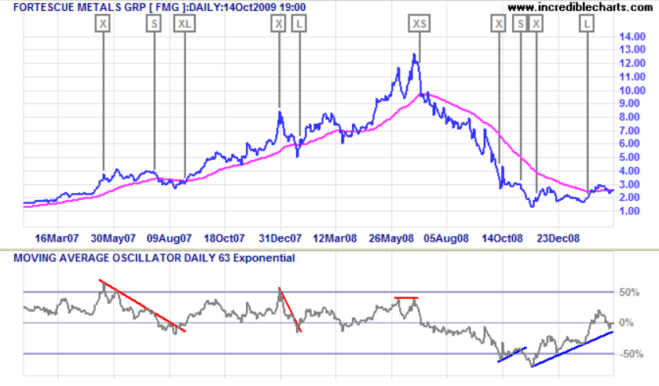

In trading, technical analysis provides a suite of tools that traders use to navigate market fluctuations. These tools help traders make informed decisions by analyzing past market data to predict future price movements. Among the vast array of indicators available, the Oscillator of a Moving Average (OSMA) stands out due to its ability to highlight pivotal changes in market momentum and trends. Unlike many other indicators, the OSMA offers a unique method of visualizing the relationship between an oscillator and its moving average, providing insights that can be crucial for traders in determining trend strength and potential reversals.

This article aims to elucidate what the OSMA is, how it functions, and its applicability in algorithmic trading. By breaking down its components, calculations, and interpretation, we seek to equip traders with a deeper understanding of this tool. The OSMA is particularly valuable in algorithmic trading, as its signals can be integrated into automated strategies aimed at optimizing trade execution. By the end of this article, traders will gain insights into leveraging the OSMA for enhanced trading decisions, helping them navigate the complexities of financial markets with increased confidence and efficiency.



## Table of Contents

## What is the Oscillator of a Moving Average (OSMA)?

The Oscillator of a Moving Average (OSMA) is a technical analysis tool utilized in financial trading to identify trends and potential reversals in market movements. At its core, the OSMA measures the difference between an oscillator and its corresponding moving average. The most common oscillator employed for this purpose is the Moving Average Convergence Divergence (MACD), which already provides valuable insights into market momentum.

MACD is composed of two lines, typically derived from exponential moving averages (EMA): the MACD line and the signal line. The OSMA enhances the interpretation of these lines by calculating the disparity between the MACD line and its signal line. Mathematically, this can be expressed as:

$$
\text{OSMA} = \text{MACD line} - \text{Signal line}
$$

This computation results in a histogram that oscillates above and below a zero line, offering a visual representation of momentum changes. Positive OSMA values suggest that the MACD line is above the signal line, which generally indicates an upward momentum. Conversely, negative values imply downward momentum as the MACD line falls below the signal line.

Traders leverage the OSMA to gain insights into potential trend strength and reversals. When the OSMA traverses the zero line, it may signal a shift in market trend direction. This feature becomes particularly useful in distinguishing periods of bullish or bearish sentiment, providing traders with actionable data for making informed trading decisions.

In summary, the OSMA serves as a refined tool in the technical analyst’s toolkit, offering a smoothed view of [momentum](/wiki/momentum) that aids in identifying significant market trends and reversals. By focusing on the relationship between oscillators and their moving averages, OSMA provides an additional layer of analysis that can enhance trading outcomes.

## How to Calculate the OSMA

The Oscillator of a Moving Average (OSMA) calculation begins with the selection of an oscillator and a corresponding moving average to track the difference between them. Widely adopted within this context are the Moving Average Convergence Divergence (MACD) line and its signal line. The OSMA is determined by subtracting the signal line from the MACD line, providing insight into the momentum and direction of price movements.

To calculate the OSMA, consider the following process:

1. **Select the Oscillator and Moving Average:** Typically, the MACD line serves as the oscillator, while its nine-day exponential moving average is employed as the signal line.

2. **Formula:** The OSMA value is derived using the formula:
$$
    \text{OSMA} = \text{MACD} - \text{Signal Line}

$$
   Where:
   - **MACD** is computed by subtracting the 26-day exponential moving average (EMA) from the 12-day EMA:
$$
     \text{MACD} = \text{EMA}_{12} - \text{EMA}_{26}

$$
   - **Signal Line** is the 9-day EMA of the MACD.

3. **Representation:** The result of the OSMA calculation is usually depicted as a histogram. When the OSMA is positive, the histogram bars are typically drawn above the zero line, signaling potential bullish momentum. Conversely, negative OSMA values position the histogram below the zero line, indicating bearish momentum.

The computation can be implemented in Python for traders aiming to automate their analysis:

```python
import pandas as pd

def calculate_osma(prices):
    ema12 = prices.ewm(span=12, adjust=False).mean()
    ema26 = prices.ewm(span=26, adjust=False).mean()
    macd = ema12 - ema26
    signal_line = macd.ewm(span=9, adjust=False).mean()
    osma = macd - signal_line
    return osma

# Example usage
# Assuming `prices` is a pandas DataFrame with a 'Close' column
close_prices = pd.Series([insert list of closing prices])
osma_values = calculate_osma(close_prices)
```

This process enables traders to gauge market trends by analyzing the fluctuations between the MACD and its moving average, aiding in the anticipation of potential market movements based on historical data patterns.

## Interpreting OSMA Signals

The Oscillator of a Moving Average (OSMA) serves as a vital tool in confirming market trends by analyzing the differences between an oscillator, typically the MACD, and its signal line. In terms of practical application, interpreting OSMA signals involves focusing on its positive and negative values. Positive OSMA values generally indicate an upward market trend, suggesting buying opportunities as the oscillator surpasses its moving average, reflecting stronger momentum. Conversely, negative OSMA values suggest a downward trend, pointing toward selling opportunities due to diminishing momentum as the oscillator falls below its moving average.

A critical aspect of OSMA interpretation is the crossover of the zero line. When the OSMA moves across the zero line from negative to positive, it may signal the beginning of an upward trend. Conversely, when it shifts from positive to negative, a potential trend reversal toward a downtrend is indicated. These crossovers can be pivotal moments for traders to consider initiating or closing positions, allowing for more strategic decision-making.

In [algorithmic trading](/wiki/algorithmic-trading), these OSMA signals can be systematically utilized by encoding them into trading algorithms. For instance, a simple Python script can automate trading decisions based on OSMA signals:

```python
def calculate_osma(macd_line, signal_line):
    return macd_line - signal_line

def trading_decision(osma_value):
    if osma_value > 0:
        return "Buy"
    elif osma_value < 0:
        return "Sell"
    else:
        return "Hold"

macd_line = [..., ...]  # Sample MACD values
signal_line = [..., ...]  # Sample Signal values

for macd_val, signal_val in zip(macd_line, signal_line):
    osma_value = calculate_osma(macd_val, signal_val)
    action = trading_decision(osma_value)
    print(f"OSMA: {osma_value:.2f} -> {action}")
```

This code tracks OSMA values in real time and generates actionable signals based on these computations, thus enabling traders to react swiftly to market changes. By integrating OSMA-driven strategies, traders can leverage historical data patterns for automated and potentially more precise trading outcomes.

## OSMA vs. Stochastic Oscillator

The Oscillator of a Moving Average (OSMA) and the Stochastic Oscillator are pivotal tools in technical analysis, each serving distinct roles in interpreting market signals. While both are utilized to gauge market momentum and trend strength, their methodologies and outputs differ significantly, aiding traders in various facets of market analysis.

The OSMA is fundamentally a momentum-based indicator that derives its value from the relationship between an oscillator, typically the Moving Average Convergence Divergence (MACD), and its signal line. The OSMA produces a smoothed representation of momentum shifts by highlighting the differences between these two components. This smoothing attribute allows the OSMA to filter out short-term price fluctuations, making it advantageous for identifying sustained market trends. The resulting values, often plotted as a histogram, offer insights into the strength and direction of price movements—positive values suggesting an upward momentum, while negative values indicate downward momentum.

On the other hand, the Stochastic Oscillator evaluates the closing price of an asset in relation to its price range over a specific period. It reflects the relative position of the current price within this range, thereby focusing on the speed or velocity of price movements. This indicator is typically plotted on a scale from 0 to 100 and consists of two lines, %K and %D, where %K measures the current close's position relative to the range, and %D is a moving average of %K. Traders use the Stochastic Oscillator to identify overbought or oversold conditions, with values above 80 generally indicating overbought conditions and values below 20 indicating oversold conditions.

The core distinction between these two indicators lies in their focus; while the OSMA provides a broader view of momentum changes over time, the Stochastic Oscillator offers a snapshot of recent price action relative to past highs and lows. Selecting between the OSMA and Stochastic Oscillator largely depends on the specific trading strategy employed. For those aiming to capture long-term trends, the OSMA's smoothing effect might be more beneficial. Conversely, traders looking to exploit short-term price reversals might find the Stochastic Oscillator's relative strength readings more instructive. Understanding these differences enables traders to choose the appropriate indicator to suit their particular market strategies and objectives.

## Limitations of Using OSMA

The Oscillator of a Moving Average (OSMA) possesses inherent limitations that traders should carefully consider within their technical analysis toolbox. As a lagging indicator, the OSMA derives its signals from historical data, which may not promptly reflect ongoing market conditions. This temporal delay can lead to challenges in anticipating immediate market movements, especially in rapidly changing environments.

In volatile or sideways markets, the risk of false signals becomes more pronounced with the OSMA. The indicator might suggest potential trends that do not materialize, leading to possible misjudgments in trading decisions. Thus, reliance solely on the OSMA can result in suboptimal outcomes.

To mitigate these drawbacks, it is recommended that traders employ the OSMA in conjunction with other technical indicators. For example, combining OSMA with leading indicators or tools that assess market momentum, such as the Relative Strength Index (RSI), can provide a more comprehensive view of market dynamics. This multi-indicator strategy helps in validating the signals generated by the OSMA, potentially reducing the occurrence of erroneous trading strategies.

Ultimately, while the OSMA is a valuable aid in identifying trends and momentum, its lagging nature necessitates a cautious approach. By integrating additional analytical tools, traders can enhance their overall strategy, improving the precision and reliability of their trading decisions.

## Leveraging OSMA in Algo Trading

The Oscillator of a Moving Average (OSMA) is a valuable tool for integrating into algorithmic trading strategies due to its capacity to provide clear, historically-derived signals. By leveraging the momentum insights offered by OSMA, algorithmic traders can develop scripts that address both short-term and long-term market fluctuations.

In algorithmic trading, OSMA's emphasis on the difference between an oscillator and its moving average translates into tangible entry and [exit](/wiki/exit-strategy) signals. These signals can be coded into automated scripts, allowing traders to specify precise conditions under which trades should be executed. For instance, a trader might create an algorithm that initiates a buy signal when the OSMA crosses above zero, indicating a potential upward trend, or a sell signal when it crosses below zero.

Backtesting is a crucial element when incorporating OSMA into trading algorithms. Historical data is used to simulate trades over past market conditions, providing insight into how the OSMA-based strategies would have performed. Through [backtesting](/wiki/backtesting), traders can optimize their algorithms by adjusting parameters such as the timeframes for the moving averages or the oscillator itself. This process aids in refining the algorithms to improve the accuracy of identifying profitable entry and exit points.

For a practical implementation, consider the following Python code snippet using a popular library like `pandas` for handling data and `matplotlib` for visualizing:

```python
import pandas as pd
import matplotlib.pyplot as plt

# Sample data loading
data = pd.read_csv('market_data.csv')
# Assuming 'Close' is the price column
data['EMA_12'] = data['Close'].ewm(span=12, adjust=False).mean()
data['EMA_26'] = data['Close'].ewm(span=26, adjust=False).mean()
data['MACD'] = data['EMA_12'] - data['EMA_26']
data['Signal'] = data['MACD'].ewm(span=9, adjust=False).mean()
data['OSMA'] = data['MACD'] - data['Signal']

# Visualize OSMA
plt.figure(figsize=(14,7))
plt.plot(data['OSMA'], label='OSMA', color='blue')
plt.axhline(0, linestyle='--', alpha=0.7, color='gray')
plt.title('OSMA Indicator')
plt.xlabel('Date')
plt.ylabel('OSMA Value')
plt.legend()
plt.show()
```

This code calculates the OSMA by first determining the MACD and its signal line. The difference is plotted to visualize potential trading signals.

In conclusion, the integration of OSMA into algo trading involves translating its historical signal patterns into automated decision-making processes. The flexibility of backtesting enables continuous improvement and fine-tuning, enhancing the effectiveness of the strategies in dynamic market environments.

## Conclusion

The Oscillator of a Moving Average (OSMA) serves as a practical and effective technical indicator, offering traders a streamlined tool to enhance their trading performance. By analyzing the difference between an oscillator, commonly the MACD, and its moving average, traders can gain a clearer picture of market momentum and potential trend changes. This understanding is crucial, especially in algorithmic trading, where precision and timing are key.

Effectively incorporating OSMA into trading strategies involves more than just understanding its basic mechanics; traders need to consider its position within a comprehensive analytical framework. This means using OSMA alongside other technical indicators to confirm signals and provide a more robust basis for trading decisions. For instance, integrating OSMA with trend lines, moving averages, or even [fundamental analysis](/wiki/fundamental-analysis) can help mitigate the limitations of any single indicator, such as lag or false signals.

Algorithmic traders, in particular, can benefit from OSMA by encoding its signals into algorithms that trigger automated buy and sell decisions. By doing so, they can capitalize on both short-term fluctuations and long-term trends, optimizing both entry and exit points through rigorous backtesting of OSMA-based strategies. Additionally, adapting the OSMA parameters to suit specific market conditions or asset classes can further refine these algorithms, enhancing overall trading efficacy.

In conclusion, the OSMA's utility is maximized when used as part of a broader strategy that incorporates multiple market insights and tools. By understanding its methodology and leveraging it effectively, traders can significantly enhance their strategy outcomes, gaining a competitive advantage in diverse trading environments.

## Frequently Asked Questions (FAQ) on OSMA

### Frequently Asked Questions (FAQ) on OSMA

**What is the primary difference between OSMA and MACD?**  
The primary difference between the Oscillator of a Moving Average (OSMA) and the Moving Average Convergence Divergence (MACD) lies in their representation and focus. MACD consists of two lines: the MACD line, which is the difference between two exponential moving averages (EMAs), and a signal line, which is a moving average of the MACD line. OSMA, on the other hand, represents the difference between the MACD line and the signal line, typically visualized as a histogram. While MACD is concerned with identifying trends and momentum, OSMA focuses on the changes in the momentum strength as highlighted by the MACD's deviation from its average.

**Can OSMA be used for day trading?**  
Yes, OSMA can be utilized in [day trading](/wiki/day-trading-spy), provided traders heave a solid understanding of its dynamics and context. Day traders can utilize OSMA to detect shifts in momentum within shorter time frames, offering insights into possible entry or exit points. However, given its nature as a lagging indicator, it's important for day traders to complement OSMA signals with other real-time analytical tools and indicators to minimize the risk of late decisions.

**How do I choose the right parameters for OSMA in trading algorithms?**  
Selecting the right parameters for OSMA in trading algorithms involves backtesting various settings to identify which works best for your specific trading environment and objectives. Traders generally adjust the periods of the moving averages used in the MACD calculation. For instance, using different EMA lengths can tailor the sensitivity of the OSMA to either detect short-term changes or longer-term trends. Algorithmic traders typically opt for empirical testing and historical data analysis to finetune these parameters for optimal performance.

**Is OSMA suitable for beginner traders?**  
OSMA can be a valuable tool for beginner traders when used within a comprehensive trading strategy. Its histogram representation makes it relatively straightforward to interpret when used as a guideline for momentum change. However, due to the intricacies involved in understanding the nuances of its signals—such as recognizing false signals or knowing when to react—it is advisable for novices to start with simpler indicators and gradually incorporate OSMA as they gain experience.

**How do I mitigate the risk of false signals when using OSMA?**  
Mitigating the risk of false signals when using OSMA can be accomplished by integrating it with other technical analysis tools and indicators. Diversifying the analytical approach can help confirm trends and reduce reliance on a single indicator. Strategies such as combining OSMA with breakdown or [breakout](/wiki/breakout-trading) levels, trend lines, or complementary indicators such as the Relative Strength Index (RSI) can provide additional confirmation. Additionally, setting boundaries around significant levels of the OSMA histogram and integrating real-time news or market sentiment analysis can further refine decision-making processes to reduce false alarms.

## References & Further Reading

[1]: Murphy, J. J. (1999). ["Technical Analysis of the Financial Markets: A Comprehensive Guide to Trading Methods and Applications."](https://archive.org/details/technicalanalysi0000murp) New York Institute of Finance.

[2]: Pring, M. J. (2002). ["Technical Analysis Explained: The Successful Investor's Guide to Spotting Investment Trends and Turning Points."](https://www.amazon.com/Technical-Analysis-Explained-Fifth-Successful/dp/0071825177) McGraw-Hill Education.

[3]: Elder, A. (2002). ["Come Into My Trading Room: A Complete Guide to Trading."](https://www.amazon.com/Come-Into-My-Trading-Room/dp/0471225347) John Wiley & Sons, Inc.

[4]: Appel, G. (2005). ["Technical Analysis: Power Tools for Active Investors."](https://www.amazon.com/Technical-Analysis-Power-Active-Investors/dp/0132930048) FT Press.

[5]: Kirkpatrick, C. D., & Dahlquist, J. (2010). ["Technical Analysis: The Complete Resource for Financial Market Technicians."](https://ptgmedia.pearsoncmg.com/images/9780134137049/samplepages/9780134137049.pdf) FT Press.

[6]: Achelis, S. B. (2000). ["Technical Analysis from A to Z."](https://www.mhebooklibrary.com/doi/book/10.1036/9780071380119) McGraw-Hill Education.