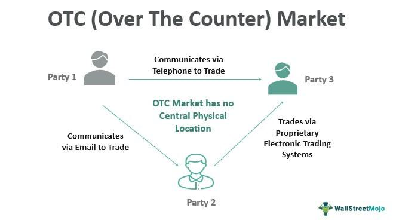

In the ever-evolving world of financial markets, traders are continuously seeking platforms and tools that offer them the edge in trading. The evolution of these platforms is fundamental in allowing traders to capitalize on market opportunities with precision and efficiency. Financial trading platforms have become indispensable to traders at all levels, granting access to a plethora of markets and instruments, and facilitating rapid execution of trades.

Among the significant advancements in this domain is the rise of algorithmic trading. This approach fundamentally reshapes how trades are conducted by utilizing pre-programmed algorithms to execute orders based on specified market conditions. This capability is particularly impactful on platforms like OTC Markets, where over-the-counter (OTC) securities are traded. Algorithmic trading provides a formidable advantage by enhancing speed and accuracy, minimizing human error, and removing emotional bias from trading decisions.



OTC Markets, a dominant player in the trading of unlisted stocks, offers unique opportunities and challenges. It serves as a crucial venue for trading a wide array of securities not listed on formal exchanges. The integration of algorithmic trading within this framework represents a transformative shift. Traders leverage algorithms to navigate the less regulated and information-sparse environment characteristic of OTC Markets, enabling them to optimize their strategies and uncover hidden value.

This article will explore the intricacies of financial markets trading platforms, with an emphasis on OTC Markets and the role of algorithmic trading. We will examine the operational mechanics of these platforms, the myriad benefits algorithmic trading offers, and approaches traders can adopt to fully harness these tools. By understanding how these elements interact, traders can refine their strategies and maintain a competitive edge.

As we navigate this exciting and complex domain, our aim is to uncover the strategies that can empower traders to innovate and excel. The convergence of technology and trading is reshaping the landscape, and staying informed is crucial for success.

## Table of Contents

## Understanding Financial Markets Trading Platforms

Trading platforms are essential for executing trades and gaining access to a diverse array of securities in financial markets. They provide traders and investors with crucial market data, analytical tools, and intuitive interfaces for executing buy and sell orders. The landscape of trading platforms is diverse, ranging from traditional brokerage services to highly sophisticated systems equipped with algorithmic trading functionalities.

Traditional brokerage services offer basic trading capabilities along with essential market information and are generally user-friendly for individual investors and smaller trading operations. These platforms often come equipped with features such as real-time quotes, stock charting tools, and access to research reports.

On the more advanced side, trading platforms with [algorithmic trading](/wiki/algorithmic-trading) capabilities enable traders to automate their trading strategies. These systems allow for the implementation of complex algorithms that can execute trades automatically when specific market conditions are met. This automation is underpinned by advanced programming and real-time data processing, which significantly enhances trading efficiency and execution speed.

An effective trading platform must prioritize reliability and accessibility while offering a comprehensive suite of tools to support complex trade strategies. Reliability ensures minimal downtime and high execution efficiency, crucial factors in fast-moving markets. Accessibility enables traders to operate smoothly across different devices and locations, ensuring continuity in trading operations.

Several popular financial markets trading platforms serve different types of traders and investment needs. MetaTrader, for example, is widely utilized for [forex](/wiki/forex-system) and contract for difference (CFD) trading due to its robust algorithmic trading capabilities and an extensive library of technical analysis tools. [Interactive Brokers](/wiki/interactive-brokers-api) provides a versatile platform catering to both retail and institutional traders with a wide range of asset classes and advanced trading tools, including algo trading and risk management features.

QuantConnect is another notable platform, offering a cloud-based [quantitative trading](/wiki/quantitative-trading) environment that provides access to historical data and research capabilities, making it ideal for developers and quants focusing on [backtesting](/wiki/backtesting) and deploying quantitative strategies.

In summary, trading platforms form the backbone of modern trading by offering the necessary infrastructure for executing trades efficiently. The choice of platform depends on the trader's specific needs, including desired asset classes, trading strategy complexity, and required technological features. Whether through a traditional brokerage service or an advanced algorithmic trading system, a suitable platform can substantially enhance a trader's ability to navigate financial markets effectively.

## An Overview of OTC Markets

OTC Markets Group Inc. stands as a significant entity in the trading of over-the-counter (OTC) securities, accommodating more than 11,500 securities. As the largest marketplace in the United States for OTC securities, it provides a robust framework for companies that do not meet the stringent listing requirements of traditional stock exchanges. The OTC Markets are structured into three main tiers: OTCQX, OTCQB, and OTC Pink, each serving different segments of the market based on company quality and financial reporting standards.

The OTCQX tier represents the highest echelon within the OTC Markets ecosystem. Companies listed under OTCQX are characterized by high financial standards, transparent reporting, and reputable operational history. This tier often includes international firms and U.S. companies that wish to enhance investor visibility without the stricter regulatory demands of larger exchanges.

OTCQB, known as the "Venture Market," caters to developing companies that are in the early stages of their growth trajectory. This tier bridges the gap between well-established corporations and start-ups, offering emerging companies a platform to access U.S. investors while they strive to meet the quantitative and qualitative criteria necessary for OTCQX or national exchange listings.

OTC Pink, the most speculative tier, includes companies that may not provide regular financial reports or adhere to specific regulatory criteria. Subdivided into Current Information, Limited Information, and No Information categories, it allows a wide spectrum of equity securities, ranging from distressed and emerging businesses seeking redevelopment to shell companies.

The operational mechanics of OTC Markets extend beyond traditional trading venues, offering essential services such as market data dissemination, trading infrastructure, and corporate visibility. OTC Markets employs an electronic quotation system, enabling seamless security transactions among traders and minimizing counterparty risks associated with traditional OTC negotiations.

For listed companies, OTC Markets provides substantial benefits. These companies enjoy increased public exposure and investor accessibility without the burden of typical listing fees on major exchanges. For investors, OTC Markets offers the opportunity to invest in a diverse portfolio of international and domestic securities with varying degrees of risk and growth potential.

OTC Markets' structure and service offerings create a unique trading environment conducive to both companies seeking capital and investors searching for innovative growth opportunities. By maintaining flexible entry requirements and supporting company transparency via disclosure and compliance processes, OTC Markets fosters a dynamic and accessible marketplace distinct from conventional exchanges.

## Algorithmic Trading: A New Era for Financial Markets

Algorithmic trading, abbreviated as algo trading, revolutionizes the trading landscape by employing computer algorithms to automate transaction processes. These algorithms are programmed to make trading decisions based on predefined criteria such as timing, price, or [volume](/wiki/volume-trading-strategy), allowing execution speed and data processing capabilities far surpassing human abilities. This methodology significantly reduces the time required to assess, decide, and execute trades, providing traders unparalleled efficiency.

One of the primary advantages of algorithmic trading is its ability to harness advanced trading strategies that are often unfeasible for manual execution. Among these strategies, [trend following](/wiki/trend-following) and statistical [arbitrage](/wiki/arbitrage) are widely utilized. Trend following relies on algorithms to identify and exploit market trends, buying or selling assets according to the movement direction. Here, the algorithm can be programmed to recognize patterns indicative of upward or downward market trends, automatically adjusting the investment positions accordingly. Statistical arbitrage, on the other hand, involves identifying pricing inefficiencies between related financial instruments and executing trades to capture these anomalies. This requires sophisticated statistical and quantitative models to analyze vast datasets—something algorithms can execute within milliseconds.

High-frequency trading ([HFT](/wiki/high-frequency-trading-strategies)) represents another dimension of algorithmic trading, characterized by a large number of transactions carried out per second. HFT strategies aim to capitalize on minuscule market inefficiencies and require state-of-the-art technology infrastructure to ensure rapid data transmission and order placement, often necessitating co-location services near financial exchanges to minimize latency.

Algorithmic trading also sidesteps the pitfalls of emotional trading. By removing the psychological component, trading decisions remain rooted in logic and pre-established frameworks, potentially resulting in more disciplined execution. This is particularly beneficial in volatile markets where emotions can often cloud judgment, leading to premature selling or holding onto losing positions. The precision and predictability of algorithmic trading help maintain consistency in strategy execution, which is crucial for long-term success.

The benefits of algorithmic trading extend to optimizing transaction costs and achieving better spreads. By timing trades and executing them when conditions are most favorable, algo trading can minimize the market impact and reduce transaction costs. Moreover, automation allows for the backtesting of trading algorithms on historical data, providing insights into potential performance and an opportunity to refine strategies before deploying them in live markets.

As we look to the future, algorithmic trading is poised to offer even greater potential through continuous technological advancements. Machine learning and [artificial intelligence](/wiki/ai-artificial-intelligence) are increasingly being integrated to develop self-adaptive algorithms that can learn and evolve without the need for constant human intervention. These algorithms could dynamically adjust trading strategies based on shifting market conditions, potentially leading to even more sophisticated and profitable trading models.

In conclusion, algorithmic trading has inaugurated a new era for financial markets, bringing immense possibilities through automation and advanced data analysis. For today's traders, adopting and adapting to algo trading is not just an option, but an essential component of staying competitive in an ever-evolving market landscape.

## The Integration of Algo Trading on OTC Markets

OTC Markets, a pivotal trading environment, presents significant opportunities for integrating algorithmic trading. The over-the-counter (OTC) market is characterized by less [liquidity](/wiki/liquidity-risk-premium) and a scarcity of readily available information, distinguishing it from traditional exchanges. Algorithmic trading can effectively navigate this landscape by leveraging algorithms that respond instantaneously to market conditions, thus maximizing execution efficiency and minimization of market impact.

Due to the decentralized and tiered structure of OTC Markets, traders have the advantage of tailoring their algorithms according to the level of disclosure and data quality. The OTC Markets Group divides securities into three tiers: OTCQX, OTCQB, and OTC Pink. Each tier represents a different level of transparency and compliance, enabling algorithmic traders to optimize strategies for each category. For instance, strategies that rely heavily on public disclosures and transparency are best suited for higher-tier securities like those in the OTCQX tier, whereas speculative trading algorithms may target OTC Pink where information is scant, exploiting inefficiencies.

Rich data provision and alternative trading systems offered by OTC Markets make it an attractive proposition for algorithmic trading. By employing powerful data analytics, traders can analyze historical and live data streams to identify trading signals and execute strategies profitably. The alternative trading systems (ATS) facilitated by OTC Markets provide an infrastructure where sophisticated algorithms can be executed with minimal latency.

Algorithm deployment in OTC Markets necessitates a deep understanding of the market’s unique characteristics. Traders employing algorithmic tactics should develop a robust backtesting framework to simulate market conditions and refine strategies before live deployment. An example of a simple algorithm for backtesting purposes in Python might involve using libraries such as `pandas` and `numpy` for data manipulation, and `[backtrader](/wiki/backtrader)` for the trading engine:

```python
import backtrader as bt
import pandas as pd
import numpy as np

class SimpleStrategy(bt.SignalStrategy):
    def __init__(self):
        self.signal_add(bt.SIGNAL_LONG, df['Signal'])

# Initialize Cerebro engine
cerebro = bt.Cerebro()
df = pd.read_csv('otc_market_data.csv')
cerebro.addstrategy(SimpleStrategy)

data = bt.feeds.PandasData(dataname=df)
cerebro.adddata(data)
cerebro.run()
```

This code snippet demonstrates a basic setup for validating a simple trading strategy using signals derived from OTC market data. It reinforces the necessity for a robust computational setup in effectively integrating algorithmic trading within the OTC framework.

In conclusion, successfully integrating algorithmic trading within the OTC Markets ecosystem requires a strategic approach that considers the market's unique structure and data dynamics. By tailoring algorithms to each tier and leveraging the comprehensive data and systems offered, traders can enhance their strategic positioning and achieve competitive advantages in the less conventional OTC trading landscape.

## Choosing the Right Algo Trading Platform

Selecting the right platform for algorithmic trading is crucial for optimizing trading strategies and achieving desired outcomes. Key considerations include execution speed, data access, and the array of available features. Leading platforms such as MetaTrader, QuantConnect, and Interactive Brokers are known for offering comprehensive tools that facilitate the building and execution of algorithms.

MetaTrader stands out with its user-friendly interface and robust analytical tools. It supports a wide range of script languages and offers backtesting capabilities, making it an excellent choice for both beginners and experienced traders. MetaTrader is particularly beneficial for those looking to automate their trading in forex and CFDs, providing an extensive library for technical analysis and strategy testing.

QuantConnect excels in providing access to open-source algorithmic trading infrastructure. It supports multiple asset classes, including equities, forex, futures, and options, catering to a diverse range of trading strategies. QuantConnect’s platform is equipped with powerful backtesting tools and API integration options. This makes it highly suitable for traders who prioritize customizable and scalable solutions tailored to specific trading needs.

Interactive Brokers offers a sophisticated trading platform with extensive data access and order execution capabilities. Known for its comprehensive financial products, it offers advanced algorithms that can be customized to meet specific trading criteria. Interactive Brokers appeals to seasoned traders seeking detailed analytics and comprehensive tools for monitoring and executing complex trading strategies.

For traders seeking an algorithmic trading platform, it is essential to align the platform's features with their trading goals and technical expertise. A platform's scalability and user-friendliness are critical factors, impacting how effectively a trader can develop and implement their desired strategies. Those new to algorithmic trading may prefer platforms with intuitive interfaces and robust community support, while experienced traders might prioritize platforms that offer deep customization and extensive market access.

Ultimately, the right platform serves as a crucial mechanism for translating conceptual trading strategies into executable algorithms. Selecting one that matches your specific needs can significantly enhance your capabilities in the algorithm-driven trading landscape.

## Advantages and Challenges of Algo Trading on OTC Markets

Algorithmic trading on OTC Markets offers several advantages that can significantly enhance trading performance. One of the primary benefits is the improved speed and efficiency of executing trades. Algorithms can process vast amounts of market data and make trading decisions in fractions of a second, outperforming human capabilities. This ability to act quickly is crucial in markets where prices can change rapidly, allowing traders to capture opportunities that may only exist momentarily. 

Additionally, algorithmic trading provides extensive backtesting capabilities, allowing traders to test their strategies against historical data before deploying them in live markets. This process helps to refine strategies and improve their effectiveness, minimizing risks associated with unproven models. Furthermore, removing emotional biases from trading decisions is another significant advantage of using algorithms. Automated systems strictly adhere to predefined rules and criteria, eliminating impulsive actions influenced by fear or greed.

However, despite these benefits, several challenges must be addressed when engaging in algorithmic trading within OTC Markets. One of the foremost challenges is accessing reliable data. OTC markets, known for their lower liquidity compared to traditional exchanges, often present difficulties in obtaining accurate and timely information. The disparity in data availability can impede the development of effective algorithms, as backtesting and real-time analysis heavily rely on comprehensive datasets.

Technological dependencies also pose a challenge. Traders must ensure their systems are not only robust but also capable of handling potential technical failures gracefully. Any downtime or technical glitches can lead to missed trades or financial losses. Additionally, the complexity of algorithm design can be a barrier. Developing algorithms requires a strong understanding of both programming and market dynamics, demanding a skill set that combines finance and technology expertise.

In OTC Markets, the liquidity and informational asymmetry present both challenges and opportunities. The lower liquidity can lead to wider bid-ask spreads and increased slippage, making trade execution potentially more costly. Nevertheless, for adept algo traders, these conditions can also present arbitrage opportunities and niche strategies tailored to exploit specific market inefficiencies.

To navigate these complexities, traders need to fully grasp the nuances of OTC markets and algorithmic trading. Constructing robust trading models involves constant monitoring and adaptation to shifting market conditions. Enhancing data acquisition methods and developing sophisticated error-handling protocols are also crucial steps in optimizing algorithmic strategies. By understanding and addressing these factors, traders can leverage algorithmic trading to their advantage, even within the challenging context of OTC Markets.

## Conclusion

Algorithmic trading and OTC Markets represent a convergence that holds substantial potential for modern traders. This union allows market participants to harness the power of automation and strategic execution in environments that are often less liquid and less transparent. By understanding the dynamics between algorithmic trading and OTC Markets, traders can gain significant strategic advantages, improving decision-making and trade execution.

Technological progress is set to further amplify the capabilities of trading platforms and algorithms, providing traders with deeper insights and enhanced efficiencies. As algorithms become more sophisticated, the ability to process and analyze vast amounts of data will offer new ways to identify trading opportunities and mitigate risks. This expansion will likely lead to more effective strategies that can capitalize on subtle market movements and arbitrage opportunities.

The successful exploitation of these technologies necessitates ongoing learning and adaptation. Markets are continually evolving, and staying updated on technological advancements and market trends is essential for maintaining a competitive edge. Traders are advised to embrace these innovations, integrating them into their trading strategies to safeguard their success in the ever-changing financial landscape.

By capitalizing on the strengths of algorithmic trading within the framework of OTC Markets, market participants can position themselves advantageously, navigating complex market conditions with increased precision and confidence.

## References & Further Reading

[1]: Bergstra, J., Bardenet, R., Bengio, Y., & Kégl, B. (2011). ["Algorithms for Hyper-Parameter Optimization."](https://dl.acm.org/doi/10.5555/2986459.2986743) Advances in Neural Information Processing Systems 24.

[2]: ["Advances in Financial Machine Learning"](https://www.amazon.com/Advances-Financial-Machine-Learning-Marcos/dp/1119482089) by Marcos Lopez de Prado

[3]: ["Evidence-Based Technical Analysis: Applying the Scientific Method and Statistical Inference to Trading Signals"](https://books.google.com/books/about/Evidence_Based_Technical_Analysis.html?id=MeoJAQAAMAAJ) by David Aronson

[4]: ["Machine Learning for Algorithmic Trading"](https://github.com/stefan-jansen/machine-learning-for-trading) by Stefan Jansen

[5]: ["Quantitative Trading: How to Build Your Own Algorithmic Trading Business"](https://www.amazon.com/Quantitative-Trading-Build-Algorithmic-Business/dp/1119800064) by Ernest P. Chan