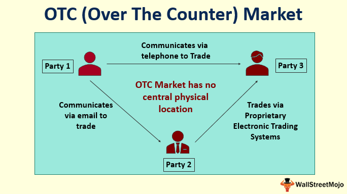

The world of securities trading is transforming at an unprecedented pace, driven largely by technological advancements. Among these changes, over-the-counter (OTC) markets and algorithmic trading have gained significant attention from investors looking to optimize their strategies and enhance returns. OTC markets offer a platform for trading securities that are not listed on formal exchanges such as the New York Stock Exchange (NYSE), providing opportunities for smaller companies to access capital markets. On the other hand, algorithmic trading utilizes automated systems powered by pre-programmed rules to execute trades, offering the benefits of speed, efficiency, and reduced human error.

This article aims to explore the unique dynamics of OTC markets and the innovative role of algorithmic trading. We will investigate how these two elements intersect to create a synergistic relationship that is reshaping securities trading. As technology continues to revolutionize financial markets, understanding the convergence of OTC trading and algorithmic strategies becomes increasingly important for investors seeking to remain competitive in a rapidly-evolving landscape.



## Table of Contents

## Understanding OTC Markets

Over-the-counter (OTC) markets are a critical component of the financial ecosystem, providing a platform for the trading of securities that are not listed on formal exchanges such as the New York Stock Exchange (NYSE) or the Nasdaq. Unlike these formal exchanges, OTC markets offer a decentralized and flexible trading environment, facilitating transactions directly between market participants through dealer networks and electronic trading systems.

One of the primary functions of OTC markets is to enable smaller or emerging companies, which might not meet the stringent listing requirements of major stock exchanges, to participate in the capital markets. This accessibility allows these companies to raise capital by issuing securities, thereby supporting their growth and expansion.

OTC markets encompass a wide range of securities, including but not limited to stocks, bonds, derivatives, and foreign currencies. The diversity of instruments traded in OTC markets reflects the customizability and adaptability of these markets to accommodate various financial products that may not fit the standardized structure of exchange-traded instruments.

In terms of structure, the OTC market is categorized into various tiers that determine the level of compliance and reporting standards that securities must meet. Among these tiers are:

1. **OTCQX**: This is the highest tier of the OTC markets and is reserved for companies that meet stringent financial standards, comply with U.S. securities laws, and are current in their disclosure. The OTCQX Best Market aims to provide visibility and credibility for quality companies that meet these standards, offering investors a high degree of transparency.

2. **OTCQB**: Known as the Venture Market, the OTCQB tier includes early-stage and developing companies that must be current in their reporting and undergo an annual verification and management certification process. It serves as a transparent trading platform for investors to access small-cap U.S. and international companies that are in compliance with U.S. securities laws.

3. **Pink Market**: This tier is more speculative and includes a diverse range of companies that might not meet the stringent requirements of the OTCQX or OTCQB. The Pink Market is divided into Current Information companies, Limited Information companies, and companies with No Information, which indicates the level of disclosure and transparency provided to investors. Companies in this tier are not subject to the same high levels of scrutiny and reporting as companies in the higher tiers, presenting higher risks and opportunities for significant returns.

The tiered structure of the OTC market facilitates appropriate risk assessment for investors and provides a clear indication of the regulatory and compliance status of the traded companies. Such organization allows market participants to make informed decisions based on their risk tolerance and investment objectives.

## The Role of Algo Trading

Algorithmic trading, often referred to as algo trading, fundamentally automates the trading of financial securities by employing predefined rules and sophisticated strategies to execute market transactions. This approach to trading leverages the power of high-speed data processing and computational efficiency, enabling traders to analyze vast datasets and respond to market fluctuations with remarkable precision and speed. 

The core advantage of [algorithmic trading](/wiki/algorithmic-trading) lies in its capacity to significantly reduce the latency of trade execution. By automating decision-making processes, traders can exploit price variations as they arise, ensuring transactions are executed at the most advantageous prices. High-frequency trading ([HFT](/wiki/high-frequency-trading-strategies)), a subset of algorithmic trading, epitomizes this efficiency, executing a large number of trades in fractions of a second to capitalize on minute price discrepancies.

Different strategies are prevalent among algo traders, often tailored to fit specific trading goals and market conditions. Trend following is a popular strategy where algorithms identify and exploit emerging price trends. This involves statistical analysis to determine the [momentum](/wiki/momentum) of a security and the automatic execution of buy or sell orders based on the trend's continuation or reversal.

Arbitrage opportunities present another lucrative approach, where traders seek to profit from price differentials of the same asset across different markets or instruments. By using algorithms, traders can rapidly identify and execute trades across these discrepancies, a task infeasible for manual trading due to the sheer speed required.

Algorithmic trading is utilized across diverse markets, from equities and commodities to complex derivative instruments. In commodities markets, traders use algorithms to analyze supply and demand fluctuations, geopolitical developments, and other variables to optimize their trades. 

Overall, the integration of algorithmic trading has revolutionized how market participants engage with financial instruments, creating an environment characterized by enhanced efficiency, accuracy, and potential profitability. As technology continues to advance, the role of algo trading is projected to grow, further transforming the dynamics of modern securities trading.

## OTC Markets and Algorithmic Trading: A Synergistic Relationship

Algorithmic trading plays a crucial role in enhancing [liquidity](/wiki/liquidity-risk-premium) within over-the-counter (OTC) markets. By executing trades according to predetermined rules, algorithmic trading facilitates a more consistent flow of transactions, thus increasing market liquidity. This approach is particularly advantageous in OTC markets, where securities not listed on formal exchanges often face liquidity challenges. 

One of the key benefits of algorithmic trading in OTC environments is the reduction of human error. Algorithms can process large volumes of trading data with rapid precision, making decisions based on historical data and real-time market analysis. This level of automation allows for efficient risk management, as trades can be executed swiftly in response to market fluctuations. For example, algorithms can be programmed to identify [arbitrage](/wiki/arbitrage) opportunities or respond to trend changes, minimizing the risk posed by volatile markets.

Furthermore, the incorporation of [artificial intelligence](/wiki/ai-artificial-intelligence) (AI) into algorithmic trading strategies enables the development of more adaptable and sophisticated trading solutions. AI technologies, such as [machine learning](/wiki/machine-learning), enhance the ability of trading algorithms to learn from data patterns and adapt to new market conditions without human intervention. This adaptability is vital in OTC markets, where price discovery and market depth can vary significantly.

Consider a Python snippet that models a simple algorithmic trading strategy incorporating machine learning for adaptive decision-making:

```python
import numpy as np
from sklearn.ensemble import RandomForestClassifier

# Sample data: features and labels
X = np.array([[1, 2], [3, 4], [1, 2], [3, 4]])
y = np.array([0, 1, 0, 1])  # 0: No trade, 1: Execute trade

# Train a Random Forest model
model = RandomForestClassifier(n_estimators=10)
model.fit(X, y)

# New market data for prediction
new_data = np.array([[2, 3]])
trade_decision = model.predict(new_data)

if trade_decision == 1:
    print("Execute trade")
else:
    print("No trade action")
```

In this example, a Random Forest Classifier is trained on historical market data to decide whether a trade should be executed based on new data inputs. Such models can evolve over time, learning from new data to improve decision-making accuracy.

In summary, algorithmic trading boosts OTC market performance by enhancing liquidity and mitigating risks through efficient execution and sophisticated technology integration. The synergy between OTC markets and algorithmic trading offers promising prospects for investors seeking to navigate the complexities of unlisted securities.

## Benefits and Challenges of OTC Algo Trading

Algorithmic trading in over-the-counter (OTC) markets offers numerous benefits, such as increased anonymity, reduced transaction costs, and improved operational efficiency. The private nature of OTC markets enables traders to execute transactions discreetly, protecting sensitive information about trading strategies and positions. This level of anonymity is particularly valuable for large institutional investors aiming to avoid market impact and potential adverse price movements.

Additionally, algorithmic trading reduces transaction costs by automating processes that traditionally require human intervention. By utilizing algorithms, traders can execute orders with optimal pricing and minimal market impact, ultimately decreasing the cost of trading. The efficiency gained from rapid data processing and execution allows traders to capitalize on fleeting market opportunities and enhances overall market fluidity.

However, the implementation of algorithmic trading in OTC markets is not without challenges. A primary concern is the dependency on technology, which can introduce risks such as system failures, connectivity issues, and vulnerability to cyberattacks. These technological dependencies necessitate rigorous system testing and robust infrastructure to ensure the reliability and security of trading operations.

Furthermore, algorithmic trading can amplify the effects of market [volatility](/wiki/volatility-trading-strategies). Algorithms, while designed to make decisions based on predefined criteria, can react to rapid market changes at an accelerated pace, sometimes exacerbating price fluctuations. This phenomenon, often referred to as volatility amplification, underscores the importance of incorporating safeguards within algorithms to manage such risks effectively.

To mitigate these challenges, sound regulatory frameworks are essential. Regulatory bodies must establish guidelines that promote transparency, accountability, and fairness in algorithmic trading practices. For instance, implementing pre-trade and post-trade transparency requirements can help monitor market activity, ensuring that trading behaviors align with established regulations.

Due diligence is equally crucial. Traders and firms engaging in OTC algorithmic trading must conduct thorough assessments of the algorithms they employ, regularly reviewing them to adapt to changing market conditions and compliance requirements. Integrating machine learning models can enhance algorithm adaptability, allowing strategies to evolve based on new data inputs and market dynamics.

In conclusion, while algorithmic trading in OTC markets presents significant opportunities to enhance trading efficiency and reduce costs, it also demands careful consideration of the inherent risks. Leveraging advanced technologies alongside comprehensive risk management strategies and regulatory compliance is key to harnessing the potential of OTC algo trading effectively.

## Case Studies and Practical Insights

While the theoretical framework of algorithmic trading in over-the-counter (OTC) markets offers substantial promise, its real-world application offers more concrete insights into the transformative potential of this synergy. Several case studies demonstrate the effectiveness and innovation of algorithmic trading within OTC markets across various sectors.

### Case Study 1: Corporate Bonds

Corporate bonds, traditionally traded over-the-counter due to their diversity and variability, have witnessed enhanced liquidity and efficiency through algorithmic trading. A notable example involves the application of liquidity-seeking algorithms designed to identify and execute transactions at optimal prices. These algorithms assess vast data sets, including historical price movements and prevailing market conditions, to calculate the timing and pricing of trades. As a result, trading desks have reported a significant increase in transaction speeds and a reduction in costs, bolstering market efficiency and liquidity.

### Case Study 2: Foreign Exchange (Forex) Markets

In the foreign exchange sector, algorithmic trading in OTC markets has brought about substantial improvements in trade execution and risk management. For instance, major financial institutions have employed machine learning algorithms to predict currency price movements by examining factors such as interest rates, economic indicators, and geopolitical events. These sophisticated models enable traders to mitigate risk and seize arbitrage opportunities more effectively, even in fast-moving [forex](/wiki/forex-system) markets.

### Industry Insights

1. **Adoption of AI and Machine Learning**: Industry experts highlight the pivotal role of artificial intelligence (AI) and machine learning in enhancing algorithmic strategies. AI-powered models continuously adapt to market changes, allowing for dynamic and responsive trading strategies that outperform static models.

2. **Emphasis on Data Quality**: The accuracy and reliability of data inputs are critical to the success of algorithmic trading in OTC markets. Experts recommend implementing stringent data validation and cleansing processes to ensure the algorithms function optimally.

3. **Regulatory Considerations**: Regulatory compliance remains a crucial aspect of OTC algorithmic trading. Adhering to established guidelines not only ensures legitimacy but also enhances trust with clients and stakeholders.

4. **Risk Management Practices**: Effective risk management is achieved through the integration of algorithms that monitor market volatility and adjust trading strategies accordingly. This proactive approach helps mitigate potential losses in fluctuating markets.

5. **Emerging Trends**: Future trends suggest a continuous integration of blockchain technology to enhance transparency and security in OTC transactions. Blockchain can provide detailed transaction records, thus reconciling the need for anonymity with the demand for auditability.

### Practical Implications

The successful implementation of algorithmic trading in OTC markets requires a multifaceted approach encompassing strategic innovation, data excellence, and regulatory compliance. Traders who effectively integrate these components are more likely to achieve sustainable success and set industry standards for best practices.

As technology continues to advance, the case studies and insights discussed above underscore the potential for further innovation and optimization within the ever-evolving landscape of OTC algorithmic trading. Industry players are encouraged to draw from these examples to enhance their trading operations and stay abreast of emerging market trends.

## Conclusion

The convergence of over-the-counter (OTC) markets and algorithmic trading is shaping a transformative era in securities trading. This combination fosters a dynamic trading environment where technology plays a pivotal role in streamlining operations, enhancing liquidity, and refining risk management strategies. As technology continues to evolve, traders must remain adaptable, embracing new tools and platforms to harness the full potential of this synergy effectively.

Advancements in artificial intelligence and trading algorithms are at the forefront of driving change in the OTC markets. AI-powered algorithms provide traders with the capability to process vast datasets in real time, identify trends, and execute trades with unprecedented precision and speed. Such technological innovations promise to further refine trading strategies, offering more personalized and efficient trading solutions.

The future landscape of OTC markets is poised to be significantly influenced by the evolution of artificial intelligence and algorithmic sophistication. As these technologies develop, they will likely introduce new dynamics and complexities to trading activities, necessitating that market participants continually update their skills and knowledge to stay competitive. 

Moreover, as the integration of these technologies becomes more commonplace, regulators and industry stakeholders will likely introduce frameworks to ensure integrity and stability in the markets. Balancing innovation with robust regulatory oversight will be crucial in unlocking the full potential of OTC markets and algorithmic trading.

In conclusion, the partnership of OTC markets and algorithmic trading promises a future where trading becomes more efficient, resilient, and inclusive. By embracing technological advancements and preparing for impending changes, traders and institutions can position themselves strategically within this evolving market landscape.

## FAQs

### FAQs

**What distinguishes OTC markets from traditional exchanges?**

OTC (Over-the-Counter) markets differ from traditional exchanges in several key ways. Traditional exchanges like the New York Stock Exchange (NYSE) provide a centralized platform where securities are bought and sold, and transactions are facilitated by intermediaries known as brokers. These exchanges operate with standardized rules and listing requirements that companies must meet to trade their securities publicly.

In contrast, OTC markets are decentralized and do not operate on a formal exchange platform. They facilitate the trading of securities not listed on traditional exchanges, allowing for the participation of companies unable to meet the stringent listing criteria of formal exchanges. Transactions in OTC markets occur directly between parties, often via broker-dealer networks. This offers more flexibility but can result in less transparency and greater risk. Securities traded in OTC markets include stocks, bonds, derivatives, and foreign currencies, often categorized into tiers such as OTCQX, OTCQB, and Pink Market based on compliance and reporting standards.

**How does algorithmic trading differ from traditional manual trading?**

Algorithmic trading, or algo trading, represents an advancement over traditional manual trading processes by automating the buying and selling of financial instruments. It leverages computer algorithms to execute trades based on pre-defined rules and strategies, allowing for high-speed data processing and rapid response to market changes. This automation can increase trading efficiency, reduce human error, and provide traders with opportunities to exploit brief market anomalies.

Traditional manual trading, on the other hand, relies on human decision-making and execution. It is typically slower, as it involves manual assessment of market conditions and manual order placement through brokers or trading platforms. While manual trading allows for more discretionary trading decisions and can adjust to qualitative factors more flexibly, it is less efficient in processing large volumes of data or capturing high-frequency trading opportunities found in algorithmic strategies.

**Are there specific regulatory standards for algo trading in OTC markets?**

The regulatory environment for algorithmic trading in OTC markets is complex and varies by jurisdiction. Regulatory standards are designed to maintain market integrity, protect investors, and reduce systemic risk associated with automated trading. In many countries, regulatory bodies such as the U.S. Securities and Exchange Commission (SEC) and the Commodity Futures Trading Commission (CFTC) impose rules on algorithmic trading activities, including requirements for risk management, testing, and compliance.

While there may not be specific standards solely for algo trading in OTC markets, participants are generally subject to broader financial regulations that govern both OTC and listed markets. This includes adherence to securities laws, anti-fraud provisions, and market conduct rules. Participants must also ensure that their algorithmic trading systems are robust, adequately tested, and equipped with risk controls to address issues such as market volatility and potential technological disruptions.

## References & Further Reading

[1]: Bergstra, J., Bardenet, R., Bengio, Y., & Kégl, B. (2011). ["Algorithms for Hyper-Parameter Optimization."](https://papers.nips.cc/paper/4443-algorithms-for-hyper-parameter-optimization) Advances in Neural Information Processing Systems 24.

[2]: ["Advances in Financial Machine Learning"](https://www.amazon.com/Advances-Financial-Machine-Learning-Marcos/dp/1119482089) by Marcos Lopez de Prado

[3]: ["Evidence-Based Technical Analysis: Applying the Scientific Method and Statistical Inference to Trading Signals"](https://www.amazon.com/Evidence-Based-Technical-Analysis-Scientific-Statistical/dp/0470008741) by David Aronson

[4]: ["Machine Learning for Algorithmic Trading"](https://github.com/stefan-jansen/machine-learning-for-trading) by Stefan Jansen

[5]: ["Quantitative Trading: How to Build Your Own Algorithmic Trading Business"](https://www.amazon.com/Quantitative-Trading-Build-Algorithmic-Business/dp/1119800064) by Ernest P. Chan