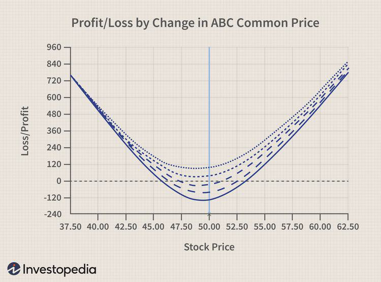

In the intricate world of financial markets, options trading represents a significant avenue for potential gains, albeit accompanied by inherent risks that demand careful navigation. Options are financial derivatives that give buyers the right, but not the obligation, to buy or sell an underlying asset at a predetermined price before a specified expiration date. Standard options are typically traded on formal exchanges, such as the Chicago Board Options Exchange (CBOE), which provide a regulated environment with standardized contracts ensuring liquidity and transparency. 

In contrast, Over-The-Counter (OTC) options operate outside these formal exchanges, in a less regulated framework that allows market participants to create bespoke agreements tailored to their specific needs. This customizability in OTC options provides flexibility in terms of strike prices, expiration dates, notional amounts, and underlying assets. However, the benefits of customization come hand-in-hand with several risks, primarily stemming from the absence of a centralized clearinghouse or secondary market, leading to concerns about counterparty risk and liquidity.



Exploring the nuances of OTC options involves a comprehensive understanding of their benefits and risks and a comparison with standard options available on exchanges. Moreover, the article addresses the impact of technological advancements, particularly the rise of algorithmic trading in modern options markets. Algorithmic trading involves using computer algorithms to automate trade execution, enhancing efficiency and strategy implementation. This technological tool has become vital in navigating the complexities of options markets, offering both improved trading efficiencies and introducing new challenges related to risk management.

By examining these elements, this article aims to provide a thorough understanding of options trading and its multifaceted nature. The insights offered will aid investors in making informed investment decisions, whether they are seasoned market participants or newcomers who are beginning to explore the opportunities available in these complex financial instruments.

## Table of Contents

## Understanding OTC Options

OTC options, or Over-The-Counter options, are non-standardized financial instruments that allow for private agreements between two parties to execute an options contract. These options are categorized as exotic due to their ability to tailor contract specifics, providing both opportunities and complexities beyond what is possible with exchange-traded options.

Unlike standardized options traded on public exchanges, OTC options offer bespoke contract terms. This customization includes setting unique strike prices, expiration dates, and other contract conditions that cater precisely to the strategic needs of the involved parties. This latitude in design allows OTC options to meet specific financial objectives, such as hedging unique risks or capturing market views with precision.

The absence of a secondary market is one of the inherent risks of OTC options. Once a contract is established, the lack of a centralized exchange means these options cannot be easily sold or transferred, limiting their [liquidity](/wiki/liquidity-risk-premium). This can make the holder reliant on fulfilling the contract to maturity, posing potential liquidity challenges if market conditions change.

OTC options transactions are conducted directly between the two counterparties, often with the support of intermediaries like brokers or investment banks. These intermediaries facilitate the setup and management of the contracts, providing essential services such as pricing, legal documentation, and risk management support. However, the absence of a centralized clearinghouse introduces significant counterparty risk, as there is no formal mechanism to ensure the obligation fulfillment, barring individual credit assessments and collateral requirements.

To illustrate, consider a hypothetical OTC call option contract. A company might enter into a contract to buy 10,000 shares of another company's stock at a strike price of $50 per share, expiring in six months. Unlike standardized contracts, the company can negotiate the precise terms, such as additional clauses on early exercise rights, which are tailored specifically to its needs.

In conclusion, OTC options provide a flexible, customizable tool in financial strategy but require careful management of the associated risks, particularly related to market liquidity and counterparty reliability. Being well-informed about these aspects is crucial for effective use of OTC options in financial markets.

## Risks Associated with OTC Options

OTC options inherently involve substantial counterparty risk, primarily because there is no centralized clearinghouse to guarantee the execution of trades. As these transactions occur directly between two parties, the failure of one party to fulfill its obligations can lead to significant financial losses for the other. This contrasts sharply with exchange-traded options, where a clearinghouse acts as an intermediary, ensuring the performance of contracts.

A well-documented illustration of this counterparty risk occurred during the 2008 financial crisis. OTC derivatives, including options, were central to the systemic shocks experienced by financial markets. The crisis highlighted the potential for significant market disruption when parties default on their obligations, exacerbated by the interconnectedness of financial institutions dealing in such instruments.

Furthermore, OTC options suffer from reduced price transparency. Unlike standardized options on formal exchanges, which have mechanisms in place for disseminating price information, OTC options lack such uniformity. This opacity can make it challenging for market participants to arrive at a fair valuation and assess the true market value of an OTC option, leading to the potential for mispricing and increased risk exposure.

Liquidity is another significant concern with OTC options. The absence of a secondary market means that these instruments are typically less liquid than their exchange-traded counterparts. This illiquidity often necessitates that parties hold these bespoke contracts to maturity, regardless of any changes in market conditions or personal circumstances that might call for early liquidation.

The intricacy of custom OTC contracts also impedes their transferability and sale in secondary markets. When combined with the aforementioned risks, these factors underscore the importance of careful risk assessment and management strategies, particularly for those employing OTC options in their financial activities.

## Comparing OTC to Standard Options

Standard options, often known as exchange-traded options, are traded on formal exchanges like the Chicago Board Options Exchange (CBOE). These options come with standardized contract terms, which include fixed strike prices, expiration dates, and specified contract sizes. The regulatory framework governing these exchanges ensures a higher level of liquidity and transparency. One critical component of this structure is the role of clearinghouses, which act as intermediaries to mitigate counterparty risk. By standing between buyers and sellers, clearinghouses guarantee the fulfillment of contracts, thereby significantly reducing the risk of default.

In contrast, Over-The-Counter (OTC) options offer tailored contract terms, providing a level of customizability not available with standard options. Parties involved in OTC options can define unique strike prices, maturities, and other contract specifications to better suit their precise financial strategies. This tailor-made feature caters to specific market needs but introduces considerable counterparty and liquidity risks. Without a centralized marketplace or clearinghouse, the execution of these options relies heavily on the integrity and creditworthiness of the counterparty involved.

The absence of a standard market infrastructure for OTC options also results in reduced price transparency. The lack of a secondary market means these options are frequently held till maturity, limiting the ability to [exit](/wiki/exit-strategy) positions easily. Consequently, traders must weigh the benefits of customization against these inherent risks. The decision to use OTC or standard options is largely influenced by the trader's strategic goals, risk exposure preferences, and specific market conditions.

In Python, one might implement a risk assessment model for these options, considering various scenarios and counterparty reliability:

```python
def risk_assessment(option_type, counterparty_risk, liquidity_risk):
    if option_type == 'OTC':
        base_risk = 0.15
        risk_score = base_risk + 0.5 * counterparty_risk + 0.3 * liquidity_risk
    elif option_type == 'Standard':
        base_risk = 0.05
        risk_score = base_risk + 0.2 * counterparty_risk + 0.1 * liquidity_risk
    return risk_score

# Example usage:
otc_risk = risk_assessment('OTC', 0.7, 0.6)
standard_risk = risk_assessment('Standard', 0.2, 0.1)

print(f"OTC Risk Score: {otc_risk}\nStandard Options Risk Score: {standard_risk}")
```

Ultimately, traders must balance their need for flexibility against the stability and transparency offered by exchange-traded options. Each type of option has its distinct advantages and potential pitfalls, making the selection process a critical aspect of options trading strategy.

## Algorithmic Trading in Options Markets

Algorithmic trading is integral to modern options trading, leveraging advanced computer algorithms to automate and optimize trade execution processes. This technology enhances efficiency by enabling traders to enter and exit markets swiftly, therefore capitalizing on transient opportunities and optimizing overall strategy execution. Algorithmic trading systems are designed to detect market patterns and execute trades at speeds beyond human capabilities, thereby facilitating more precise timing and pricing in options transactions.

In the context of Over-The-Counter (OTC) markets, [algorithmic trading](/wiki/algorithmic-trading) strategies are particularly beneficial. OTC options are characterized by their bespoke nature, with contracts tailored to the specific requirements of buyers and sellers, which often includes unique strike prices and expiration dates. The complexity of these customized contracts and their dynamic pricing landscapes present significant challenges. Algorithmic trading can address these challenges by employing sophisticated models that process large volumes of data to identify optimal trading moments and adjust to pricing fluctuations.

However, the application of algorithmic trading in OTC options requires robust risk management systems, as these markets inherently bear higher counterparty and liquidity risks. Algorithms must incorporate advanced risk management protocols to mitigate potential default risks, which could arise from the absence of a centralized clearinghouse that typically ensures trade execution. These protocols may utilize statistical models to assess counterparty creditworthiness or simulate market scenarios to anticipate potential liquidity constraints.

One approach in managing risks is through the implementation of [machine learning](/wiki/machine-learning) algorithms which can adapt to changing market conditions and improve predictive accuracy over time. For example, a Python-based machine learning model can be developed to predict default probabilities by analyzing historical transaction data and market indicators:

```python
from sklearn.ensemble import RandomForestClassifier
import pandas as pd

# Example data loading (replace with actual data)
data = pd.read_csv('market_data.csv')

# Features and target variable for default prediction
X = data[['feature1', 'feature2', 'feature3']]
y = data['default']

# Train a Random Forest Classifier
model = RandomForestClassifier(n_estimators=100, random_state=42)
model.fit(X, y)

# Predict default probabilities
probabilities = model.predict_proba(X)[:, 1]
```

Moreover, liquidity risks are mitigated through algorithms designed to optimize execution strategies, carefully timing large orders to minimize market impact and systematically managing [order book](/wiki/order-book-trading-strategies) imbalances. These algorithmic systems enable traders to dynamically adjust their portfolios and hedge positions as market conditions evolve.

In summary, algorithmic trading is a cornerstone of efficient options trading, particularly within the OTC markets where complexities abound. By harnessing advanced algorithms and robust risk management frameworks, traders can effectively navigate the intricacies of bespoke contracts, optimizing both performance and risk mitigation in their options trading endeavors.

## Conclusion

OTC options offer distinct opportunities and risks due to their customizable yet non-transparent nature. These financial instruments provide investors with the ability to tailor contracts to meet specific needs, offering greater flexibility than standard options. However, this flexibility comes at the cost of increased counterparty and liquidity risks. The lack of a centralized exchange or standard pricing mechanism results in potential challenges in evaluating these contracts, which necessitates cautious assessment by investors.

Algorithmic trading can be an essential tool in managing and executing OTC options strategies effectively. By utilizing sophisticated algorithms, traders can automate the trading process, optimizing the execution of complex and tailored strategies. This can help mitigate some of the inherent risks, such as default and liquidity challenges, by providing rapid trade execution and enhancing market efficiencies. Traders must ensure their algorithms are robust and capable of addressing these unique challenges.

For those with a deep understanding of financial markets and risk management, OTC options can play a vital role in a diversified investment portfolio. Their ability to meet specific investment objectives through bespoke contracts makes them a powerful tool for those prepared to navigate the associated complexities. Such investors can leverage the benefits of OTC options while managing the risks, potentially achieving superior returns and enhanced portfolio diversification.

## References & Further Reading

[1]: Johnson, L., & Hazen, T. (2020). ["Derivatives and Risk Management."](https://scholar.google.com/citations?user=lwTMu8kAAAAJ) Cambridge University Press.

[2]: Hull, J. C. (2018). ["Options, Futures, and Other Derivatives."](https://www.semanticscholar.org/paper/Options%2C-Futures%2C-and-Other-Derivatives-Hull/89bdee500c8623864fc9eb7a471546aa713acc44) Pearson.

[3]: Lopez de Prado, M. (2018). ["Advances in Financial Machine Learning."](https://www.amazon.com/Advances-Financial-Machine-Learning-Marcos/dp/1119482089) Wiley.

[4]: Jha, N. K. (2015). ["Algorithms for Automated Trading."](https://www.princeton.edu/~jha/files/publications.html) Wiley.

[5]: Chan, E. P. (2009). ["Quantitative Trading: How to Build Your Own Algorithmic Trading Business."](https://github.com/ftvision/quant_trading_echan_book) Wiley.