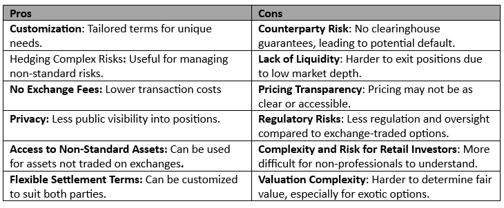

## Table of Contents

## What are OTC options and how do they differ from standard options?

OTC options, or over-the-counter options, are financial contracts that are traded directly between two parties, without going through a formal exchange. This means that the terms of the contract, like the price and expiration date, can be customized to fit the needs of the people involved. Because they are not traded on an exchange, OTC options can be less transparent and might carry more risk since there's no central body overseeing the trades.

Standard options, on the other hand, are traded on regulated exchanges like the Chicago Board Options Exchange. These options have standardized terms, which means everyone trading them agrees to the same rules about price, expiration, and contract size. Because they are on an exchange, standard options are more transparent and generally considered safer because the exchange acts as a middleman to ensure the trade goes smoothly.

The main difference between OTC and standard options lies in their flexibility and regulation. OTC options offer more customization but come with higher risks due to less oversight. Standard options are more rigid but provide more security and transparency because they are regulated by an exchange. Depending on what a trader needs, they might choose one type of option over the other.

## What are the basic characteristics of standard options?

Standard options are contracts that give the buyer the right, but not the obligation, to buy or sell an asset at a set price before a certain date. These options are traded on exchanges, which means they follow strict rules set by the exchange. The price at which the asset can be bought or sold is called the strike price, and the date by which the option must be used is the expiration date. Standard options come in two main types: call options, which give the right to buy an asset, and put options, which give the right to sell an asset.

These options are standardized, meaning everyone trading them agrees to the same terms. This makes it easier for people to buy and sell them because they know exactly what they are getting. The size of the contract, the strike price, and the expiration date are all set by the exchange. Because they are traded on an exchange, standard options are considered safer than other types of options. The exchange acts like a middleman, making sure that both the buyer and seller follow through on their part of the deal.

## How are OTC options typically used by investors?

Investors use OTC options because they can make the options fit their needs better. They can pick the exact time when the option ends, the price at which they want to buy or sell, and even the amount of the asset they want to trade. This is really helpful for big companies or investors who have specific goals. For example, a company might use an OTC option to protect itself from big changes in currency values or commodity prices, which could hurt their business.

However, using OTC options can be riskier than using standard options. Since they are not traded on a big exchange, there's less oversight. This means there's a chance the other person in the deal might not follow through. To manage this risk, investors often work with big banks or financial firms they trust. These firms can help set up the OTC options and make sure everything goes smoothly. So, while OTC options offer more freedom, investors need to be careful and do their homework to make sure they're making safe choices.

## What are the main advantages of using OTC options over standard options?

OTC options give investors more freedom to customize their trades. They can choose the exact date when the option ends, the price they want to buy or sell at, and how much of the asset they want to trade. This is great for big companies or investors who have special needs. For example, a business might use an OTC option to protect itself from big changes in currency or commodity prices that could hurt their profits. With standard options, they would have to use what's available on the exchange, which might not fit their needs perfectly.

Another advantage is that OTC options can be more private. Since they are not traded on a big exchange, fewer people know about the trade. This can be important for companies that want to keep their financial moves secret. Also, because OTC options can be set up directly with a bank or a financial firm, the process can be quicker and more personal than dealing with a public exchange. This direct relationship can help investors feel more secure and get better service.

## What are the potential risks associated with trading OTC options?

Trading OTC options can be riskier than trading standard options because they are not on a big exchange. Since there's no big exchange watching over the trades, there's a chance that the other person in the deal might not follow through. This is called counterparty risk. If the other person can't or won't do what they promised, the investor could lose money. Also, because OTC options are not as common, it can be harder to find someone to trade with when you want to close your position, which is called [liquidity](/wiki/liquidity-risk-premium) risk.

Another risk is that OTC options can be less transparent. With standard options, everyone can see the prices and trades happening on the exchange. But with OTC options, the details of the trade are usually just between the two people involved. This can make it harder to know if you're getting a fair deal. Plus, because OTC options can be more complicated and customized, they can be harder to understand, which adds to the risk if you're not sure what you're agreeing to.

## How does the liquidity of OTC options compare to that of standard options?

The liquidity of OTC options is usually lower than that of standard options. Liquidity means how easy it is to buy or sell something without affecting its price too much. Because OTC options are not traded on a big exchange, it can be harder to find someone to trade with when you want to buy or sell. This means you might have to wait longer or accept a worse price than you would with standard options, which are traded on exchanges where there are lots of buyers and sellers all the time.

Standard options, on the other hand, have much better liquidity. They are traded on big exchanges where there are always people looking to buy and sell. This means you can usually find someone to trade with quickly and at a fair price. The high liquidity of standard options makes them more reliable and easier to use for most investors.

## What role does counterparty risk play in OTC options?

Counterparty risk is a big deal when it comes to OTC options. It means there's a chance the other person in the deal might not do what they promised. Since OTC options are not traded on a big exchange, there's no one watching over the trades to make sure everything goes smoothly. If the other person can't or won't follow through, the investor could lose money. This risk is higher with OTC options because they are private deals between two people, without the safety net of an exchange.

To manage this risk, investors often work with big banks or financial firms they trust. These firms can help set up the OTC options and make sure everything goes smoothly. Even though working with trusted firms can lower the risk, it's still something investors need to think about carefully. They need to do their homework and make sure they're dealing with someone reliable to avoid losing money because of counterparty risk.

## How are OTC options priced compared to standard options?

OTC options are priced differently than standard options because they are not traded on a big exchange. The price of an OTC option is worked out between the two people making the deal. They look at things like how likely it is the option will be used, how long until it expires, and how much the price of the asset might change. Since the terms of the option can be changed to fit what the people want, the price can be different for each deal. This means OTC options might cost more or less than standard options, depending on what the people agree on.

Standard options, on the other hand, have prices that are set by the exchange where they are traded. Everyone can see the prices, and they change based on what people are willing to pay. The price depends on things like the current price of the asset, how long until the option expires, and how much the price of the asset might move. Because standard options are the same for everyone, their prices are easier to understand and compare. But with OTC options, the price can be harder to figure out because it's a private deal between two people.

## What regulatory differences exist between OTC and standard options?

OTC options and standard options have different rules because of where they are traded. Standard options are traded on big exchanges like the Chicago Board Options Exchange. These exchanges have strict rules set by the government to make sure everything is fair and safe. The exchange watches over the trades, and there are rules about how much money you need to trade and what information you have to share. This makes standard options safer because there's a lot of oversight.

On the other hand, OTC options are traded directly between two people, without a big exchange. This means there are fewer rules to follow. The government still has some rules for OTC options, but they are not as strict as the ones for standard options. Since OTC options are private deals, there's less oversight, which can make them riskier. People trading OTC options need to be careful and make sure they're dealing with someone they trust.

## How can an investor mitigate the risks associated with OTC options?

To lower the risks of trading OTC options, investors should work with big banks or financial firms they trust. These firms can help set up the options and make sure everything goes smoothly. They also have a lot of experience and can give good advice on how to handle the risks. By choosing a reliable partner, investors can reduce the chance that the other person in the deal won't follow through, which is called counterparty risk.

Another way to manage risks is to do a lot of research before making a trade. Investors should learn as much as they can about the options they are thinking about buying or selling. They should also keep an eye on the market and be ready to change their plans if things start to go wrong. By being careful and staying informed, investors can make smarter choices and protect themselves from big losses.

## What advanced strategies can be implemented using OTC options that are not feasible with standard options?

OTC options let investors do things that standard options can't because they can be made to fit exactly what someone wants. For example, an investor might want an option that lasts for a very long time, like several years, or one that covers a very specific amount of an asset. With OTC options, they can do this. They can also use OTC options to make deals that depend on more than one thing happening, like the price of two different things going up or down at the same time. This kind of complex deal is harder to do with standard options because they have set rules and can't be changed as much.

Another advanced strategy with OTC options is called "exotic options." These are special kinds of options that can have very different rules from normal options. For example, there are options that only pay out if the price of the asset stays within a certain range, or options that let the buyer choose the best time to use the option within a certain period. These exotic options can be very useful for investors who want to protect themselves from big changes in the market or take advantage of specific situations. Because OTC options can be made to fit these special needs, they open up more ways for investors to make money or protect their investments than standard options can.

## How do market conditions affect the choice between OTC and standard options?

Market conditions can really change whether an investor picks OTC or standard options. When the market is calm and stable, standard options might be a better choice. They are traded on big exchanges, so they are easy to buy and sell, and everyone can see the prices. This makes them safer and easier to understand. But if the market is moving a lot and prices are changing quickly, an investor might want to use OTC options. They can make these options fit exactly what they need, like setting a special price or time to use the option. This can help them make money or protect their investments in a way that standard options can't.

Also, if the market is hard to predict or there's a lot of risk, OTC options can be useful because they let investors make deals that depend on more than one thing happening. For example, they can set up an option that only works if two different things happen at the same time. This kind of deal can be hard to do with standard options because they have set rules and can't be changed as much. So, when the market is tricky, OTC options give investors more ways to handle the risk and maybe even make more money.

## References & Further Reading

[1]: Johnson, L., & Hazen, T. (2020). ["Derivatives and Risk Management."](https://scholar.google.com/citations?user=lwTMu8kAAAAJ) Cambridge University Press.

[2]: Hull, J. C. (2018). ["Options, Futures, and Other Derivatives."](https://www.semanticscholar.org/paper/Options%2C-Futures%2C-and-Other-Derivatives-Hull/89bdee500c8623864fc9eb7a471546aa713acc44) Pearson.

[3]: Lopez de Prado, M. (2018). ["Advances in Financial Machine Learning."](https://www.amazon.com/Advances-Financial-Machine-Learning-Marcos/dp/1119482089) Wiley.

[4]: Jha, N. K. (2015). ["Algorithms for Automated Trading."](https://www.princeton.edu/~jha/files/publications.html) Wiley.

[5]: Chan, E. P. (2009). ["Quantitative Trading: How to Build Your Own Algorithmic Trading Business."](https://github.com/ftvision/quant_trading_echan_book) Wiley.