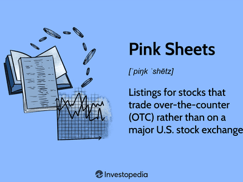

## Table of Contents

## What is OTC Pink and how does it differ from other OTC markets?

OTC Pink is a type of over-the-counter (OTC) market operated by OTC Markets Group. It's the lowest and least regulated tier of the three OTC markets, which also include OTCQX and OTCQB. Companies listed on OTC Pink often have limited financial disclosure and may not meet the more stringent requirements of the higher tiers. This makes OTC Pink a riskier place for investors because there's less information available about the companies.

The main difference between OTC Pink and the other OTC markets, OTCQX and OTCQB, is the level of regulation and transparency. OTCQX and OTCQB have stricter standards for financial reporting and corporate governance. Companies on OTCQX, for example, must meet high financial standards and undergo a qualitative review. OTCQB requires companies to be current in their reporting with the SEC or another regulator. In contrast, OTC Pink has no minimum financial standards or reporting requirements, which can make it harder for investors to make informed decisions.

## What are the different types of companies listed on OTC Pink?

OTC Pink has many different kinds of companies. Some are small businesses that are just starting out and don't have a lot of money yet. Others are foreign companies that want to trade in the U.S. but don't want to follow strict rules. There are also companies that used to be on bigger stock markets but got moved to OTC Pink because they didn't meet the rules anymore.

Another type of company you might find on OTC Pink is called a "shell company." These are companies that don't really do much business but can be used to help other companies go public. Lastly, there are some companies on OTC Pink that might be risky because they don't share much information about their finances. This can make it hard for people to know if they should invest in them.

## How are companies categorized on OTC Pink?

Companies on OTC Pink are sorted into different groups to help investors know more about them. The main groups are called "Current Information," "Limited Information," and "No Information." "Current Information" means the company gives regular updates about its money and business, which helps investors make better choices. "Limited Information" means the company shares some information, but not as much as the "Current Information" group. "No Information" means the company doesn't share any details, which can be risky for people thinking about investing.

There are also other special groups within OTC Pink. One is called "Caveat Emptor," which is a warning to investors that the company might be risky because of things like investigations or big changes in how much the stock is worth. Another group is "Pink Sheets," which is just another name for OTC Pink and includes all kinds of companies, from those that follow some rules to those that don't share any information at all. These categories help investors understand the risks and make smarter decisions about where to put their money.

## What are the basic requirements for a company to be listed on OTC Pink?

To be listed on OTC Pink, a company doesn't have to meet many rules. They don't need to share a lot of information about their money or business. This makes it easier for small companies or foreign companies to be listed, but it also means it can be harder for investors to know if they should buy the stock.

There are different groups within OTC Pink, like "Current Information," "Limited Information," and "No Information." If a company wants to be in the "Current Information" group, they need to share some basic details about their business and money. But even then, the rules are not as strict as on other stock markets. For the "Limited Information" and "No Information" groups, the company can share less or no information at all, which makes it riskier for people thinking about investing.

## What are the potential benefits of investing in OTC Pink companies?

Investing in OTC Pink companies can have some good points. One big benefit is that these companies can be really cheap to buy. Since they are not on bigger stock markets, their prices can be lower. This means you might be able to buy a lot of shares without spending too much money. If the company does well and its stock price goes up, you could make a lot of money. Also, OTC Pink has a lot of different kinds of companies. You might find a small business that could grow a lot or a foreign company that you think will do well. This variety gives you more choices to find something that fits what you want to invest in.

Another benefit is that OTC Pink can be a good place to find new and exciting companies. Because the rules to get listed are not as strict, new businesses that are just starting out can be listed here. If you find a company early and it turns into a big success, you could see your investment grow a lot. Plus, some investors like the challenge of finding hidden gems in the OTC Pink market. It can be fun to research and find companies that others might not know about yet. But remember, with these benefits come risks, so it's important to be careful and do your homework before investing.

## What are the common risks associated with investing in OTC Pink stocks?

Investing in OTC Pink stocks can be risky because these companies don't have to share a lot of information about their money or business. This means it can be hard to know if a company is doing well or not. Without good information, it's tough to make smart choices about where to put your money. Also, some companies on OTC Pink might be involved in shady stuff or might not be honest about what they're doing. This can lead to big problems for investors if the company gets in trouble or if the stock price drops a lot.

Another risk is that OTC Pink stocks can be very unpredictable. Their prices can go up and down a lot in a short time, which can be scary if you're not ready for it. Because these stocks are not on bigger markets, they might not have many people buying and selling them. This can make it hard to sell your shares if you want to. Plus, some OTC Pink companies might be very small or just starting out, so there's a chance they might not make it and could go out of business. This means you could lose all the money you put into them.

## How can an investor evaluate the financial health of an OTC Pink company?

Evaluating the financial health of an OTC Pink company can be tricky because these companies don't have to share a lot of information. But there are some things you can do to get a better idea. First, look at the company's financial statements if they are available. Some OTC Pink companies in the "Current Information" category will share their income statements, balance sheets, and cash flow statements. These documents can tell you about the company's profits, debts, and how much money they have. If the company is making money and doesn't have too much debt, that's a good sign.

Another way to evaluate an OTC Pink company is to read any news or press releases they put out. This can give you an idea of what the company is doing and if they are growing or facing problems. You can also look at what other people are saying about the company on financial websites or forums. But be careful, because not everything you read online is true. If the company is in the "Limited Information" or "No Information" category, it's even harder to find out about their financial health. In these cases, it's really important to be careful and maybe not invest too much money until you know more.

## What role does the SEC play in regulating OTC Pink companies?

The SEC, or Securities and Exchange Commission, doesn't directly control OTC Pink companies as much as it does companies on bigger stock markets. The SEC's main job is to make sure that companies follow the rules when they sell stocks and to protect people who invest money. For OTC Pink companies, the SEC still has some power, but these companies don't have to follow as many rules as others. This means the SEC might not know as much about what these companies are doing.

Even though the SEC doesn't watch OTC Pink companies as closely, it can still step in if it finds out that a company is doing something wrong. If an OTC Pink company is breaking the law or lying to investors, the SEC can investigate and take action. This could mean fines, stopping the company from selling stocks, or even criminal charges. So, while the SEC's role with OTC Pink companies is less strict, it still plays an important part in making sure these companies don't hurt investors.

## How does the lack of transparency affect investment decisions in OTC Pink stocks?

The lack of transparency in OTC Pink stocks makes it hard for people to decide if they should invest. When companies don't share much about their money or what they're doing, it's tough to know if they are doing well or if they might be in trouble. This means investors have to guess more than they would with companies on bigger stock markets. Without good information, it's easy to make bad choices and lose money. So, people need to be really careful and do a lot of research before putting money into these stocks.

Even though it's harder, some people still try to find good investments in OTC Pink. They might look at any news or financial statements the company shares, even if it's not much. They might also talk to other investors or read what people are saying online. But because there's so little information, it's risky. Investors have to be ready to lose their money if they guess wrong about a company's health. So, while it's possible to find good opportunities in OTC Pink, the lack of transparency makes it a lot more challenging and risky.

## What are some strategies to mitigate risks when investing in OTC Pink stocks?

When you invest in OTC Pink stocks, one good way to lower your risks is to only spend money you can afford to lose. Since these stocks can be very unpredictable and there's less information about the companies, it's smart to not put all your money into them. Another strategy is to spread your money around. Instead of putting all your money into one OTC Pink stock, you can invest a little bit in different stocks. This way, if one stock does badly, you won't lose everything.

Another important thing is to do a lot of research. Even though OTC Pink companies don't have to share a lot of information, you can still find out some things. Look for any financial statements or news the company puts out. Also, read what other people are saying about the company online, but be careful because not everything you read is true. If you can, try to find companies that are in the "Current Information" category because they share more details than others. This can help you make better choices.

Lastly, be patient and don't rush into buying OTC Pink stocks. It's easy to get excited about a stock that looks like it might go up a lot, but it's important to take your time. Watch the stock for a while and see how it moves before you decide to buy. And always remember that OTC Pink stocks can be very risky, so it's okay to say no if you're not sure. The more careful you are, the less likely you are to lose your money.

## How do market makers influence the trading of OTC Pink stocks?

Market makers play a big role in how OTC Pink stocks are traded. They are companies or people who help make it easier to buy and sell these stocks. Since OTC Pink stocks are not on big stock exchanges, there aren't as many people buying and selling them. Market makers step in to keep the market moving. They do this by always being ready to buy or sell a stock at a certain price. This helps make sure there's always someone to trade with, even if not many people are interested in the stock.

Because market makers are important for trading OTC Pink stocks, they can also affect the price of these stocks. If a market maker decides to buy a lot of a stock, the price might go up. If they sell a lot, the price might go down. Since there's less information about OTC Pink companies, what market makers do can have a bigger effect on the stock price. This can make trading these stocks even riskier, so it's good to know how market makers work when you're thinking about investing in OTC Pink stocks.

## What advanced analysis techniques can be used to assess the viability of OTC Pink investments?

To assess the viability of OTC Pink investments, one advanced technique is to use technical analysis. This means looking at charts and patterns of the stock's price over time. By studying these charts, you can try to guess where the price might go next. You can look for trends, like if the price is going up or down steadily, or for patterns, like if the price moves in a certain way that has happened before. Technical analysis can help you decide when to buy or sell a stock, but it's not perfect and it's still risky because OTC Pink stocks can be very unpredictable.

Another technique is [fundamental analysis](/wiki/fundamental-analysis), which involves looking at the company's financials if they are available. Even though OTC Pink companies don't have to share much, some do provide financial statements. You can look at things like how much money the company is making, how much debt they have, and how they are growing. You can also try to figure out if the stock is priced fairly by comparing it to other similar companies. This can be hard with OTC Pink stocks because there's less information, but if you can find enough details, it can help you understand if the company is a good investment. Both technical and fundamental analysis take time and effort, but they can give you a better idea of whether an OTC Pink stock might be worth buying.

## What are the risks of algorithmic trading in OTC Pink?

Applying [algorithmic trading](/wiki/algorithmic-trading) strategies to OTC Pink markets poses a series of unique challenges. These markets, characterized by their high [volatility](/wiki/volatility-trading-strategies), limited availability of data, and lower [liquidity](/wiki/liquidity-risk-premium), create an environment that can be difficult to navigate for algorithmic systems that are generally optimized for more stable and liquid markets.

Market volatility in OTC Pink markets is a significant concern for algorithmic traders. Stocks in these markets often experience dramatic price fluctuations within short periods, which can lead to substantial losses if algorithms are not designed to handle such volatility. This unpredictability requires that algorithms employ advanced statistical models and [machine learning](/wiki/machine-learning) techniques to adapt to rapid price changes. Implementing volatility measures, such as calculating the standard deviation of price movements or employing dynamic stop-loss orders, can help mitigate risks. For instance, an algorithm could be programmed to adjust its trading thresholds based on the current market's volatility level using a formula such as:

$$
\text{Volatility Threshold} = k \times \sigma
$$

where $\sigma$ represents the standard deviation of recent price movements, and $k$ is a predetermined constant that adjusts sensitivity.

Another significant challenge is the limited data available for OTC Pink stocks. Unlike major exchanges where extensive historical data is readily accessible, OTC Pink markets suffer from a scarcity of reliable data, which can hinder the development and [backtesting](/wiki/backtesting) of trading algorithms. This limitation necessitates the use of sophisticated data-cleaning processes and innovative techniques such as synthetic data generation or the integration of [alternative data](/wiki/best-alternative-data) sources, including social media sentiment analysis or unstructured data from news articles, to enhance the dataset.

The lower liquidity in OTC Pink markets also poses a risk to algorithmic trading. Orders for less liquid stocks are more likely to impact market prices, creating slippage and executing trades at unfavorable prices. To manage these risks, strategies such as [volume](/wiki/volume-trading-strategy)-weighted average price (VWAP) trading or implementing limit orders rather than market orders can be beneficial. These methods ensure that trades are executed at more stable prices by monitoring liquidity levels and adjusting order execution accordingly.

Given these unique challenges, employing robust risk management strategies is imperative for algorithmic trading in OTC Pink markets. Algorithms should be equipped with risk assessment tools that [factor](/wiki/factor-investing) in potential maximum drawdowns, the probability of extreme loss events, and portfolio diversification techniques to spread risk across various assets. Additionally, continuous monitoring and real-time adjustments are essential to respond to sudden changes and maintain an acceptable risk level. Implementing such strategies can prevent substantial losses and maintain algorithm performance even under challenging market conditions.

## References & Further Reading

[1]: Mauritsen, T., & Hauth, S. (2018). ["Algorithmic Trading in OTC Markets."](https://wjaets.com/sites/default/files/WJAETS-2024-0054.pdf) 

[2]: Hansen, L. P., & Lunde, A. (2005). ["A forecast comparison of volatility models: Does anything beat a GARCH(1,1)?"](https://onlinelibrary.wiley.com/doi/full/10.1002/jae.800) Journal of Applied Econometrics.

[3]: Pintacuda, G. (2010). ["Risk Management in Algorithmic Trading."](https://journals.sagepub.com/doi/full/10.1177/03063127211048515)

[4]: OTC Markets Group Inc. (2021). ["OTC Pink Market."](https://www.otcmarkets.com/files/OTC_Markets_Annual_Review_2021.pdf) 

[5]: Gatev, E. G., Goetzmann, W. N., & Rouwenhorst, K. G. (2006). ["Pairs Trading: Performance of a Relative-Value Arbitrage Rule."](https://www.nber.org/papers/w7032) The Review of Financial Studies. 