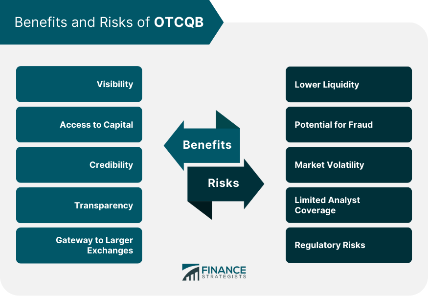

## Table of Contents

## What is the OTCQB Venture Market?

The OTCQB Venture Market is a part of the over-the-counter (OTC) market where companies can list their stocks. It is operated by OTC Markets Group and is designed for early-stage and developing companies that want to provide transparency to investors. Companies on the OTCQB must meet certain reporting standards, but these are less strict than those required for major stock exchanges like the NYSE or NASDAQ.

The OTCQB is often used by smaller companies that are not yet ready or able to meet the requirements of larger exchanges. It helps these companies to raise capital and increase their visibility among investors. By being listed on the OTCQB, these companies can provide important information to the public, such as financial reports and company news, which helps build trust and credibility with potential investors.

## How does a company qualify for listing on the OTCQB?

To qualify for listing on the OTCQB, a company needs to meet some basic rules. First, it must be up-to-date with its financial reporting. This means the company has to share its financial information with the public regularly, usually through quarterly and annual reports. Second, the company needs to have its financials reviewed by a third party, like an independent accountant. This helps make sure the financial information is correct and trustworthy.

Also, the company must follow the rules set by the Securities and Exchange Commission (SEC) or another recognized regulatory body. This includes things like making sure the company's stock is not being used for illegal activities. The company also needs to pay a fee to be listed on the OTCQB. By meeting these requirements, a company can show investors that it is serious about being open and honest, which can help attract more people to invest in the company.

## What are the main differences between OTCQB and other OTC markets?

The OTCQB is one part of the over-the-counter (OTC) market, and it's different from other OTC markets like the OTC Pink and the OTCQX. The OTCQB is for early-stage and growing companies that want to be more open with investors. To be on the OTCQB, a company has to share its financial information regularly and have it checked by an independent accountant. This makes the OTCQB a bit more trustworthy than the OTC Pink, which has fewer rules and can include companies that don't share much information.

The OTCQX is another OTC market, but it's for bigger and more established companies. To be on the OTCQX, a company has to meet even stricter rules than the OTCQB. They need to have good financials, follow high standards of how they run their business, and be listed on a qualified foreign stock exchange if they are from outside the U.S. So, the OTCQX is seen as the top level of the OTC markets, while the OTCQB is a step below but still better than the OTC Pink in terms of how much information companies have to share.

## What are the benefits of being listed on the OTCQB for a company?

Being listed on the OTCQB can help a company in many ways. It makes it easier for the company to raise money because more people can see and buy their stock. When a company is on the OTCQB, it has to share its financial information regularly, which makes investors feel more confident about putting their money into the company. This can attract more investors and help the company grow.

Another benefit is that the OTCQB is less strict than bigger stock exchanges like the NYSE or NASDAQ. This means smaller companies that are still growing can list their stock without having to meet very tough rules right away. Being on the OTCQB can also help a company become better known in the market, which can lead to more opportunities for partnerships and growth.

## How does the OTCQB enhance investor transparency?

The OTCQB helps investors see more clearly what a company is doing by making sure the company shares its financial information regularly. This means investors can look at the company's quarterly and yearly reports to understand how it is doing financially. The OTCQB also requires that these financial reports are checked by an independent accountant, which makes the information more trustworthy. This way, investors can feel more confident that the numbers they are seeing are correct.

Because the OTCQB has these rules, it helps build trust between the company and its investors. When a company is open about its financial health, investors can make better decisions about whether to buy or sell the company's stock. This transparency can attract more investors who want to put their money into companies that are honest and clear about their business. Overall, the OTCQB's focus on transparency helps create a more open and fair market for everyone involved.

## What role does the OTCQB play in the growth of small to mid-sized companies?

The OTCQB helps small to mid-sized companies grow by giving them a place to list their stocks where they can be seen by more investors. When a company is on the OTCQB, it has to share its financial information regularly, which makes investors feel more confident about putting their money into the company. This can help the company raise more money to grow its business. The OTCQB is less strict than bigger stock exchanges, so smaller companies that are still growing can list their stock without having to meet very tough rules right away.

Being on the OTCQB also helps a company become better known in the market. When more people know about a company, it can lead to more opportunities for partnerships and growth. The OTCQB's focus on transparency helps build trust between the company and its investors, which can attract more investors who want to put their money into companies that are honest and clear about their business. Overall, the OTCQB plays a big role in helping small to mid-sized companies grow by making it easier for them to raise money and become more visible in the market.

## How does trading on the OTCQB compare to trading on major exchanges like NASDAQ or NYSE?

Trading on the OTCQB is different from trading on big exchanges like NASDAQ or NYSE. The OTCQB is for smaller companies that are still growing. It has fewer rules than the big exchanges, so it's easier for these companies to list their stocks there. On the OTCQB, companies have to share their financial information regularly, but they don't have to meet the strict rules that companies on NASDAQ or NYSE do. This makes it a good place for early-stage companies to start.

On the other hand, NASDAQ and NYSE are for bigger and more established companies. These exchanges have very strict rules about how much money a company needs to have and how it shares its financial information. Trading on these big exchanges can be more expensive and harder for a company to get onto, but it can also make the company look more trustworthy to investors. So, while the OTCQB helps smaller companies grow, NASDAQ and NYSE are better for companies that are already big and want to show they are very stable and reliable.

## What are the financial reporting requirements for companies on the OTCQB?

Companies on the OTCQB have to share their financial information regularly. This means they need to give out quarterly and yearly reports that show how their business is doing financially. These reports are important because they help investors understand if the company is making money or losing it. The OTCQB wants to make sure that this information is correct, so they require that an independent accountant checks the financial reports.

The rules for financial reporting on the OTCQB are not as strict as those on bigger exchanges like the NASDAQ or NYSE. This makes it easier for smaller companies to list their stocks on the OTCQB. But even though the rules are simpler, companies still have to follow the rules set by the Securities and Exchange Commission (SEC) or another recognized regulatory body. This helps keep everything fair and open for investors.

## Can foreign companies list on the OTCQB, and what are the benefits for them?

Yes, foreign companies can list on the OTCQB. This is a good option for them because it is easier to get listed on the OTCQB than on bigger exchanges like the NASDAQ or NYSE. The OTCQB has rules that are not as strict, so foreign companies that are still growing can list their stocks there without having to meet very tough rules right away. They just need to share their financial information regularly and have it checked by an independent accountant.

Listing on the OTCQB can help foreign companies grow by making it easier for them to raise money. When a company is on the OTCQB, more investors can see and buy their stock. This can attract more people to invest in the company, which can help it grow its business. Also, being on the OTCQB can help foreign companies become better known in the U.S. market, which can lead to more opportunities for partnerships and growth.

## How does the OTCQB support the development of emerging industries?

The OTCQB helps new and growing industries by giving them a place to list their stocks. This is important because it lets these companies share their financial information with investors, which builds trust. When investors trust a company, they are more likely to put money into it. This money can help the company grow and develop new products or services. The OTCQB is good for companies in new industries because it has simpler rules than bigger exchanges. This makes it easier for these companies to get started and attract the money they need to grow.

Also, being on the OTCQB can help companies in emerging industries become more well-known. When more people know about a company, it can lead to more business opportunities. For example, a company might find new partners or customers because it is listed on the OTCQB. This can help the company grow faster and become a leader in its industry. Overall, the OTCQB plays a big role in helping new industries develop by making it easier for companies to raise money and become more visible in the market.

## What are the potential risks for investors in the OTCQB market?

Investing in the OTCQB market can be riskier than investing in bigger stock exchanges like the NASDAQ or NYSE. One big risk is that the companies on the OTCQB are often smaller and newer. This means they might not have a long history of making money, so it's harder to know if they will do well in the future. Also, because these companies are smaller, they might not have as much money to keep their business going if things get tough.

Another risk is that the OTCQB has fewer rules than bigger exchanges. This means that the information companies share might not be as detailed or checked as carefully. Sometimes, companies might not share all the important information, which can make it hard for investors to make good decisions. Because of these risks, it's important for investors to do a lot of research and be careful when they invest in the OTCQB market.

## How has the OTCQB evolved since its inception, and what future developments are anticipated?

The OTCQB started in 2010 as a way to help smaller companies share their financial information with investors. At first, it was just a place for these companies to list their stocks and show they were being open about their business. Over time, the OTCQB has grown and changed to meet the needs of more companies. It now has rules that make sure companies share their financial reports regularly and have them checked by an independent accountant. This has helped build trust with investors and made the OTCQB a more reliable place to invest.

In the future, the OTCQB is expected to keep growing and changing. One big change might be more technology to make it easier for companies to share their information and for investors to find it. The OTCQB might also start working with more foreign companies, helping them grow in the U.S. market. As more people learn about the OTCQB and how it helps smaller companies, it could become an even more important part of the stock market. This would give more companies a chance to grow and more investors a chance to find new opportunities.

## References & Further Reading

[1]: Harris, L. (2003). ["Trading and Exchanges: Market Microstructure for Practitioners."](https://academic.oup.com/book/52292) Oxford University Press.

[2]: Narang, R. K. (2013). ["Inside the Black Box: A Simple Guide to Quantitative and High Frequency Trading."](https://onlinelibrary.wiley.com/doi/book/10.1002/9781118662717) Wiley.

[3]: Johnson, B. A. (2009). ["Algorithmic Trading & DMA: An Introduction to Direct Access Trading Strategies."](https://archive.org/details/algorithmictradi0000john) 4Myeloma Press.

[4]: Hasbrouck, J. (2007). ["Empirical Market Microstructure: The Institutions, Economics, and Econometrics of Securities Trading."](https://academic.oup.com/book/52241) Oxford University Press.

[5]: Gomber, P., Arndt, B., Lutat, M., & Uhle, T. (2011). ["High-Frequency Trading."](https://www.researchgate.net/publication/271631628_High-Frequency-Trading) In Business & Information Systems Engineering 3(3), 153-162. Springer.