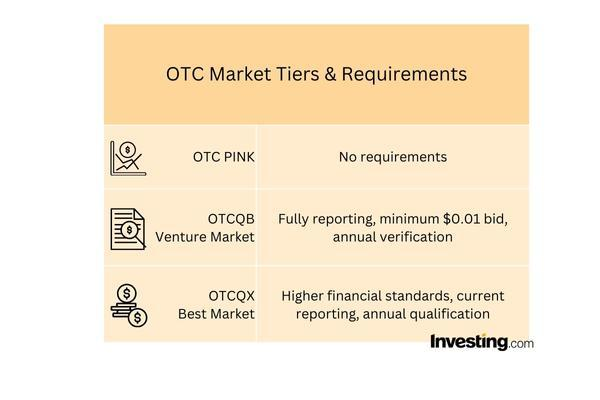

## Table of Contents

## What is OTCQX and how does it differ from other OTC markets?

OTCQX is a type of over-the-counter (OTC) market operated by OTC Markets Group. It is designed for established, investor-focused companies that meet high financial standards, have good corporate governance, and are committed to providing transparent information to investors. Companies listed on OTCQX are typically more stable and reputable compared to those on other OTC markets. This makes OTCQX an attractive option for investors looking for reliable investments without the need for a full stock exchange listing.

OTCQX differs from other OTC markets, like OTCQB and Pink Sheets, mainly in terms of the listing requirements and the quality of the companies listed. OTCQB has less stringent requirements than OTCQX, making it suitable for early-stage and developing companies that still meet some financial and reporting standards. On the other hand, Pink Sheets have the least oversight and can include companies with little to no reporting requirements, which can be riskier for investors. OTCQX stands out by offering a more regulated and transparent environment, which helps build investor confidence and provides a stepping stone for companies aiming to eventually list on major exchanges.

## What are the basic eligibility criteria for a company to be listed on OTCQX?

To be listed on OTCQX, a company needs to meet certain basic requirements. First, the company must be up-to-date with its financial reporting. This means they need to provide regular financial statements that are audited by a qualified accountant. The company also needs to have a certain level of earnings or assets, showing that it is financially stable. Additionally, the company must be listed on a qualified international stock exchange or meet specific financial standards if it is not listed elsewhere.

Another important requirement is good corporate governance. This means the company must have a board of directors that follows best practices and looks out for the interests of shareholders. The company also needs to follow the rules set by OTCQX, which include being transparent about its business and financial situation. This helps build trust with investors. Overall, OTCQX looks for companies that are well-managed and committed to providing clear and honest information to the public.

## How does a company apply for OTCQX listing and what are the associated costs?

To apply for an OTCQX listing, a company needs to start by choosing a Designated Advisor for Disclosure (DAD). This is a firm that helps the company make sure it follows all the rules and meets the requirements. The company then works with the DAD to prepare all the necessary documents, like financial statements and corporate governance details. Once everything is ready, the company submits an application to OTC Markets Group. If the application is approved, the company can start trading on OTCQX.

There are costs associated with listing on OTCQX. First, there is an application fee, which is a one-time payment to cover the cost of reviewing the application. After the company is listed, it has to pay an annual fee to stay on OTCQX. This fee helps cover the costs of maintaining the market and providing services to listed companies. The exact amount of these fees can change, so it's important for companies to check the current fee schedule on the OTC Markets Group website.

## What are the ongoing requirements for companies listed on OTCQX?

Once a company is listed on OTCQX, it needs to keep following certain rules to stay on the market. They have to keep sending in their financial reports on time. These reports need to be checked by a professional accountant to make sure they are correct. The company also needs to keep up good corporate governance, which means having a board of directors that follows the rules and looks out for shareholders. They must also tell investors about any big changes in the company, like if they merge with another company or if something important happens that could affect their business.

These ongoing requirements help keep OTCQX a trusted place for investors. By making sure companies keep providing clear and honest information, OTCQX helps investors feel confident in their investments. If a company does not follow these rules, it might be removed from OTCQX. This makes sure that only companies that are doing well and being honest stay on the market.

## Can you explain the different market tiers within OTCQX and their significance?

OTCQX has two main market tiers: OTCQX Best Market and OTCQX U.S. Premier. The OTCQX Best Market is for companies that are listed on a qualified international stock exchange. These companies already follow strict rules in their home country, so OTCQX trusts them to keep providing good information to investors. This tier helps these companies reach more investors in the U.S. without having to list on a big American stock exchange.

The OTCQX U.S. Premier is for companies that are not listed on another exchange but still meet high financial and governance standards. To be in this tier, a company needs to show that it is financially stable and well-managed. This tier is important because it gives investors another option to find good companies to invest in, even if those companies are not on a big exchange. Both tiers help make OTCQX a trusted place for investors to find reliable companies.

## How does OTCQX ensure transparency and investor protection?

OTCQX works hard to make sure everything is clear and safe for investors. They do this by setting strict rules for companies that want to be listed. Companies have to share their financial reports regularly and these reports must be checked by a professional accountant. This helps make sure the numbers are right and honest. OTCQX also checks that companies have good people in charge, like a board of directors that follows the rules and looks out for shareholders. If a company does not follow these rules, OTCQX can take them off the market, which keeps only the good companies on the list.

Another way OTCQX protects investors is by having a Designated Advisor for Disclosure (DAD) for each company. The DAD helps the company follow all the rules and make sure they are sharing the right information with investors. This adds another layer of trust because the DAD is there to help keep everything honest. By doing all these things, OTCQX makes sure that investors can feel safe and confident when they invest in companies listed on their market.

## What are the benefits for a company of being listed on OTCQX compared to other OTC markets?

Being listed on OTCQX can be really good for a company. OTCQX is known for having high standards, so if a company is listed there, it shows that the company is doing well and is trustworthy. This can make more investors want to buy the company's stock because they feel safe investing in it. Also, OTCQX helps companies reach more investors in the U.S., even if the company is from another country. This can help the company grow and get more money to use for its business.

Compared to other OTC markets like OTCQB and Pink Sheets, OTCQX offers a more stable and reputable place for a company to be listed. OTCQB is for companies that are still growing and might not meet the high standards of OTCQX. Pink Sheets have the least rules, so they can be riskier for investors. By being on OTCQX, a company shows that it is more stable and follows better rules, which can make it easier for the company to get more investors and maybe even move to a bigger stock exchange in the future.

## How does OTCQX impact a company's visibility and liquidity in the market?

When a company gets listed on OTCQX, it can become more visible to investors. OTCQX is known for having high standards, so being listed there shows that the company is doing well and is trustworthy. This can attract more investors who feel safe putting their money into the company. Also, OTCQX helps companies from other countries reach more investors in the U.S., which can help the company grow and get more attention.

Being on OTCQX can also help with [liquidity](/wiki/liquidity-risk-premium), which means how easily the company's stock can be bought and sold. Because OTCQX is a more reputable market, more investors might want to trade the company's stock. This can make it easier for people to buy and sell the stock, which is good for the company. More trading can help the company's stock price stay stable and give the company more money to use for its business.

## What are the common challenges faced by companies listed on OTCQX?

One common challenge for companies listed on OTCQX is maintaining the high standards required to stay on the market. They have to keep sending in their financial reports on time and make sure these reports are checked by a professional accountant. This can be tough because it takes a lot of work and money to do this right. If a company does not follow these rules, it might be taken off OTCQX, which can hurt its reputation and make it harder to attract investors.

Another challenge is making sure the company's stock stays liquid. Even though being on OTCQX can help with this, it's not guaranteed. If not enough people are buying and selling the stock, it can be hard for the company to get the money it needs to grow. Companies need to keep working to make sure investors stay interested and keep trading their stock. This can mean spending more on marketing and investor relations, which can be costly and time-consuming.

## How do investors typically analyze and evaluate companies listed on OTCQX?

Investors usually look at a few main things when they want to check out companies on OTCQX. They start by looking at the company's financial reports. These reports tell them how much money the company is making and if it is growing. Investors also check if the company is following all the rules of OTCQX, like sending in their reports on time and having a good board of directors. This helps them know if the company is being honest and well-managed.

Another thing investors do is compare the company to others in the same industry. They see if the company is doing better or worse than its competitors. This can give them a good idea of how strong the company is. Investors also look at what people are saying about the company, like news articles and expert opinions. This helps them understand if the company has a good future ahead or if there are problems they should worry about.

## What role does OTCQX play in the global financial markets and cross-border trading?

OTCQX helps companies from around the world reach more investors in the U.S. It is like a bridge that lets these companies show their stocks to American investors without having to be on a big American stock exchange. This is good for the companies because it can help them grow and get more money. It is also good for investors because they can find more good companies to invest in, even if those companies are from other countries.

OTCQX makes cross-border trading easier by setting high standards for the companies that want to be listed. When a company meets these standards, it shows that the company is doing well and is trustworthy. This makes investors feel safe when they buy stocks from companies in other countries. By doing this, OTCQX helps make the global financial markets more connected and open to everyone.

## Can you discuss any recent trends or developments related to OTCQX and its market tiers?

Recently, OTCQX has seen a growing interest from international companies looking to expand their investor base in the U.S. Many companies from countries like Canada, Australia, and Europe have been listing on OTCQX because it offers them a way to reach American investors without the strict rules of bigger U.S. exchanges. This trend shows that more and more companies see the value in being on a market that is known for its high standards and good reputation.

Another development is the increasing focus on environmental, social, and governance ([ESG](/wiki/esg-investing)) factors among investors. Companies listed on OTCQX are starting to report more about their ESG efforts because investors are looking for companies that care about these things. This can help companies on OTCQX attract more investors who want to put their money into businesses that are trying to make a positive impact on the world.

## What is the strategic approach to OTCQX and algorithmic trading?

The OTCQX market represents an advantageous setting for [algorithmic trading](/wiki/algorithmic-trading) due to its stringent regulatory standards and commitment to transparency. These attributes create an environment where algorithmic traders can operate with a degree of predictability and reliability not often found in less regulated spaces. Employing algorithmic trading techniques in this market allows investors to efficiently identify and exploit price discrepancies, offering a tactical advantage in trading operations.

Algorithmic trading, or algo trading, involves the use of automated, complex mathematical models to make trading decisions at speeds and frequencies impractical for human traders. In the OTCQX market, this form of trading can be particularly effective due to the presence of high-quality information and consistent reporting standards. By utilizing algorithms designed to parse this data, investors can achieve enhanced market responsiveness, aligning their strategies with real-time market dynamics.

The synergy between the OTCQX's stability and the rapid execution capabilities of algorithmic trading provides strategic leverage for investment portfolios. For instance, investors can use algorithms to conduct statistical [arbitrage](/wiki/arbitrage), a method that relies on mean-reversion principles to exploit temporary mispricings between correlated securities. This involves statistical models like:

$$
\text{Profit} = (P_{\text{sell}} - P_{\text{buy}}) \times \text{Volume}
$$

where $P_{\text{sell}}$ and $P_{\text{buy}}$ represent the selling and buying prices of the securities, respectively.

Furthermore, the adaptability of algorithmic trading allows investors to manage risks more effectively, especially pertinent in OTC environments where market [volatility](/wiki/volatility-trading-strategies) can be significant. Algorithms tailored to the nuances of OTCQX can incorporate risk management techniques such as stop-loss strategies and position size calculations, enhancing the investor's ability to protect their capital.

Successful integration of algorithmic trading in OTCQX necessitates both a comprehensive understanding of financial markets and robust technological infrastructure. Investors seeking to leverage these strategies must invest in advanced analytics and computing power, alongside a continual adaptation of their models to reflect the ever-evolving market conditions.

In conclusion, while this strategic approach has the potential for higher returns, it demands meticulous planning and execution. Algorithmic trading within the OTCQX market requires continual learning and adjustment, ensuring that trading models remain aligned with market realities and regulatory frameworks.

## References & Further Reading

[1]: Vithayasrichareon, P., & MacGill, I. (2012). ["Identifying Effective Trading Strategies in Stock Markets: A Principal Component Analysis Approach."](https://www.sciencedirect.com/science/article/pii/S2352152X24043160) International Journal of Financial Studies.

[2]: "Algorithmic Trading and DMA: An Introduction to Direct Access Trading Strategies" by Barry Johnson. (https://www.amazon.com/Algorithmic-Trading-DMA-introduction-strategies/dp/0956399207)

[3]: Fang, L., & Peress, J. (2020). ["Media Coverage and the Cross-section of Stock Returns."](https://onlinelibrary.wiley.com/doi/abs/10.1111/j.1540-6261.2009.01493.x) The Review of Financial Studies.

[4]: Barth, W. (2001). ["The New OTCQX Tier: A Review of the Features and Benefits."](https://barth.ptsem.edu/introductory-resources/) American Business Law Journal.

[5]: Harris, L. (2003). ["Trading and Exchanges: Market Microstructure for Practitioners"](https://academic.oup.com/book/52292) by Larry Harris.