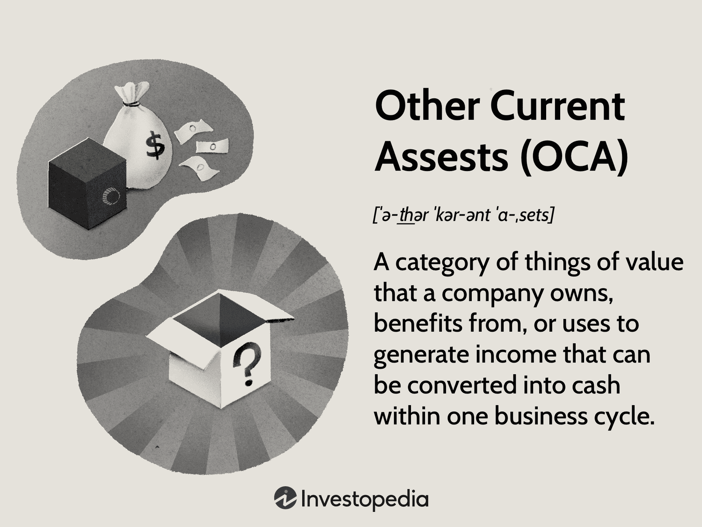

In the continuously evolving world of finance, the intersection of accounting and algorithmic trading is creating new opportunities and challenges. Accounting plays a pivotal role in providing the backbone for financial reporting and analysis, while algorithmic trading is revolutionizing the way trades are executed in financial markets. This intersection is promising for improved market efficiencies and strategic decision-making.

This article aims to explore the concept of Other Current Assets (OCA) within financial accounting and how they relate to algorithmic trading strategies. OCAs are a critical component of a company’s balance sheet, representing assets that are expected to be converted into cash within a year. They are distinct from typical current assets such as cash, marketable securities, and accounts receivable due to their less common nature encompassing items such as prepaid expenses, deferred tax assets, and restricted cash. Understanding OCA is crucial for businesses as they represent potential liquidity, impacting a firm's financial statements significantly. A firm's liquidity and ability to meet short-term obligations are influenced by the management of these assets.



On the other hand, algorithmic trading is transforming the trading landscape by facilitating faster and more accurate trading decisions. Utilizing complex algorithms and mathematical models, algo trading systems analyze vast amounts of market data to execute trades at optimal prices while reducing human errors. The ability to process information quickly and respond to market changes is reshaping how investment strategies are implemented.

Together, these concepts hold significant implications for financial efficiency and strategic investment decisions. The financial health of a company, often indicated by its OCAs, can influence trading strategies developed through algorithms. Moreover, incorporating OCA data into these algorithms can potentially enhance the predictive power of trading models, thus improving investment performance. This synergy between accounting and algorithmic trading represents a promising avenue for enhancing financial analysis, liquidity management, and trading operations in modern finance.

## Table of Contents

## Understanding Other Current Assets (OCA)

Other Current Assets (OCA) are assets that a company expects to convert into cash within a year. They are part of a company's total current assets and appear on the balance sheet. Unlike more common current assets such as cash, securities, and accounts receivable, OCAs include less typical items like prepaid expenses, deferred tax assets, advancements paid to suppliers, restricted cash, and certain short-term investments.

OCAs are essential for evaluating a company’s liquidity and overall financial health. They provide insights into the company's expected short-term cash flows, offering a snapshot of the organization's ability to cover its short-term obligations. By analyzing these assets, financial analysts can assess whether a firm has adequate resources to sustain its operations over the coming year, thus informing investment and operational decisions.

For example, advancements paid to suppliers represent payments made in advance for goods or services yet to be received. This type of OCA reflects potential future operational costs that have already been addressed, freeing up cash flow for other uses. Similarly, prepaid expenses like insurance or rent signify payments made for benefits received in future periods. Deferred tax assets, resulting from overpayment or advance payment of taxes, can also be a significant OCA, as they represent potential future tax reductions.

Each component of OCA serves as an indicator of the firm's short-term financial planning and flexibility. A substantial proportion of OCAs on a balance sheet might suggest that a business has proactively managed its [liquidity](/wiki/liquidity-risk-premium) to mitigate financial risks. Therefore, understanding OCAs can offer valuable insights into the financial strategies employed by businesses, aiding stakeholders in making informed decisions.

## The Role of OCA in Financial Accounting

In financial accounting, Other Current Assets (OCA) play a pivotal role in evaluating a company's liquidity and solvency. These assets, while varied and often minor individually, collectively provide insights into the firm's ability to meet short-term liabilities. Typically expected to convert into cash within a year, OCAs contribute to a comprehensive understanding of a company's near-term financial health.

OCAs often have negligible individual impact, but when considered collectively, they can influence key financial metrics such as liquidity ratios. For instance, the current ratio, which is calculated as:

$$
\text{Current Ratio} = \frac{\text{Current Assets}}{\text{Current Liabilities}}
$$

can be significantly affected by the aggregate presence of OCAs. A higher ratio indicates stronger liquidity, suggesting that the company is well-positioned to cover its short-term obligations.

For precise financial analysis, OCAs are generally detailed in the footnotes of financial statements. These notes offer transparency by elucidating the nature and composition of OCAs, thereby allowing stakeholders to assess the potential real-world effects on liquidity management. This detailed reporting is especially crucial when OCAs are material, as they might necessitate reclassification. Such reclassifications can alter the landscape of major current asset accounts, impacting the overall portrayal of a firm's financial standing. Understanding these nuances is essential for financial managers aiming to make informed decisions regarding resource allocation and risk management.

 to Algorithmic Trading

Algorithmic trading, often referred to as algo trading, employs sophisticated computer programs and algorithms to execute financial trading decisions. These algorithms leverage computational models and mathematical formulas to analyze market data, identify trading opportunities, and execute orders at optimal prices. The primary aim of [algorithmic trading](/wiki/algorithmic-trading) is to capitalize on each trade's price movements in a highly efficient manner, minimizing transaction costs and maximizing profits.

At the core of algorithmic trading lies the ability to systematically process vast sets of market data, which would be overwhelmingly cumbersome for a human trader. By utilizing high-frequency trading systems, these algorithms can react to market changes in fractions of a second, providing a significant advantage over manual trading. One hallmark of such systems is their ability to detect minor market fluctuations and execute trades in response to these variations rapidly.

For instance, consider a simple moving average crossover strategy. In this approach, two moving averages—one short-term, another long-term—are used to predict price trends. An algorithm is coded to buy when the short-term average crosses above the long-term average and to sell when it crosses below. In Python, this could be implemented as follows:

```python
import numpy as np
import pandas as pd

def moving_average_crossover(stock_data):
    short_window = 40
    long_window = 100

    signals = pd.DataFrame(index=stock_data.index)
    signals['signal'] = 0.0

    signals['short_mavg'] = stock_data['close'].rolling(window=short_window, min_periods=1, center=False).mean()
    signals['long_mavg'] = stock_data['close'].rolling(window=long_window, min_periods=1, center=False).mean()

    signals['signal'][short_window:] = np.where(signals['short_mavg'][short_window:] 
                                                 > signals['long_mavg'][short_window:], 1.0, 0.0)

    signals['positions'] = signals['signal'].diff()

    return signals
```

This automated process reduces the potential for human error, as decisions are executed based on predetermined signals and criteria rather than gut feeling or emotional reactions. Another significant advantage of algo trading is its capacity to operate across multiple markets and assets simultaneously, thereby diversifying risk and increasing potential profit opportunities.

Additionally, algorithmic trading facilitates a reduction in overall costs associated with trading. By optimizing the timing and size of each trade, algorithms can ensure that trades are executed at prices close to the market price and minimize the slippage and commission charged by brokers.

Thus, in the competitive environment of financial markets, algorithmic trading strategies are being increasingly adopted by institutional investors and hedge funds alike, enhancing execution efficiency, accuracy, and operational speed while maintaining a lower cost structure.

## Intersection of OCA and Algorithmic Trading

The intersection of Other Current Assets (OCA) and algorithmic trading presents a unique opportunity for developing more sophisticated trading strategies. The financial health of companies, as depicted through indicators like OCAs, can significantly influence algorithmic trading strategies by providing insights into a company's liquidity position, thus impacting investment decisions.

Algorithms can be programmed to incorporate OCA data for a more nuanced evaluation of a company's liquidity, influencing trading decisions. By examining OCA values, trading algorithms can assess the liquidity risk or potential cash flow availability of a firm, thereby guiding investment strategies. For instance, an increase in prepaid expenses within OCAs might signal a future reduction in cash flow, which can be factored into trading models assessing company stability or risk levels.

Trading programs can also be designed to react to variations in a firm's OCA levels, such as shifts in working capital or unanticipated asset reclassifications. For example, an algorithm can be tailored to adjust its trading positions if there's a sudden reclassification of deferred tax assets into OCAs, affecting the firm's apparent short-term financial health. These automated systems can swiftly adapt to such changes, recalibrating trading tactics based on updated fiscal information.

Analyzing OCAs grants additional context to algorithmic models, thereby enhancing trading strategies for entities like hedge funds and private equity firms. Such insights may include recognizing trends in asset allocation or identifying potential red flags in a company's financial practices. By integrating OCA data, algorithms could refine forecasts and optimize trading decisions.

Python libraries such as pandas can be instrumental for creating these analytical models. For instance:

```python
import pandas as pd

# Sample data representing OCA changes over time
data = {'Date': ['2023-01-01', '2023-02-01', '2023-03-01'],
        'Prepaid Expenses': [10000, 12000, 8000],
        'Deferred Tax Assets': [5000, 6000, 4500]}

# Create DataFrame
oca_df = pd.DataFrame(data)

# Calculate changes in OCA
oca_df['Total OCA'] = oca_df['Prepaid Expenses'] + oca_df['Deferred Tax Assets']
oca_df['OCA Change'] = oca_df['Total OCA'].diff()

print(oca_df)
```

In this example, changes in the Total OCA can be logged, allowing a trading algorithm to recognize patterns or triggers that could influence its trading strategy. By continuously updating and refining these models with real-time OCA data, trading strategies can achieve greater precision and agility in financial markets.

## Case Studies and Real-World Applications

Case studies provide crucial insights into how Other Current Assets (OCA) and algorithmic trading intersect in practical settings. A prominent example is Microsoft, which effectively utilizes OCA in its financial reporting. Microsoft's OCAs include prepaid expenses, restricted cash, and short-term investments, which are consistently monitored and reported. These elements offer a snapshot of Microsoft's liquidity and operational efficiency, reflecting its ability to meet short-term obligations.

Algorithmic trading strategies leverage this financial data to make sophisticated trading decisions. For instance, an algorithm designed to respond to OCA fluctuations could adjust trading positions in real-time based on changes in these financial metrics. Consider an algorithm that tracks Microsoft's quarterly financial statements; it incorporates Python scripts that parse through PDF documents of financial reports to extract data on OCAs. These scripts employ libraries such as PyPDF2 or pdfminer for text extraction.

```python
import PyPDF2

def extract_oca_data(pdf_path):
    with open(pdf_path, "rb") as file:
        pdf_reader = PyPDF2.PdfReader(file)
        text = ""
        for page in range(len(pdf_reader.pages)):
            text += pdf_reader.pages[page].extract_text()
        return parse_oca(text)

def parse_oca(text):
    # Custom parsing logic to extract OCA information
    # Regular expressions may be used to locate key terms
    # Specific OCA data extraction can be implemented here
    return oca_data
```

This algorithm might adjust its trading strategy if there is a significant increase in prepaid expenses or restricted cash, suggesting improved liquidity and potential investment opportunities.

Traders and financial managers acknowledge both challenges and benefits in integrating OCA data into algorithmic trading frameworks. One challenge is the accurate and timely extraction of data from financial reports, which may require advanced parsing techniques and real-time updating of data streams. Another is the interpretation of OCA data, as fluctuations might not always indicate straightforward financial trends.

Benefits include enhanced decision-making accuracy and the ability to anticipate market movements based on comprehensive financial analysis. By understanding a company's liquidity via OCA, traders can reduce risk and optimize their investment strategies. Real-world applications demonstrate that integrating OCAs into algos positions traders to exploit market inefficiencies, thus improving potential returns on investment. These practices exemplify the strategic advantage gained from aligning financial accounting insights with trading technology.

## Conclusion

In modern finance, the intersection between Other Current Assets (OCA) in financial accounting and algorithmic trading reflects a paradigm of integrated strategic financial management. Understanding OCA is essential as these assets, though individually minor, collectively offer significant insights into a company's short-term financial health and liquidity. Firms that effectively leverage OCA data can gain a strategic advantage in managing liquidity, enabling optimized responses to financial obligations and investment opportunities.

The evolution of both accounting and trading disciplines underscores the necessity for continuous monitoring and strategic innovation. Algorithmic trading, with its reliance on precise data analysis, can benefit greatly from incorporating OCA metrics into its models. As firms confront the challenge of integrating these data points into complex trading algorithms, adaptive frameworks can be structured to respond dynamically to fluctuations in OCA levels. This requires sophisticated data processing techniques and an agile approach to model adjustments and execution strategies.

The synergy between financial accounting and trading algorithms offers the promise of refined financial analysis and more efficient investment strategy execution. By harnessing detailed financial data, algorithms can improve accuracy in predicting market movements and company performance. This integrated approach not only enhances the efficiency of trading operations but also supports more informed decision-making processes within firms, leading to potentially superior investment outcomes. As these fields continue to evolve, the ongoing development of robust strategies to incorporate OCA data will be crucial for maintaining competitive advantage in the financial sector.

## References & Further Reading

[1]: ["Mastering Python for Finance,"](https://github.com/PacktPublishing/Mastering-Python-for-Finance-Second-Edition) by James Ma Weiming

[2]: ["Algorithmic Trading: Winning Strategies and Their Rationale"](https://www.wiley.com/en-us/Algorithmic+Trading%3A+Winning+Strategies+and+Their+Rationale-p-9781118746912) by Ernest P. Chan

[3]: ["Python for Finance: Analyze Big Financial Data"](https://books.google.com/books/about/Python_for_Finance.html?id=E93SBQAAQBAJ) by Yves Hilpisch

[4]: ["Trading and Exchanges: Market Microstructure for Practitioners"](https://www.amazon.com/Trading-Exchanges-Market-Microstructure-Practitioners/dp/0195144708) by Larry Harris

[5]: Beaver, W.H. (1966). ["Financial Ratios as Predictors of Failure."](https://www.semanticscholar.org/paper/Financial-Ratios-As-Predictors-Of-Failure-Beaver/e787079a38dde55ce53eb60f3a3b5e640055cd85) Journal of Accounting Research, 4, 71-111.