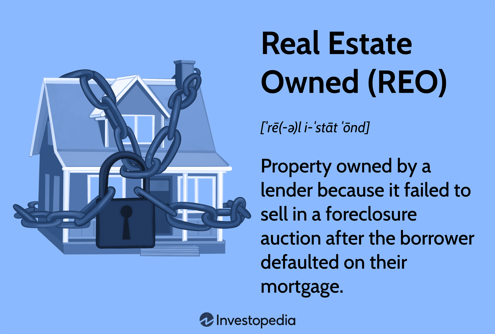

## Table of Contents

## What is Other Real Estate Owned (OREO)?

Other Real Estate Owned, often called OREO, is a term used in banking and finance. It refers to real estate that a bank or lender has taken back from a borrower who couldn't pay their loan. This usually happens when the borrower defaults on their mortgage, and the bank then owns the property.

Banks don't want to keep these properties for long. They are in the business of lending money, not managing real estate. So, they try to sell these OREO properties quickly to get their money back. Sometimes, they might fix up the property to make it more attractive to buyers.

## How does a property become classified as OREO?

A property becomes classified as OREO when a borrower can't pay back their loan and the bank takes the property back. This usually happens after the borrower misses many payments and the bank decides to foreclose on the property. Foreclosure is when the bank legally takes ownership of the property because the borrower didn't meet the terms of the loan.

Once the bank owns the property, it is called Other Real Estate Owned, or OREO. The bank will then try to sell the property to get back the money they lent out. They might fix it up a bit to make it easier to sell. Banks don't want to keep these properties for long because they are not in the business of managing real estate, but lending money.

## What are the common reasons banks acquire OREO properties?

Banks acquire OREO properties mainly because borrowers can't pay back their loans. When someone takes out a loan to buy a house and then stops making payments, the bank can take the house back. This happens a lot when people lose their jobs or have other money problems. The bank then owns the house and it becomes an OREO property.

Another reason is when the value of the property drops a lot. If a house is worth less than what the borrower owes on the loan, the borrower might just walk away from the house. This is called strategic default. The bank then has to take the house back because it's the only way they can try to get some of their money back.

Sometimes, banks also end up with OREO properties because of fraud. If someone tricks the bank into giving them a loan for a property that isn't worth what they said it was, the bank might take the property back when they find out. This doesn't happen as often, but it's another way banks can end up with OREO properties.

## What are the financial implications for banks holding OREO properties?

When banks hold OREO properties, it can cost them money. They have to pay for things like taxes, insurance, and upkeep of the property. If the property stays empty for a long time, it might even get damaged or vandalized, which costs more money to fix. Banks also have to pay people to manage these properties, which adds to their expenses. All these costs add up and can eat into the bank's profits.

Another problem is that OREO properties can tie up the bank's money. Instead of using that money to make new loans and earn interest, it's stuck in a property that's hard to sell. This can make it harder for the bank to do its main job of lending money. If the bank has too many OREO properties, it might even make people worry about the bank's health, which could hurt its reputation and make it harder to attract new customers.

## How do banks typically manage and dispose of OREO properties?

Banks usually want to get rid of OREO properties as fast as they can. They don't want to be in the real estate business, so they try to sell these properties quickly. To do this, they might hire a real estate agent to help find buyers. Sometimes, they fix up the property a bit to make it look nicer and sell faster. They might also lower the price if it's not selling, to get it off their [books](/wiki/algo-trading-books) sooner.

If the property is in really bad shape, the bank might decide to sell it at an auction. This can help them get rid of it quickly, even if they don't get as much money as they hoped. Another way banks manage OREO properties is by working with special companies that buy these properties in bulk. These companies, called REO asset managers, take care of selling the properties so the bank doesn't have to. This can save the bank time and money, but they might not get the best price for each property.

## What are the regulatory requirements for banks regarding OREO?

Banks have to follow rules when they own OREO properties. They need to report these properties to the government and keep good records. The government wants to make sure banks are not holding onto too many of these properties for too long. Banks have to show that they are trying to sell the properties quickly and not just keeping them to make money from real estate.

There are also rules about how banks can value these properties. They can't just guess at the value; they need to have the property appraised by a professional. This helps make sure the bank is being honest about what the property is worth. If a bank doesn't follow these rules, they could get in trouble with the government, which could mean fines or other penalties.

## How does OREO impact a bank's balance sheet and financial statements?

When a bank has OREO properties, it shows up on their balance sheet as an asset. But these assets are not as good as cash or loans because they are hard to turn into money quickly. The bank has to list the OREO properties at what they think they can sell them for, which might be less than what they were worth when the bank took them back. This can make the bank's total assets look smaller and can affect how healthy the bank looks to people who look at its financial statements.

OREO properties also affect the bank's income statement. The bank has to pay for things like taxes, insurance, and upkeep on these properties, which are costs that come out of the bank's profits. If the bank sells an OREO property for less than what they have it listed for on their balance sheet, they have to report a loss. This can make the bank's profits look smaller and can worry people who invest in the bank or do business with it.

## What are the risks associated with holding OREO properties for banks?

Holding OREO properties can be risky for banks. One big risk is that these properties can cost a lot of money to keep up. Banks have to pay for things like taxes, insurance, and repairs, which can eat into their profits. If the properties stay empty for a long time, they might get damaged or vandalized, which costs even more money to fix. All these costs can add up and make it harder for the bank to make money.

Another risk is that OREO properties can tie up the bank's money. Instead of using that money to make new loans and earn interest, it's stuck in properties that are hard to sell. This can make it harder for the bank to do its main job of lending money. If the bank has too many OREO properties, it might make people worry about the bank's health, which could hurt its reputation and make it harder to attract new customers.

## How can investors identify and purchase OREO properties?

Investors can find OREO properties by looking at bank websites or working with real estate [agents](/wiki/agents) who specialize in these kinds of properties. Banks often list their OREO properties online, so investors can search these listings to find properties that interest them. Real estate agents who focus on OREO properties can also help investors find good deals and guide them through the buying process.

Once an investor finds an OREO property they like, they can make an offer to the bank. Banks usually want to sell these properties quickly, so they might be willing to accept a lower price than what the property is listed for. Investors should be ready to move fast because other people might also be interested in the same property. It's a good idea to have a real estate agent help with the offer and the paperwork to make sure everything goes smoothly.

## What strategies can banks use to minimize losses on OREO properties?

Banks can minimize losses on OREO properties by selling them quickly. They don't want to keep these properties for long because they cost money to maintain. To sell them fast, banks might fix up the property a bit to make it look nicer. They can also lower the price if it's not selling, to get it off their books sooner. Hiring a real estate agent who knows how to sell OREO properties can help too. The agent can find buyers and help the bank get a good price.

Another strategy is to work with special companies that buy OREO properties in bulk. These companies, called REO asset managers, take care of selling the properties so the bank doesn't have to. This can save the bank time and money, even if they don't get the best price for each property. Banks can also hold auctions to sell OREO properties quickly, even if it means selling them for less than they hoped. By using these strategies, banks can get rid of OREO properties faster and minimize their losses.

## How does the market for OREO properties fluctuate with economic conditions?

The market for OREO properties goes up and down with the economy. When the economy is doing well, people have more money and are more likely to buy houses. This means banks can sell their OREO properties faster and for more money. But when the economy is bad, like during a recession, people don't have as much money to buy houses. This makes it harder for banks to sell their OREO properties, and they might have to lower the prices a lot just to get rid of them.

Another thing that affects the OREO market is the housing market. When house prices are going up, OREO properties can be sold for more money, and banks don't lose as much. But if house prices are going down, OREO properties are worth less, and banks might have to sell them at a loss. This is why banks try to sell OREO properties quickly during bad economic times, to avoid losing even more money.

## What are advanced financial models used for valuing OREO properties?

Banks use advanced financial models to figure out how much OREO properties are worth. These models help them guess the best price to sell the property and how much money they might lose. One common model is called the discounted cash flow (DCF) model. This model looks at how much money the property could make in the future, like from rent, and then figures out what that money is worth today. It takes into account things like how long it might take to sell the property and what it will cost to keep it until then.

Another model banks use is the comparative market analysis (CMA). This model looks at what similar properties in the area have sold for recently. By comparing the OREO property to these other sales, the bank can guess a good price for it. Both of these models help banks make smart decisions about selling OREO properties and try to lose as little money as possible.

## References & Further Reading

[1]: Geltner, D., Miller, N., Clayton, J., & Eichholtz, P. (2013). ["Commercial Real Estate Analysis and Investments,"](https://www.researchgate.net/publication/245702364_Commercial_Real_Estate_Analysis_and_Investments) South-Western Educational Pub.

[2]: Lopez de Prado, M. (2018). ["Advances in Financial Machine Learning."](https://books.google.com/books/about/Advances_in_Financial_Machine_Learning.html?id=oU9KDwAAQBAJ) Wiley.

[3]: Fabozzi, F. J., Shiller, R. J., & Tunaru, R. S. (2012). ["Rethinking Real Estate."](http://aida.econ.yale.edu/~shiller/pubs/property-derivatives2010.pdf) Wiley.

[4]: Jansen, S. (2020). ["Machine Learning for Algorithmic Trading - Second Edition: Predictive models to extract signals from market and alternative data for systematic trading strategies."](https://www.oreilly.com/library/view/machine-learning-for/9781839217715/Text/Front_Matter.xhtml) Packt Publishing.

[5]: Chan, E. (2009). ["Quantitative Trading: How to Build Your Own Algorithmic Trading Business."](https://github.com/ftvision/quant_trading_echan_book) Wiley.

[6]: Shiller, R. J. (2015). ["Irrational Exuberance"](https://www.jstor.org/stable/j.ctt1287kz5) (3rd ed.). Princeton University Press.

[7]: Aronson, D. R. (2006). ["Evidence-Based Technical Analysis: Applying the Scientific Method and Statistical Inference to Trading Signals."](https://www.amazon.com/Evidence-Based-Technical-Analysis-Scientific-Statistical/dp/0470008741) Wiley.