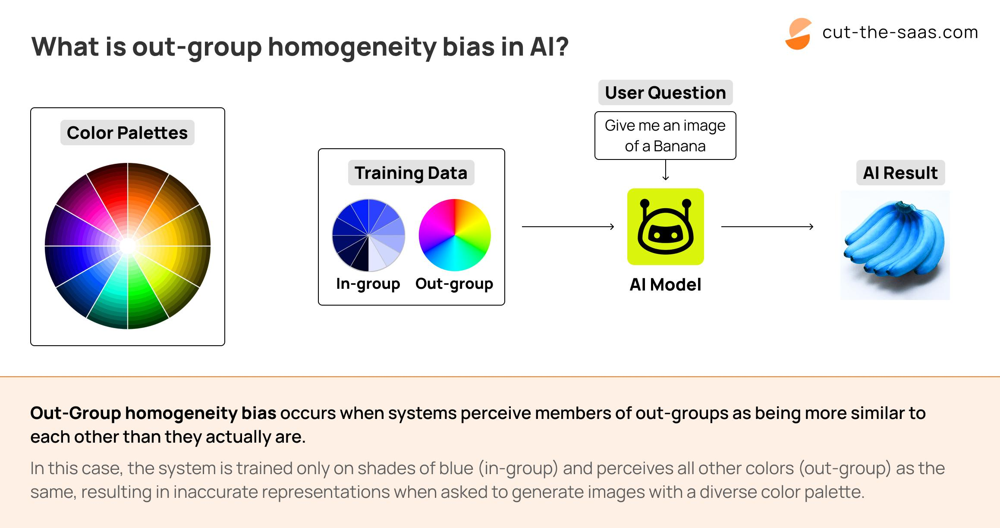

## Table of Contents

## What is Out-Group Homogeneity Bias in the context of machine learning?

Out-Group Homogeneity Bias in the context of machine learning refers to a tendency where a model perceives members of an out-group (a group to which the model or its developers do not belong) as being more similar to each other than they actually are. This bias can arise when a machine learning model is trained on data that is not diverse enough or when the data itself contains biases that reflect societal stereotypes. As a result, the model might fail to recognize the individual differences within the out-group and treat them as a uniform entity, which can lead to unfair or inaccurate predictions and classifications.

For example, if a facial recognition system is primarily trained on images of people from one ethnic group, it might struggle to differentiate between individuals from another ethnic group, assuming they all look similar. This can have serious implications in applications like security systems or hiring processes, where accurate identification is crucial. To mitigate this bias, it's important for data scientists to ensure that training datasets are diverse and representative of all groups the model will encounter in real-world scenarios. Additionally, continuous monitoring and updating of the model with new, varied data can help in reducing the effects of out-group homogeneity bias.

## How does Out-Group Homogeneity Bias manifest in machine learning models?

Out-Group Homogeneity Bias in machine learning shows up when a model treats people from different groups as if they are all the same. Imagine a machine learning model that is used to recognize faces. If this model was mostly trained on pictures of people from one group, it might have a hard time telling apart people from another group. The model might think that everyone in the other group looks very similar, even though they are actually very different from each other. This happens because the model hasn't seen enough examples of the other group to learn about their unique features.

This bias can cause problems in real life. For example, if a security camera system uses this kind of model, it might not be able to tell apart two different people from the out-group, leading to mistakes in identifying who is who. This can be unfair and can even be dangerous if the system is used to make important decisions. To fix this, people who make these models need to use training data that includes a lot of different kinds of people, so the model can learn about everyone's unique features and not just treat some groups as if they are all the same.

## What are the common causes of Out-Group Homogeneity Bias in datasets used for machine learning?

Out-Group Homogeneity Bias in [machine learning](/wiki/machine-learning) datasets often happens because the data used to train the models does not include enough variety. When a model is trained mostly on data from one group, it learns to recognize patterns and features from that group well. However, if it doesn't see enough examples from other groups, it might think that everyone in those other groups looks or acts the same. This can happen if the people collecting the data don't include enough examples from different backgrounds, cultures, or demographics. For instance, if a facial recognition system is trained mostly on images of people from one ethnicity, it might struggle to recognize the unique features of people from other ethnicities.

Another cause of Out-Group Homogeneity Bias is the presence of existing biases in the data collection process. Sometimes, the data used to train machine learning models can reflect societal stereotypes or prejudices. If the data collectors have unconscious biases, they might unintentionally gather data in a way that over-represents certain groups and under-represents others. This can lead to a model that performs well on the over-represented group but fails to accurately recognize the diversity within under-represented groups. To address this, it's important for those working with machine learning to be aware of their own biases and actively seek out diverse data sources to ensure the model learns to recognize and value the differences within all groups.

## Can you explain an example where Out-Group Homogeneity Bias affected a machine learning application?

Imagine a company that uses a machine learning model to help them hire new employees. The model looks at things like resumes and interview answers to decide if someone is a good fit for the job. But, if the model was trained mostly on data from one group of people, like men, it might think that all men are similar and all women are similar too. This is an example of Out-Group Homogeneity Bias. The model might not see the unique skills and experiences of women because it hasn't seen enough examples of them. As a result, the model might unfairly decide that women are not as good for the job as men, even if they are just as qualified.

To fix this, the company needs to make sure their model is trained on a mix of data from different groups of people. They should include resumes and interview answers from men, women, and people from different backgrounds. By doing this, the model can learn about the unique qualities of everyone and make fair decisions. If the company doesn't do this, they might miss out on great employees and could even break laws about fair hiring practices.

## What are the potential consequences of Out-Group Homogeneity Bias in machine learning systems?

Out-Group Homogeneity Bias in machine learning can lead to unfair decisions. For example, if a model is used to help hire people but it was mostly trained on data from one group, like men, it might think all men are similar and all women are similar too. This can cause the model to overlook the unique skills and experiences of women, leading to fewer women being hired even if they are just as qualified. This is not only unfair to the women who miss out on job opportunities, but it can also make the company less diverse and miss out on great employees.

The bias can also cause problems in other areas, like security systems. If a facial recognition system was trained mostly on pictures of people from one ethnic group, it might struggle to tell apart people from other groups. This can lead to mistakes in identifying who is who, which can be dangerous if the system is used to make important decisions. To avoid these problems, it's important for the people who make these models to use training data that includes a lot of different kinds of people, so the model can learn about everyone's unique features and not just treat some groups as if they are all the same.

## How can one identify Out-Group Homogeneity Bias in a trained machine learning model?

To identify Out-Group Homogeneity Bias in a trained machine learning model, you need to look at how the model performs with different groups of people. One way to do this is by testing the model with data from various groups that it might not have seen much during training. If the model makes more mistakes or treats everyone in a certain group as if they are all the same, that could be a sign of Out-Group Homogeneity Bias. For example, if a model is good at recognizing faces of one ethnicity but struggles with another, it might be because it was trained mostly on pictures from the first group.

Another way to check for this bias is by using fairness metrics. These are special tools that help you see if the model is treating all groups fairly. If the model's performance is very different for different groups, it might be showing Out-Group Homogeneity Bias. To fix this, you can look at the data used to train the model and make sure it includes a good mix of examples from all kinds of people. By doing this, you can help the model learn about everyone's unique features and make fairer decisions.

## What methods are used to mitigate Out-Group Homogeneity Bias in machine learning?

To mitigate Out-Group Homogeneity Bias in machine learning, one effective method is to ensure that the training data is diverse and representative of all groups the model will encounter in real-world scenarios. This means including a good mix of examples from different backgrounds, cultures, and demographics in the dataset. By doing this, the model can learn about the unique features of everyone and not just treat some groups as if they are all the same. For example, if a facial recognition system is being developed, it's important to include images of people from various ethnicities, ages, and genders in the training data. This helps the model recognize the individual differences within each group and reduces the chance of it making biased decisions.

Another approach to reducing Out-Group Homogeneity Bias is to use fairness-aware machine learning techniques. These techniques involve adjusting the model or the training process to make sure the model treats all groups fairly. One way to do this is by using fairness metrics to monitor the model's performance across different groups. If the model is found to be biased, adjustments can be made to the training data or the model itself to improve fairness. For instance, techniques like re-weighting the data to give more importance to under-represented groups or using algorithms that explicitly aim to minimize bias can be employed. By continuously monitoring and updating the model with new, varied data, it's possible to keep the bias in check and ensure the model makes fair and accurate predictions for everyone.

## How does the choice of algorithm affect the presence of Out-Group Homogeneity Bias in machine learning?

The choice of algorithm can have a big impact on whether Out-Group Homogeneity Bias shows up in machine learning. Some algorithms are more sensitive to the biases in the data they are trained on. For example, if an algorithm is good at finding patterns but the training data mostly comes from one group of people, it might think that everyone in other groups is the same. This happens because the algorithm learns from the data it sees, and if it doesn't see enough variety, it can't learn about the unique features of different groups. So, choosing an algorithm that can handle diverse data well is important to reduce this bias.

One way to pick a better algorithm is to use ones that are designed to be fair and work well with all kinds of data. For example, some algorithms can be set up to pay more attention to under-represented groups in the data. This helps make sure the model learns about everyone's unique features and doesn't just treat some groups as if they are all the same. By choosing the right algorithm and making sure it is trained on a good mix of data, we can help reduce Out-Group Homogeneity Bias and make machine learning models fairer for everyone.

## What role does data preprocessing play in reducing Out-Group Homogeneity Bias?

Data preprocessing is a big help in reducing Out-Group Homogeneity Bias in machine learning. When we clean and organize the data before we use it to train our model, we can make sure that the data includes a good mix of examples from different groups of people. If we find that some groups are not represented enough, we can add more examples from those groups to the data. This helps the model learn about the unique features of everyone and not just treat some groups as if they are all the same. By making the data more balanced, we can help the model make fairer decisions.

Another way data preprocessing helps is by fixing mistakes in the data that might make the bias worse. Sometimes, the data we collect can have errors or be missing information about certain groups. By fixing these problems during preprocessing, we can make the data more accurate and complete. This means the model will have a better chance of learning about all groups equally and not just focusing on the ones that are over-represented. So, taking the time to preprocess the data carefully can really make a difference in reducing Out-Group Homogeneity Bias.

## How can feature engineering help in addressing Out-Group Homogeneity Bias in machine learning models?

Feature engineering can help address Out-Group Homogeneity Bias by creating new features or modifying existing ones to better represent the diversity within different groups. When we engineer features, we can focus on capturing unique characteristics that might be overlooked if we only use the original data. For example, if we're working on a model for predicting job performance, we might create features that capture different types of skills or experiences that are relevant to various groups. By doing this, we help the model recognize and value the individual differences within each group, reducing the tendency to treat out-group members as if they are all the same.

Another way feature engineering can help is by balancing the importance of different features so that the model doesn't rely too heavily on characteristics that are more common in one group. For instance, if certain features are more predictive for one group but not for others, we can adjust these features during the engineering process to ensure they are equally relevant across all groups. This can help the model make fairer predictions and reduce the impact of Out-Group Homogeneity Bias. By carefully selecting and engineering features, we can improve the model's ability to understand and respect the diversity of all groups it encounters.

## What are the latest research findings on tackling Out-Group Homogeneity Bias in advanced machine learning techniques?

Recent research on tackling Out-Group Homogeneity Bias in advanced machine learning techniques has focused on developing more sophisticated methods to ensure fairness and accuracy across diverse groups. One key finding is the use of adversarial training, where a secondary model is trained to detect and counteract bias in the primary model. This approach helps the primary model to better recognize individual differences within out-groups by forcing it to be less reliant on biased features. Researchers have also explored the use of transfer learning, where models pretrained on diverse datasets are fine-tuned on specific tasks, helping to mitigate biases that might arise from limited data.

Another significant finding comes from the application of fairness-aware algorithms, which explicitly aim to minimize bias during the training process. These algorithms often use fairness metrics to monitor and adjust the model's performance across different groups, ensuring that no group is treated as homogeneous. For example, techniques like reweighting the data to give more importance to underrepresented groups have shown promise in reducing Out-Group Homogeneity Bias. By continuously refining these methods, researchers are making strides toward creating machine learning models that are more equitable and effective for all users.

## How can organizations implement ongoing monitoring and adjustment strategies to manage Out-Group Homogeneity Bias in their machine learning systems?

Organizations can implement ongoing monitoring and adjustment strategies to manage Out-Group Homogeneity Bias by regularly checking how their machine learning models perform across different groups. They can do this by using fairness metrics to see if the model treats all groups fairly. If the model makes more mistakes with certain groups or treats everyone in a group as if they are the same, it might be showing Out-Group Homogeneity Bias. To fix this, the organization can add more diverse data to the training set or adjust the model to pay more attention to under-represented groups. By doing this regularly, they can keep the model fair and accurate for everyone.

Another important strategy is to have a team dedicated to monitoring and updating the model. This team can use tools that automatically check for bias and send alerts if they find any issues. They can also keep adding new data from different groups to the training set to make sure the model keeps learning about everyone's unique features. By staying proactive and continuously working on the model, organizations can reduce Out-Group Homogeneity Bias and make sure their machine learning systems are fair and effective for all users.